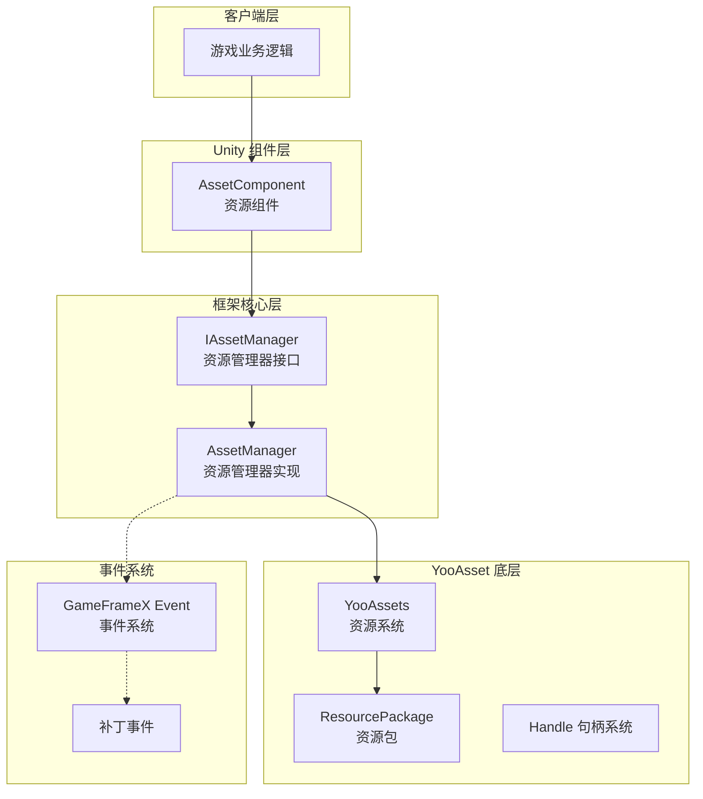
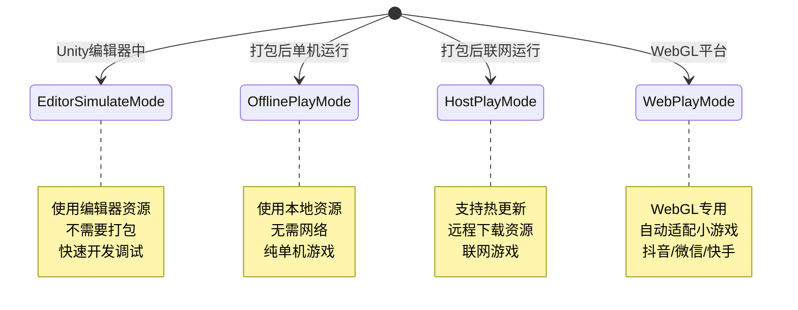
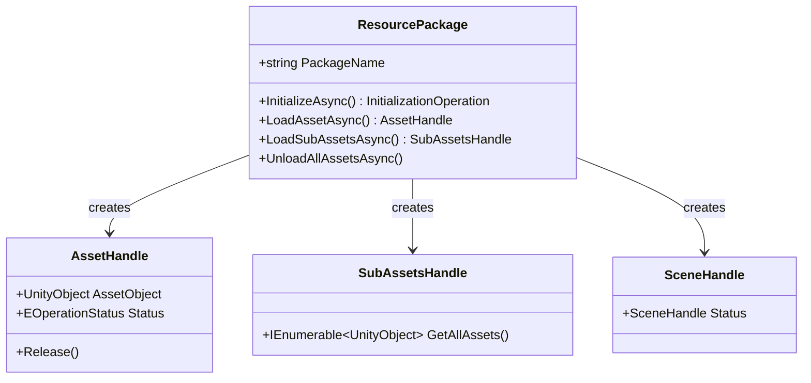

# アーキテクチャ設計

このドキュメント詳細介绍 GameFrameX Asset リソースコンポーネント的整体アーキテクチャ設計，含みますコアコンポーネント、モジュール职责、交互关系および設計决策。

## 概要

GameFrameX Asset リソースコンポーネント是 GameFrameX フレームワーク的コアモジュール之一，基于业界成熟的 **YooAsset** リソース管理系统ビルド。该コンポーネント通过カプセル化 YooAsset 的底层 API，为 Unity 游戏应用提供します一套**統一された、シンプル、易用**的リソース管理解決策。

**設計目标：**
- 簡素化リソースロード和アンロード的複雑度
- 提供跨プラットフォーム一致的 API インターフェース
- サポート多种运行モード（エディタ模拟、离线、ホットアップデート、WebGL）
- 集成 GameFrameX イベント系统，実装ステータス通知
- サポート多リソースパッケージ管理

## アーキテクチャ总览



### 各層の役割の説明

| 层级 | コンポーネント | 职责 |
|------|------|------|
| 客户端层 | 游戏业务逻辑 | 呼び出しリソースコンポーネント提供的 API 进行リソースロード |
| Unity コンポーネント層 | AssetComponent | 作为 Unity シーン中的コンポーネント，提供面向ユーザー的 API 入口 |
| フレームワークコア层 | AssetManager | 実装リソース管理的コア业务逻辑 |
| YooAsset 底层 | YooAssets | 底层リソースシステム，処理实际的ファイル系统、下载、缓存等 |
| イベント系统 | EventSystem | 提供补丁フローステータス通知、下载進捗等イベント |

## コアコンポーネント

### 1. AssetComponent（リソースコンポーネント）

`AssetComponent` 是 Unity 游戏シーン中的コアコンポーネント，継承自 `GameFrameworkComponent`。它作为リソースシステム的統一された入口，为游戏逻辑层提供リソース访问インターフェース。

**主な职责：**
- 作为 Unity コンポーネント挂载在シーン中
- 設定运行モード（PlayMode）
- 管理リソースパッケージ的初期化
- 代理转发リソースロード请求到 AssetManager
- 処理プラットフォーム差异（WebGL 自动切换モード）

> Source: [AssetComponent.cs](https://github.com/GameFrameX/com.gameframex.unity.asset/blob/main/Runtime/Asset/AssetComponent.cs#L18-L70)

```csharp
[DisallowMultipleComponent]
[AddComponentMenu("GameFrameX/Asset")]
public sealed class AssetComponent : GameFrameworkComponent
{
    [Tooltip("当目标平台为Web平台时，将会强制设置为WebPlayMode")]
    [SerializeField]
    private EPlayMode m_GamePlayMode;
    
    private IAssetManager _assetManager;
    
    protected override void Awake()
    {
        // 非编辑器环境下，自动调整运行模式
#if !UNITY_EDITOR
        if (GamePlayMode == EPlayMode.EditorSimulateMode)
        {
            GamePlayMode = EPlayMode.HostPlayMode;
        }
#if UNITY_WEBGL
        GamePlayMode = EPlayMode.WebPlayMode;
#endif
#endif
        base.Awake();
        _assetManager = GameFrameworkEntry.GetModule<IAssetManager>();
        _assetManager.SetPlayMode(GamePlayMode);
    }
}
```

**設計意图：**
- 使用 `[DisallowMultipleComponent]` 限制シーン中只能有一个 AssetComponent，保证リソース管理的唯一性
- 在 `Awake` 中処理プラットフォーム差异，確認してください在非エディタ環境下使用正确的运行モード
- 通过依存性注入取得 IAssetManager インスタンス，実装解耦

### 2. IAssetManager（リソースマネージャーインターフェース）

`IAssetManager` インターフェース定義了リソース管理的所有操作契约，確認してください実装的柔軟性和可テスト性。

> Source: [IAssetManager.cs](https://github.com/GameFrameX/com.gameframex.unity.asset/blob/main/Runtime/Asset/IAssetManager.cs#L1-L519)

**インターフェース分类：**

| 機能分类 | メソッド例 |
|----------|----------|
| 初期化 | `Initialize()`, `InitPackageAsync()` |
| 非同期ロード | `LoadAssetAsync<T>()`, `LoadSceneAsync()` |
| 同期ロード | `LoadAssetSync<T>()`, `LoadSubAssetSync()` |
| リソースパッケージ管理 | `CreateAssetsPackage()`, `GetAssetsPackage()` |
| リソースアンロード | `UnloadAsset()`, `UnloadUnusedAssetsAsync()` |
| リソース查询 | `GetAssetInfo()`, `HasAssetPath()`, `IsNeedDownload()` |

### 3. AssetManager（リソースマネージャー実装）

`AssetManager` 是リソース管理的コア実装类，継承自 `GameFrameworkModule` 并実装 `IAssetManager` インターフェース。它カプセル化了对 YooAssets 的呼び出し，并适配了 GameFrameX 的モジュール系统。

**主な职责：**
- 管理 YooAssets 初期化
- 処理不同运行モード的設定
- カプセル化リソースロード/アンロード操作
- 管理リソースパッケージ（Package）

> Source: [AssetManager.cs](https://github.com/GameFrameX/com.gameframex.unity.asset/blob/main/Runtime/Asset/AssetManager.cs#L14-L60)

```csharp
[UnityEngine.Scripting.Preserve]
public partial class AssetManager : GameFrameworkModule, IAssetManager
{
    public string DefaultPackageName { get; set; } = ConstDefaultPackageName;
    public int DownloadingMaxNum { get; set; }
    public int FailedTryAgain { get; set; }
    public EFileVerifyLevel VerifyLevel { get; set; }
    public EPlayMode PlayMode { get; private set; }
    
    public void Initialize()
    {
        BetterStreamingAssets.Initialize();
        Log.Info($"资源系统运行模式：{PlayMode}");
        YooAssets.Initialize();
        YooAssets.SetOperationSystemMaxTimeSlice(30);
    }
}
```

## 動作モード

Asset コンポーネントサポート四种运行モード，通过 `EPlayMode` 列挙型定義：



### モード選択ロジック

> Source: [AssetManager.Initialization.cs](https://github.com/GameFrameX/com.gameframex.unity.asset/blob/main/Runtime/Asset/AssetManager.Initialization.cs#L18-L47)

```csharp
private InitializationOperation CreateInitializationOperationHandler(ResourcePackage resourcePackage, string hostServerURL, string fallbackHostServerURL)
{
    switch (PlayMode)
    {
        case EPlayMode.EditorSimulateMode:
            return InitializeYooAssetEditorSimulateMode(resourcePackage);
        case EPlayMode.OfflinePlayMode:
            return InitializeYooAssetOfflinePlayMode(resourcePackage);
        case EPlayMode.HostPlayMode:
            return InitializeYooAssetHostPlayMode(resourcePackage, hostServerURL, fallbackHostServerURL);
        case EPlayMode.WebPlayMode:
            return InitializeYooAssetWebPlayMode(resourcePackage, hostServerURL, fallbackHostServerURL);
        default:
            return null;
    }
}
```

### モード初期化の詳細

| モード | 初期化メソッド | 适用シーン |
|------|------------|----------|
| EditorSimulateMode | `InitializeYooAssetEditorSimulateMode()` | エディタ开发デバッグ，不打パッケージ |
| OfflinePlayMode | `InitializeYooAssetOfflinePlayMode()` | オフラインゲーム，无需ホットアップデート |
| HostPlayMode | `InitializeYooAssetHostPlayMode()` | 〜する必要がありますホットアップデート的联网游戏 |
| WebPlayMode | `InitializeYooAssetWebPlayMode()` | WebGL/ミニゲームプラットフォーム |

## リソースパッケージ系统

Asset コンポーネント采用**リソースパッケージ（ResourcePackage）**机制管理不同タイプ的リソース。



### リソースパッケージ操作

```csharp
// 创建资源包
ResourcePackage package = assetComponent.CreateAssetsPackage("MyPackage");

// 获取资源包
ResourcePackage pkg = assetComponent.TryGetAssetsPackage("MyPackage");

// 设置默认资源包
assetComponent.SetDefaultAssetsPackage(pkg);

// 检查资源包是否存在
if (assetComponent.HasAssetsPackage("MyPackage"))
{
    // 使用资源包
}
```

> Source: [AssetManager.cs](https://github.com/GameFrameX/com.gameframex.unity.asset/blob/main/Runtime/Asset/AssetManager.cs#L646-L692)

## イベント系统

Asset コンポーネント集成了 GameFrameX 的イベント系统，用于通知リソースロード進捗和ステータス变更。

### パッチステータス変更

> Source: [EPatchStates.cs](https://github.com/GameFrameX/com.gameframex.unity.asset/blob/main/Runtime/Update/EPatchStates.cs#L1-L33)

```csharp
public enum EPatchStates
{
    /// <summary>更新静态的资源版本</summary>
    UpdateStaticVersion,
    /// <summary>更新补丁清单</summary>
    UpdateManifest,
    /// <summary>创建下载器</summary>
    CreateDownloader,
    /// <summary>下载远端文件</summary>
    DownloadWebFiles,
    /// <summary>补丁流程完毕</summary>
    PatchDone,
}
```

### イベントタイプ

| イベント类 | 用途 |
|--------|------|
| AssetPatchStatesChangeEventArgs | 补丁フローステータス变更 |
| AssetDownloadProgressUpdateEventArgs | 下载進捗アップデート |
| AssetFoundUpdateFilesEventArgs | 发现〜する必要がありますアップデート的ファイル |
| AssetPatchManifestUpdateFailedEventArgs | 补丁清单アップデート失敗 |
| AssetWebFileDownloadFailedEventArgs | リソースファイル下载失敗 |

> Source: [AssetPatchStatesChangeEventArgs.cs](https://github.com/GameFrameX/com.gameframex.unity.asset/blob/main/Runtime/Update/EventArgs/AssetPatchStatesChangeEventArgs.cs#L1-L49)

## リソースロードフロー

### 非同期リソースロード


### リソースのアンロードフロー

```mermaid
flowchart LR
    A[调用 UnloadAsset] --> B{指定资源包?}
    B -->|是| C[UnloadAsset(packageName, assetPath)]
    B -->|否| D[UnloadAsset(assetPath)]
    C --> E[获取目标资源包]
    D --> E
    E --> F[调用 Package.TryUnloadUnusedAsset]
    F --> G[YooAsset 释放资源]
    
    G --> H{调用 UnloadUnusedAssetsAsync?}
    H -->|是| I[释放未使用资源]
    H -->|否| J[结束]
```

## 設定オプション

Asset コンポーネント提供以下可設定项：

| 設定项 | タイプ | デフォルト值 | 説明 |
|--------|------|--------|------|
| GamePlayMode | EPlayMode | EditorSimulateMode | リソース运行モード |
| DefaultPackageName | string | "DefaultPackage" | デフォルトリソースパッケージ名称 |
| DownloadingMaxNum | int | - | 最大并发下载数量 |
| FailedTryAgain | int | - | 下载失敗重试次数 |
| VerifyLevel | EFileVerifyLevel | - | ファイル検証等级 |
| Milliseconds | long | - | 异步系统每帧最大执行时间(毫秒) |

> Source: [AssetComponent.cs](https://github.com/GameFrameX/com.gameframex.unity.asset/blob/main/Runtime/Asset/AssetComponent.cs#L20-L36)

## 設計の決定事項説明

### 1. 为什么使用 YooAsset？

选择 YooAsset 作为底层リソースシステム的原因：
- **機能完善**：サポートリソース打パッケージ、依赖分析、ホットアップデート、缓存管理等完全な機能
- **性能最適化**：提供句柄机制、参照计数、リソース解放最適化
- **跨プラットフォーム**：サポート Unity 所有主流プラットフォーム
- **社区活跃**：持续维护アップデート

### 2. 为什么采用インターフェース分离？

通过 `IAssetManager` インターフェース定義清晰的操作契约：
- 便于单元テスト（〜できます mock 実装）
- 提供拡張点，允许置換底层実装
- API ドキュメント更清晰

### 3. 为什么区分同步/非同期ロード？

- **非同期ロード**：适合大规模リソースロード，避免阻塞主线程
- **同期ロード**：适合小リソース或特定性能敏感シーン
- ユーザー〜できます根据シーン需求选择合适的ロード方法

### 4. 为什么〜する必要がありますリソースパッケージ？

多リソースパッケージ設計サポート：
- 按機能モジュール划分リソース（UI、DLC、設定）
- 动态ロード/アンロード特定モジュール
- リソース按需下载，节省带宽

## 関連リンク

- [リソースコンポーネント](./4-core-concepts.asset-component) - AssetComponent 詳細 API
- [リソースマネージャー](./4-core-concepts.asset-manager) - AssetManager 実装细节
- [リソースロードインターフェース](./5-api-reference.loading-api) - 完全なロード API リファレンス
- [リソースパッケージ管理](./5-api-reference.package-management) - リソースパッケージ操作 API
- [运行モード](./6-configuration.play-modes) - 各种运行モード設定
- [コンポーネント設定](./6-configuration.component-settings) - コンポーネント設定オプション
