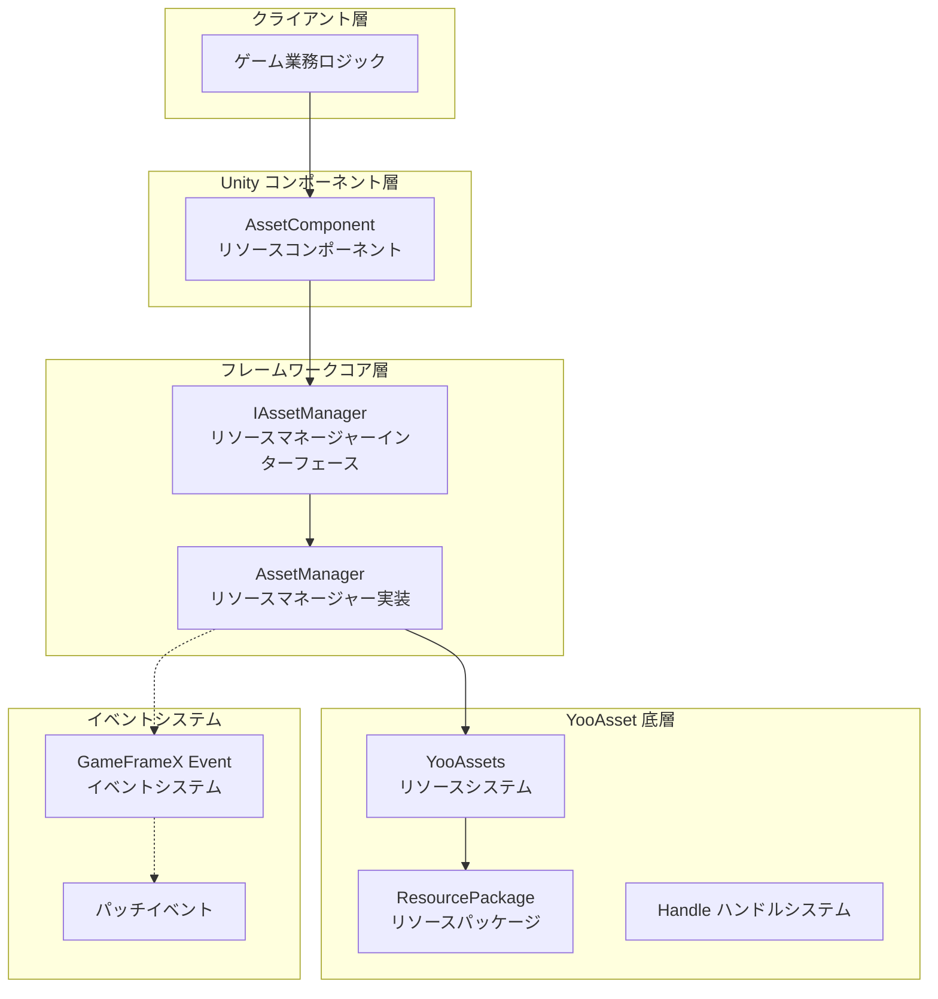
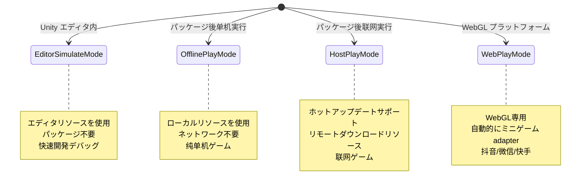
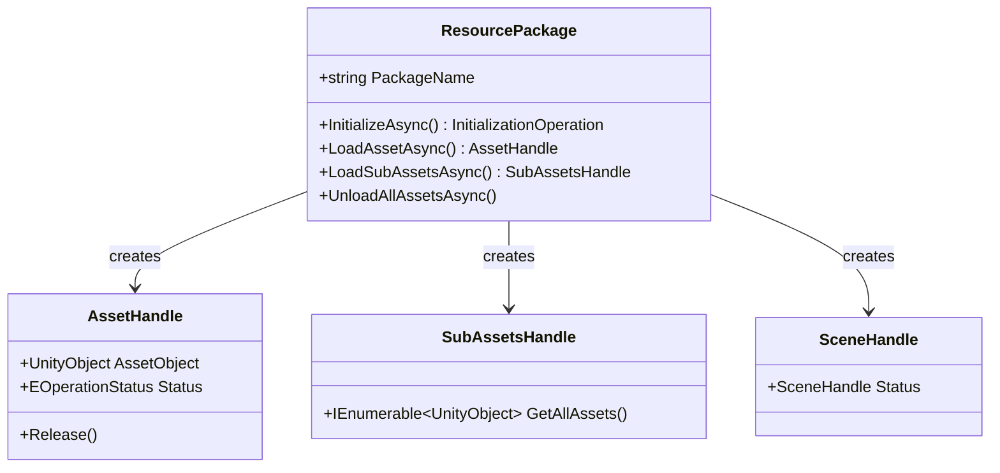
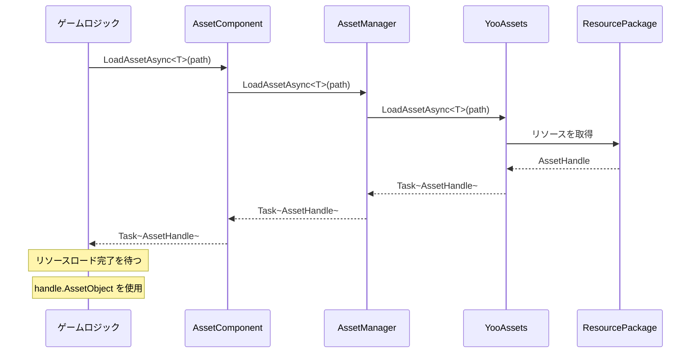

# アーキテクチャ設計

このドキュメントでは、GameFrameX Asset リソースコンポーネントの全体的なアーキテクチャ設計について詳しく説明します。コアコンポーネント、モジュールの职责、インタラクショ関係および設計上の意思決定を含みます。

## 概要

GameFrameX Asset リソースコンポーネントは GameFrameX フレームワークのコアモジュールの一つであり、业界で成熟した **YooAsset** リソース管理システムに基づいて構築されています。このコンポーネントは YooAsset の底層 API を封裝し、Unity ゲームアプリケーションに **統一、シンプル、易使用** のリソース管理ソリューションを提供します。

**設計目標:**
- リソースのロードとアンロードの複雑さを簡素化
- クロスプラットフォームで一貫した API インターフェースを提供
- 複数の実行モードをサポート（エディタシミュレート、オフライン、ホットアップデート、WebGL）
- GameFrameX イベントシステムを統合し、ステータス通知を実現
- 複数のリソースパッケージ管理をサポート

## アーキテクチャ概要



### 各層の职责説明

| 階層 | コンポーネント | 职责 |
|------|------|------|
| クライアント層 | ゲーム業務ロジック | リソースコンポーネントが提供する API を呼び出してリソースをロード |
| Unity コンポーネント層 | AssetComponent | Unity シーン内のコンポーネントとして、用户向けの API エントリーポイントを提供 |
| フレームワークコア層 | AssetManager | リソース管理のコア業務ロジックを実装 |
| YooAsset 底層 | YooAssets | 底層リソースシステム、実際のファイルシステム、ダウンロード、キャッシュなどを処理 |
| イベントシステム | EventSystem | パッチフローのステータス通知、ダウンロード進捗などのイベントを提供 |

## コアコンポーネント

### 1. AssetComponent（リソースコンポーネント）

`AssetComponent` は Unity ゲームシーン内のコアコンポーネントであり、`GameFrameworkComponent` を継承しています。リソースシステムの統一エントリーポイントとして、ゲームロジック層にリソースアクセスインターフェースを提供します。

**主要职责:**
- Unity コンポーネントとしてシーンにアタッチ
- 実行モード（PlayMode）を構成
- リソースパッケージの初期化管理
- リソースロード要求を AssetManager に代理転送
- プラットフォームの差异を処理（WebGL 自動的にモード切り替え）

> Source: [AssetComponent.cs](https://github.com/GameFrameX/com.gameframex.unity.asset/blob/main/Runtime/Asset/AssetComponent.cs#L18-L70)

```csharp
[DisallowMultipleComponent]
[AddComponentMenu("GameFrameX/Asset")]
public sealed class AssetComponent : GameFrameworkComponent
{
    [Tooltip("目標プラットフォームが Web プラットフォームの場合、強制的に WebPlayMode に設定されます")]
    [SerializeField]
    private EPlayMode m_GamePlayMode;
    
    private IAssetManager _assetManager;
    
    protected override void Awake()
    {
        // 非エディタ環境では、自動的に実行モードを調整
#if !UNITY_EDITOR
        if (GamePlayMode == EPlayMode.EditorSimulateMode)
        {
            GamePlayMode = EPlayMode.HostPlayMode;
        }
#if UNITY_WEBGL
        GamePlayMode = EPlayMode.WebPlayMode;
#endif
#endif
        base.Awake();
        _assetManager = GameFrameworkEntry.GetModule<IAssetManager>();
        _assetManager.SetPlayMode(GamePlayMode);
    }
}
```

**設計意図:**
- `[DisallowMultipleComponent]` を使用してシーン内で AssetComponent を1つだけに制限し、リソース管理の唯一性を確保
- `Awake` でプラットフォーム差异を処理し、非エディタ環境で正しい実行モードを使用することを確保
- 依存性注入を通じて IAssetManager インスタンスを取得し、解耦を実現

### 2. IAssetManager（リソースマネージャーインターフェース）

`IAssetManager` インターフェースはリソース管理のすべての操作 контракт を定義し、実装の柔軟性とテスト可能性を確保します。

> Source: [IAssetManager.cs](https://github.com/GameFrameX/com.gameframex.unity.asset/blob/main/Runtime/Asset/IAssetManager.cs#L1-L519)

**インターフェース分類:**

| 機能分類 | メソッド例 |
|----------|----------|
| 初期化 | `Initialize()`, `InitPackageAsync()` |
| 非同期ロード | `LoadAssetAsync<T>()`, `LoadSceneAsync()` |
| 同期ロード | `LoadAssetSync<T>()`, `LoadSubAssetSync()` |
| リソースパッケージ管理 | `CreateAssetsPackage()`, `GetAssetsPackage()` |
| リソースアンロード | `UnloadAsset()`, `UnloadUnusedAssetsAsync()` |
| リソースクエリ | `GetAssetInfo()`, `HasAssetPath()`, `IsNeedDownload()` |

### 3. AssetManager（リソースマネージャー実装）

`AssetManager` はリソース管理のコア実装クラスであり、`GameFrameworkModule` を継承し `IAssetManager` インターフェースを実装します。YooAssets の呼び出しを封裝し、GameFrameX のモジュールシステムを adapter します。

**主要职责:**
- YooAssets の初期化管理
- 異なる実行モードの構成を処理
- リソースロード/アンロード操作を封裝
- リソースパッケージ（Package）を管理

> Source: [AssetManager.cs](https://github.com/GameFrameX/com.gameframex.unity.asset/blob/main/Runtime/Asset/AssetManager.cs#L14-L60)

```csharp
[UnityEngine.Scripting.Preserve]
public partial class AssetManager : GameFrameworkModule, IAssetManager
{
    public string DefaultPackageName { get; set; } = ConstDefaultPackageName;
    public int DownloadingMaxNum { get; set; }
    public int FailedTryAgain { get; set; }
    public EFileVerifyLevel VerifyLevel { get; set; }
    public EPlayMode PlayMode { get; private set; }
    
    public void Initialize()
    {
        BetterStreamingAssets.Initialize();
        Log.Info($"リソースシステム実行モード：{PlayMode}");
        YooAssets.Initialize();
        YooAssets.SetOperationSystemMaxTimeSlice(30);
    }
}
```

## 実行モード

Asset コンポーネントは `EPlayMode` 列挙を 통해4種類の実行モードをサポートしています：



### モード選択ロジック

> Source: [AssetManager.Initialization.cs](https://github.com/GameFrameX/com.gameframex.unity.asset/blob/main/Runtime/Asset/AssetManager.Initialization.cs#L18-L47)

```csharp
private InitializationOperation CreateInitializationOperationHandler(ResourcePackage resourcePackage, string hostServerURL, string fallbackHostServerURL)
{
    switch (PlayMode)
    {
        case EPlayMode.EditorSimulateMode:
            return InitializeYooAssetEditorSimulateMode(resourcePackage);
        case EPlayMode.OfflinePlayMode:
            return InitializeYooAssetOfflinePlayMode(resourcePackage);
        case EPlayMode.HostPlayMode:
            return InitializeYooAssetHostPlayMode(resourcePackage, hostServerURL, fallbackHostServerURL);
        case EPlayMode.WebPlayMode:
            return InitializeYooAssetWebPlayMode(resourcePackage, hostServerURL, fallbackHostServerURL);
        default:
            return null;
    }
}
```

### モード初期化詳細

| モード | 初期化メソッド | 適用シーン |
|------|------------|----------|
| EditorSimulateMode | `InitializeYooAssetEditorSimulateMode()` | エディタ開発デバッグ、パッケージ不要 |
| OfflinePlayMode | `InitializeYooAssetOfflinePlayMode()` | 单機ゲーム、ホットアップデート不要 |
| HostPlayMode | `InitializeYooAssetHostPlayMode()` | ホットアップデートが必要な联网ゲーム |
| WebPlayMode | `InitializeYooAssetWebPlayMode()` | WebGL/ミニゲームプラットフォーム |

## リソースパッケージシステム

Asset コンポーネントは **リソースパッケージ（ResourcePackage）** メカニズムを使用して不同なタイプのリソースを管理します。



### リソースパッケージ操作

```csharp
// リソースパッケージを作成
ResourcePackage package = assetComponent.CreateAssetsPackage("MyPackage");

// リソースパッケージを取得
ResourcePackage pkg = assetComponent.TryGetAssetsPackage("MyPackage");

// デフォルトリソースパッケージを設定
assetComponent.SetDefaultAssetsPackage(pkg);

// リソースパッケージ是否存在か確認
if (assetComponent.HasAssetsPackage("MyPackage"))
{
    // リソースパッケージを使用
}
```

> Source: [AssetManager.cs](https://github.com/GameFrameX/com.gameframex.unity.asset/blob/main/Runtime/Asset/AssetManager.cs#L646-L692)

## イベントシステム

Asset コンポーネントは GameFrameX のイベントシステムを統合し、リソースロード進捗とステータス変更を通知します。

### パッチステータス変更

> Source: [EPatchStates.cs](https://github.com/GameFrameX/com.gameframex.unity.asset/blob/main/Runtime/Update/EPatchStates.cs#L1-L33)

```csharp
public enum EPatchStates
{
    /// <summary>静的なリソースバージョンを更新</summary>
    UpdateStaticVersion,
    /// <summary>パッチ清单を更新</summary>
    UpdateManifest,
    /// <summary>ダウンロード器を作成</summary>
    CreateDownloader,
    /// <summary>リモートファイルをダウンロード</summary>
    DownloadWebFiles,
    /// <summary>パッチフローが完了</summary>
    PatchDone,
}
```

### イベントクラス型

| イベントクラス | 用途 |
|--------|------|
| AssetPatchStatesChangeEventArgs | パッチフローステータス変更 |
| AssetDownloadProgressUpdateEventArgs | ダウンロード進捗更新 |
| AssetFoundUpdateFilesEventArgs | 更新が必要なファイルを発見 |
| AssetPatchManifestUpdateFailedEventArgs | パッチ清单更新失敗 |
| AssetWebFileDownloadFailedEventArgs | リソースファイルのダウンロード失敗 |

> Source: [AssetPatchStatesChangeEventArgs.cs](https://github.com/GameFrameX/com.gameframex.unity.asset/blob/main/Runtime/Update/EventArgs/AssetPatchStatesChangeEventArgs.cs#L1-L49)

## リソースロードフロー

### 非同期リソースロード



### リソースアンロードフロー

```mermaid
flowchart LR
    A[UnloadAsset を呼び出す] --> B{特定リソースパッケージ?}
    B -->|はい| C[UnloadAsset(packageName, assetPath)]
    B -->|いいえ| D[UnloadAsset(assetPath)]
    C --> E[目標リソースパッケージを取得]
    D --> E
    E --> F[Package.TryUnloadUnusedAsset を呼び出す]
    F --> G[YooAsset がリソースを解放]
    
    G --> H{UnloadUnusedAssetsAsync を呼び出す?}
    H -->|はい| I[未使用リソースを解放]
    H -->|いいえ| J[終了]
```

## 設定オプション

Asset コンポーネントは以下の設定可能な項目を提供します：

| 設定項目 | タイプ | デフォルト値 | 説明 |
|--------|------|--------|------|
| GamePlayMode | EPlayMode | EditorSimulateMode | リソース実行モード |
| DefaultPackageName | string | "DefaultPackage" | デフォルトリソースパッケージ名 |
| DownloadingMaxNum | int | - | 最大同時ダウンロード数 |
| FailedTryAgain | int | - | ダウンロード失敗時の再試行回数 |
| VerifyLevel | EFileVerifyLevel | - | ファイル検証レベル |
| Milliseconds | long | - | 非同期システム每フレーム最大実行時間（ミリ秒） |

> Source: [AssetComponent.cs](https://github.com/GameFrameX/com.gameframex.unity.asset/blob/main/Runtime/Asset/AssetComponent.cs#L20-L36)

## 設計意思決定の説明

### 1. なぜ YooAsset を使用するのですか？

YooAsset を底層リソースシステムとして選択した理由：
- **機能が完全**: リソースパッケージング、依存分析、ホットアップデート、キャッシュ管理などの完全な機能をサポート
- **パフォーマンス最適化**: ハンドルメカニズム、参照カウント、リソース解放最適化を提供
- **クロスプラットフォーム**: Unity のすべての主要プラットフォームをサポート
- **コミュニティが活発**: 継続的にメンテナンスと更新

### 2. なぜインターフェース分離を採用するのですか？

`IAssetManager` インターフェースを通じて明確な操作 контракт を定義することで：
- ユニットテストを容易にする（mock 実装が可能）
- 拡張ポイントを提供し、底層実装の置換を許可
- API ドキュメントがより明確に

### 3. なぜ同期/非同期ロードを区別するのですか？

- **非同期ロード**: 大規模リソースのロードに適し、メースレッドのブロックを回避
- **同期ロード**: 小規模リソースまたは特定のパフォーマンス敏感なシーンに適合
- ユーザーはシーンの需求に基づいて適切なロード方法を選択可能

### 4. なぜリソースパッケージが必要なのですか？

複数のリソースパッケージ設計がサポート）：
- 機能モジュール별로リソースを分割（UI、DLC、設定）
- 特定のモジュールを動的にロード/アンロード
- リソースを需要的時にダウンロードし、带宽を節約

## 関連リンク

- [リソースコンポーネント](./4-core-concepts.asset-component) - AssetComponent 詳細 API
- [リソースマネージャー](./4-core-concepts.asset-manager) - AssetManager 実装詳細
- [リソースロード API](./5-api-reference.loading-api) - 完全なロード API リファレンス
- [リソースパッケージ管理](./5-api-reference.package-management) - リソースパッケージ操作 API
- [実行モード](./6-configuration.play-modes) - 各种実行モードの設定
- [コンポーネント設定](./6-configuration.component-settings) - コンポーネント設定オプション
