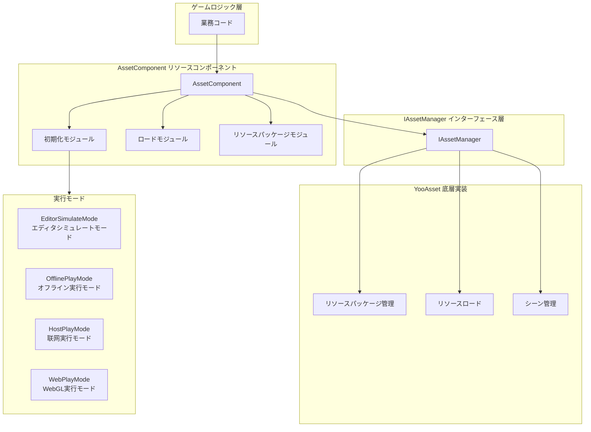
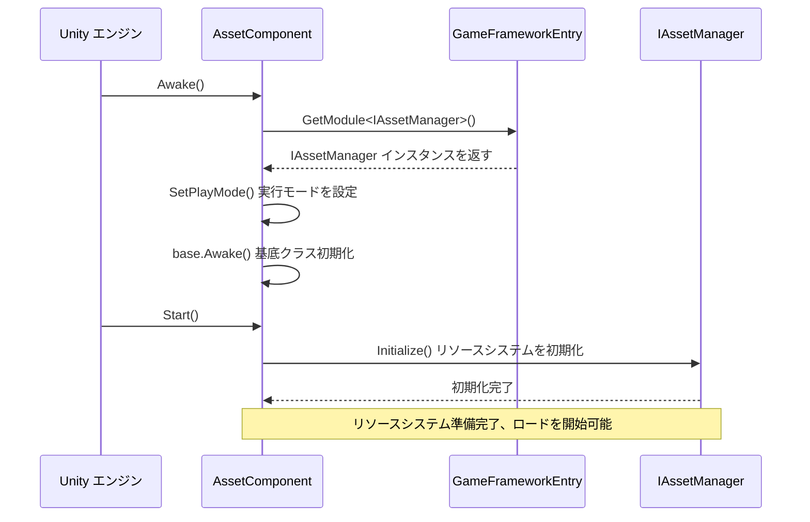

# リソースコンポーネント

リソースコンポーネント（AssetComponent）は GameFrameX リソースシステムのコアエントリーポイントであり、统一されたリソースロード、アンロード、管理機能を提供します。このコンポーネントは YooAsset 底層実装を封裝し、ゲームプロジェクトにシンプルで高效なリソース管理 API を提供します。

## 概要

AssetComponent は Unity コンポーネント（MonoBehaviour）であり、`GameFrameworkComponent` を継承しています。リソースシステムのファサード（Facade）として、リソース操作の複雑さを簡素化し、同期/非同期ロード、シーン管理、リソースパッケージ管理などの機能を提供します。

**設計目的:**
- 统一されたリソースアクセスインターフェースを提供し、底層実装の詳細を隠蔽
- 複数の実行モードをサポートし、異なる开发和展開シーンに適応
- リソースの遅延ロードと自動解放を実現し、メモリの使用を最適化
- ホットアップデートリソース管理をサポートし、联网ゲームに適合

## アーキテクチャ設計



**アーキテクチャ説明:**
- **ゲームロジック層**: 業務コードは AssetComponent を通じてリソースシステムにアクセス
- **AssetComponent 層**: コンポーネント化されたリソースインターフェースを提供し、初期化、ロード、リソースパッケージ管理モジュールを含みます
- **IAssetManager インターフェース層**: リソース管理の抽象インターフェースを定義し、注目の分離を実装
- **YooAsset 層**: YooAsset ライブラリに基づく実際のリソース管理実装
- **実行モード**: 4種類の異なるリソース実行モードをサポートし、各种開発展開シーンに適応

## コア機能

### 1. 実行モードサポート

AssetComponent は4種類の実行モードをサポートし、`GamePlayMode` プロパティを通じて設定します：

| モード | 説明 | 適用シーン |
|------|------|----------|
| EditorSimulateMode | エディタシミュレートモード | 開発フェーズ、パッケージなしでリソースをテスト可能 |
| OfflinePlayMode | オフライン実行モード | ローカルリソースのみ、ネットワーク更新なし |
| HostPlayMode | 联网実行モード | ホットアップデートが必要な本番リリースバージョン |
| WebPlayMode | WebGL 実行モード | Web プラットフォーム发布、ミニゲームプラットフォームをサポート |

**プラットフォーム自動 adapter:**

```csharp
// AssetComponent.cs - 実行時に自動的に実行モードを調整
#if !UNITY_EDITOR
    if (GamePlayMode == EPlayMode.EditorSimulateMode)
    {
        GamePlayMode = EPlayMode.HostPlayMode;
    }
#if UNITY_WEBGL
    GamePlayMode = EPlayMode.WebPlayMode;
#endif
#endif
```
> Source: [AssetComponent.cs](https://github.com/GameFrameX/com.gameframex.unity.asset/blob/main/Runtime/Asset/AssetComponent.cs#L44-L52)

### 2. リソースロード

AssetComponent は丰富なリソースロードインターフェースを提供し、同期と非同期两种の方法をサポート：

```csharp
// 非同期でリソースをロード
public async Task<AssetHandle> LoadAssetAsync<T>(string path) where T : Object

// 同期でリソースをロード
public AssetHandle LoadAssetSync<T>(string path) where T : Object

// 非同期でサブリソースをロード（例：SpriteAtlas 内）の Sprite）
public Task<SubAssetsHandle> LoadSubAssetsAsync<T>(string path) where T : Object

// 非同期ですべてのリソースをロード
public Task<AllAssetsHandle> LoadAllAssetsAsync<T>(string path) where T : Object
```
> Source: [AssetComponent.cs](https://github.com/GameFrameX/com.gameframex.unity.asset/blob/main/Runtime/Asset/AssetComponent.cs#L257-L305)

### 3. シーンロード

非同期で Unity シーンをロードするのをサポート：

```csharp
// 非同期でシーンをロード
public Task<SceneHandle> LoadSceneAsync(string path, LoadSceneMode sceneMode, bool activateOnLoad = true)
```
> Source: [AssetComponent.cs](https://github.com/GameFrameX/com.gameframex.unity.asset/blob/main/Runtime/Asset/AssetComponent.cs#L443-L459)

### 4. リソースパッケージ管理

複数のリソースパッケージ管理をサポートし、リソースパッケージの作成、取得、デフォルト設定が可能：

```csharp
// リソースパッケージを作成
public ResourcePackage CreateAssetsPackage(string packageName)

// リソースパッケージの取得を試行（存在しない場合は null を返す）
public ResourcePackage TryGetAssetsPackage(string packageName)

// リソースパッケージ是否存在か確認
public bool HasAssetsPackage(string packageName)

// デフォルトリソースパッケージを設定
public void SetDefaultAssetsPackage(ResourcePackage assetsPackage)
```
> Source: [AssetComponent.cs](https://github.com/GameFrameX/com.gameframex.unity.asset/blob/main/Runtime/Asset/AssetComponent.cs#L471-L584)

### 5. リソースアンロードと清理

複数のリソース解放戦略を提供：

```csharp
// 特定のリソースをアンロード
public void UnloadAsset(string assetPath)

// リソースハンドルをアンロード
public void UnloadAssetHandle(object assetHandle)

// 未使用のリソースをアンロード
public void UnloadUnusedAssetsAsync(string packageName = null)

// 無用なリソースパッケージファイルを清理
public void ClearUnusedBundleFilesAsync(string packageName = null)

// すべてのリソースを強制回收
public void UnloadAllAssetsAsync(string packageName)

// すべてのリソースパッケージファイルを清理
public void ClearAllBundleFilesAsync(string packageName = null)
```
> Source: [AssetComponent.cs](https://github.com/GameFrameX/com.gameframex.unity.asset/blob/main/Runtime/Asset/AssetComponent.cs#L602-L658)

## コアフロー

### コンポーネント初期化フロー



### リソースロードフロー

```mermaid
sequenceDiagram
    participant Client as 業務コード
    participant AC as AssetComponent
    participant IAM as IAssetManager
    package as YooAsset ResourcePackage

    Client->>AC: LoadAssetAsync<T>(path)
    AC->>IAM: LoadAssetAsync<T>(path)
    IAM->>package: LoadAssetAsync(path)
    
    rect rgb(240, 248, 255)
        Note right of package: リソースロード段階
    end
    
    package-->>IAM: AssetHandle
    IAM-->>AC: AssetHandle
    AC-->>Client: Task<AssetHandle>
    
    Client->>Client: await Task
    Note over Client: リソースオブジェクトを取得
    
    Client->>AC: UnloadAssetHandle(handle)
    AC->>IAM: handle.Release()
    Note over package: リソースは解放済み
```

## 使用例

### 基礎用法：非同期でリソースをロード

```csharp
using UnityEngine;
using GameFrameX.Asset.Runtime;
using YooAssets;

public class Example : MonoBehaviour
{
    private async void Start()
    {
        var assetComponent = GameEntry.GetComponent<AssetComponent>();
        
        // 非同期で Prefab をロード
        var handle = await assetComponent.LoadAssetAsync<GameObject>("Prefabs/Player");
        var prefab = handle.LoadAsset();
        
        // オブジェクトをインスタンス化
        Instantiate(prefab);
        
        // ロード完了後にリソースハンドルを解放
        handle.Release();
    }
}
```
> Source: [AssetComponent.cs](https://github.com/GameFrameX/com.gameframex.unity.asset/blob/main/Runtime/Asset/AssetComponent.cs#L257-L261)

### 上級用法：リソースパッケージ初期化と複数リソースパッケージ管理

```csharp
using UnityEngine;
using GameFrameX.Asset.Runtime;

public class MultiPackageExample : MonoBehaviour
{
    private async void Start()
    {
        var assetComponent = GameEntry.GetComponent<AssetComponent>();
        
        // デフォルトリソースパッケージを初期化
        await assetComponent.InitPackageAsync(
            "DefaultPackage",           // パッケージ名
            "https://cdn.example.com/", // メイン下载地址
            "https://backup.example.com/", // バックアップ地址
            true                        // デフォルトパッケージか
        );
        
        // 追加のリソースパッケージを作成
        var uiPackage = assetComponent.CreateAssetsPackage("UIPackage");
        var configPackage = assetComponent.CreateAssetsPackage("ConfigPackage");
        
        // デフォルトリソースパッケージを設定
        assetComponent.SetDefaultAssetsPackage(uiPackage);
    }
}
```
> Source: [AssetComponent.cs](https://github.com/GameFrameX/com.gameframex.unity.asset/blob/main/Runtime/Asset/AssetComponent.cs#L80-L95)

### 上級用法：リソースステータス確認と条件付きロード

```csharp
using UnityEngine;
using GameFrameX.Asset.Runtime;

public class ResourceCheckExample : MonoBehaviour
{
    private async void LoadResourceWithCheck()
    {
        var assetComponent = GameEntry.GetComponent<AssetComponent>();
        
        string resourcePath = "Prefabs/HeavyModel";
        
        // リソースがダウンロード必要か確認
        if (assetComponent.IsNeedDownload(resourcePath))
        {
            Debug.Log("リソースがダウンロード必要、ダウンロード画面を表示...");
            // ここにダウンロード進捗 UI を追加可能
        }
        
        // リソース情報を取得
        var assetInfo = assetComponent.GetAssetInfo(resourcePath);
        if (assetInfo != null)
        {
            Debug.Log($"リソースパス: {assetInfo.AssetPath}");
        }
        
        // リソースパスが存在するか確認
        if (assetComponent.HasAssetPath(resourcePath))
        {
            var handle = await assetComponent.LoadAssetAsync<GameObject>(resourcePath);
            // リソースを処理
            handle.Release();
        }
    }
}
```
> Source: [AssetComponent.cs](https://github.com/GameFrameX/com.gameframex.unity.asset/blob/main/Runtime/Asset/AssetComponent.cs#L517-L573)

## 設定説明

### Unity エディタで構成

Unity シーンで GameObject を作成し、**AssetComponent** コンポーネントを追加します：

1. Inspector パネルで **リソース実行モード**（GamePlayMode）を設定
2. 選択したモードに応じて相应のパラメータを設定

```csharp
// AssetComponentInspector.cs - エディタ設定インターフェース
[CustomEditor(typeof(AssetComponent))]
internal sealed class AssetComponentInspector : ComponentTypeComponentInspector
{
    public override void OnInspectorGUI()
    {
        // 実行モード中に編集を無効化
        EditorGUI.BeginDisabledGroup(EditorApplication.isPlayingOrWillChangePlaymode);
        {
            EditorGUILayout.PropertyField(m_GamePlayMode, m_GamePlayModeGUIContent);
        }
    }
}
```
> Source: [AssetComponentInspector.cs](https://github.com/GameFrameX/com.gameframex.unity.asset/blob/main/Editor/Inspector/AssetComponentInspector.cs#L48-L66)

### コンポーネントプロパティ

| プロパティ | タイプ | 説明 |
|------|------|------|
| GamePlayMode | EPlayMode | リソース実行モード、リソースロード方式を決定 |
| ImplementationComponentType | Type | IAssetManager の実装クラス型 |
| InterfaceComponentType | Type | コンポーネントに対応するインターフェースクラス型 |

## リソースマネージャーとの関係

AssetComponent は Unity コンポーネントシステムに向けたファサードクラスであり、IAssetManager/AssetManager は純粋な業務ロジック层面的リソース管理能力を提供します：


**职责の划分:**
- **AssetComponent**: Unity コンポーネントとして、ライフサイクル（Awake/Start）を處理し、Unity に優しい API を提供
- **IAssetManager**: リソース管理のインターフェース контракт を定義し、Unity ライフサイクルと解耦
- **AssetManager**: インターフェースの具体的な実装であり、YooAsset の底層呼び出しを處理

## 関連リンク

- [リソースマネージャー](./4-core-concepts.asset-manager) - リソース管理の底層実装について詳細を確認
- [実行モード](./6-configuration.play-modes) - 4種類の実行モードの詳細設定について確認
- [リソースロード API](./5-api-reference.loading-api) - 完全なリソースロードインターフェース документацию
- [リソースパッケージ管理](./5-api-reference.package-management) - リソースパッケージ管理の詳細説明
- [インストールガイド](./2-installation.index) - リソースコンポーネントのインストールと設定方法
- [クイックスタート](./3-getting-started.index) - リソースコンポーネントの手早い使用方法
