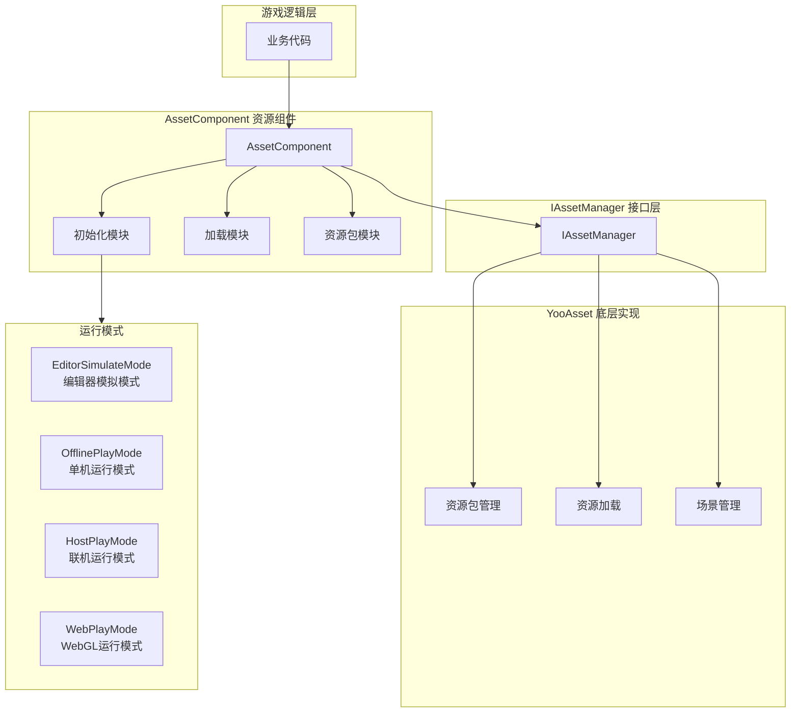
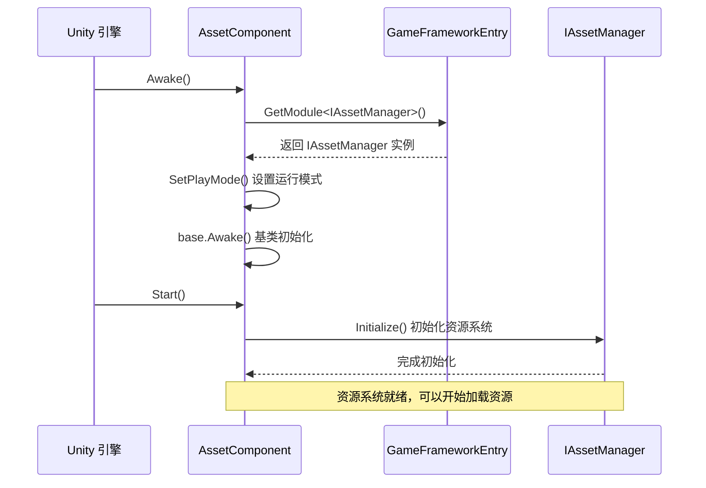

# リソースコンポーネント

リソースコンポーネント（AssetComponent）是 GameFrameX リソースシステム的コア入口，提供統一された的リソースロード、アンロード和管理機能。该コンポーネントカプセル化了 YooAsset 底层実装，为游戏プロジェクト提供シンプル効率的的リソース管理 API。

## 概要

AssetComponent は Unity コンポーネント（MonoBehaviour），継承自 GameFrameworkComponent。作为リソースシステム的门面（Facade），它簡素化了リソース操作的複雑性，提供します同步/非同期ロード、シーン管理、リソースパッケージ管理等機能。

**設計目的**：
- 提供統一された的リソース访问インターフェース，隐藏底层実装细节
- サポート多种运行モード，适应不同的开发和デプロイシーン
- 実装リソース的懒ロード和自动解放，最適化内存使用
- サポートホットアップデートリソース管理，適しています联机游戏

## アーキテクチャ設計



**アーキテクチャ説明**：
- **游戏逻辑层**：业务コード通过 AssetComponent 访问リソースシステム
- **AssetComponent 层**：提供コンポーネント化的リソースインターフェース，含みます初期化、ロード、リソースパッケージ管理モジュール
- **IAssetManager インターフェース層**：定義リソース管理的抽象インターフェース，実装关注点分离
- **YooAsset 层**：基于 YooAsset 库的实际リソース管理実装
- **运行モード**：サポート四种不同的リソース运行モード，适应各种开发デプロイシーン

## コア機能

### 1. 运行モードサポート

AssetComponent サポート四种运行モード，通过 `GamePlayMode` プロパティ設定：

| モード | 説明 | 适用シーン |
|------|------|----------|
| EditorSimulateMode | エディタ模拟モード | 开发フェーズ，无需打パッケージつまり可テストリソース |
| OfflinePlayMode | 单机运行モード | 纯本地リソース，不涉及网络アップデート |
| HostPlayMode | 联机运行モード | 〜する必要がありますホットアップデート的正式リリースバージョン |
| WebPlayMode | WebGL 运行モード | Web プラットフォームリリース，サポートミニゲームプラットフォーム |

**プラットフォーム自动适配**：

```csharp
// AssetComponent.cs - 运行时自动调整运行模式
#if !UNITY_EDITOR
    if (GamePlayMode == EPlayMode.EditorSimulateMode)
    {
        GamePlayMode = EPlayMode.HostPlayMode;
    }
#if UNITY_WEBGL
    GamePlayMode = EPlayMode.WebPlayMode;
#endif
#endif
```
> Source: [AssetComponent.cs](https://github.com/GameFrameX/com.gameframex.unity.asset/blob/main/Runtime/Asset/AssetComponent.cs#L44-L52)

### 2. リソースロード

AssetComponent 提供丰富的リソースロードインターフェース，サポート同步和异步两种方法：

```csharp
// 异步加载资源
public async Task<AssetHandle> LoadAssetAsync<T>(string path) where T : Object

// 同步加载资源
public AssetHandle LoadAssetSync<T>(string path) where T : Object

// 异步加载子资源（如 SpriteAtlas 中的 Sprite）
public Task<SubAssetsHandle> LoadSubAssetsAsync<T>(string path) where T : Object

// 异步加载所有资源
public Task<AllAssetsHandle> LoadAllAssetsAsync<T>(string path) where T : Object
```
> Source: [AssetComponent.cs](https://github.com/GameFrameX/com.gameframex.unity.asset/blob/main/Runtime/Asset/AssetComponent.cs#L257-L305)

### 3. シーンロード

サポート非同期ロード Unity シーン：

```csharp
// 异步加载场景
public Task<SceneHandle> LoadSceneAsync(string path, LoadSceneMode sceneMode, bool activateOnLoad = true)
```
> Source: [AssetComponent.cs](https://github.com/GameFrameX/com.gameframex.unity.asset/blob/main/Runtime/Asset/AssetComponent.cs#L443-L459)

### 4. リソースパッケージ管理

サポート多リソースパッケージ管理，〜できます作成、取得、設定デフォルトリソースパッケージ：

```csharp
// 创建资源包
public ResourcePackage CreateAssetsPackage(string packageName)

// 尝试获取资源包（不存在返回 null）
public ResourcePackage TryGetAssetsPackage(string packageName)

// 检查资源包是否存在
public bool HasAssetsPackage(string packageName)

// 设置默认资源包
public void SetDefaultAssetsPackage(ResourcePackage assetsPackage)
```
> Source: [AssetComponent.cs](https://github.com/GameFrameX/com.gameframex.unity.asset/blob/main/Runtime/Asset/AssetComponent.cs#L471-L584)

### 5. リソースアンロード与清理

提供多种リソース解放策略：

```csharp
// 卸载指定资源
public void UnloadAsset(string assetPath)

// 卸载资源句柄
public void UnloadAssetHandle(object assetHandle)

// 卸载无用资源
public void UnloadUnusedAssetsAsync(string packageName = null)

// 清理无用资源包文件
public void ClearUnusedBundleFilesAsync(string packageName = null)

// 强制回收所有资源
public void UnloadAllAssetsAsync(string packageName)

// 清理所有资源包文件
public void ClearAllBundleFilesAsync(string packageName = null)
```
> Source: [AssetComponent.cs](https://github.com/GameFrameX/com.gameframex.unity.asset/blob/main/Runtime/Asset/AssetComponent.cs#L602-L658)

## コアフロー

### コンポーネント初期化フロー



### リソースロードフロー

```mermaid
sequenceDiagram
    participant Client as 业务代码
    participant AC as AssetComponent
    participant IAM as IAssetManager
    package as YooAsset ResourcePackage

    Client->>AC: LoadAssetAsync<T>(path)
    AC->>IAM: LoadAssetAsync<T>(path)
    IAM->>package: LoadAssetAsync(path)
    
    rect rgb(240, 248, 255)
        Note right of package: 资源加载阶段
    end
    
    package-->>IAM: AssetHandle
    IAM-->>AC: AssetHandle
    AC-->>Client: Task<AssetHandle>
    
    Client->>Client: await Task
    Note over Client: 获取资源对象
    
    Client->>AC: UnloadAssetHandle(handle)
    AC->>IAM: handle.Release()
    Note over package: 资源已释放
```

## 使用例

### 基本用法：非同期ロードリソース

```csharp
using UnityEngine;
using GameFrameX.Asset.Runtime;
using YooAssets;

public class Example : MonoBehaviour
{
    private async void Start()
    {
        var assetComponent = GameEntry.GetComponent<AssetComponent>();
        
        // 异步加载 Prefab
        var handle = await assetComponent.LoadAssetAsync<GameObject>("Prefabs/Player");
        var prefab = handle.LoadAsset();
        
        // 实例化对象
        Instantiate(prefab);
        
        // 加载完成后释放资源句柄
        handle.Release();
    }
}
```
> Source: [AssetComponent.cs](https://github.com/GameFrameX/com.gameframex.unity.asset/blob/main/Runtime/Asset/AssetComponent.cs#L257-L261)

### 进阶用法：リソースパッケージ初期化与多リソースパッケージ管理

```csharp
using UnityEngine;
using GameFrameX.Asset.Runtime;

public class MultiPackageExample : MonoBehaviour
{
    private async void Start()
    {
        var assetComponent = GameEntry.GetComponent<AssetComponent>();
        
        // 初始化默认资源包
        await assetComponent.InitPackageAsync(
            "DefaultPackage",           // 包名称
            "https://cdn.example.com/", // 主下载地址
            "https://backup.example.com/", // 备用地址
            true                        // 是否默认包
        );
        
        // 创建额外的资源包
        var uiPackage = assetComponent.CreateAssetsPackage("UIPackage");
        var configPackage = assetComponent.CreateAssetsPackage("ConfigPackage");
        
        // 设置默认资源包
        assetComponent.SetDefaultAssetsPackage(uiPackage);
    }
}
```
> Source: [AssetComponent.cs](https://github.com/GameFrameX/com.gameframex.unity.asset/blob/main/Runtime/Asset/AssetComponent.cs#L80-L95)

### 高级用法：確認リソースステータス与条件ロード

```csharp
using UnityEngine;
using GameFrameX.Asset.Runtime;

public class ResourceCheckExample : MonoBehaviour
{
    private async void LoadResourceWithCheck()
    {
        var assetComponent = GameEntry.GetComponent<AssetComponent>();
        
        string resourcePath = "Prefabs/HeavyModel";
        
        // 检查资源是否需要下载
        if (assetComponent.IsNeedDownload(resourcePath))
        {
            Debug.Log("资源需要下载，显示下载界面...");
            // 这里可以添加下载进度 UI
        }
        
        // 获取资源信息
        var assetInfo = assetComponent.GetAssetInfo(resourcePath);
        if (assetInfo != null)
        {
            Debug.Log($"资源路径: {assetInfo.AssetPath}");
        }
        
        // 检查资源路径是否存在
        if (assetComponent.HasAssetPath(resourcePath))
        {
            var handle = await assetComponent.LoadAssetAsync<GameObject>(resourcePath);
            // 处理资源
            handle.Release();
        }
    }
}
```
> Source: [AssetComponent.cs](https://github.com/GameFrameX/com.gameframex.unity.asset/blob/main/Runtime/Asset/AssetComponent.cs#L517-L573)

## 設定説明

### 在 Unity エディタ中設定

在 Unity シーン中作成 GameObject，并追加 **AssetComponent** コンポーネント：

1. 在 Inspector パネル中設定 **リソース运行モード**（GamePlayMode）
2. 根据选择的モード設定相应的パラメータ

```csharp
// AssetComponentInspector.cs - 编辑器配置界面
[CustomEditor(typeof(AssetComponent))]
internal sealed class AssetComponentInspector : ComponentTypeComponentInspector
{
    public override void OnInspectorGUI()
    {
        // 运行模式下禁用编辑
        EditorGUI.BeginDisabledGroup(EditorApplication.isPlayingOrWillChangePlaymode);
        {
            EditorGUILayout.PropertyField(m_GamePlayMode, m_GamePlayModeGUIContent);
        }
    }
}
```
> Source: [AssetComponentInspector.cs](https://github.com/GameFrameX/com.gameframex.unity.asset/blob/main/Editor/Inspector/AssetComponentInspector.cs#L48-L66)

### コンポーネントプロパティ

| プロパティ | タイプ | 説明 |
|------|------|------|
| GamePlayMode | EPlayMode | リソース运行モード，决定リソースロード方法 |
| ImplementationComponentType | Type | IAssetManager 的実装タイプ |
| InterfaceComponentType | Type | コンポーネント对应的インターフェースタイプ |

## 与リソースマネージャー的关系

AssetComponent 是面向 Unity コンポーネント系统的门面类，而 IAssetManager/AssetManager 提供します纯业务逻辑层面的リソース管理能力：


**职责划分**：
- **AssetComponent**：作为 Unity コンポーネント，処理ライフサイクル（Awake/Start），提供 Unity 使いやすい的 API
- **IAssetManager**：定義リソース管理的インターフェース契约，与 Unity ライフサイクル解耦
- **AssetManager**：インターフェース的具体実装，処理 YooAsset 的底层呼び出し

## 関連リンク

- [リソースマネージャー](./4-core-concepts.asset-manager) - 理解する更多リソース管理的底层実装
- [运行モード](./6-configuration.play-modes) - 理解する四种运行モード的詳細設定
- [リソースロード API](./5-api-reference.loading-api) - 完全な的リソースロードインターフェースドキュメント
- [リソースパッケージ管理](./5-api-reference.package-management) - リソースパッケージ管理的詳細説明
- [インストールガイド](./2-installation.index) - 如何インストール和設定リソースコンポーネント
- [快速入门](./3-getting-started.index) - 快速开始使用リソースコンポーネント
