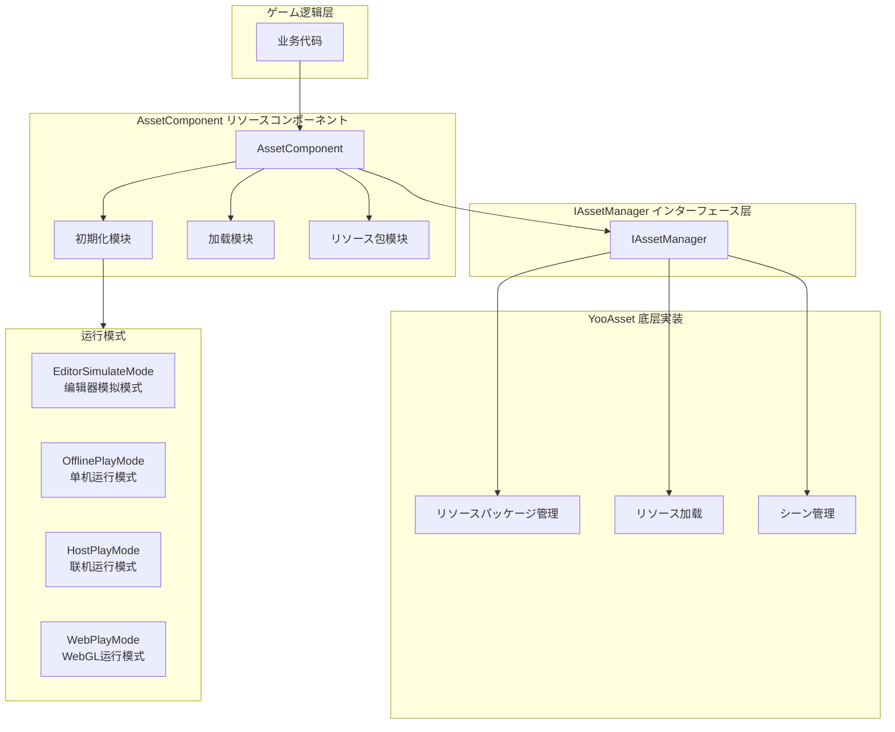
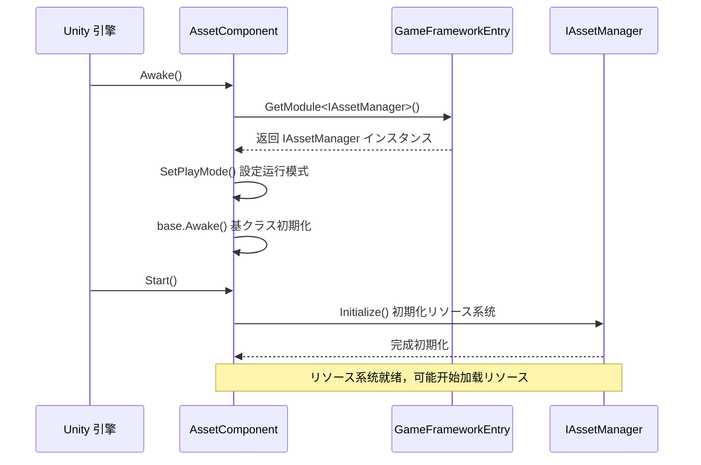
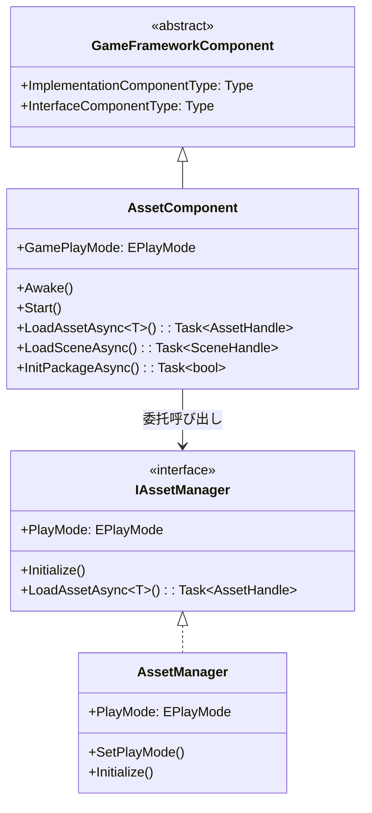

# リソースコンポーネント

リソースコンポーネント（AssetComponent）是 GameFrameX リソース系统的コアエントリーポイント，提供统一的リソース加载、卸载和管理機能。该コンポーネント封装了 YooAsset 底层実装，为ゲームプロジェクト提供简洁高效的リソース管理 API。

## 概要

AssetComponent は Unity コンポーネント（MonoBehaviour），を継承 GameFrameworkComponent。作为リソース系统的门面（Facade），它简化了リソース操作的复杂性，提供します同步/异步加载、シーン管理、リソースパッケージ管理等機能。

**设计目的**：
- 提供统一的リソース访问インターフェース，隐藏底层実装细节
- サポート多种运行模式，适应不同的开发和部署シーン
- 実装リソース的懒加载和自动释放，优化内存使用
- サポートホットアップデートリソース管理，适に使用联机ゲーム

## アーキテクチャ設計



**架构説明**：
- **ゲーム逻辑层**：业务代码を通じて AssetComponent 访问リソース系统
- **AssetComponent 层**：提供コンポーネント化的リソースインターフェース，包括初期化、加载、リソースパッケージ管理模块
- **IAssetManager インターフェース层**：定义リソース管理的抽象インターフェース，実装关注点分离
- **YooAsset 层**：基づく YooAsset 库的实际リソース管理実装
- **运行模式**：サポート四种不同的リソース运行模式，适应各种开发部署シーン

## コア機能

### 1. 运行模式サポート

AssetComponent サポート四种运行模式，を通じて `GamePlayMode` プロパティ配置：

| 模式 | 説明 | 适用シーン |
|------|------|----------|
| EditorSimulateMode | 编辑器模拟模式 | 开发阶段，无需打包即可测试リソース |
| OfflinePlayMode | 单机运行模式 | 纯本地リソース，不涉及网络更新 |
| HostPlayMode | 联机运行模式 | 必要ホットアップデート的正式发布版本 |
| WebPlayMode | WebGL 运行模式 | Web 平台发布，サポート小ゲーム平台 |

**平台自动适配**：

```csharp
// AssetComponent.cs - 运行时自动调整运行模式
#if !UNITY_EDITOR
    if (GamePlayMode == EPlayMode.EditorSimulateMode)
    {
        GamePlayMode = EPlayMode.HostPlayMode;
    }
#if UNITY_WEBGL
    GamePlayMode = EPlayMode.WebPlayMode;
#endif
#endif
```
> Source: [AssetComponent.cs](https://github.com/GameFrameX/com.gameframex.unity.asset/blob/main/Runtime/Asset/AssetComponent.cs#L44-L52)

### 2. リソース加载

AssetComponent 提供丰富的リソース加载インターフェース，サポート同步和异步两种方法：

```csharp
// 异步加载リソース
public async Task<AssetHandle> LoadAssetAsync<T>(string path) where T : Object

// 同步加载リソース
public AssetHandle LoadAssetSync<T>(string path) where T : Object

// 异步加载子リソース（如 SpriteAtlas 中的 Sprite）
public Task<SubAssetsHandle> LoadSubAssetsAsync<T>(string path) where T : Object

// 异步加载所有リソース
public Task<AllAssetsHandle> LoadAllAssetsAsync<T>(string path) where T : Object
```
> Source: [AssetComponent.cs](https://github.com/GameFrameX/com.gameframex.unity.asset/blob/main/Runtime/Asset/AssetComponent.cs#L257-L305)

### 3. シーン加载

サポート异步加载 Unity シーン：

```csharp
// 异步加载シーン
public Task<SceneHandle> LoadSceneAsync(string path, LoadSceneMode sceneMode, bool activateOnLoad = true)
```
> Source: [AssetComponent.cs](https://github.com/GameFrameX/com.gameframex.unity.asset/blob/main/Runtime/Asset/AssetComponent.cs#L443-L459)

### 4. リソースパッケージ管理

サポート多リソースパッケージ管理，可能作成、取得、設定默认リソース包：

```csharp
// 作成リソース包
public ResourcePackage CreateAssetsPackage(string packageName)

// 尝试取得リソース包（不存在返回 null）
public ResourcePackage TryGetAssetsPackage(string packageName)

// 检查リソース包是否存在
public bool HasAssetsPackage(string packageName)

// 設定默认リソース包
public void SetDefaultAssetsPackage(ResourcePackage assetsPackage)
```
> Source: [AssetComponent.cs](https://github.com/GameFrameX/com.gameframex.unity.asset/blob/main/Runtime/Asset/AssetComponent.cs#L471-L584)

### 5. リソース卸载与清理

提供多种リソース释放策略：

```csharp
// 卸载指定リソース
public void UnloadAsset(string assetPath)

// 卸载リソース句柄
public void UnloadAssetHandle(object assetHandle)

// 卸载无用リソース
public void UnloadUnusedAssetsAsync(string packageName = null)

// 清理无用リソース包ファイル
public void ClearUnusedBundleFilesAsync(string packageName = null)

// 强制回收所有リソース
public void UnloadAllAssetsAsync(string packageName)

// 清理所有リソース包ファイル
public void ClearAllBundleFilesAsync(string packageName = null)
```
> Source: [AssetComponent.cs](https://github.com/GameFrameX/com.gameframex.unity.asset/blob/main/Runtime/Asset/AssetComponent.cs#L602-L658)

## コアフロー

### コンポーネント初期化フロー



### リソース加载フロー

```mermaid
sequenceDiagram
    participant Client as 业务代码
    participant AC as AssetComponent
    participant IAM as IAssetManager
    package as YooAsset ResourcePackage

    Client->>AC: LoadAssetAsync<T>(path)
    AC->>IAM: LoadAssetAsync<T>(path)
    IAM->>package: LoadAssetAsync(path)
    
    rect rgb(240, 248, 255)
        Note right of package: リソース加载阶段
    end
    
    package-->>IAM: AssetHandle
    IAM-->>AC: AssetHandle
    AC-->>Client: Task<AssetHandle>
    
    Client->>Client: await Task
    Note over Client: 取得リソース对象
    
    Client->>AC: UnloadAssetHandle(handle)
    AC->>IAM: handle.Release()
    Note over package: リソース已释放
```

## 使用例

### 基础用法：异步加载リソース

```csharp
using UnityEngine;
using GameFrameX.Asset.Runtime;
using YooAssets;

public class Example : MonoBehaviour
{
    private async void Start()
    {
        var assetComponent = GameEntry.GetComponent<AssetComponent>();
        
        // 异步加载 Prefab
        var handle = await assetComponent.LoadAssetAsync<GameObject>("Prefabs/Player");
        var prefab = handle.LoadAsset();
        
        // インスタンス化对象
        Instantiate(prefab);
        
        // 加载完成后释放リソース句柄
        handle.Release();
    }
}
```
> Source: [AssetComponent.cs](https://github.com/GameFrameX/com.gameframex.unity.asset/blob/main/Runtime/Asset/AssetComponent.cs#L257-L261)

### 进阶用法：リソース包初期化与多リソースパッケージ管理

```csharp
using UnityEngine;
using GameFrameX.Asset.Runtime;

public class MultiPackageExample : MonoBehaviour
{
    private async void Start()
    {
        var assetComponent = GameEntry.GetComponent<AssetComponent>();
        
        // 初期化默认リソース包
        await assetComponent.InitPackageAsync(
            "DefaultPackage",           // 包名称
            "https://cdn.example.com/", // 主ダウンロード地址
            "https://backup.example.com/", // 备用地址
            true                        // 是否默认包
        );
        
        // 作成额外的リソース包
        var uiPackage = assetComponent.CreateAssetsPackage("UIPackage");
        var configPackage = assetComponent.CreateAssetsPackage("ConfigPackage");
        
        // 設定默认リソース包
        assetComponent.SetDefaultAssetsPackage(uiPackage);
    }
}
```
> Source: [AssetComponent.cs](https://github.com/GameFrameX/com.gameframex.unity.asset/blob/main/Runtime/Asset/AssetComponent.cs#L80-L95)

### 高级用法：检查リソースステータス与条件加载

```csharp
using UnityEngine;
using GameFrameX.Asset.Runtime;

public class ResourceCheckExample : MonoBehaviour
{
    private async void LoadResourceWithCheck()
    {
        var assetComponent = GameEntry.GetComponent<AssetComponent>();
        
        string resourcePath = "Prefabs/HeavyModel";
        
        // 检查リソース是否必要ダウンロード
        if (assetComponent.IsNeedDownload(resourcePath))
        {
            Debug.Log("リソース必要ダウンロード，显示ダウンロード界面...");
            // 这里可能添加ダウンロード进度 UI
        }
        
        // 取得リソース信息
        var assetInfo = assetComponent.GetAssetInfo(resourcePath);
        if (assetInfo != null)
        {
            Debug.Log($"リソース路径: {assetInfo.AssetPath}");
        }
        
        // 检查リソース路径是否存在
        if (assetComponent.HasAssetPath(resourcePath))
        {
            var handle = await assetComponent.LoadAssetAsync<GameObject>(resourcePath);
            // 处理リソース
            handle.Release();
        }
    }
}
```
> Source: [AssetComponent.cs](https://github.com/GameFrameX/com.gameframex.unity.asset/blob/main/Runtime/Asset/AssetComponent.cs#L517-L573)

## 設定説明

### 在 Unity 编辑器中配置

在 Unity シーン中作成 GameObject，并添加 **AssetComponent** コンポーネント：

1. 在 Inspector 面板中配置 **リソース运行模式**（GamePlayMode）
2. に基づいて选择的模式配置相应的参数

```csharp
// AssetComponentInspector.cs - 编辑器配置界面
[CustomEditor(typeof(AssetComponent))]
internal sealed class AssetComponentInspector : ComponentTypeComponentInspector
{
    public override void OnInspectorGUI()
    {
        // 运行模式下禁用编辑
        EditorGUI.BeginDisabledGroup(EditorApplication.isPlayingOrWillChangePlaymode);
        {
            EditorGUILayout.PropertyField(m_GamePlayMode, m_GamePlayModeGUIContent);
        }
    }
}
```
> Source: [AssetComponentInspector.cs](https://github.com/GameFrameX/com.gameframex.unity.asset/blob/main/Editor/Inspector/AssetComponentInspector.cs#L48-L66)

### コンポーネントプロパティ

| プロパティ | クラス型 | 説明 |
|------|------|------|
| GamePlayMode | EPlayMode | リソース运行模式，决定リソース加载方法 |
| ImplementationComponentType | Type | IAssetManager 的実装クラス型 |
| InterfaceComponentType | Type | コンポーネント对应的インターフェースクラス型 |

## 与リソース管理器的关系

AssetComponent 是面向 Unity コンポーネント系统的门面クラス，而 IAssetManager/AssetManager 提供します纯业务逻辑层面的リソース管理能力：



**职责划分**：
- **AssetComponent**：作为 Unity コンポーネント，处理生命周期（Awake/Start），提供 Unity 友好的 API
- **IAssetManager**：定义リソース管理的インターフェース契约，与 Unity 生命周期解耦
- **AssetManager**：インターフェース的具体実装，处理 YooAsset 的底层呼び出し

## 関連リンク

- [リソース管理器](./4-core-concepts.asset-manager) - 了解更多リソース管理的底层実装
- [运行模式](./6-configuration.play-modes) - 了解四种运行模式的详细配置
- [リソース加载 API](./5-api-reference.loading-api) - 完整的リソース加载インターフェース文档
- [リソースパッケージ管理](./5-api-reference.package-management) - リソースパッケージ管理的詳細説明
- [安装指南](./2-installation.index) - 如何安装和配置リソースコンポーネント
- [快速入门](./3-getting-started.index) - 快速开始使用リソースコンポーネント
