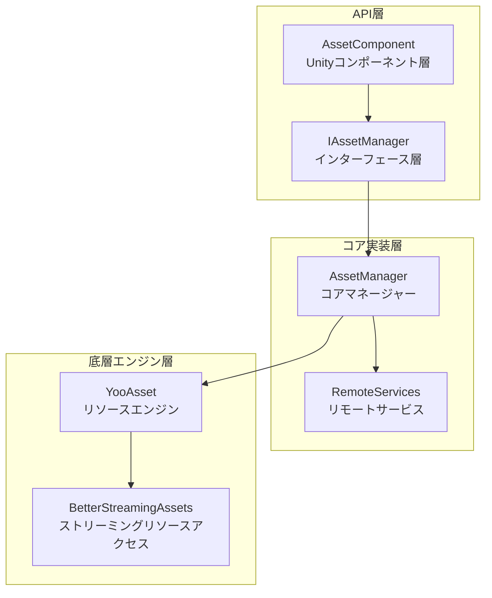
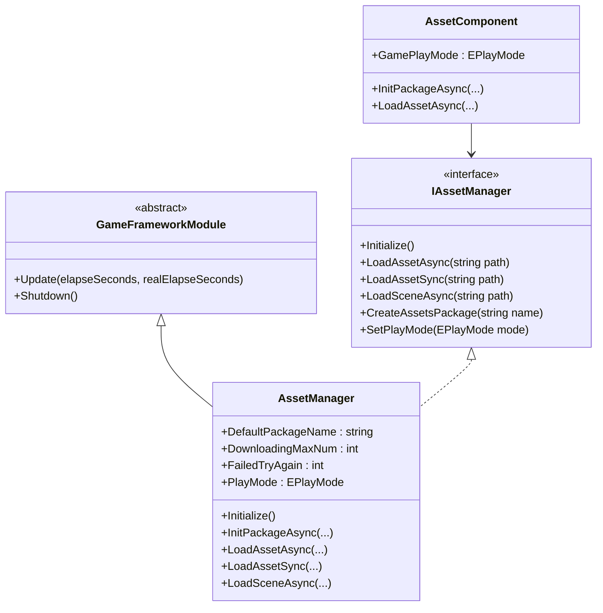
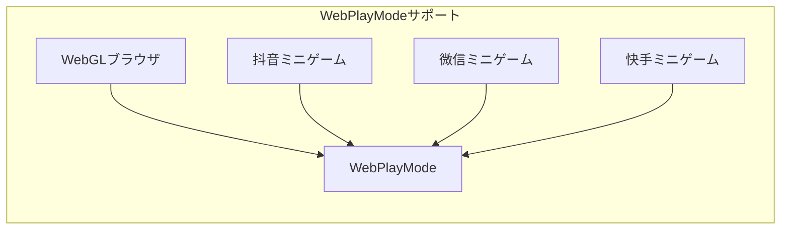

# リソースマネージャー

リソースマネージャー（Asset Manager）は GameFrameX アセットシステムのコアコンポーネントであり、ゲームリソースのロード、アンロード、ホットアップデートとリソースパッケージ管理を统一的に管理します。このコンポーネントは YooAsset ライブラリに基づいて構築され、シンプルで使いやすい API インターフェースを提供し、複数の実行モードとプラットフォームをサポートします。

## 概要

リソースマネージャーはゲームフレームワークのコアモジュールとして、ゲーム実行時のリソース管理の重要な責務を担います。現代ゲーム開発において、リソースの効果的な管理は直接ゲームの性能、ロード速度とユーザー体験に影響します。リソースマネージャーは YooAsset の機能を统一的に封裝し、開発者に一套の完全なリソース管理ソリューションを提供します。

このコンポーネントは、以下のコア機能をサポートしています：

- **同期/非同期リソースロード**: 同步と非同期两种のロード方法を提供し、異なるシーンの需求を満たします
- **複数リソースパッケージ管理**: 複数の独立したリソースパッケージの作成と管理をサポート
- **シーンロード**: 非同期シーンロードと切り替えをサポート
- **ホットアップデートサポート**: HostPlayMode と WebPlayMode でリソースホットアップデートをサポート
- **リソース清理**: 複数のリソース解放策略を提供し、メモリの使用を最適化

リソースマネージャーの設計理念は、複雑な底層リソース管理ロジックを封裝し、開発者は只需关注業務层面的リソース使用 필요なく、リソースがディスクまたはネットワークからどのようにロードされるか、バージョン管理などの问题を考慮する必要がありません。

## アーキテクチャ設計

リソースマネージャーのアーキテクチャは分层設計パターンを采用し、上から下に3つの主要層に分かれています：



### コンポーネントの説明

**API 層**は Unity エンジンと業務コードのインタラクションを担当します。`AssetComponent` は GameObject にアタッチされた Unity コンポーネントであり、Inspector パネル設定とコンポーネントライフサイクル管理を提供します。`IAssetManager` インターフェースはリソース管理のすべての操作 контракт を定義し、コードのテスト可能性と置換可能性を確保します。

**コア実装層**はリソース管理のコアロジックを実装します。`AssetManager` は `GameFrameworkModule` を継承し、全リソースシステムのコアです。YooAsset のすべての機能を封裝し、ゲーム開発により適した機能を追加します。`RemoteServices` は内部クラスであり、熱更新リソースのリモート URL の解決を担当します。

**底層エンジン層**は実際のリソース操作の実装です。YooAsset は業界有数の Unity リソース管理ソリューションであり、強力なリソースパッケージング、ロードとホットアップデート能力を提供します。BetterStreamingAssets は StreamingAssets ディレクトリへの高效的アクセスを提供します。

### コアクラス図



## コア機能

### リソースロード

リソースマネージャーは丰富なリソースロードインターフェースを提供し、同期と非同期两种のロードパターンをサポートします。同期ロードはロード時間に要求不高で主スレッドで実行するシーンに適合し、非同期ロードはフレームレートを安定させる必要がある大規模リソースロードシーンに適合します。

#### 非同期でリソースをロード

非同期ロードはゲーム開発で最も一般的に使用されるリソースロード方法であり、メースレッドをブロックせず、ゲームの流畅な運行を維持できます。リソースマネージャーは複数の非同期ロードインターフェースを提供します：

```csharp
// パスを介して非同期でリソースをロード
var handle = await assetComponent.LoadAssetAsync<GameObject>("Prefabs/Player");

// ロード完了のリソースオブジェクトを取得
var playerPrefab = handle.AssetObject as GameObject;
if (playerPrefab != null)
{
    Instantiate(playerPrefab);
}

// ロード完了後にハンドルを解放
handle.Release();
```

> Source: [AssetManager.cs](https://github.com/GameFrameX/com.gameframex.unity.asset/blob/main/Runtime/Asset/AssetManager.cs#L454-L480)

非同期ロードは Handle オブジェクトを返し、このオブジェクトを通じてロードされたリソースの取得、ロード進捗の监控、適当なタイマ밍でのリソース解放が可能です。開発者はリソースが不要になったら Handle を及时に解放し、メモリーリークを避ける必要があります。

#### 同期でリソースをロード

現在のフレームでリソースを取得する必要があるシーンには、同期ロードインターフェースを使用できます：

```csharp
// 同期でリソースをロード
var handle = assetComponent.LoadAssetSync<GameObject>("Prefabs/Enemy");
var enemyPrefab = handle.AssetObject as GameObject;
handle.Release();
```

> Source: [AssetManager.cs](https://github.com/GameFrameX/com.gameframex.unity.asset/blob/main/Runtime/Asset/AssetManager.cs#L603-L606)

同期ロードは呼び出しスレッドをブロックし、リソースがロード完了する前は返しません。因此、同期ロードは大規模リソースのロードには適さず、一般的には設定ファイルなどの小规模リソースのロードにしか使用しません。

#### サブリソースをロード

特定のリソースには複数のサブリソースが含まれている場合があります、例：prefab で参照されているマテリアルやテクスチャなど。リソースマネージャーは專門的なサブリソースロードインターフェースを提供します：

```csharp
// 非同期でサブリソースをロード
var handle = await assetComponent.LoadSubAssetsAsync<Sprite>("Atlas/GameUI");
foreach (var subAsset in handle.SubAssets)
{
    var sprite = subAsset.AssetObject as Sprite;
    // sprite を処理...
}
handle.Release();
```

> Source: [AssetManager.cs](https://github.com/GameFrameX/com.gameframex.unity.asset/blob/main/Runtime/Asset/AssetManager.cs#L244-L250)

### リソースパッケージ管理

リソースパッケージ（Resource Package）はリソース管理の基本単位であり、各リソースパッケージは独立してパッケージング、バージョン管理とホットアップデートを行うことができます。リソースマネージャーは同時に複数のリソースパッケージを管理することできます。

#### リソースパッケージを作成

```csharp
// 新しいリソースパッケージを作成
var package = assetComponent.CreateAssetsPackage("DLC_Package");
assetComponent.SetDefaultAssetsPackage(package);
```

> Source: [AssetManager.cs](https://github.com/GameFrameX/com.gameframex.unity.asset/blob/main/Runtime/Asset/AssetManager.cs#L654-L657)

#### リソースパッケージを取得

```csharp
// 既存のリソースパッケージを取得
var package = assetComponent.TryGetAssetsPackage("DLC_Package");
if (package != null)
{
    // リソースパッケージを使用...
}
```

> Source: [AssetManager.cs](https://github.com/GameFrameX/com.gameframex.unity.asset/blob/main/Runtime/Asset/AssetManager.cs#L665-L668)

### シーン管理

リソースマネージャーは非同期で Unity シーンをロードすることをサポートし、これは大型ゲームのレベル切り替えにおいて特に重要です：

```csharp
// 非同期でシーンをロード
var handle = await assetComponent.LoadSceneAsync(
    "Scenes/Level1", 
    LoadSceneMode.Single, 
    true
);
```

> Source: [AssetManager.cs](https://github.com/GameFrameX/com.gameframex.unity.asset/blob/main/Runtime/Asset/AssetManager.cs#L620-L626)

3番目のパラメータはロード完了後に自動的にシーンをアクティブにするかどうかを制御します。ロード過程中に Loading 画面を表示する必要がある場合、パラメータを false に设定し、Loading 完了後に手动でアクティブにできます。

### リソース清理

リソースメモリの合理的な管理は、ゲームパフォーマンス最適化の重要な环节です。リソースマネージャーは複数のリソース解放インターフェースを提供します：

```csharp
// 特定のリソースをアンロード
assetComponent.UnloadAsset("Prefabs/Player");

// 未使用のリソースをアンロード
assetComponent.UnloadUnusedAssetsAsync();

// 未使用の Bundle ファイルを清理
assetComponent.ClearUnusedBundleFilesAsync();

// すべてのリソースを強制回收
assetComponent.UnloadAllAssetsAsync();
```

> Source: [AssetManager.cs](https://github.com/GameFrameX/com.gameframex.unity.asset/blob/main/Runtime/Asset/AssetManager.cs#L591-L658)

これらの接口の使用シーンは各不相同です：UnloadAsset は特定のリソースをアンロードするために使用され、UnloadUnusedAssetsAsync は現在未被参照のリソースをアンロードするために使用され、ClearUnusedBundleFilesAsync は未使用の Bundle ファイルを清理してディスクスペースを解放するために使用され、UnloadAllAssetsAsync はリソースパッケージ内のすべてのリソースを強制アンロードします。

## 実行モード

リソースマネージャーは4種類の実行モードをサポートし、各モードは異なる开发和展開シーンに適しています：

```mermaid
flowchart TD
    Start[実行モードを選択] --> Mode1{EditorSimulateMode}
    Mode1 -->|開発フェーズ| A[エディタシミュレートモード]
    Mode1 -->|ホットアップデート不要| B[オフライン実行モード]
    B --> C[ホットアップデートが必要}
    C --> D[HostPlayMode<br/>联网実行モード]
    C --> E[WebPlayMode<br/>WebGL実行モード]
    
    style A fill:#90EE90
    style B fill:#87CEEB
    style D fill:#FFB6C1
    style E fill:#DDA0DD
```

### エディタシミュレートモード

エディタシミュレートモード（EditorSimulateMode）は開発フェーズで最も一般的に使用されるモードです。このモードでは、リソースは Unity エディタのソースリソースファイルから直接ロードされ、リソースパッケージングの必要はありません。これにより開発反復速度が大幅に加速され、リソースを変更した後立即に効果を見ることができます。

```csharp
// 実行モードを設定
assetComponent.GamePlayMode = EPlayMode.EditorSimulateMode;
```

> Source: [AssetManager.Initialization.cs](https://github.com/GameFrameX/com.gameframex.unity.asset/blob/main/Runtime/Asset/AssetManager.Initialization.cs#L55-L61)

**特徴:**
- パッケージ不要、リソースの変更即时生效
- ホットアップデート機能をサポートしない
- エディタ環境でのみ使用可能

### オフライン実行モード

オフライン実行モード（OfflinePlayMode）は、ホットアップデートが必要ない单机ゲームまたは獨立アプリケーションに適しています。このモードでは、すべてのリソースはローカルストレージからロードされます。

```csharp
// 実行モードを設定
assetComponent.GamePlayMode = EPlayMode.OfflinePlayMode;
```

> Source: [AssetManager.Initialization.cs](https://github.com/GameFrameX/com.gameframex.unity.asset/blob/main/Runtime/Asset/AssetManager.Initialization.cs#L69-L75)

**特徴:**
- すべてのリソースはローカルからロード
- ネットワークリクエストなし、パフォーマンスが安定
- 单機ゲーム或いはリリースバージョンに適合

### 联网実行モード

联网実行モード（HostPlayMode）は最も一般的に使用される本番モードであり、完全なホットアップデート機能をサポートします。このモードでは、リソースはビルドインリソースとリモートリソースの2つの部分に分かれ、ビルドインリソースはアプリと一緒に发布され、リモートリソースはサーバーから動的にダウンロードされます。

```csharp
// 実行モードを設定
assetComponent.GamePlayMode = EPlayMode.HostPlayMode;

// リソースパッケージを初期化（非同期）
await assetComponent.InitPackageAsync(
    "DefaultPackage",           // パッケージ名
    "http://192.168.1.100:8000", // メインサーバーアドレス
    "http://backup.example.com"   // バックアップサーバーアドレス
);
```

> Source: [AssetManager.Initialization.cs](https://github.com/GameFrameX/com.gameframex.unity.asset/blob/main/Runtime/Asset/AssetManager.Initialization.cs#L155-L164)

**特徴:**
- リソースホットアップデートをサポート
- ビルドインリソース + リモートリソースの混合モード
- コンテンツの更新頻度が高いゲームに適合

### WebGL 実行モード

WebGL 実行モード（WebPlayMode）は WebGL プラットフォーム专用に設計されたモードであり、各种小程序ゲーム環境と互換性があります：

```csharp
// Web プラットフォームは自動的に WebPlayMode を使用
#if UNITY_WEBGL && !UNITY_EDITOR
assetComponent.GamePlayMode = EPlayMode.WebPlayMode;
#endif
```

> Source: [AssetComponent.cs](https://github.com/GameFrameX/com.gameframex.unity.asset/blob/main/Runtime/Asset/AssetComponent.cs#L49-L51)

**サポートされるプラットフォーム:**
- WebGL ブラウザ
- 抖音ミニゲーム
- 微信ミニゲーム
- 快手ミニゲーム



## 使用例

### 基础的初期化

ゲームの起動時に、リソースシステムを正しく初期化する必要があります：

```csharp
public class GameBootstrap : MonoBehaviour
{
    public AssetComponent assetComponent;
    
    private async void Start()
    {
        // 実行モードを設定
        assetComponent.GamePlayMode = EPlayMode.HostPlayMode;
        
        // デフォルトリソースパッケージを初期化
        bool success = await assetComponent.InitPackageAsync(
            "DefaultPackage",
            "http://localhost:8080",
            "http://localhost:8081",
            true
        );
        
        if (success)
        {
            Debug.Log("リソースシステム初期化成功");
            // ゲームのロジックを開始...
        }
    }
}
```

> Source: [AssetComponent.cs](https://github.com/GameFrameX/com.gameframex.unity.asset/blob/main/Runtime/Asset/AssetComponent.cs#L80-L95)

### リソースロードのベストプラクティス

```csharp
public class ResourceManager
{
    private AssetComponent _assetComponent;
    
    // ジェネリックを使用してリソースをロード、お勧めする方法
    public async Task<T> LoadAssetAsync<T>(string path) where T : UnityEngine.Object
    {
        var handle = await _assetComponent.LoadAssetAsync<T>(path);
        return handle.AssetObject as T;
    }
    
    // 同类型的複数のリソースをロード
    public async Task<T[]> LoadAssetsAsync<T>(string path) where T : UnityEngine.Object
    {
        var handle = await _assetComponent.LoadAllAssetsAsync<T>(path);
        var assets = new List<T>();
        foreach (var asset in handle.AllAssets())
        {
            assets.Add(asset.AssetObject as T);
        }
        handle.Release();
        return assets.ToArray();
    }
    
    // Sprite 圖集をロード
    public async Task<Sprite[]> LoadSprites(string atlasPath)
    {
        var handle = await _assetComponent.LoadSubAssetsAsync<Sprite>(atlasPath);
        var sprites = new List<Sprite>();
        foreach (var subAsset in handle.SubAssets)
        {
            sprites.Add(subAsset.AssetObject as Sprite);
        }
        handle.Release();
        return sprites.ToArray();
    }
}
```

### ホットアップデート確認

リソースがホットアップデートを必要とするか確認する必要がある場合：

```csharp
public async Task<bool> CheckAndUpdateResources()
{
    var assetComponent = GameEntry.GetComponent<AssetComponent>();
    
    // リソースがダウンロード必要か確認
    if (assetComponent.IsNeedDownload("Prefabs/Player"))
    {
        Debug.Log("新しいリソースを発見、ダウンロードが必要...");
        // ダウンロードロジックを実装...
    }
    
    return true;
}
```

> Source: [AssetManager.cs](https://github.com/GameFrameX/com.gameframex.unity.asset/blob/main/Runtime/Asset/AssetManager.cs#L700-L714)

## 設定説明

### AssetComponent 設定

Unity エディタでは、AssetComponent は以下の設定オプションを提供します：

| 設定項目 | タイプ | 説明 |
|--------|------|------|
| GamePlayMode | EPlayMode | リソース実行モード |

> Source: [AssetComponent.cs](https://github.com/GameFrameX/com.gameframex.unity.asset/blob/main/Runtime/Asset/AssetComponent.cs#L18-L31)

### リソースマネージャー設定

リソースマネージャーは複数の設定可能なプロパティを提供します：

| プロパティ | タイプ | デフォルト値 | 説明 |
|------|------|--------|------|
| DefaultPackageName | string | "DefaultPackage" | デフォルトリソースパッケージ名 |
| DownloadingMaxNum | int | - | 同時ダウンロードの最大数 |
| FailedTryAgain | int | - | 失敗時の再試行回数 |
| VerifyLevel | EFileVerifyLevel | - | ダウンロードファイルの検証レベル |
| Milliseconds | long | - | 非同期システム時間切片（ミリ秒） |

> Source: [AssetManager.cs](https://github.com/GameFrameX/com.gameframex.unity.asset/blob/main/Runtime/Asset/AssetManager.cs#L14-L39)

## API リファレンス

### 初期化インターフェース

#### `Initialize()`

リソースシステムを初期化します。Unity コンポーネントの Start 段階で自動的に呼び出されます。

```csharp
public void Initialize()
```

> Source: [AssetManager.cs](https://github.com/GameFrameX/com.gameframex.unity.asset/blob/main/Runtime/Asset/AssetManager.cs#L46-L56)

#### `InitPackageAsync`

非同期でリソースパッケージを初期化します。

```csharp
public Task<bool> InitPackageAsync(
    string packageName,           // リソースパッケージ名
    string hostServerURL,         // メインサーバーURL
    string fallbackHostServerURL, // バックアップサーバーURL
    bool isDefaultPackage = true  // デフォルトパッケージに設定するか
)
```

> Source: [AssetManager.cs](https://github.com/GameFrameX/com.gameframex.unity.asset/blob/main/Runtime/Asset/AssetManager.cs#L68-L100)

### リソースロードインターフェース

#### `LoadAssetAsync<T>`

非同期で单个リソースをロードします。

```csharp
public Task<AssetHandle> LoadAssetAsync<T>(string path) where T : UnityEngine.Object
```

**パラメータ:**
- `path` (string): リソースパス

**返回值:** `Task<AssetHandle>` - リソースハンドル

> Source: [AssetManager.cs](https://github.com/GameFrameX/com.gameframex.unity.asset/blob/main/Runtime/Asset/AssetManager.cs#L469-L481)

#### `LoadAssetSync<T>`

同期で单个リソースをロードします。

```csharp
public AssetHandle LoadAssetSync<T>(string path) where T : UnityEngine.Object
```

**パラメータ:**
- `path` (string): リソースパス

**返回值:** AssetHandle - リソースハンドル

> Source: [AssetManager.cs](https://github.com/GameFrameX/com.gameframex.unity.asset/blob/main/Runtime/Asset/AssetManager.cs#L603-L606)

#### `LoadSceneAsync`

非同期でシーンをロードします。

```csharp
public Task<SceneHandle> LoadSceneAsync(
    string path,                      // シーンパス
    LoadSceneMode sceneMode,          // シーンロードモード
    bool activateOnLoad = true        // ロード完了後に自動アクティブにするか
)
```

> Source: [AssetManager.cs](https://github.com/GameFrameX/com.gameframex.unity.asset/blob/main/Runtime/Asset/AssetManager.cs#L620-L626)

### リソースパッケージ管理インターフェース

#### `CreateAssetsPackage`

新しいリソースパッケージを作成します。

```csharp
public ResourcePackage CreateAssetsPackage(string packageName)
```

> Source: [AssetManager.cs](https://github.com/GameFrameX/com.gameframex.unity.asset/blob/main/Runtime/Asset/AssetManager.cs#L654-L657)

#### `GetAssetsPackage`

既存のリソースパッケージを取得します。

```csharp
public ResourcePackage GetAssetsPackage(string packageName)
```

> Source: [AssetManager.cs](https://github.com/GameFrameX/com.gameframex.unity.asset/blob/main/Runtime/Asset/AssetManager.cs#L687-L690)

### リソース清理インターフェース

#### `UnloadAsset`

特定のリソースをアンロードします。

```csharp
public void UnloadAsset(string assetPath)
```

> Source: [AssetManager.cs](https://github.com/GameFrameX/com.gameframex.unity.asset/blob/main/Runtime/Asset/AssetManager.cs#L107-L112)

#### `UnloadUnusedAssetsAsync`

非同期で未使用のリソースをアンロードします。

```csharp
public void UnloadUnusedAssetsAsync(string packageName = null)
```

> Source: [AssetManager.cs](https://github.com/GameFrameX/com.gameframex.unity.asset/blob/main/Runtime/Asset/AssetManager.cs#L153-L165)

#### `ClearUnusedBundleFilesAsync`

未使用の Bundle ファイルを清理します。

```csharp
public void ClearUnusedBundleFilesAsync(string packageName = null)
```

> Source: [AssetManager.cs](https://github.com/GameFrameX/com.gameframex.unity.asset/blob/main/Runtime/Asset/AssetManager.cs#L191-L204)

## 関連リンク

- [リソースコンポーネント](./4-core-concepts.asset-component) - Unity コンポーネント层面的リソースアクセス
- [リソースロード API](./5-api-reference.loading-api) - 詳細 API リファレンス
- [リソースパッケージ管理](./5-api-reference.package-management) - リソースパッケージ操作ガイド
- [実行モード](./6-configuration.play-modes) - 各実行モードの詳細設定
- [コンポーネント設定](./6-configuration.component-settings) - Unity コンポーネント設定説明
- [WebGL プラットフォーム](./7-platforms.webgl) - WebGL プラットフォームの特殊設定
