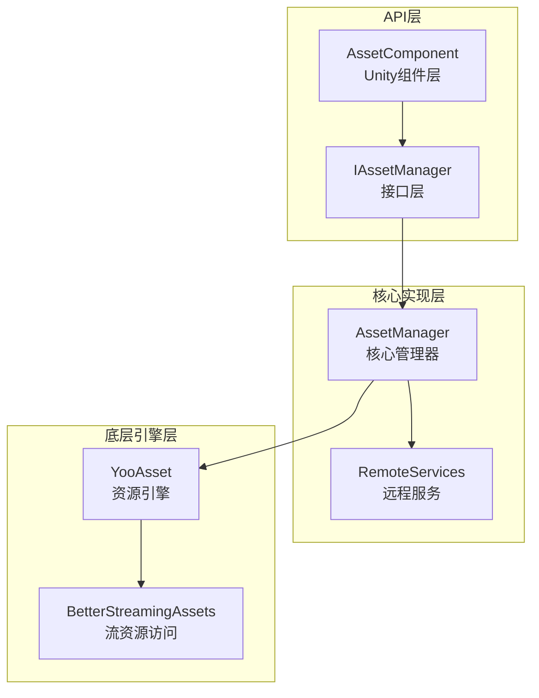
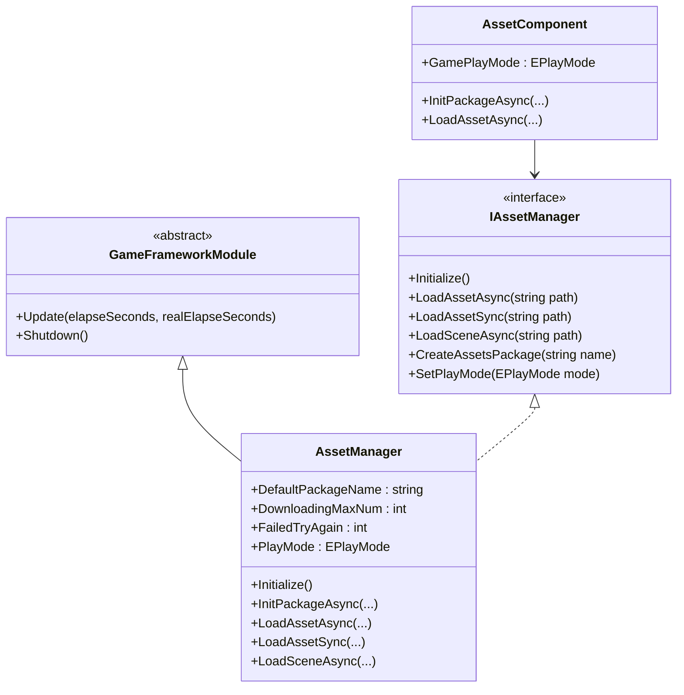
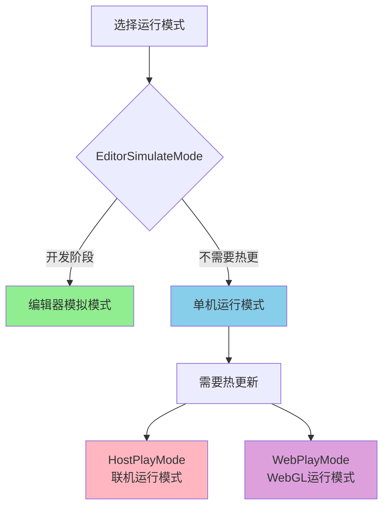
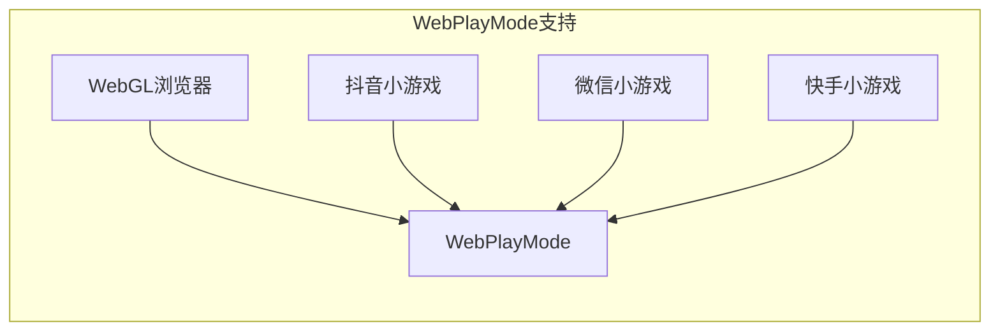

# リソースマネージャー

リソースマネージャー（Asset Manager）是 GameFrameX 资产系统的コアコンポーネント，负责統一された管理游戏リソース的ロード、アンロード、ホットアップデート和リソースパッケージ管理。该コンポーネント基于 YooAsset 库ビルド，提供しますシンプル易用的 API インターフェース，サポート多种运行モード和プラットフォーム。

## 概要

リソースマネージャー作为游戏フレームワーク的コアモジュール，承担着游戏ランタイムリソース管理的关键职责。在现代游戏开发中，リソース的有效管理直接影响着游戏的性能、ロード速度和ユーザー体验。リソースマネージャー通过統一されたカプセル化 YooAsset 的機能，为開発者提供します一套完全な的リソース管理解決策。

该コンポーネントサポート以下コア機能：

- **同步/异步リソースロード**：提供同步和异步两种ロード方法，满足不同シーン需求
- **多リソースパッケージ管理**：サポート作成和管理多个独立的リソースパッケージ
- **シーンロード**：サポート异步シーンロード和切换
- **ホットアップデートサポート**：在 HostPlayMode 和 WebPlayMode 下サポートリソースホットアップデート
- **リソース清理**：提供多种リソース解放策略，最適化内存使用

リソースマネージャー的設計理念是将複雑的底层リソース管理逻辑カプセル化起来，開発者只需关注业务层面的リソース使用，无需关心リソース如何从磁盘或网络ロード、如何进行バージョン管理等問題。

## アーキテクチャ設計

リソースマネージャー的アーキテクチャ采用了分层設計モード，从上到下分为三个主な层次：



### コンポーネント説明

**API 层**负责与 Unity 引擎和业务コード的交互。`AssetComponent` 是挂载在 GameObject 上的 Unity コンポーネント，提供します Inspector パネル設定和コンポーネントライフサイクル管理。`IAssetManager` インターフェース定義了リソース管理的所有操作契约，確認してください了コード的可テスト性和可置換性。

**コア実装層**実装了リソース管理的コア逻辑。`AssetManager` 継承自 `GameFrameworkModule`，是整个リソースシステム的コア。它カプセル化了 YooAsset 的所有機能，并追加了更适合游戏开发的機能。`RemoteServices` 是内部类，负责解析ホットアップデートリソース的远程 URL。

**底层引擎层**是实际的リソース操作実装。YooAsset 是业界优秀的 Unity リソース管理解決策，提供します強力的リソース打パッケージ、ロード和ホットアップデート能力。BetterStreamingAssets 提供します对 StreamingAssets ディレクトリ的効率的访问。

### コア类图



## コア機能

### リソースロード

リソースマネージャー提供します丰富的リソースロードインターフェース，サポート同步和异步两种ロードモード。同期ロード適しています对ロード时间要求不高、且在主线程中执行的シーン；非同期ロード则適しています〜する必要があります保持帧率稳定的大型リソースロードシーン。

#### 非同期ロードリソース

非同期ロード是游戏开发中最常用的リソースロード方法，它不会阻塞主线程，〜できます保持游戏的流畅运行。リソースマネージャー提供します多种非同期ロードインターフェース：

```csharp
// 通过路径异步加载资源
var handle = await assetComponent.LoadAssetAsync<GameObject>("Prefabs/Player");

// 获取加载完成的资源对象
var playerPrefab = handle.AssetObject as GameObject;
if (playerPrefab != null)
{
    Instantiate(playerPrefab);
}

// 加载完成后释放句柄
handle.Release();
```

> Source: [AssetManager.cs](https://github.com/GameFrameX/com.gameframex.unity.asset/blob/main/Runtime/Asset/AssetManager.cs#L454-L480)

非同期ロード返す一个 Handle 对象，通过该对象〜できます取得ロード的リソース、监控ロード進捗、および在适当时机解放リソース。開発者应当注意，在リソース不再〜する必要があります时及时解放 Handle，避免内存泄漏。

#### 同期ロードリソース

对于某些〜しなければなりません在当前帧取得リソース的シーン，〜できます使用同期ロードインターフェース：

```csharp
// 同步加载资源
var handle = assetComponent.LoadAssetSync<GameObject>("Prefabs/Enemy");
var enemyPrefab = handle.AssetObject as GameObject;
handle.Release();
```

> Source: [AssetManager.cs](https://github.com/GameFrameX/com.gameframex.unity.asset/blob/main/Runtime/Asset/AssetManager.cs#L603-L606)

同期ロード会阻塞呼び出し线程，在リソース未ロード完成前不会返す。因此，同期ロード不適しています大型リソース的ロード，一般仅用于設定数据等小规模リソース的ロード。

#### ロードサブリソース

某些リソースパッケージ含多个サブリソース，例えば一个 prefab 中参照的材质或纹理。リソースマネージャー提供します专门的子リソースロードインターフェース：

```csharp
// 异步加载子资源
var handle = await assetComponent.LoadSubAssetsAsync<Sprite>("Atlas/GameUI");
foreach (var subAsset in handle.SubAssets)
{
    var sprite = subAsset.AssetObject as Sprite;
    // 处理sprite...
}
handle.Release();
```

> Source: [AssetManager.cs](https://github.com/GameFrameX/com.gameframex.unity.asset/blob/main/Runtime/Asset/AssetManager.cs#L244-L250)

### リソースパッケージ管理

リソースパッケージ（Resource Package）是リソース管理的基本单元，每个リソースパッケージ〜できます独立进行打パッケージ、バージョン管理和ホットアップデート。リソースマネージャーサポート同時に管理多个リソースパッケージ。

#### 作成リソースパッケージ

```csharp
// 创建新的资源包
var package = assetComponent.CreateAssetsPackage("DLC_Package");
assetComponent.SetDefaultAssetsPackage(package);
```

> Source: [AssetManager.cs](https://github.com/GameFrameX/com.gameframex.unity.asset/blob/main/Runtime/Asset/AssetManager.cs#L654-L657)

#### 取得リソースパッケージ

```csharp
// 获取已存在的资源包
var package = assetComponent.TryGetAssetsPackage("DLC_Package");
if (package != null)
{
    // 使用资源包...
}
```

> Source: [AssetManager.cs](https://github.com/GameFrameX/com.gameframex.unity.asset/blob/main/Runtime/Asset/AssetManager.cs#L665-L668)

### シーン管理

リソースマネージャーサポート非同期ロード Unity シーン，这在大型游戏的关卡切换中尤为重要な：

```csharp
// 异步加载场景
var handle = await assetComponent.LoadSceneAsync(
    "Scenes/Level1", 
    LoadSceneMode.Single, 
    true
);
```

> Source: [AssetManager.cs](https://github.com/GameFrameX/com.gameframex.unity.asset/blob/main/Runtime/Asset/AssetManager.cs#L620-L626)

第3个パラメータ控制是否在ロード完成后自动激活シーン。もし〜する必要があります在ロード过程中显示 Loading 界面，〜できます先将パラメータ设为 false，待 Loading 完成后手动激活。

### リソース清理

合理管理リソース内存是游戏性能最適化的重要な环节。リソースマネージャー提供します多种リソース解放インターフェース：

```csharp
// 卸载指定资源
assetComponent.UnloadAsset("Prefabs/Player");

// 卸载无用资源
assetComponent.UnloadUnusedAssetsAsync();

// 清理未使用的Bundle文件
assetComponent.ClearUnusedBundleFilesAsync();

// 强制回收所有资源
assetComponent.UnloadAllAssetsAsync();
```

> Source: [AssetManager.cs](https://github.com/GameFrameX/com.gameframex.unity.asset/blob/main/Runtime/Asset/AssetManager.cs#L591-L658)

这些インターフェース的使用シーン各不相同：UnloadAsset 用于アンロード特定リソース；UnloadUnusedAssetsAsync アンロード当前未被参照的リソース；ClearUnusedBundleFilesAsync 清理未使用的 Bundle ファイル以解放磁盘空间；UnloadAllAssetsAsync 则会强制アンロードリソースパッケージ内的所有リソース。

## 動作モード

リソースマネージャーサポート四种运行モード，每种モード適しています不同的开发和デプロイシーン：



### エディタ模拟モード

エディタ模拟モード（EditorSimulateMode）是开发フェーズ最常用的モード。在这种モード下，リソース直接从 Unity エディタ的源リソースファイル夹中ロード，无需进行リソース打パッケージ。这大大加速了开发迭代速度，変更リソース后〜できます立つまり看到效果。

```csharp
// 设置运行模式
assetComponent.GamePlayMode = EPlayMode.EditorSimulateMode;
```

> Source: [AssetManager.Initialization.cs](https://github.com/GameFrameX/com.gameframex.unity.asset/blob/main/Runtime/Asset/AssetManager.Initialization.cs#L55-L61)

**特点：**
- 无需打パッケージ，変更リソースつまり时生效
- 不サポートホットアップデート機能
- 仅在エディタ環境下可用

### 单机运行モード

单机运行モード（OfflinePlayMode）適しています不〜する必要がありますホットアップデート的オフラインゲーム或独立应用。在这种モード下，所有リソース都从本地存储中ロード。

```csharp
// 设置运行模式
assetComponent.GamePlayMode = EPlayMode.OfflinePlayMode;
```

> Source: [AssetManager.Initialization.cs](https://github.com/GameFrameX/com.gameframex.unity.asset/blob/main/Runtime/Asset/AssetManager.Initialization.cs#L69-L75)

**特点：**
- 所有リソース从本地ロード
- 无网络请求，性能稳定
- 適していますオフラインゲーム或リリースバージョン

### 联机运行モード

联机运行モード（HostPlayMode）是最常用的本番モード，サポート完全な的ホットアップデート機能。在这种モード下，リソース分为内蔵リソース和リモートリソース两部分，内蔵リソース随应用一起リリース，リモートリソース从服务器动态下载。

```csharp
// 设置运行模式
assetComponent.GamePlayMode = EPlayMode.HostPlayMode;

// 初始化资源包（异步）
await assetComponent.InitPackageAsync(
    "DefaultPackage",           // 包名称
    "http://192.168.1.100:8000", // 主服务器地址
    "http://backup.example.com"   // 备用服务器地址
);
```

> Source: [AssetManager.Initialization.cs](https://github.com/GameFrameX/com.gameframex.unity.asset/blob/main/Runtime/Asset/AssetManager.Initialization.cs#L155-L164)

**特点：**
- サポートリソースホットアップデート
- 内蔵リソース + リモートリソース的混合モード
- 適しています〜する必要があります频繁アップデート内容的游戏

### WebGL 运行モード

WebGL 运行モード（WebPlayMode）是专门为 WebGL プラットフォーム設計的モード，兼容各种小程序游戏環境：

```csharp
// Web平台自动使用WebPlayMode
#if UNITY_WEBGL && !UNITY_EDITOR
assetComponent.GamePlayMode = EPlayMode.WebPlayMode;
#endif
```

> Source: [AssetComponent.cs](https://github.com/GameFrameX/com.gameframex.unity.asset/blob/main/Runtime/Asset/AssetComponent.cs#L49-L51)

**サポート的プラットフォーム：**
- WebGL 浏览器
- DouYinミニゲーム
- WeChatミニゲーム
- KuaiShouミニゲーム



## 使用例

### 基本初期化

在游戏启动时，〜する必要があります正确初期化リソースシステム：

```csharp
public class GameBootstrap : MonoBehaviour
{
    public AssetComponent assetComponent;
    
    private async void Start()
    {
        // 配置运行模式
        assetComponent.GamePlayMode = EPlayMode.HostPlayMode;
        
        // 初始化默认资源包
        bool success = await assetComponent.InitPackageAsync(
            "DefaultPackage",
            "http://localhost:8080",
            "http://localhost:8081",
            true
        );
        
        if (success)
        {
            Debug.Log("资源系统初始化成功");
            // 开始游戏逻辑...
        }
    }
}
```

> Source: [AssetComponent.cs](https://github.com/GameFrameX/com.gameframex.unity.asset/blob/main/Runtime/Asset/AssetComponent.cs#L80-L95)

### リソースロード最佳实践

```csharp
public class ResourceManager
{
    private AssetComponent _assetComponent;
    
    // 使用泛型加载资源，推荐方式
    public async Task<T> LoadAssetAsync<T>(string path) where T : UnityEngine.Object
    {
        var handle = await _assetComponent.LoadAssetAsync<T>(path);
        return handle.AssetObject as T;
    }
    
    // 加载多个同类型资源
    public async Task<T[]> LoadAssetsAsync<T>(string path) where T : UnityEngine.Object
    {
        var handle = await _assetComponent.LoadAllAssetsAsync<T>(path);
        var assets = new List<T>();
        foreach (var asset in handle.AllAssets())
        {
            assets.Add(asset.AssetObject as T);
        }
        handle.Release();
        return assets.ToArray();
    }
    
    // 加载Sprite图集
    public async Task<Sprite[]> LoadSprites(string atlasPath)
    {
        var handle = await _assetComponent.LoadSubAssetsAsync<Sprite>(atlasPath);
        var sprites = new List<Sprite>();
        foreach (var subAsset in handle.SubAssets)
        {
            sprites.Add(subAsset.AssetObject as Sprite);
        }
        handle.Release();
        return sprites.ToArray();
    }
}
```

### ホットアップデート確認

在〜する必要があります確認リソース是否〜する必要がありますホットアップデート时：

```csharp
public async Task<bool> CheckAndUpdateResources()
{
    var assetComponent = GameEntry.GetComponent<AssetComponent>();
    
    // 检查是否需要下载资源
    if (assetComponent.IsNeedDownload("Prefabs/Player"))
    {
        Debug.Log("发现新资源，需要下载...");
        // 实现下载逻辑...
    }
    
    return true;
}
```

> Source: [AssetManager.cs](https://github.com/GameFrameX/com.gameframex.unity.asset/blob/main/Runtime/Asset/AssetManager.cs#L700-L714)

## 設定説明

### AssetComponent 設定

在 Unity エディタ中，AssetComponent 提供します以下設定オプション：

| 設定项 | タイプ | 説明 |
|--------|------|------|
| GamePlayMode | EPlayMode | リソース运行モード |

> Source: [AssetComponent.cs](https://github.com/GameFrameX/com.gameframex.unity.asset/blob/main/Runtime/Asset/AssetComponent.cs#L18-L31)

### リソースマネージャー設定

リソースマネージャー提供します多个可設定プロパティ：

| プロパティ | タイプ | デフォルト值 | 説明 |
|------|------|--------|------|
| DefaultPackageName | string | "DefaultPackage" | デフォルトリソースパッケージ名称 |
| DownloadingMaxNum | int | - | 同時に下载的最大数目 |
| FailedTryAgain | int | - | 失敗重试次数 |
| VerifyLevel | EFileVerifyLevel | - | 下载ファイル校验等级 |
| Milliseconds | long | - | 异步系统时间切片（毫秒） |

> Source: [AssetManager.cs](https://github.com/GameFrameX/com.gameframex.unity.asset/blob/main/Runtime/Asset/AssetManager.cs#L14-L39)

## API リファレンス

### 初期化インターフェース

#### `Initialize()`

初期化リソースシステム。在 Unity コンポーネント的 Start フェーズ自动呼び出し。

```csharp
public void Initialize()
```

> Source: [AssetManager.cs](https://github.com/GameFrameX/com.gameframex.unity.asset/blob/main/Runtime/Asset/AssetManager.cs#L46-L56)

#### `InitPackageAsync`

异步初期化リソースパッケージ。

```csharp
public Task<bool> InitPackageAsync(
    string packageName,           // 资源包名称
    string hostServerURL,         // 主服务器URL
    string fallbackHostServerURL, // 备用服务器URL
    bool isDefaultPackage = true  // 是否设为默认包
)
```

> Source: [AssetManager.cs](https://github.com/GameFrameX/com.gameframex.unity.asset/blob/main/Runtime/Asset/AssetManager.cs#L68-L100)

### リソースロードインターフェース

#### `LoadAssetAsync<T>`

非同期ロード单个リソース。

```csharp
public Task<AssetHandle> LoadAssetAsync<T>(string path) where T : UnityEngine.Object
```

**パラメータ：**
- `path` (string): リソースパス

**返す：** Task<AssetHandle> - リソース句柄

> Source: [AssetManager.cs](https://github.com/GameFrameX/com.gameframex.unity.asset/blob/main/Runtime/Asset/AssetManager.cs#L469-L481)

#### `LoadAssetSync<T>`

同期ロード单个リソース。

```csharp
public AssetHandle LoadAssetSync<T>(string path) where T : UnityEngine.Object
```

**パラメータ：**
- `path` (string): リソースパス

**返す：** AssetHandle - リソース句柄

> Source: [AssetManager.cs](https://github.com/GameFrameX/com.gameframex.unity.asset/blob/main/Runtime/Asset/AssetManager.cs#L603-L606)

#### `LoadSceneAsync`

非同期ロードシーン。

```csharp
public Task<SceneHandle> LoadSceneAsync(
    string path,                      // 场景路径
    LoadSceneMode sceneMode,          // 场景加载模式
    bool activateOnLoad = true        // 加载完成是否自动激活
)
```

> Source: [AssetManager.cs](https://github.com/GameFrameX/com.gameframex.unity.asset/blob/main/Runtime/Asset/AssetManager.cs#L620-L626)

### リソースパッケージ管理インターフェース

#### `CreateAssetsPackage`

作成新的リソースパッケージ。

```csharp
public ResourcePackage CreateAssetsPackage(string packageName)
```

> Source: [AssetManager.cs](https://github.com/GameFrameX/com.gameframex.unity.asset/blob/main/Runtime/Asset/AssetManager.cs#L654-L657)

#### `GetAssetsPackage`

取得已存在的リソースパッケージ。

```csharp
public ResourcePackage GetAssetsPackage(string packageName)
```

> Source: [AssetManager.cs](https://github.com/GameFrameX/com.gameframex.unity.asset/blob/main/Runtime/Asset/AssetManager.cs#L687-L690)

### リソース清理インターフェース

#### `UnloadAsset`

アンロード指定リソース。

```csharp
public void UnloadAsset(string assetPath)
```

> Source: [AssetManager.cs](https://github.com/GameFrameX/com.gameframex.unity.asset/blob/main/Runtime/Asset/AssetManager.cs#L107-L112)

#### `UnloadUnusedAssetsAsync`

异步アンロード无用リソース。

```csharp
public void UnloadUnusedAssetsAsync(string packageName = null)
```

> Source: [AssetManager.cs](https://github.com/GameFrameX/com.gameframex.unity.asset/blob/main/Runtime/Asset/AssetManager.cs#L153-L165)

#### `ClearUnusedBundleFilesAsync`

清理未使用的 Bundle ファイル。

```csharp
public void ClearUnusedBundleFilesAsync(string packageName = null)
```

> Source: [AssetManager.cs](https://github.com/GameFrameX/com.gameframex.unity.asset/blob/main/Runtime/Asset/AssetManager.cs#L191-L204)

## 関連リンク

- [リソースコンポーネント](./4-core-concepts.asset-component) - Unity コンポーネント層面的リソース访问
- [リソースロードインターフェース](./5-api-reference.loading-api) - 詳細 API リファレンス
- [リソースパッケージ管理](./5-api-reference.package-management) - リソースパッケージ操作ガイド
- [运行モード](./6-configuration.play-modes) - 各运行モード詳細設定
- [コンポーネント設定](./6-configuration.component-settings) - Unity コンポーネント設定説明
- [WebGL プラットフォーム](./7-platforms.webgl) - WebGL プラットフォーム特殊設定
