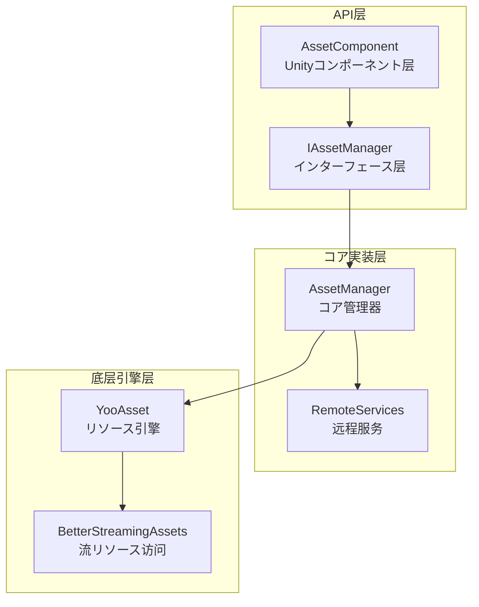
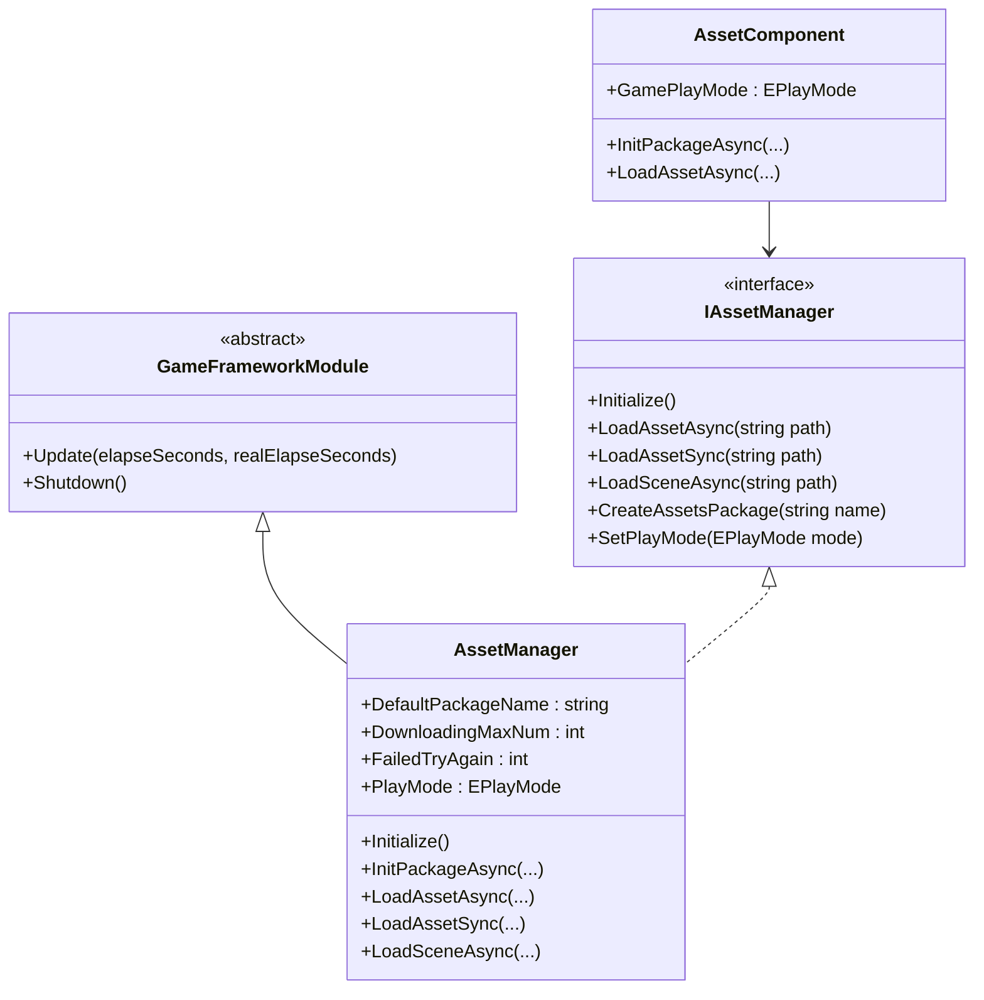
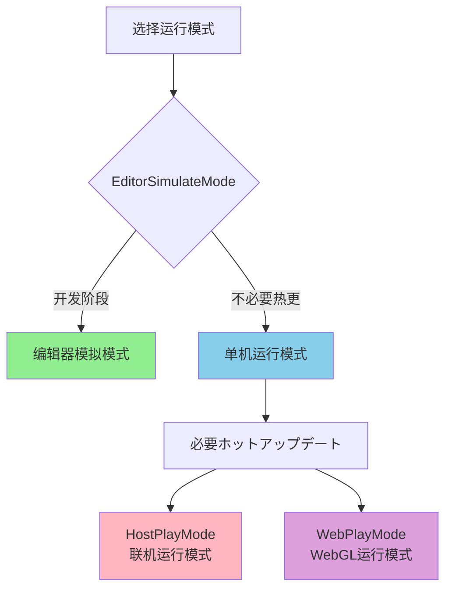
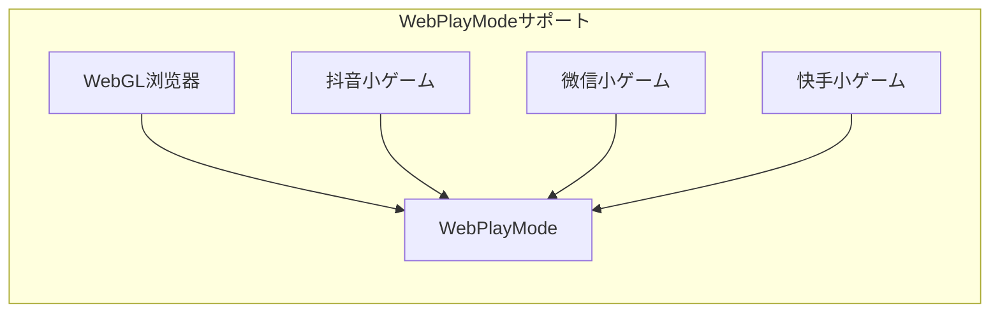

# リソース管理器

リソース管理器（Asset Manager）是 GameFrameX 资产系统的コアコンポーネント，负责统一管理ゲームリソース的加载、卸载、ホットアップデート和リソースパッケージ管理。该コンポーネント基づく YooAsset 库构建，提供します简洁易用的 API インターフェース，サポート多种运行模式和平台。

## 概要

リソース管理器作为ゲームフレームワーク的コア模块，承担着ゲーム运行时リソース管理的关键职责。在现代ゲーム开发中，リソース的有效管理直接影响着ゲーム的性能、加载速度和用户体验。リソース管理器を通じて统一封装 YooAsset 的機能，为開発者提供します一套完整的リソース管理解決策。

该コンポーネントサポート以下コア機能：

- **同步/异步リソース加载**：提供同步和异步两种加载方法，满足不同シーン需求
- **多リソースパッケージ管理**：サポート作成和管理多个独立的リソース包
- **シーン加载**：サポート异步シーン加载和切换
- **ホットアップデートサポート**：在 HostPlayMode 和 WebPlayMode 下サポートリソースホットアップデート
- **リソース清理**：提供多种リソース释放策略，优化内存使用

リソース管理器的设计理念是将复杂的底层リソース管理逻辑封装起来，開発者只需关注业务层面的リソース使用，无需关心リソース如何从磁盘或网络加载、如何进行版本管理等问题。

## アーキテクチャ設計

リソース管理器的架构采用了分层设计模式，从上到下分为三个主要层次：



### コンポーネント説明

**API 层**负责与 Unity 引擎和业务代码的交互。`AssetComponent` 是挂载在 GameObject 上的 Unity コンポーネント，提供します Inspector 面板配置和コンポーネント生命周期管理。`IAssetManager` インターフェース定义了リソース管理的所有操作契约，确保了代码的可测试性和可替换性。

**コア実装层**実装了リソース管理的コア逻辑。`AssetManager` を継承 `GameFrameworkModule`，是整个リソース系统的コア。它封装了 YooAsset 的全機能，并添加了更适合ゲーム开发的機能。`RemoteServices` 是内部クラス，负责解析ホットアップデートリソース的远程 URL。

**底层引擎层**是实际的リソース操作実装。YooAsset 是业界优秀的 Unity リソース管理解決策，提供します强大的リソース打包、加载和ホットアップデート能力。BetterStreamingAssets 提供します对 StreamingAssets ディレクトリ的高效访问。

### コアクラス图



## コア機能

### リソース加载

リソース管理器提供します丰富的リソース加载インターフェース，サポート同步和异步两种加载模式。同步加载适に使用对加载时间要求不高、且在主线程中执行的シーン；异步加载则适に使用必要保持帧率稳定的大型リソース加载シーン。

#### 异步加载リソース

异步加载是ゲーム开发中最常用的リソース加载方法，它不会阻塞主线程，可能保持ゲーム的流畅运行。リソース管理器提供します多种异步加载インターフェース：

```csharp
// を通じて路径异步加载リソース
var handle = await assetComponent.LoadAssetAsync<GameObject>("Prefabs/Player");

// 取得加载完成的リソース对象
var playerPrefab = handle.AssetObject as GameObject;
if (playerPrefab != null)
{
    Instantiate(playerPrefab);
}

// 加载完成后释放句柄
handle.Release();
```

> Source: [AssetManager.cs](https://github.com/GameFrameX/com.gameframex.unity.asset/blob/main/Runtime/Asset/AssetManager.cs#L454-L480)

异步加载返回一个 Handle 对象，を通じて该对象可能取得加载的リソース、监控加载进度、以及在适当时机释放リソース。開発者应当注意，在リソース不再必要时及时释放 Handle，避免内存泄漏。

#### 同步加载リソース

对于某些必須在当前帧取得リソース的シーン，可能使用同步加载インターフェース：

```csharp
// 同步加载リソース
var handle = assetComponent.LoadAssetSync<GameObject>("Prefabs/Enemy");
var enemyPrefab = handle.AssetObject as GameObject;
handle.Release();
```

> Source: [AssetManager.cs](https://github.com/GameFrameX/com.gameframex.unity.asset/blob/main/Runtime/Asset/AssetManager.cs#L603-L606)

同步加载会阻塞呼び出し线程，在リソース未加载完成前不会返回。因此，同步加载不适に使用大型リソース的加载，一般仅に使用配置数据等小规模リソース的加载。

#### 加载子リソース

某些リソース包含多个子リソース，例如一个 prefab 中引用的材质或纹理。リソース管理器提供します专门的子リソース加载インターフェース：

```csharp
// 异步加载子リソース
var handle = await assetComponent.LoadSubAssetsAsync<Sprite>("Atlas/GameUI");
foreach (var subAsset in handle.SubAssets)
{
    var sprite = subAsset.AssetObject as Sprite;
    // 处理sprite...
}
handle.Release();
```

> Source: [AssetManager.cs](https://github.com/GameFrameX/com.gameframex.unity.asset/blob/main/Runtime/Asset/AssetManager.cs#L244-L250)

### リソースパッケージ管理

リソース包（Resource Package）是リソース管理的基本单元，每个リソース包可能独立进行打包、版本管理和ホットアップデート。リソース管理器サポート同时管理多个リソース包。

#### 作成リソース包

```csharp
// 作成新的リソース包
var package = assetComponent.CreateAssetsPackage("DLC_Package");
assetComponent.SetDefaultAssetsPackage(package);
```

> Source: [AssetManager.cs](https://github.com/GameFrameX/com.gameframex.unity.asset/blob/main/Runtime/Asset/AssetManager.cs#L654-L657)

#### 取得リソース包

```csharp
// 取得已存在的リソース包
var package = assetComponent.TryGetAssetsPackage("DLC_Package");
if (package != null)
{
    // 使用リソース包...
}
```

> Source: [AssetManager.cs](https://github.com/GameFrameX/com.gameframex.unity.asset/blob/main/Runtime/Asset/AssetManager.cs#L665-L668)

### シーン管理

リソース管理器サポート异步加载 Unity シーン，这在大型ゲーム的关卡切换中尤为重要：

```csharp
// 异步加载シーン
var handle = await assetComponent.LoadSceneAsync(
    "Scenes/Level1", 
    LoadSceneMode.Single, 
    true
);
```

> Source: [AssetManager.cs](https://github.com/GameFrameX/com.gameframex.unity.asset/blob/main/Runtime/Asset/AssetManager.cs#L620-L626)

第三个参数控制是否在加载完成后自动激活シーン。如果必要在加载过程中显示 Loading 界面，可能先将参数设为 false，待 Loading 完成后手动激活。

### リソース清理

合理管理リソース内存是ゲーム性能优化的重要环节。リソース管理器提供します多种リソース释放インターフェース：

```csharp
// 卸载指定リソース
assetComponent.UnloadAsset("Prefabs/Player");

// 卸载无用リソース
assetComponent.UnloadUnusedAssetsAsync();

// 清理未使用的Bundleファイル
assetComponent.ClearUnusedBundleFilesAsync();

// 强制回收所有リソース
assetComponent.UnloadAllAssetsAsync();
```

> Source: [AssetManager.cs](https://github.com/GameFrameX/com.gameframex.unity.asset/blob/main/Runtime/Asset/AssetManager.cs#L591-L658)

这些インターフェース的使用シーン各不相同：UnloadAsset に使用卸载特定リソース；UnloadUnusedAssetsAsync 卸载当前未被引用的リソース；ClearUnusedBundleFilesAsync 清理未使用的 Bundle ファイル以释放磁盘空间；UnloadAllAssetsAsync 则会强制卸载リソース包内的所有リソース。

## 运行模式

リソース管理器サポート四种运行模式，每种模式适に使用不同的开发和部署シーン：



### 编辑器模拟模式

编辑器模拟模式（EditorSimulateMode）是开发阶段最常用的模式。在这种模式下，リソース直接从 Unity 编辑器的源リソースファイル夹中加载，无需进行リソース打包。这大大加速了开发迭代速度，修改リソース后可能立即看到效果。

```csharp
// 設定运行模式
assetComponent.GamePlayMode = EPlayMode.EditorSimulateMode;
```

> Source: [AssetManager.Initialization.cs](https://github.com/GameFrameX/com.gameframex.unity.asset/blob/main/Runtime/Asset/AssetManager.Initialization.cs#L55-L61)

**特点：**
- 无需打包，修改リソース即时生效
- 不サポートホットアップデート機能
- 仅在编辑器环境下可用

### 单机运行模式

单机运行模式（OfflinePlayMode）适に使用不必要ホットアップデート的单机ゲーム或独立应用。在这种模式下，所有リソース都从本地存储中加载。

```csharp
// 設定运行模式
assetComponent.GamePlayMode = EPlayMode.OfflinePlayMode;
```

> Source: [AssetManager.Initialization.cs](https://github.com/GameFrameX/com.gameframex.unity.asset/blob/main/Runtime/Asset/AssetManager.Initialization.cs#L69-L75)

**特点：**
- 所有リソース从本地加载
- 无网络お願いします求，性能稳定
- 适に使用单机ゲーム或发布版本

### 联机运行模式

联机运行模式（HostPlayMode）是最常用的生产模式，サポート完整的ホットアップデート機能。在这种模式下，リソース分为内置リソース和远程リソース两部分，内置リソース随应用一起发布，远程リソース从服务器动态ダウンロード。

```csharp
// 設定运行模式
assetComponent.GamePlayMode = EPlayMode.HostPlayMode;

// 初期化リソース包（异步）
await assetComponent.InitPackageAsync(
    "DefaultPackage",           // 包名称
    "http://192.168.1.100:8000", // 主服务器地址
    "http://backup.example.com"   // 备用服务器地址
);
```

> Source: [AssetManager.Initialization.cs](https://github.com/GameFrameX/com.gameframex.unity.asset/blob/main/Runtime/Asset/AssetManager.Initialization.cs#L155-L164)

**特点：**
- サポートリソースホットアップデート
- 内置リソース + 远程リソース的混合模式
- 适に使用必要频繁更新内容的ゲーム

### WebGL 运行模式

WebGL 运行模式（WebPlayMode）是专门为 WebGL 平台设计的模式，兼容各种小程序ゲーム环境：

```csharp
// Web平台自动使用WebPlayMode
#if UNITY_WEBGL && !UNITY_EDITOR
assetComponent.GamePlayMode = EPlayMode.WebPlayMode;
#endif
```

> Source: [AssetComponent.cs](https://github.com/GameFrameX/com.gameframex.unity.asset/blob/main/Runtime/Asset/AssetComponent.cs#L49-L51)

**サポート的平台：**
- WebGL 浏览器
- 抖音小ゲーム
- 微信小ゲーム
- 快手小ゲーム



## 使用例

### 基础初期化

在ゲーム启动时，必要正确初期化リソース系统：

```csharp
public class GameBootstrap : MonoBehaviour
{
    public AssetComponent assetComponent;
    
    private async void Start()
    {
        // 配置运行模式
        assetComponent.GamePlayMode = EPlayMode.HostPlayMode;
        
        // 初期化默认リソース包
        bool success = await assetComponent.InitPackageAsync(
            "DefaultPackage",
            "http://localhost:8080",
            "http://localhost:8081",
            true
        );
        
        if (success)
        {
            Debug.Log("リソース系统初期化成功");
            // 开始ゲーム逻辑...
        }
    }
}
```

> Source: [AssetComponent.cs](https://github.com/GameFrameX/com.gameframex.unity.asset/blob/main/Runtime/Asset/AssetComponent.cs#L80-L95)

### リソース加载最佳实践

```csharp
public class ResourceManager
{
    private AssetComponent _assetComponent;
    
    // 使用泛型加载リソース，推荐方法
    public async Task<T> LoadAssetAsync<T>(string path) where T : UnityEngine.Object
    {
        var handle = await _assetComponent.LoadAssetAsync<T>(path);
        return handle.AssetObject as T;
    }
    
    // 加载多个同クラス型リソース
    public async Task<T[]> LoadAssetsAsync<T>(string path) where T : UnityEngine.Object
    {
        var handle = await _assetComponent.LoadAllAssetsAsync<T>(path);
        var assets = new List<T>();
        foreach (var asset in handle.AllAssets())
        {
            assets.Add(asset.AssetObject as T);
        }
        handle.Release();
        return assets.ToArray();
    }
    
    // 加载Sprite图集
    public async Task<Sprite[]> LoadSprites(string atlasPath)
    {
        var handle = await _assetComponent.LoadSubAssetsAsync<Sprite>(atlasPath);
        var sprites = new List<Sprite>();
        foreach (var subAsset in handle.SubAssets)
        {
            sprites.Add(subAsset.AssetObject as Sprite);
        }
        handle.Release();
        return sprites.ToArray();
    }
}
```

### ホットアップデート检查

在必要检查リソース是否必要ホットアップデート时：

```csharp
public async Task<bool> CheckAndUpdateResources()
{
    var assetComponent = GameEntry.GetComponent<AssetComponent>();
    
    // 检查是否必要ダウンロードリソース
    if (assetComponent.IsNeedDownload("Prefabs/Player"))
    {
        Debug.Log("发现新リソース，必要ダウンロード...");
        // 実装ダウンロード逻辑...
    }
    
    return true;
}
```

> Source: [AssetManager.cs](https://github.com/GameFrameX/com.gameframex.unity.asset/blob/main/Runtime/Asset/AssetManager.cs#L700-L714)

## 設定説明

### AssetComponent 配置

在 Unity 编辑器中，AssetComponent 提供します以下配置选项：

| 配置项 | クラス型 | 説明 |
|--------|------|------|
| GamePlayMode | EPlayMode | リソース运行模式 |

> Source: [AssetComponent.cs](https://github.com/GameFrameX/com.gameframex.unity.asset/blob/main/Runtime/Asset/AssetComponent.cs#L18-L31)

### リソース管理器配置

リソース管理器提供します多个可配置プロパティ：

| プロパティ | クラス型 | 默认值 | 説明 |
|------|------|--------|------|
| DefaultPackageName | string | "DefaultPackage" | 默认リソース包名称 |
| DownloadingMaxNum | int | - | 同时ダウンロード的最大数目 |
| FailedTryAgain | int | - | 失败重试次数 |
| VerifyLevel | EFileVerifyLevel | - | ダウンロードファイル校验等级 |
| Milliseconds | long | - | 异步系统时间切片（毫秒） |

> Source: [AssetManager.cs](https://github.com/GameFrameX/com.gameframex.unity.asset/blob/main/Runtime/Asset/AssetManager.cs#L14-L39)

## API 参考

### 初期化インターフェース

#### `Initialize()`

初期化リソース系统。在 Unity コンポーネント的 Start 阶段自动呼び出し。

```csharp
public void Initialize()
```

> Source: [AssetManager.cs](https://github.com/GameFrameX/com.gameframex.unity.asset/blob/main/Runtime/Asset/AssetManager.cs#L46-L56)

#### `InitPackageAsync`

异步初期化リソース包。

```csharp
public Task<bool> InitPackageAsync(
    string packageName,           // リソース包名称
    string hostServerURL,         // 主服务器URL
    string fallbackHostServerURL, // 备用服务器URL
    bool isDefaultPackage = true  // 是否设为默认包
)
```

> Source: [AssetManager.cs](https://github.com/GameFrameX/com.gameframex.unity.asset/blob/main/Runtime/Asset/AssetManager.cs#L68-L100)

### リソース加载インターフェース

#### `LoadAssetAsync<T>`

异步加载单个リソース。

```csharp
public Task<AssetHandle> LoadAssetAsync<T>(string path) where T : UnityEngine.Object
```

**参数：**
- `path` (string): リソース路径

**返回：** Task<AssetHandle> - リソース句柄

> Source: [AssetManager.cs](https://github.com/GameFrameX/com.gameframex.unity.asset/blob/main/Runtime/Asset/AssetManager.cs#L469-L481)

#### `LoadAssetSync<T>`

同步加载单个リソース。

```csharp
public AssetHandle LoadAssetSync<T>(string path) where T : UnityEngine.Object
```

**参数：**
- `path` (string): リソース路径

**返回：** AssetHandle - リソース句柄

> Source: [AssetManager.cs](https://github.com/GameFrameX/com.gameframex.unity.asset/blob/main/Runtime/Asset/AssetManager.cs#L603-L606)

#### `LoadSceneAsync`

异步加载シーン。

```csharp
public Task<SceneHandle> LoadSceneAsync(
    string path,                      // シーン路径
    LoadSceneMode sceneMode,          // シーン加载模式
    bool activateOnLoad = true        // 加载完成是否自动激活
)
```

> Source: [AssetManager.cs](https://github.com/GameFrameX/com.gameframex.unity.asset/blob/main/Runtime/Asset/AssetManager.cs#L620-L626)

### リソースパッケージ管理インターフェース

#### `CreateAssetsPackage`

作成新的リソース包。

```csharp
public ResourcePackage CreateAssetsPackage(string packageName)
```

> Source: [AssetManager.cs](https://github.com/GameFrameX/com.gameframex.unity.asset/blob/main/Runtime/Asset/AssetManager.cs#L654-L657)

#### `GetAssetsPackage`

取得已存在的リソース包。

```csharp
public ResourcePackage GetAssetsPackage(string packageName)
```

> Source: [AssetManager.cs](https://github.com/GameFrameX/com.gameframex.unity.asset/blob/main/Runtime/Asset/AssetManager.cs#L687-L690)

### リソース清理インターフェース

#### `UnloadAsset`

卸载指定リソース。

```csharp
public void UnloadAsset(string assetPath)
```

> Source: [AssetManager.cs](https://github.com/GameFrameX/com.gameframex.unity.asset/blob/main/Runtime/Asset/AssetManager.cs#L107-L112)

#### `UnloadUnusedAssetsAsync`

异步卸载无用リソース。

```csharp
public void UnloadUnusedAssetsAsync(string packageName = null)
```

> Source: [AssetManager.cs](https://github.com/GameFrameX/com.gameframex.unity.asset/blob/main/Runtime/Asset/AssetManager.cs#L153-L165)

#### `ClearUnusedBundleFilesAsync`

清理未使用的 Bundle ファイル。

```csharp
public void ClearUnusedBundleFilesAsync(string packageName = null)
```

> Source: [AssetManager.cs](https://github.com/GameFrameX/com.gameframex.unity.asset/blob/main/Runtime/Asset/AssetManager.cs#L191-L204)

## 関連リンク

- [リソースコンポーネント](./4-core-concepts.asset-component) - Unity コンポーネント层面的リソース访问
- [リソース加载インターフェース](./5-api-reference.loading-api) - 详细 API 参考
- [リソースパッケージ管理](./5-api-reference.package-management) - リソース包操作指南
- [运行模式](./6-configuration.play-modes) - 各运行模式详细配置
- [コンポーネント配置](./6-configuration.component-settings) - Unity コンポーネント配置説明
- [WebGL 平台](./7-platforms.webgl) - WebGL 平台特殊配置
