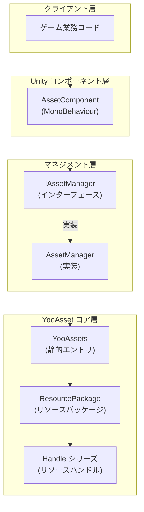
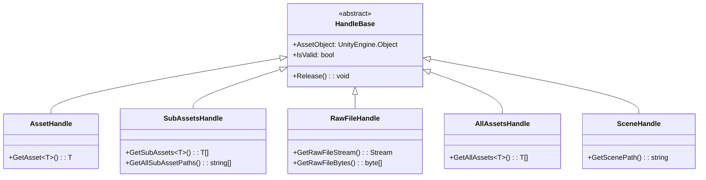
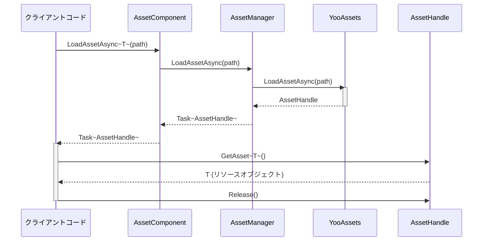

# リソースロード API

リソースロード API は GameFrameX Asset モジュールのコア API であり、统一されたリソースロード与管理ソリューションを提供します。このインターフェースは YooAsset ライブラリに基づいて構築されており、同期/非同期ロード、リソースパッケージ管理、シーンロードなど、多様なリソース操作をサポートします。

## 概要

`IAssetManager` インターフェースはリソースコンポーネントのすべてのロード機能を定義しており、以下のコア能力を含みます：

- **多様なリソースロード方式**：同期・非同期の2種類のロードモードをサポート
- **丰富なリソースタイプ**：通常リソース、サブリソース、ネイティブラルファイル、シーンなど多様なタイプをサポート
- **リソースパッケージ管理**：複数のリソースパッケージの作成、取得、切り替えをサポート
- **リソースライフサイクル管理**：リソースのアンロード、清理、回収などの完全な管理機能を提供

リソースロード API は Handle パターンを采用してリソースライフサイクルを管理し、すべてのロード操作は対応する Handle オブジェクトを返します。Handle オブジェクトを通じてロードしたリソースの取得と解放操作を行います。

> Source: [IAssetManager.cs](https://github.com/GameFrameX/com.gameframex.unity.asset/blob/main/Runtime/Asset/IAssetManager.cs#L1-L519)

## アーキテクチャ設計

リソースロードシステムは分层アーキテクチャ設計を採用し、コアコンポーネントは以下を含みます：



**アーキテクチャ説明：**

- **クライアント層**：ゲーム業務コードは `AssetComponent` または `IAssetManager` インターフェースを通じてリソース機能にアクセス
- **Unity コンポーネント層**：`AssetComponent` は GameObject にアタッチされた MonoBehaviour コンポーネントであり、コンポーネント方式でのアクセスを提供
- **マネジメント層**：`AssetManager` は `IAssetManager` インターフェースを実装しリソースの中核マネージャー
- **YooAsset コア層**：実際のリソースロードは YooAsset が 수행하며、各种 Handle オブジェクトを返してリソース管理

### Handle オブジェクトシステム

リソースロードが返す Handle オブジェクトはリソース管理のコアです：



> Handle タイプの定義は YooAsset ライブラリから提供されています。詳細については [YooAsset 公式サイト](https://www.yooasset.com/) を参照してください。

## コアロード API

### 非同期でリソースをロード

非同期ロードは推奨される主要なロード方式であり、メインスレッドをブロックしません。

```csharp
/// <summary>
/// 非同期でリソースをロード
/// </summary>
/// <param name="path">リソースパス</param>
/// <typeparam name="T">リソースタイプ</typeparam>
/// <returns>AssetHandle オブジェクトを含む Task を返す</returns>
Task<AssetHandle> LoadAssetAsync<T>(string path) where T : UnityEngine.Object;
```

> Source: [IAssetManager.cs](https://github.com/GameFrameX/com.gameframex.unity.asset/blob/main/Runtime/Asset/IAssetManager.cs#L234)

**使用例：**

```csharp
// AssetComponent を通じて Prefab を非同期ロード
var handle = await assetComponent.LoadAssetAsync<GameObject>("Prefabs/Player");
GameObject player = handle.GetAsset<GameObject>();
// 使用完毕后リソースを解放
handle.Release();
```

> Source: [AssetComponent.cs](https://github.com/GameFrameX/com.gameframex.unity.asset/blob/main/Runtime/Asset/AssetComponent.cs#L258-L261)

### 同期でリソースをロード

同期ロードは即座にリソースを返しますが、ロードプロセス中にメインスレッドをブロックするため、慎重に使用する必要があります。

```csharp
/// <summary>
/// 同期でリソースをロード
/// </summary>
/// <param name="path">リソースパス</param>
/// <returns>AssetHandle オブジェクトを返す</returns>
AssetHandle LoadAssetSync<T>(string path) where T : UnityEngine.Object;
```

> Source: [IAssetManager.cs](https://github.com/GameFrameX/com.gameframex.unity.asset/blob/main/Runtime/Asset/IAssetManager.cs#L365)

**使用例：**

```csharp
// Sprite を同期ロード
var handle = assetManager.LoadAssetSync<Sprite>("UI/Sprites/Icon");
Sprite sprite = handle.GetAsset<Sprite>();
handle.Release();
```

> Source: [AssetManager.cs](https://github.com/GameFrameX/com.gameframex.unity.asset/blob/main/Runtime/Asset/AssetManager.cs#L603-L606)

### サブリソースをロード

サブリソースロードは、1つのリソースパッケージ内のすべてのサブリソースを取得するために使用されます，例如：アトラス内のすべての Sprite など。

```csharp
/// <summary>
/// 非同期でサブリソースオブジェクトをロード
/// </summary>
/// <param name="path">リソースパス</param>
/// <typeparam name="T">リソースタイプ</typeparam>
Task<SubAssetsHandle> LoadSubAssetsAsync<T>(string path) where T : UnityEngine.Object;
```

> Source: [IAssetManager.cs](https://github.com/GameFrameX/com.gameframex.unity.asset/blob/main/Runtime/Asset/IAssetManager.cs#L134)

**使用例：**

```csharp
// アトラス内のすべての Sprite をロード
var handle = await assetComponent.LoadSubAssetsAsync<Sprite>("Atlas/UI/MainAtlas");
Sprite[] sprites = handle.GetSubAssets<Sprite>();
foreach (var sprite in sprites)
{
    Debug.Log($"Sprite: {sprite.name}");
}
handle.Release();
```

> Source: [AssetComponent.cs](https://github.com/GameFrameX/com.gameframex.unity.asset/blob/main/Runtime/Asset/AssetComponent.cs#L128-L131)

### ネイティブラルをロード

ネイティブラルロードは、Unity リソースタイプではない元のファイル（設定ファイル、テキストファイルなど）をロードするために使用されます。

```csharp
/// <summary>
/// 非同期でネイティブラルをロード
/// </summary>
/// <param name="path">リソースパス</param>
Task<RawFileHandle> LoadRawFileAsync(string path);
```

> Source: [IAssetManager.cs](https://github.com/GameFrameX/com.gameframex.unity.asset/blob/main/Runtime/Asset/IAssetManager.cs#L183)

**使用例：**

```csharp
// JSON 設定ファイルをロード
var handle = await assetComponent.LoadRawFileAsync("Config/GameConfig.json");
string json = System.Text.Encoding.UTF8.GetString(handle.GetRawFileBytes());
handle.Release();
```

> Source: [AssetComponent.cs](https://github.com/GameFrameX/com.gameframex.unity.asset/blob/main/Runtime/Asset/AssetComponent.cs#L192-L195)

### すべてのリソースをロード

指定されたリソースパッケージ内のすべてのリソースオブジェクトをロードします。

```csharp
/// <summary>
/// 非同期でリソースパッケージ内のすべてのリソースオブジェクトをロード
/// </summary>
/// <param name="path">リソースのアドレス</param>
Task<AllAssetsHandle> LoadAllAssetsAsync(string path);
```

> Source: [IAssetManager.cs](https://github.com/GameFrameX/com.gameframex.unity.asset/blob/main/Runtime/Asset/IAssetManager.cs#L267)

**使用例：**

```csharp
// あるディレクトリ下のすべての Prefab をロード
var handle = await assetComponent.LoadAllAssetsAsync<GameObject>("Prefabs/Enemies");
GameObject[] enemies = handle.GetAllAssets<GameObject>();
handle.Release();
```

> Source: [AssetComponent.cs](https://github.com/GameFrameX/com.gameframex.unity.asset/blob/main/Runtime/Asset/AssetComponent.cs#L292-L295)

### シーンをロード

Unity シーンを非同期でロードします。

```csharp
/// <summary>
/// 非同期でシーンをロード
/// </summary>
/// <param name="path">リソースパス</param>
/// <param name="sceneMode">シーンロードモード</param>
/// <param name="activateOnLoad">ロード完了後に自動アクティブにするか</param>
Task<SceneHandle> LoadSceneAsync(string path, LoadSceneMode sceneMode, bool activateOnLoad = true);
```

> Source: [IAssetManager.cs](https://github.com/GameFrameX/com.gameframex.unity.asset/blob/main/Runtime/Asset/IAssetManager.cs#L379)

**使用例：**

```csharp
// 非同期でシーンをロードしてアクティブ化
var handle = await assetComponent.LoadSceneAsync("Scenes/Game", LoadSceneMode.Single);
Debug.Log("シーンロード完了");
// シーンは自動的にアクティブ化。手動でアクティブ化する場合：
// handle.Activate();
```

> Source: [AssetComponent.cs](https://github.com/GameFrameX/com.gameframex.unity.asset/blob/main/Runtime/Asset/AssetComponent.cs#L443-L446)

## リソース管理 API

### リソースパッケージ管理

リソースパッケージ（ResourcePackage）はリソース管理の基本単位で、複数の独立したリソースパッケージを作成できます。

```csharp
/// <summary>
/// リソースパッケージを作成
/// </summary>
ResourcePackage CreateAssetsPackage(string packageName);

/// <summary>
/// リソースパッケージの取得を試行
/// </summary>
ResourcePackage TryGetAssetsPackage(string packageName);

/// <summary>
/// リソースパッケージ是否存在か確認
/// </summary>
bool HasAssetsPackage(string packageName);

/// <summary>
/// リソースパッケージを取得
/// </summary>
ResourcePackage GetAssetsPackage(string packageName);

/// <summary>
/// デフォルトリソースパッケージを設定
/// </summary>
void SetDefaultAssetsPackage(ResourcePackage resourcePackage);
```

> Source: [IAssetManager.cs](https://github.com/GameFrameX/com.gameframex.unity.asset/blob/main/Runtime/Asset/IAssetManager.cs#L393-L481)

### リソースアンロードと清理

```csharp
/// <summary>
/// リソースをアンロード
/// </summary>
void UnloadAsset(string assetPath);
void UnloadAsset(string packageName, string assetPath);

/// <summary>
/// 未使用のリソースをアンロード
/// </summary>
void UnloadUnusedAssetsAsync(string packageName = null);

/// <summary>
/// 未使用のリソースを清理
/// </summary>
void ClearUnusedBundleFilesAsync(string packageName = null);

/// <summary>
/// すべてのリソースを清理
/// </summary>
void ClearAllBundleFilesAsync(string packageName = null);

/// <summary>
/// すべてのリソースを強制回收
/// </summary>
void UnloadAllAssetsAsync(string packageName = null);
```

> Source: [IAssetManager.cs](https://github.com/GameFrameX/com.gameframex.unity.asset/blob/main/Runtime/Asset/IAssetManager.cs#L107-L509)

### リソース情報クエリ

```csharp
/// <summary>
/// ダウンロードが必要か確認（リソースがリモートサーバーにあるか）
/// </summary>
bool IsNeedDownload(AssetInfo assetInfo);
bool IsNeedDownload(string path);

/// <summary>
/// リソース情報を取得
/// </summary>
AssetInfo[] GetAssetInfos(string[] assetTags);
AssetInfo[] GetAssetInfos(string assetTag);
AssetInfo GetAssetInfo(string path);

/// <summary>
/// 指定されたリソースパスが有効か確認
/// </summary>
bool HasAssetPath(string assetPath);
```

> Source: [IAssetManager.cs](https://github.com/GameFrameX/com.gameframex.unity.asset/blob/main/Runtime/Asset/IAssetManager.cs#L429-L481)

## 初期化と設定

### リソースシステムを初期化

リソースロード機能を使用する前に、必ずリソースシステムを初期化する必要があります。

```csharp
/// <summary>
/// 初期化
/// </summary>
void Initialize();
```

> Source: [IAssetManager.cs](https://github.com/GameFrameX/com.gameframex.unity.asset/blob/main/Runtime/Asset/IAssetManager.cs#L89)

初期化操作は `AssetComponent` が Start 段階で自動的に呼び出すため、一般的には手動で呼び出す必要はありません。

### リソースパッケージを初期化

```csharp
/// <summary>
/// 非同期で初期化操作を実行
/// </summary>
Task<bool> InitPackageAsync(
    string packageName,
    string hostServerURL,
    string fallbackHostServerURL,
    bool isDefaultPackage = true
);
```

> Source: [IAssetManager.cs](https://github.com/GameFrameX/com.gameframex.unity.asset/blob/main/Runtime/Asset/IAssetManager.cs#L100)

**使用例：**

```csharp
// AssetComponent でリソースパッケージを初期化
bool success = await assetComponent.InitPackageAsync(
    "DefaultPackage",                    // パッケージ名
    "https://cdn.example.com/assets",   // メインサーバーアドレス
    "https://backup.example.com/assets", // バックアップサーバーアドレス
    true                                 // デフォルトパッケージに設定するか
);

if (success)
{
    Debug.Log("リソースパッケージの初期化成功");
}
```

> Source: [AssetComponent.cs](https://github.com/GameFrameX/com.gameframex.unity.asset/blob/main/Runtime/Asset/AssetComponent.cs#L80-L95)

### 設定プロパティ

```csharp
/// <summary>
/// 同時ダウンロードの最大数
/// </summary>
int DownloadingMaxNum { get; set; }

/// <summary>
/// 失敗時の再試行最大回数
/// </summary>
int FailedTryAgain { get; set; }

/// <summary>
/// リソースの読み取り専用領域パスを取得
/// </summary>
string ReadOnlyPath { get; }

/// <summary>
/// リソースの読み書き領域パスを取得
/// </summary>
string ReadWritePath { get; }

/// <summary>
/// 実行モードを取得または設定
/// </summary>
EPlayMode PlayMode { get; }

/// <summary>
/// ダウンロードファイルの検証レベルを取得または設定
/// </summary>
EFileVerifyLevel VerifyLevel { get; set; }
```

> Source: [IAssetManager.cs](https://github.com/GameFrameX/com.gameframex.unity.asset/blob/main/Runtime/Asset/IAssetManager.cs#L15-L75)

### 実行モード

システムは4種類の実行モードをサポートし、`EPlayMode` 列挙で定義されています：

| モード | 説明 | 使用シーン |
|------|------|----------|
| `EditorSimulateMode` | エディタシミュレートモード | 開発フェーズ、パッケージなしでテスト可能 |
| `OfflinePlayMode` | 单機実行モード | ローカルリソースのみ、熱更新サポートなし |
| `HostPlayMode` | 联网実行モード | 熱更新をサポートする本番環境 |
| `WebPlayMode` | WebGL 実行モード | WebGL プラットフォーム専用 |

> 実行モードの詳細は [実行モード](./6-configuration.play-modes) を参照してください。

```csharp
/// <summary>
/// 実行モードを設定
/// </summary>
void SetPlayMode(EPlayMode playMode);
```

> Source: [IAssetManager.cs](https://github.com/GameFrameX/com.gameframex.unity.asset/blob/main/Runtime/Asset/IAssetManager.cs#L82)

## ロードフロー

### 典型的な非同期ロードフロー



### 完全な使用例

```csharp
using UnityEngine;
using System;
using System.Threading.Tasks;
using YooAsset;
using GameFrameX.Asset.Runtime;

public class ResourceLoaderExample : MonoBehaviour
{
    private AssetComponent _assetComponent;

    async void Start()
    {
        // AssetComponent を取得
        _assetComponent = GetComponent<AssetComponent>();

        // リソースパッケージを初期化（通常是起動画面で完了）
        await InitializePackages();

        // 例1: 单一リソースを非同期ロード
        await LoadSingleAssetAsync();

        // 例2: サブリソース（アトラス）をロード
        await LoadSubAssetsAsync();

        // 例3: シーンをロード
        await LoadSceneAsync();
    }

    async Task InitializePackages()
    {
        bool success = await _assetComponent.InitPackageAsync(
            "DefaultPackage",
            "https://cdn.example.com/assets",
            "https://backup.example.com/assets",
            true
        );
        Debug.Log($"リソースパッケージ初期化: {(success ? "成功" : "失敗")}");
    }

    async Task LoadSingleAssetAsync()
    {
        // Prefab をロード
        var handle = await _assetComponent.LoadAssetAsync<GameObject>("Prefabs/Player");
        if (handle.IsValid())
        {
            GameObject player = handle.GetAsset<GameObject>();
            Instantiate(player);
            Debug.Log($"Prefab ロード成功: {player.name}");

            // 使用完毕后必ず解放
            handle.Release();
        }
    }

    async Task LoadSubAssetsAsync()
    {
        // アトラス内のすべての Sprite をロード
        var handle = await _assetComponent.LoadSubAssetsAsync<Sprite>("Atlas/UI/MainUI");
        if (handle.IsValid())
        {
            var sprites = handle.GetSubAssets<Sprite>();
            Debug.Log($" {sprites.Length} 個の Sprite をロード");

            foreach (var sprite in sprites)
            {
                Debug.Log($"  - {sprite.name}");
            }

            handle.Release();
        }
    }

    async Task LoadSceneAsync()
    {
        // ゲームシーンをロード
        var handle = await _assetComponent.LoadSceneAsync(
            "Scenes/GameMain",
            UnityEngine.SceneManagement.LoadSceneMode.Single,
            true
        );

        if (handle.IsValid())
        {
            Debug.Log("シーンロード成功");
        }
    }
}
```

> Source: [AssetManager.cs](https://github.com/GameFrameX/com.gameframex.unity.asset/blob/main/Runtime/Asset/AssetManager.cs#L1-L829)

## API リファレンス

### 初期化メソッド

#### `Initialize(): void`

リソースシステムを初期化します。通常 `AssetComponent` が起動時に自動的に呼び出します。

#### `InitPackageAsync(packageName, hostServerURL, fallbackHostServerURL, isDefaultPackage): Task<bool>`

リソースパッケージを非同期で初期化します。

**パラメータ：**
- `packageName` (string): リソースパッケージ名
- `hostServerURL` (string): メイン熱更新サーバーアドレス
- `fallbackHostServerURL` (string): バックアップ熱更新サーバーアドレス
- `isDefaultPackage` (bool, オプション): デフォルトパッケージに設定するか、デフォルトは true

**返り値：** 初期化が成功したかどうか

### 非同期ロードメソッド

#### `LoadAssetAsync<T>(path): Task<AssetHandle>`

单一リソースを非同期でロードします。

**パラメータ：**
- `path` (string): リソースパス
- `T`: リソースタイプ（ジェネリックパラメータ）

**返り値：** AssetHandle を含む Task

#### `LoadSubAssetsAsync<T>(path): Task<SubAssetsHandle>`

サブリソースを非同期でロードします。

#### `LoadRawFileAsync(path): Task<RawFileHandle>`

ネイティブラルを非同期でロードします。

#### `LoadAllAssetsAsync(path): Task<AllAssetsHandle>`

リソースパッケージ内のすべてのリソースオブジェクトを非同期でロードします。

#### `LoadSceneAsync(path, sceneMode, activateOnLoad): Task<SceneHandle>`

シーンを非同期でロードします。

### 同期ロードメソッド

同期ロードメソッドは非同期メソッドに対応하지만、即座に結果を返します：
- `LoadAssetSync<T>(path): AssetHandle`
- `LoadSubAssetSync<T>(path): SubAssetsHandle`
- `LoadRawFileSync(path): RawFileHandle`
- `LoadAllAssetsSync<T>(path): AllAssetsHandle`

### リソース管理メソッド

| メソッド | 説明 |
|------|------|
| `CreateAssetsPackage(name)` | リソースパッケージを作成 |
| `GetAssetsPackage(name)` | リソースパッケージを取得 |
| `HasAssetsPackage(name)` | リソースパッケージ是否存在か確認 |
| `SetDefaultAssetsPackage(package)` | デフォルトリソースパッケージを設定 |
| `UnloadAsset(path)` | 指定されたリソースをアンロード |
| `UnloadUnusedAssetsAsync()` | 未使用のリソースを非同期でアンロード |
| `ClearUnusedBundleFilesAsync()` | 未使用のリソースパッケージファイルを清理 |
| `UnloadAllAssetsAsync()` | すべてのリソースを強制回收 |

### クエリメソッド

| メソッド | 説明 |
|------|------|
| `IsNeedDownload(path)` | リソースがダウンロード必要か確認 |
| `GetAssetInfo(path)` | リソース情報を取得 |
| `GetAssetInfos(tag)` | タグに基づいてリソース情報リストを取得 |
| `HasAssetPath(path)` | リソースパスが有効か確認 |

## ベストプラクティス

### 1. 非同期ロードを使用

優先的に非同期ロードメソッドを使用し、メインスレッドのブロックを避けてゲームのフレームレートへの影響を軽減します：

```csharp
// ✅ 推奨：非同期ロード
var handle = await assetComponent.LoadAssetAsync<GameObject>("Prefables/Player");

// ⚠️ 注意：同期ロード
var handle = assetManager.LoadAssetSync<GameObject>("Prefables/Player");
```

### 2. タイムリーにリソースを解放

リソースを使用完毕后 반드시 Release() を呼び出して解放し、メモリーリークを避ける必要があります：

```csharp
var handle = await assetComponent.LoadAssetAsync<GameObject>("Prefabs/Player");
GameObject obj = handle.GetAsset<GameObject>();
// ... リソースオブジェクトを使用
handle.Release(); // リソースを解放
```

### 3. try-finally を使用して解放を保証

try-finally を使用してリソースが必ず解放されることを保証します：

```csharp
var handle = await assetComponent.LoadAssetAsync<GameObject>("Prefabs/Player");
try
{
    GameObject obj = handle.GetAsset<GameObject>();
    // リソースを使用
}
finally
{
    handle.Release();
}
```

### 4. リソースパッケージを合理的に使用

ゲームの構造に応じてリソースパッケージを合理的に划分します：

```csharp
// UI リソースパッケージを作成
var uiPackage = assetManager.CreateAssetsPackage("UI");
// デフォルトパッケージに設定
assetManager.SetDefaultAssetsPackage(uiPackage);
```

### 5. リソースの有効性を確認

リソースを取得する前に Handle の有効性を確認します：

```csharp
var handle = await assetComponent.LoadAssetAsync<GameObject>("Prefabs/Player");
if (handle.IsValid())
{
    GameObject obj = handle.GetAsset<GameObject>();
    // リソースを使用
}
else
{
    Debug.LogError("リソースロード失敗");
}
handle.Release();
```

## 関連リンク

- [リソースコンポーネント](./4-core-concepts.asset-component) - Unity コンポーネント方式でリソースにアクセス
- [リソースマネージャー](./4-core-concepts.asset-manager) - リソースマネージャーのコア実装
- [実行モード](./6-configuration.play-modes) - 4種類の実行モードの詳細説明
- [リソースパッケージ管理](./5-api-reference.package-management) - リソースパッケージ管理 API
- [更新イベント](./5-api-reference.update-events) - リソース更新イベント
- [YooAsset 公式サイト](https://www.yooasset.com/)