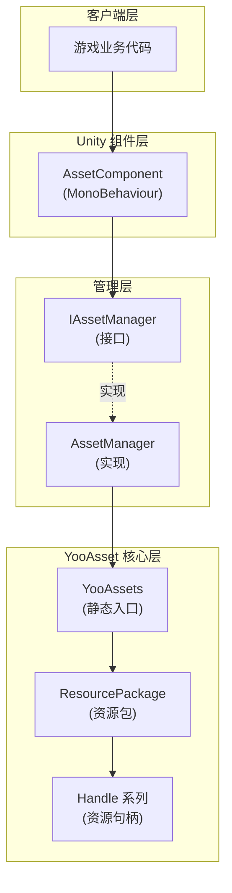
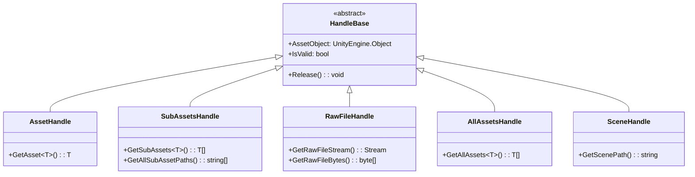

# リソースロードインターフェース

リソースロードインターフェース是 GameFrameX Asset モジュール的コア API，提供します一套統一された的リソースロード和管理方案。该インターフェース基于 YooAsset 库ビルド，サポート同步/非同期ロード、リソースパッケージ管理、シーンロード等多种リソース操作。

## 概要

`IAssetManager` インターフェース定義了リソースコンポーネント的全部ロード機能，涵盖以下コア能力：

- **多种リソースロード方法**：サポート同步和异步两种ロードモード
- **丰富的リソースタイプ**：サポート普通リソース、サブリソース、ネイティブファイル、シーン等多种タイプ
- **リソースパッケージ管理**：サポート作成、取得、切换多个リソースパッケージ
- **リソースライフサイクル管理**：提供リソースアンロード、清理、回收等完全な管理能力

リソースロードインターフェース采用 Handle モード管理リソースライフサイクル，所有ロード操作都返す对应的 Handle 对象，通过 Handle 对象〜できます取得ロード的リソース和进行解放操作。

> Source: [IAssetManager.cs](https://github.com/GameFrameX/com.gameframex.unity.asset/blob/main/Runtime/Asset/IAssetManager.cs#L1-L519)

## アーキテクチャ設計

リソースロード系统采用分层アーキテクチャ設計，コアコンポーネント含みます：



**アーキテクチャ説明：**

- **客户端层**：游戏业务コード通过 `AssetComponent` 或 `IAssetManager` インターフェース呼び出しリソース機能
- **Unity コンポーネント層**：`AssetComponent` 是挂载在 GameObject 上的 MonoBehaviour コンポーネント，提供コンポーネント方法的访问
- **管理层**：`AssetManager` 実装了 `IAssetManager` インターフェース，是リソース的コアマネージャー
- **YooAsset コア层**：实际的リソースロード由 YooAsset 完成，返す各种 Handle 对象进行リソース管理

### Handle 对象体系

リソースロード返す的 Handle 对象是リソース管理的コア：



> Handle タイプ定義来自 YooAsset 库，详情请リファレンス [YooAsset 官方ドキュメント](https://www.yooasset.com/)

## コアロード API

### 非同期ロードリソース

非同期ロード是推奨的主なロード方法，不会阻塞主线程。

```csharp
/// <summary>
/// 异步加载资源
/// </summary>
/// <param name="path">资源路径</param>
/// <typeparam name="T">资源类型</typeparam>
/// <returns>返回一个 Task，包含 AssetHandle 对象</returns>
Task<AssetHandle> LoadAssetAsync<T>(string path) where T : UnityEngine.Object;
```

> Source: [IAssetManager.cs](https://github.com/GameFrameX/com.gameframex.unity.asset/blob/main/Runtime/Asset/IAssetManager.cs#L234)

**使用例：**

```csharp
// 通过 AssetComponent 异步加载 Prefab
var handle = await assetComponent.LoadAssetAsync<GameObject>("Prefabs/Player");
GameObject player = handle.GetAsset<GameObject>();
// 使用完毕后释放资源
handle.Release();
```

> Source: [AssetComponent.cs](https://github.com/GameFrameX/com.gameframex.unity.asset/blob/main/Runtime/Asset/AssetComponent.cs#L258-L261)

### 同期ロードリソース

同期ロード会立つまり返すリソース，但在ロード过程中会阻塞主线程，应谨慎使用。

```csharp
/// <summary>
/// 同步加载资源
/// </summary>
/// <param name="path">资源路径</param>
/// <returns>返回 AssetHandle 对象</returns>
AssetHandle LoadAssetSync<T>(string path) where T : UnityEngine.Object;
```

> Source: [IAssetManager.cs](https://github.com/GameFrameX/com.gameframex.unity.asset/blob/main/Runtime/Asset/IAssetManager.cs#L365)

**使用例：**

```csharp
// 同步加载 Sprite
var handle = assetManager.LoadAssetSync<Sprite>("UI/Sprites/Icon");
Sprite sprite = handle.GetAsset<Sprite>();
handle.Release();
```

> Source: [AssetManager.cs](https://github.com/GameFrameX/com.gameframex.unity.asset/blob/main/Runtime/Asset/AssetManager.cs#L603-L606)

### ロードサブリソース

子リソースロード用于取得一个リソースパッケージ内的所有サブリソース，例えば图集中的所有 Sprite。

```csharp
/// <summary>
/// 异步加载子资源对象
/// </summary>
/// <param name="path">资源路径</param>
/// <typeparam name="T">资源类型</typeparam>
Task<SubAssetsHandle> LoadSubAssetsAsync<T>(string path) where T : UnityEngine.Object;
```

> Source: [IAssetManager.cs](https://github.com/GameFrameX/com.gameframex.unity.asset/blob/main/Runtime/Asset/IAssetManager.cs#L134)

**使用例：**

```csharp
// 加载图集中的所有 Sprite
var handle = await assetComponent.LoadSubAssetsAsync<Sprite>("Atlas/UI/MainAtlas");
Sprite[] sprites = handle.GetSubAssets<Sprite>();
foreach (var sprite in sprites)
{
    Debug.Log($"Sprite: {sprite.name}");
}
handle.Release();
```

> Source: [AssetComponent.cs](https://github.com/GameFrameX/com.gameframex.unity.asset/blob/main/Runtime/Asset/AssetComponent.cs#L128-L131)

### ロードネイティブファイル

ネイティブファイルロード用于ロード非 Unity リソースタイプ的原始ファイル，如設定ファイル、文本ファイル等。

```csharp
/// <summary>
/// 异步加载原生文件
/// </summary>
/// <param name="path">资源路径</param>
Task<RawFileHandle> LoadRawFileAsync(string path);
```

> Source: [IAssetManager.cs](https://github.com/GameFrameX/com.gameframex.unity.asset/blob/main/Runtime/Asset/IAssetManager.cs#L183)

**使用例：**

```csharp
// 加载 JSON 配置文件
var handle = await assetComponent.LoadRawFileAsync("Config/GameConfig.json");
string json = System.Text.Encoding.UTF8.GetString(handle.GetRawFileBytes());
handle.Release();
```

> Source: [AssetComponent.cs](https://github.com/GameFrameX/com.gameframex.unity.asset/blob/main/Runtime/Asset/AssetComponent.cs#L192-L195)

### ロード所有リソース

ロード指定リソースパッケージ内所有的リソース对象。

```csharp
/// <summary>
/// 异步加载资源包内所有资源对象
/// </summary>
/// <param name="path">资源的定位地址</param>
Task<AllAssetsHandle> LoadAllAssetsAsync(string path);
```

> Source: [IAssetManager.cs](https://github.com/GameFrameX/com.gameframex.unity.asset/blob/main/Runtime/Asset/IAssetManager.cs#L267)

**使用例：**

```csharp
// 加载某个目录下的所有 Prefab
var handle = await assetComponent.LoadAllAssetsAsync<GameObject>("Prefabs/Enemies");
GameObject[] enemies = handle.GetAllAssets<GameObject>();
handle.Release();
```

> Source: [AssetComponent.cs](https://github.com/GameFrameX/com.gameframex.unity.asset/blob/main/Runtime/Asset/AssetComponent.cs#L292-L295)

### ロードシーン

非同期ロード Unity シーン。

```csharp
/// <summary>
/// 异步加载场景
/// </summary>
/// <param name="path">资源路径</param>
/// <param name="sceneMode">场景模式</param>
/// <param name="activateOnLoad">是否加载完成自动激活</param>
Task<SceneHandle> LoadSceneAsync(string path, LoadSceneMode sceneMode, bool activateOnLoad = true);
```

> Source: [IAssetManager.cs](https://github.com/GameFrameX/com.gameframex.unity.asset/blob/main/Runtime/Asset/IAssetManager.cs#L379)

**使用例：**

```csharp
// 异步加载并激活场景
var handle = await assetComponent.LoadSceneAsync("Scenes/Game", LoadSceneMode.Single);
Debug.Log("场景加载完成");
// 场景会自动激活，如果需要手动激活：
// handle.Activate();
```

> Source: [AssetComponent.cs](https://github.com/GameFrameX/com.gameframex.unity.asset/blob/main/Runtime/Asset/AssetComponent.cs#L443-L446)

## リソース管理 API

### リソースパッケージ管理

リソースパッケージ（ResourcePackage）是リソース管理的基本单位，〜できます作成多个独立的リソースパッケージ。

```csharp
/// <summary>
/// 创建资源包
/// </summary>
ResourcePackage CreateAssetsPackage(string packageName);

/// <summary>
/// 尝试获取资源包
/// </summary>
ResourcePackage TryGetAssetsPackage(string packageName);

/// <summary>
/// 检查资源包是否存在
/// </summary>
bool HasAssetsPackage(string packageName);

/// <summary>
/// 获取资源包
/// </summary>
ResourcePackage GetAssetsPackage(string packageName);

/// <summary>
/// 设置默认资源包
/// </summary>
void SetDefaultAssetsPackage(ResourcePackage resourcePackage);
```

> Source: [IAssetManager.cs](https://github.com/GameFrameX/com.gameframex.unity.asset/blob/main/Runtime/Asset/IAssetManager.cs#L393-L481)

### リソースのアンロード与清理

```csharp
/// <summary>
/// 卸载资源
/// </summary>
void UnloadAsset(string assetPath);
void UnloadAsset(string packageName, string assetPath);

/// <summary>
/// 卸载无用资源
/// </summary>
void UnloadUnusedAssetsAsync(string packageName = null);

/// <summary>
/// 清理无用资源
/// </summary>
void ClearUnusedBundleFilesAsync(string packageName = null);

/// <summary>
/// 清理所有资源
/// </summary>
void ClearAllBundleFilesAsync(string packageName = null);

/// <summary>
/// 强制回收所有资源
/// </summary>
void UnloadAllAssetsAsync(string packageName = null);
```

> Source: [IAssetManager.cs](https://github.com/GameFrameX/com.gameframex.unity.asset/blob/main/Runtime/Asset/IAssetManager.cs#L107-L509)

### リソース情報照会

```csharp
/// <summary>
/// 是否需要下载（资源是否在远程服务器）
/// </summary>
bool IsNeedDownload(AssetInfo assetInfo);
bool IsNeedDownload(string path);

/// <summary>
/// 获取资源信息
/// </summary>
AssetInfo[] GetAssetInfos(string[] assetTags);
AssetInfo[] GetAssetInfos(string assetTag);
AssetInfo GetAssetInfo(string path);

/// <summary>
/// 检查指定的资源路径是否有效
/// </summary>
bool HasAssetPath(string assetPath);
```

> Source: [IAssetManager.cs](https://github.com/GameFrameX/com.gameframex.unity.asset/blob/main/Runtime/Asset/IAssetManager.cs#L429-L481)

## 初期化与設定

### 初期化リソースシステム

在使用リソースロード機能前，〜しなければなりません先初期化リソースシステム。

```csharp
/// <summary>
/// 初始化
/// </summary>
void Initialize();
```

> Source: [IAssetManager.cs](https://github.com/GameFrameX/com.gameframex.unity.asset/blob/main/Runtime/Asset/IAssetManager.cs#L89)

初期化操作由 `AssetComponent` 在 Start フェーズ自动呼び出し，一般不〜する必要があります手动呼び出し。

### 初期化リソースパッケージ

```csharp
/// <summary>
/// 异步初始化操作
/// </summary>
Task<bool> InitPackageAsync(
    string packageName, 
    string hostServerURL, 
    string fallbackHostServerURL, 
    bool isDefaultPackage = true
);
```

> Source: [IAssetManager.cs](https://github.com/GameFrameX/com.gameframex.unity.asset/blob/main/Runtime/Asset/IAssetManager.cs#L100)

**使用例：**

```csharp
// 在 AssetComponent 中初始化资源包
bool success = await assetComponent.InitPackageAsync(
    "DefaultPackage",                    // 包名称
    "https://cdn.example.com/assets",   // 主服务器地址
    "https://backup.example.com/assets", // 备用服务器地址
    true                                 // 设为默认包
);

if (success)
{
    Debug.Log("资源包初始化成功");
}
```

> Source: [AssetComponent.cs](https://github.com/GameFrameX/com.gameframex.unity.asset/blob/main/Runtime/Asset/AssetComponent.cs#L80-L95)

### 設定プロパティ

```csharp
/// <summary>
/// 同时下载的最大数目
/// </summary>
int DownloadingMaxNum { get; set; }

/// <summary>
/// 失败重试最大数目
/// </summary>
int FailedTryAgain { get; set; }

/// <summary>
/// 获取资源只读区路径
/// </summary>
string ReadOnlyPath { get; }

/// <summary>
/// 获取资源读写区路径
/// </summary>
string ReadWritePath { get; }

/// <summary>
/// 获取或设置运行模式
/// </summary>
EPlayMode PlayMode { get; }

/// <summary>
/// 获取或设置下载文件校验等级
/// </summary>
EFileVerifyLevel VerifyLevel { get; set; }
```

> Source: [IAssetManager.cs](https://github.com/GameFrameX/com.gameframex.unity.asset/blob/main/Runtime/Asset/IAssetManager.cs#L15-L75)

### 動作モード

系统サポート四种运行モード，由 `EPlayMode` 列挙型定義：

| モード | 説明 | 使用シーン |
|------|------|----------|
| `EditorSimulateMode` | エディタ模拟モード | 开发フェーズ，不〜する必要があります打パッケージつまり可テスト |
| `OfflinePlayMode` | 单机运行モード | 纯本地リソース，不サポートホットアップデート |
| `HostPlayMode` | 联机运行モード | サポートホットアップデート的正式環境 |
| `WebPlayMode` | WebGL 运行モード | WebGL プラットフォーム专用 |

> 运行モード詳細介绍请リファレンス [运行モード](./6-configuration.play-modes)

```csharp
/// <summary>
/// 设置运行模式
/// </summary>
void SetPlayMode(EPlayMode playMode);
```

> Source: [IAssetManager.cs](https://github.com/GameFrameX/com.gameframex.unity.asset/blob/main/Runtime/Asset/IAssetManager.cs#L82)

## ロードフロー

### 典型非同期ロードフロー


### 完全な使用例

```csharp
using UnityEngine;
using System;
using System.Threading.Tasks;
using YooAsset;
using GameFrameX.Asset.Runtime;

public class ResourceLoaderExample : MonoBehaviour
{
    private AssetComponent _assetComponent;
    
    async void Start()
    {
        // 获取 AssetComponent
        _assetComponent = GetComponent<AssetComponent>();
        
        // 初始化资源包（通常在启动界面完成）
        await InitializePackages();
        
        // 示例 1: 异步加载单个资源
        await LoadSingleAssetAsync();
        
        // 示例 2: 加载子资源（图集）
        await LoadSubAssetsAsync();
        
        // 示例 3: 加载场景
        await LoadSceneAsync();
    }
    
    async Task InitializePackages()
    {
        bool success = await _assetComponent.InitPackageAsync(
            "DefaultPackage",
            "https://cdn.example.com/assets",
            "https://backup.example.com/assets",
            true
        );
        Debug.Log($"资源包初始化: {(success ? "成功" : "失败")}");
    }
    
    async Task LoadSingleAssetAsync()
    {
        // 加载 Prefab
        var handle = await _assetComponent.LoadAssetAsync<GameObject>("Prefabs/Player");
        if (handle.IsValid())
        {
            GameObject player = handle.GetAsset<GameObject>();
            Instantiate(player);
            Debug.Log($"加载 Prefab 成功: {player.name}");
            
            // 使用完毕后必须释放
            handle.Release();
        }
    }
    
    async Task LoadSubAssetsAsync()
    {
        // 加载图集中的所有 Sprite
        var handle = await _assetComponent.LoadSubAssetsAsync<Sprite>("Atlas/UI/MainUI");
        if (handle.IsValid())
        {
            var sprites = handle.GetSubAssets<Sprite>();
            Debug.Log($"加载了 {sprites.Length} 个 Sprite");
            
            foreach (var sprite in sprites)
            {
                Debug.Log($"  - {sprite.name}");
            }
            
            handle.Release();
        }
    }
    
    async Task LoadSceneAsync()
    {
        // 加载游戏场景
        var handle = await _assetComponent.LoadSceneAsync(
            "Scenes/GameMain", 
            UnityEngine.SceneManagement.LoadSceneMode.Single,
            true
        );
        
        if (handle.IsValid())
        {
            Debug.Log("场景加载成功");
        }
    }
}
```

> Source: [AssetManager.cs](https://github.com/GameFrameX/com.gameframex.unity.asset/blob/main/Runtime/Asset/AssetManager.cs#L1-L829)

## API リファレンス

### 初期化メソッド

#### `Initialize(): void`

初期化リソースシステム。通常由 `AssetComponent` 在启动时自动呼び出し。

#### `InitPackageAsync(packageName, hostServerURL, fallbackHostServerURL, isDefaultPackage): Task<bool>`

异步初期化リソースパッケージ。

**パラメータ：**
- `packageName` (string): リソースパッケージ名称
- `hostServerURL` (string): 主热更服务器地址
- `fallbackHostServerURL` (string): 备用热更服务器地址
- `isDefaultPackage` (bool, 可选): 是否设为デフォルトパッケージ，デフォルト true

**返す：** 初期化是否成功

### 非同期ロードメソッド

#### `LoadAssetAsync<T>(path): Task<AssetHandle>`

非同期ロード单个リソース。

**パラメータ：**
- `path` (string): リソースパス
- `T`: リソースタイプ（ジェネリックパラメータ）

**返す：** パッケージ含 AssetHandle 的 Task

#### `LoadSubAssetsAsync<T>(path): Task<SubAssetsHandle>`

非同期ロードサブリソース。

#### `LoadRawFileAsync(path): Task<RawFileHandle>`

非同期ロードネイティブファイル。

#### `LoadAllAssetsAsync(path): Task<AllAssetsHandle>`

非同期ロードリソースパッケージ内所有リソース对象。

#### `LoadSceneAsync(path, sceneMode, activateOnLoad): Task<SceneHandle>`

非同期ロードシーン。

### 同期ロードメソッド

同期ロードメソッド与异步メソッド对应，但立つまり返す結果：
- `LoadAssetSync<T>(path): AssetHandle`
- `LoadSubAssetSync<T>(path): SubAssetsHandle`
- `LoadRawFileSync(path): RawFileHandle`
- `LoadAllAssetsSync<T>(path): AllAssetsHandle`

### リソース管理メソッド

| メソッド | 説明 |
|------|------|
| `CreateAssetsPackage(name)` | 作成リソースパッケージ |
| `GetAssetsPackage(name)` | 取得リソースパッケージ |
| `HasAssetsPackage(name)` | 確認リソースパッケージ是否存在 |
| `SetDefaultAssetsPackage(package)` | 設定デフォルトリソースパッケージ |
| `UnloadAsset(path)` | アンロード指定リソース |
| `UnloadUnusedAssetsAsync()` | 异步アンロード无用リソース |
| `ClearUnusedBundleFilesAsync()` | 清理无用リソースパッケージファイル |
| `UnloadAllAssetsAsync()` | 强制回收所有リソース |

### 查询メソッド

| メソッド | 説明 |
|------|------|
| `IsNeedDownload(path)` | 確認リソース是否〜する必要があります下载 |
| `GetAssetInfo(path)` | 取得リソース情報 |
| `GetAssetInfos(tag)` | 根据标签取得リソース情報列表 |
| `HasAssetPath(path)` | 確認リソースパス是否有效 |

## ベストプラクティス

### 1. 使用非同期ロード

优先使用非同期ロードメソッド，避免阻塞主线程影响游戏帧率：

```csharp
// ✅ 推荐：异步加载
var handle = await assetComponent.LoadAssetAsync<GameObject>("Prefables/Player");

// ⚠️ 谨慎：同步加载
var handle = assetManager.LoadAssetSync<GameObject>("Prefables/Player");
```

### 2. 及时解放リソース

使用完リソース后〜しなければなりません呼び出し Release() 解放，避免内存泄漏：

```csharp
var handle = await assetComponent.LoadAssetAsync<GameObject>("Prefabs/Player");
GameObject obj = handle.GetAsset<GameObject>();
// ... 使用资源对象
handle.Release(); // 释放资源
```

### 3. 使用 try-finally 確認してください解放

使用 try-finally 確認してくださいリソース一定被解放：

```csharp
var handle = await assetComponent.LoadAssetAsync<GameObject>("Prefabs/Player");
try
{
    GameObject obj = handle.GetAsset<GameObject>();
    // 使用资源
}
finally
{
    handle.Release();
}
```

### 4. 合理使用リソースパッケージ

根据游戏结构合理划分リソースパッケージ：

```csharp
// 创建UI资源包
var uiPackage = assetManager.CreateAssetsPackage("UI");
// 设置为默认包
assetManager.SetDefaultAssetsPackage(uiPackage);
```

### 5. 確認リソース有效性

在取得リソース前確認 Handle 有效性：

```csharp
var handle = await assetComponent.LoadAssetAsync<GameObject>("Prefabs/Player");
if (handle.IsValid())
{
    GameObject obj = handle.GetAsset<GameObject>();
    // 使用资源
}
else
{
    Debug.LogError("资源加载失败");
}
handle.Release();
```

## 関連リンク

- [リソースコンポーネント](./4-core-concepts.asset-component) - Unity コンポーネント方法访问リソース
- [リソースマネージャー](./4-core-concepts.asset-manager) - リソースマネージャーコア実装
- [运行モード](./6-configuration.play-modes) - 四种运行モード详解
- [リソースパッケージ管理](./5-api-reference.package-management) - リソースパッケージ管理 API
- [アップデートイベント](./5-api-reference.update-events) - リソースアップデートイベント
- [YooAsset 官方ドキュメント](https://www.yooasset.com/)
