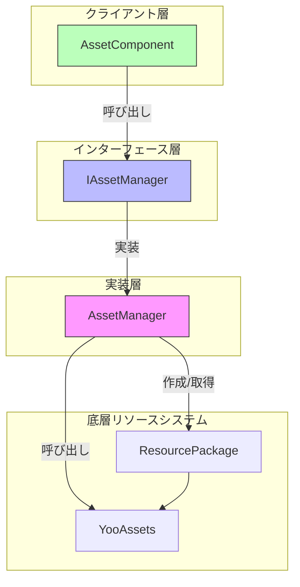
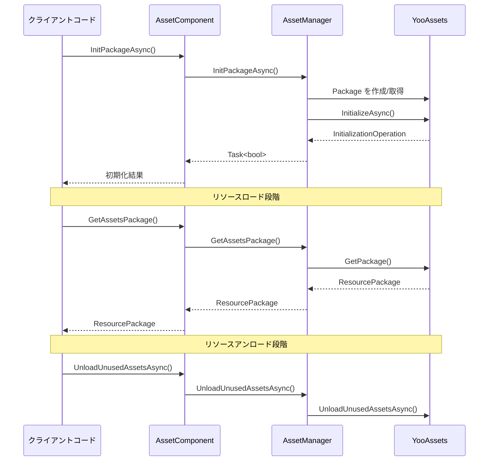

# リソースパッケージ管理

リソースパッケージ管理 API は、リソースパッケージ（ResourcePackage）の完全なライフサイクル管理機能を提供し、パッケージの作成、初期化、取得、アンロードなどの操作を含みます。このモジュールは YooAssets ライブラリに基づいて構築されており、GameFrameX に統一された強力なリソースパッケージ管理機能を提供します。

## 概要

リソースパッケージ（ResourcePackage）は GameFrameX リソースシステムにおいてリソースを組織・管理するコアコンセプトです。各リソースパッケージは独立したリソース集合を表し、独自の下载地址、初期化方式、リソースロードルールを持つことができます。リソースパッケージ管理 API を通じて、開発者は以下を行うことができます：

- 複数の独立したリソースパッケージを作成し、モジュール별リソース管理を実現
- 各リソースパッケージに異なるリモートサーバーアドレスを設定
- デフォルトリソースパッケージを設定してロードインターフェースの簡略化
- リソースのロードとアンロードのタイミングを柔軟に制御

システムは同時に複数のリソースパッケージを管理できますが、同時には1つのデフォルトパッケージのみ設定できます。デフォルトパッケージは簡略化されたロードインターフェースを使用でき、パッケージ名を明示的に指定する必要はありません。

> 注意：デフォルトリソースパッケージ名は `DefaultPackage` で、`AssetManager.ConstDefaultPackageName` 定数で定義されています。

## アーキテクチャ

リソースパッケージ管理の architecture は典型的な分层設計パターンを采用し、インターフェース抽象化を通じて底層 YooAssets の封裝を実現しています：



**コンポーネント説明：**

| コンポーネント | 职责 |
|------|------|
| AssetComponent | Unity コンポーネント層、公開 API インターフェースを提供 |
| IAssetManager | リソース管理の抽象インターフェースを定義 |
| AssetManager | 具象実装クラス、YooAssets との相互作用を担当 |
| ResourcePackage | YooAssets のリソースパッケージオブジェクト |

## コア機能

### リソースパッケージ初期化

リソースパッケージは使用する前に必ず初期化する必要があります。初期化プロセスは実行モード（PlayMode）に従って異なるファイルシステムを構成し、リモートサーバー（必要な場合）に接続します。

#### 非同期でリソースパッケージを初期化

```csharp
public async Task<bool> InitPackageAsync(string packageName, string host, string fallbackHostServer, bool isDefaultPackage = false)
```

> Source: [AssetComponent.cs](https://github.com/GameFrameX/com.gameframex.unity.asset/blob/main/Runtime/Asset/AssetComponent.cs#L80-L95)

**パラメータ説明：**
- `packageName` (string): リソースパッケージ名、リソースパッケージの識別と取得に使用
- `host` (string): メイン下载地址.Remote リソースをダウンロードするために使用
- `fallbackHostServer` (string): バックアップ下载地址、メインアドレスが利用できない場合に使用
- `isDefaultPackage` (bool): デフォルトパッケージに設定するか、默认は false

**返り値：**
- `Task<bool>`: 初期化が成功したかどうか

**使用例：**

```csharp
var assetComponent = GameEntry.GetComponent<AssetComponent>();
bool success = await assetComponent.InitPackageAsync(
    "MyPackage",
    "https://cdn.example.com/assets",
    "https://backup.example.com/assets",
    true
);
```

初期化プロセスは現在設定されている実行モード（EPlayMode）に従って異なる初期化策略を選択します：

- **EditorSimulateMode**: エディタシミュレートモード、エディタ内のシミュレートリソースを使用
- **OfflinePlayMode**: 单機実行モード、内蔵リソースのみを使用
- **HostPlayMode**: 联网実行モード.Remote リソースダウンロードと熱更新をサポート
- **WebPlayMode**: WebGL 実行モード.Web プラットフォームに最適化

> 実行モードの詳細な説明は [実行モード](./6-configuration.play-modes) ドキュメントを参照してください。

### リソースパッケージの作成と取得

#### リソースパッケージを作成

```csharp
public ResourcePackage CreateAssetsPackage(string packageName)
```

> Source: [AssetComponent.cs](https://github.com/GameFrameX/com.gameframex.unity.asset/blob/main/Runtime/Asset/AssetComponent.cs#L471-L474)

新しいリソースパッケージを作成します。パッケージが既に存在する場合は、既存のインスタンスを返します。

**パラメータ：**
- `packageName` (string): リソースパッケージ名

**返り値：**
- ResourcePackage: 作成されたリソースパッケージオブジェクト

#### リソースパッケージの取得を試行

```csharp
public ResourcePackage TryGetAssetsPackage(string packageName)
```

> Source: [AssetComponent.cs](https://github.com/GameFrameX/com.gameframex.unity.asset/blob/main/Runtime/Asset/AssetComponent.cs#L482-L485)

安全にリソースパッケージを取得し、パケットが存在しない場合は null を返し、例外をスローしません。

**パラメータ：**
- `packageName` (string): リソースパッケージ名

**返り値：**
- ResourcePackage: リソースパッケージオブジェクト、存在しない場合は null

#### リソースパッケージ是否存在か確認

```csharp
public bool HasAssetsPackage(string packageName)
```

> Source: [AssetComponent.cs](https://github.com/GameFrameX/com.gameframex.unity.asset/blob/main/Runtime/Asset/AssetComponent.cs#L493-L496)

指定された名前のリソースパッケージが既に作成されているか確認します。

**パラメータ：**
- `packageName` (string): リソースパッケージ名

**返り値：**
- bool: 存在するかどうか

#### リソースパッケージを取得

```csharp
public ResourcePackage GetAssetsPackage(string packageName)
```

> Source: [AssetComponent.cs](https://github.com/GameFrameX/com.gameframex.unity.asset/blob/main/Runtime/Asset/AssetComponent.cs#L504-L507)

指定された名前のリソースパッケージを取得します。パッケージが存在しない場合は例外をスローします。

**パラメータ：**
- `packageName` (string): リソースパッケージ名

**返り値：**
- ResourcePackage: リソースパッケージオブジェクト

### デフォルトリソースパッケージ

#### デフォルトリソースパッケージを設定

```csharp
public void SetDefaultAssetsPackage(ResourcePackage assetsPackage)
```

> Source: [AssetComponent.cs](https://github.com/GameFrameX/com.gameframex.unity.asset/blob/main/Runtime/Asset/AssetComponent.cs#L581-L584)

デフォルトリソースパッケージを設定します。設定後、リソースをロードする際にパッケージ名を明示的に指定する必要はなく、システムはデフォルトパッケージから自動的にロードします。

**パラメータ：**
- `assetsPackage` (ResourcePackage): デフォルトに設定するリソースパッケージ

**使用例：**

```csharp
var assetComponent = GameEntry.GetComponent<AssetComponent>();
var package = assetComponent.GetAssetsPackage("MyPackage");
assetComponent.SetDefaultAssetsPackage(package);
// その後、簡略化されたロードインターフェースを使用可能
var handle = await assetComponent.LoadAssetAsync("Prefabs/Player");
```

## リソースアンロードと清理

GameFrameX は多層のリソースアンロードと清理メカニズムを提供し、異なるシーンの需求を満たします。

### 单一リソースをアンロード

```csharp
public void UnloadAsset(string assetPath)
public void UnloadAsset(string packageName, string assetPath)
```

> Source: [AssetComponent.cs](https://github.com/GameFrameX/com.gameframex.unity.asset/blob/main/Runtime/Asset/AssetComponent.cs#L602-L615)

指定されたパスのリソースをアンロードします。

**パラメータ：**
- `packageName` (string): リソースパッケージ名（オプション、指定しない場合はデフォルトパッケージを使用）
- `assetPath` (string): リソースパス

### すべてのリソースを強制回收

```csharp
public void UnloadAllAssetsAsync(string packageName)
```

> Source: [AssetComponent.cs](https://github.com/GameFrameX/com.gameframex.unity.asset/blob/main/Runtime/Asset/AssetComponent.cs#L591-L594)

指定されたリソースパッケージ内のすべてのロード済みリソースを強制回収します。この操作はすべてのリソースメモリを直ちに解放するため、慎重に使用する必要があります。

**パラメータ：**
- `packageName` (string): リソースパッケージ名

### 未使用のリソースをアンロード

```csharp
public void UnloadUnusedAssetsAsync(string packageName = null)
```

> Source: [AssetComponent.cs](https://github.com/GameFrameX/com.gameframex.unity.asset/blob/main/Runtime/Asset/AssetComponent.cs#L635-L638)

参照されていないリソースをアンロードします。これは推奨されるリソース解放方式であり、システムは使用されていないリソースを自動的に識別して解放します。

**パラメータ：**
- `packageName` (string): リソースパッケージ名、null の場合はデフォルトパッケージを清理

### リソースファイルを清理

```csharp
public void ClearAllBundleFilesAsync(string packageName = null)
public void ClearUnusedBundleFilesAsync(string packageName = null)
```

> Source: [AssetComponent.cs](https://github.com/GameFrameX/com.gameframex.unity.asset/blob/main/Runtime/Asset/AssetComponent.cs#L645-L658)

ローカルキャッシュのリソースパッケージファイルを清理します。

- `ClearAllBundleFilesAsync`: すべてのリソースファイルを清理
- `ClearUnusedBundleFilesAsync`: 未使用のリソースファイルのみを清理

**パラメータ：**
- `packageName` (string): リソースパッケージ名、null の場合はデフォルトパッケージを清理

## 使用フロー

以下はマルチリソースパッケージシナリオの典型的な使用フローです：



## 典型的な使用シーン

### シーン1：DLC リソースパッケージ管理

ゲームの公开发布後に追加の DLC コンテンツを動的にロードする必要がある場合、独立したリソースパッケージを使用できます：

```csharp
var assetComponent = GameEntry.GetComponent<AssetComponent>();

// DLC リソースパッケージを初期化
await assetComponent.InitPackageAsync(
    "DLC_LevelPack1",
    "https://cdn.example.com/dlc/levelpack1",
    "https://backup.example.com/dlc/levelpack1"
);

// DLC パッケージを取得してリソースをロード
var dlcPackage = assetComponent.GetAssetsPackage("DLC_LevelPack1");
assetComponent.SetDefaultAssetsPackage(dlcPackage);

var levelHandle = await assetComponent.LoadAssetAsync<Scene>("Levels/Level01");
```

### シーン2：リソース熱更新

联网モードを使用する場合、リソースパッケージは熱更新リソースの管理に使用されます：

```csharp
var assetComponent = GameEntry.GetComponent<AssetComponent>();

// デフォルトパッケージを初期化（熱更新用）
bool success = await assetComponent.InitPackageAsync(
    "HotUpdate",
    "https://gamecdn.example.com/hotupdate",
    "https://backup.example.com/hotupdate",
    true
);

if (success)
{
    Debug.Log("熱更新リソースパッケージの初期化成功");
}
```

### シーン3：リソース清理

ゲームのシーン切り替え時または特定流程に進入時に不要なリソースを清理します：

```csharp
var assetComponent = GameEntry.GetComponent<AssetComponent>();

// 未使用のリソースをアンロード（推奨）
assetComponent.UnloadUnusedAssetsAsync();

// または特定リソースパッケージのすべてのキャッシュを清理
assetComponent.ClearUnusedBundleFilesAsync("OldDLC");
```

## API リファレンス

### AssetComponent

| メソッド | 返り値タイプ | 説明 |
|------|----------|------|
| InitPackageAsync | Task\<bool\> | リソースパッケージを非同期で初期化 |
| CreateAssetsPackage | ResourcePackage | リソースパッケージを作成 |
| TryGetAssetsPackage | ResourcePackage | リソースパッケージを取得 시도（安全） |
| HasAssetsPackage | bool | リソースパッケージ是否存在か確認 |
| GetAssetsPackage | ResourcePackage | リソースパッケージを取得 |
| SetDefaultAssetsPackage | void | デフォルトリソースパッケージを設定 |
| UnloadAsset | void | 指定されたリソースをアンロード |
| UnloadAllAssetsAsync | void | すべてのリソースを強制回収 |
| UnloadUnusedAssetsAsync | void | 未使用のリソースをアンロード |
| ClearAllBundleFilesAsync | void | すべてのリソースファイルを清理 |
| ClearUnusedBundleFilesAsync | void | 未使用のリソースファイルを清理 |

### IAssetManager

| プロパティ | タイプ | 説明 |
|------|------|------|
| DefaultPackageName | string | デフォルトリソースパッケージ名 |
| PlayMode | EPlayMode | 現在の実行モード |
| VerifyLevel | EFileVerifyLevel | ファイル検証レベル |
| Milliseconds | long | 非同期システム時間切片 |

> 完全なインターフェース定義は [IAssetManager.cs](https://github.com/GameFrameX/com.gameframex.unity.asset/blob/main/Runtime/Asset/IAssetManager.cs) を参照してください。

## 関連リンク

- [リソースロードインターフェース](./5-api-reference.loading-api) - パッケージ内でリソースをロードする方法を確認
- [実行モード](./6-configuration.play-modes) - 異なる実行モードの設定を確認
- [リソースコンポーネント](./4-core-concepts.asset-component) - AssetComponent コンポーネントを確認
- [アーキテクチャ設計](./4-core-concepts.architecture) - 全体的なアーキテクチャ設計を確認