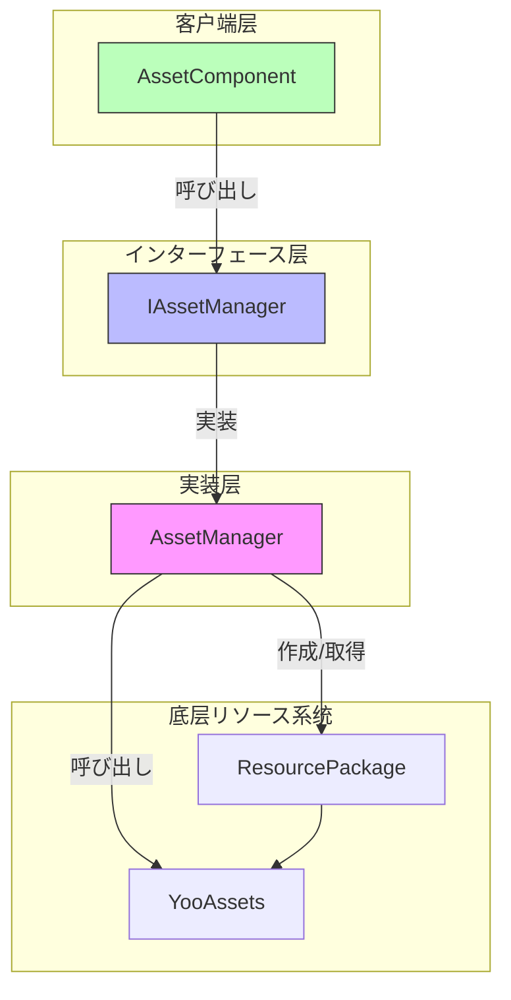
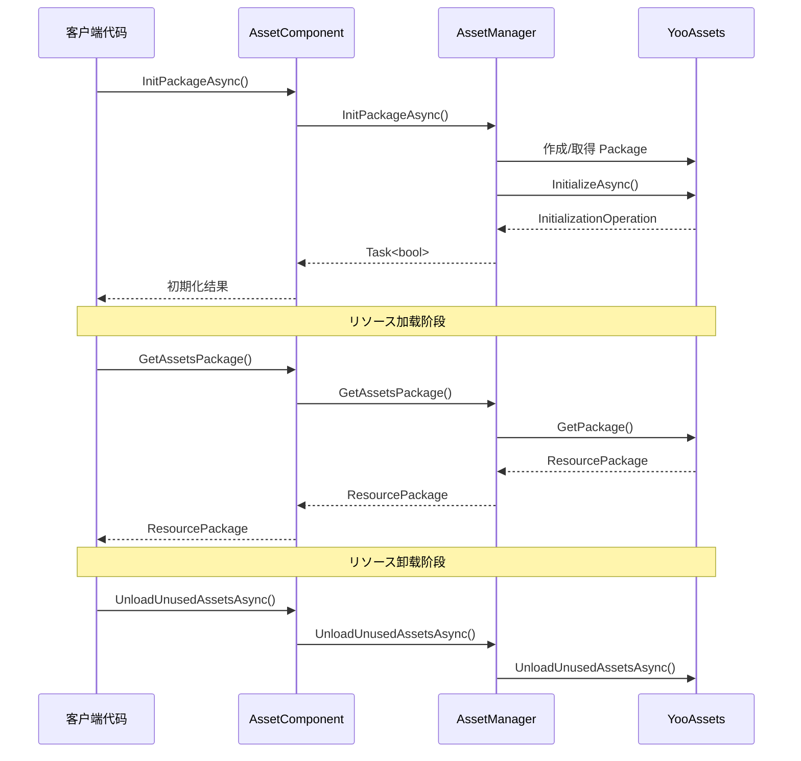

# リソースパッケージ管理

リソースパッケージ管理 API 提供します对リソース包（ResourcePackage）的完整生命周期管理能力，包括包的作成、初期化、取得、卸载等操作。该模块基づく YooAssets 库构建，为 GameFrameX 提供します统一且强大的リソースパッケージ管理機能。

## 概要

リソース包（ResourcePackage）是 GameFrameX リソース系统中に使用组织和管理リソース的コア概念。每个リソース包代表一个独立的リソース集合，可能拥有自己的ダウンロード地址、初期化方法和リソース加载规则。を通じてリソースパッケージ管理 API，開発者可能：

- 作成多个独立的リソース包以実装リソース的模块化管理
- 为每个リソース包配置不同的远程服务器地址
- 設定默认リソース包以简化加载インターフェース的使用
- 灵活地控制リソース的加载和卸载时机

系统サポート同时管理多个リソース包，但同一时间只能設定一个默认包。默认包可能使用简化的加载インターフェース，无需显式指定包名。

> 注意：默认リソース包名称为 `DefaultPackage`，定义在 `AssetManager.ConstDefaultPackageName` 常量中。

## 架构

リソースパッケージ管理的架构采用了典型的分层设计模式，を通じてインターフェース抽象実装了底层 YooAssets 的封装：



**コンポーネント説明：**

| コンポーネント | 职责 |
|------|------|
| AssetComponent | Unity コンポーネント层，提供公开的 API インターフェース |
| IAssetManager | 定义リソース管理的抽象インターフェース |
| AssetManager | 具体実装クラス，负责与 YooAssets 交互 |
| ResourcePackage | YooAssets 的リソース包对象 |

## コア機能

### リソース包初期化

リソース包在使用前必須先进行初期化。初期化过程会に基づいて运行模式（PlayMode）配置不同的ファイル系统，并连接到远程服务器（如果必要）。

#### 异步初期化リソース包

```csharp
public async Task<bool> InitPackageAsync(string packageName, string host, string fallbackHostServer, bool isDefaultPackage = false)
```

> Source: [AssetComponent.cs](https://github.com/GameFrameX/com.gameframex.unity.asset/blob/main/Runtime/Asset/AssetComponent.cs#L80-L95)

**参数説明：**
- `packageName` (string): リソース包名称，に使用标识和取得该リソース包
- `host` (string): 主ダウンロード地址，に使用ダウンロード远程リソース
- `fallbackHostServer` (string): 备用ダウンロード地址，当主地址不可用时使用
- `isDefaultPackage` (bool): 是否設定为默认包，默认为 false

**返回值：** 
- `Task<bool>`: 初期化是否成功

**使用示例：**

```csharp
var assetComponent = GameEntry.GetComponent<AssetComponent>();
bool success = await assetComponent.InitPackageAsync(
    "MyPackage", 
    "https://cdn.example.com/assets", 
    "https://backup.example.com/assets", 
    true
);
```

初期化过程会に基づいて当前設定的运行模式（EPlayMode）选择不同的初期化策略：

- **EditorSimulateMode**: 编辑器模拟模式，使用编辑器内的模拟リソース
- **OfflinePlayMode**: 单机运行模式，仅使用内置リソース
- **HostPlayMode**: 联机运行模式，サポート远程リソースダウンロード和ホットアップデート
- **WebPlayMode**: WebGL 运行模式，针对 Web 平台优化

> 运行模式的詳細説明お願いします参阅 [运行模式](./6-configuration.play-modes) 文档。

### リソース包作成与取得

#### 作成リソース包

```csharp
public ResourcePackage CreateAssetsPackage(string packageName)
```

> Source: [AssetComponent.cs](https://github.com/GameFrameX/com.gameframex.unity.asset/blob/main/Runtime/Asset/AssetComponent.cs#L471-L474)

作成一个新的リソース包。如果包已存在，则返回已存在的包インスタンス。

**参数：**
- `packageName` (string): リソース包名称

**返回值：**
- ResourcePackage: 作成的リソース包对象

#### 尝试取得リソース包

```csharp
public ResourcePackage TryGetAssetsPackage(string packageName)
```

> Source: [AssetComponent.cs](https://github.com/GameFrameX/com.gameframex.unity.asset/blob/main/Runtime/Asset/AssetComponent.cs#L482-L485)

安全取得リソース包，如果包不存在则返回 null 而不会抛出異常。

**参数：**
- `packageName` (string): リソース包名称

**返回值：**
- ResourcePackage: リソース包对象，如果不存在则返回 null

#### 检查リソース包是否存在

```csharp
public bool HasAssetsPackage(string packageName)
```

> Source: [AssetComponent.cs](https://github.com/GameFrameX/com.gameframex.unity.asset/blob/main/Runtime/Asset/AssetComponent.cs#L493-L496)

检查指定名称的リソース包是否已作成。

**参数：**
- `packageName` (string): リソース包名称

**返回值：**
- bool: 是否存在

#### 取得リソース包

```csharp
public ResourcePackage GetAssetsPackage(string packageName)
```

> Source: [AssetComponent.cs](https://github.com/GameFrameX/com.gameframex.unity.asset/blob/main/Runtime/Asset/AssetComponent.cs#L504-L507)

取得指定名称的リソース包。如果包不存在，将抛出異常。

**参数：**
- `packageName` (string): リソース包名称

**返回值：**
- ResourcePackage: リソース包对象

### 默认リソース包

#### 設定默认リソース包

```csharp
public void SetDefaultAssetsPackage(ResourcePackage assetsPackage)
```

> Source: [AssetComponent.cs](https://github.com/GameFrameX/com.gameframex.unity.asset/blob/main/Runtime/Asset/AssetComponent.cs#L581-L584)

設定默认リソース包。設定后，加载リソース时无需显式指定包名，系统会自动从默认包中加载。

**参数：**
- `assetsPackage` (ResourcePackage): 要設定为默认的リソース包

**使用示例：**

```csharp
var assetComponent = GameEntry.GetComponent<AssetComponent>();
var package = assetComponent.GetAssetsPackage("MyPackage");
assetComponent.SetDefaultAssetsPackage(package);
// 之后可能使用简化的加载インターフェース
var handle = await assetComponent.LoadAssetAsync("Prefabs/Player");
```

## リソース卸载与清理

GameFrameX 提供します多层次的リソース卸载和清理机制，以满足不同シーン的需求。

### 卸载单个リソース

```csharp
public void UnloadAsset(string assetPath)
public void UnloadAsset(string packageName, string assetPath)
```

> Source: [AssetComponent.cs](https://github.com/GameFrameX/com.gameframex.unity.asset/blob/main/Runtime/Asset/AssetComponent.cs#L602-L615)

卸载指定路径的リソース。

**参数：**
- `packageName` (string): リソース包名称（可选，不指定则使用默认包）
- `assetPath` (string): リソース路径

### 强制回收所有リソース

```csharp
public void UnloadAllAssetsAsync(string packageName)
```

> Source: [AssetComponent.cs](https://github.com/GameFrameX/com.gameframex.unity.asset/blob/main/Runtime/Asset/AssetComponent.cs#L591-L594)

强制回收指定リソース包中的所有已加载リソース。此操作会立即释放所有リソース内存，应谨慎使用。

**参数：**
- `packageName` (string): リソース包名称

### 卸载无用リソース

```csharp
public void UnloadUnusedAssetsAsync(string packageName = null)
```

> Source: [AssetComponent.cs](https://github.com/GameFrameX/com.gameframex.unity.asset/blob/main/Runtime/Asset/AssetComponent.cs#L635-L638)

卸载未被引用的リソース。这是推荐使用的リソース释放方法，系统会自动识别并释放不再使用的リソース。

**参数：**
- `packageName` (string): リソース包名称，为 null 时清理默认包

### 清理リソースファイル

```csharp
public void ClearAllBundleFilesAsync(string packageName = null)
public void ClearUnusedBundleFilesAsync(string packageName = null)
```

> Source: [AssetComponent.cs](https://github.com/GameFrameX/com.gameframex.unity.asset/blob/main/Runtime/Asset/AssetComponent.cs#L645-L658)

清理本地缓存的リソース包ファイル。

- `ClearAllBundleFilesAsync`: 清理所有リソースファイル
- `ClearUnusedBundleFilesAsync`: 仅清理未被使用的リソースファイル

**参数：**
- `packageName` (string): リソース包名称，为 null 时清理默认包

## 使用フロー

以下是多リソース包シーン的典型使用フロー：



## 典型使用シーン

### シーン一：DLC リソースパッケージ管理

在ゲーム发布后必要动态加载额外的 DLC 内容时，可能使用独立的リソース包：

```csharp
var assetComponent = GameEntry.GetComponent<AssetComponent>();

// 初期化 DLC リソース包
await assetComponent.InitPackageAsync(
    "DLC_LevelPack1",
    "https://cdn.example.com/dlc/levelpack1",
    "https://backup.example.com/dlc/levelpack1"
);

// 取得 DLC 包并加载リソース
var dlcPackage = assetComponent.GetAssetsPackage("DLC_LevelPack1");
assetComponent.SetDefaultAssetsPackage(dlcPackage);

var levelHandle = await assetComponent.LoadAssetAsync<Scene>("Levels/Level01");
```

### シーン二：リソースホットアップデート

使用联机模式时，リソース包に使用管理ホットアップデートリソース：

```csharp
var assetComponent = GameEntry.GetComponent<AssetComponent>();

// 初期化默认包（に使用ホットアップデート）
bool success = await assetComponent.InitPackageAsync(
    "HotUpdate",
    "https://gamecdn.example.com/hotupdate",
    "https://backup.example.com/hotupdate",
    true
);

if (success)
{
    Debug.Log("ホットアップデートリソース包初期化成功");
}
```

### シーン三：リソース清理

在切换ゲームシーン或进入特定フロー时清理不必要的リソース：

```csharp
var assetComponent = GameEntry.GetComponent<AssetComponent>();

// 卸载未使用的リソース（推荐）
assetComponent.UnloadUnusedAssetsAsync();

// 或者清理特定リソース包的所有缓存
assetComponent.ClearUnusedBundleFilesAsync("OldDLC");
```

## API 参考

### AssetComponent

| メソッド | 返回クラス型 | 説明 |
|------|----------|------|
| InitPackageAsync | Task\<bool\> | 异步初期化リソース包 |
| CreateAssetsPackage | ResourcePackage | 作成リソース包 |
| TryGetAssetsPackage | ResourcePackage | 尝试取得リソース包（安全） |
| HasAssetsPackage | bool | 检查リソース包是否存在 |
| GetAssetsPackage | ResourcePackage | 取得リソース包 |
| SetDefaultAssetsPackage | void | 設定默认リソース包 |
| UnloadAsset | void | 卸载指定リソース |
| UnloadAllAssetsAsync | void | 强制回收所有リソース |
| UnloadUnusedAssetsAsync | void | 卸载无用リソース |
| ClearAllBundleFilesAsync | void | 清理所有リソースファイル |
| ClearUnusedBundleFilesAsync | void | 清理无用リソースファイル |

### IAssetManager

| プロパティ | クラス型 | 説明 |
|------|------|------|
| DefaultPackageName | string | 默认リソース包名称 |
| PlayMode | EPlayMode | 当前运行模式 |
| VerifyLevel | EFileVerifyLevel | ファイル验证等级 |
| Milliseconds | long | 异步系统时间片 |

> 完整的インターフェース定义お願いします参阅 [IAssetManager.cs](https://github.com/GameFrameX/com.gameframex.unity.asset/blob/main/Runtime/Asset/IAssetManager.cs)

## 関連リンク

- [リソース加载インターフェース](./5-api-reference.loading-api) - 了解如何在包中加载リソース
- [运行模式](./6-configuration.play-modes) - 了解不同的运行模式配置
- [リソースコンポーネント](./4-core-concepts.asset-component) - 了解 AssetComponent コンポーネント
- [アーキテクチャ設計](./4-core-concepts.architecture) - 了解整体アーキテクチャ設計
