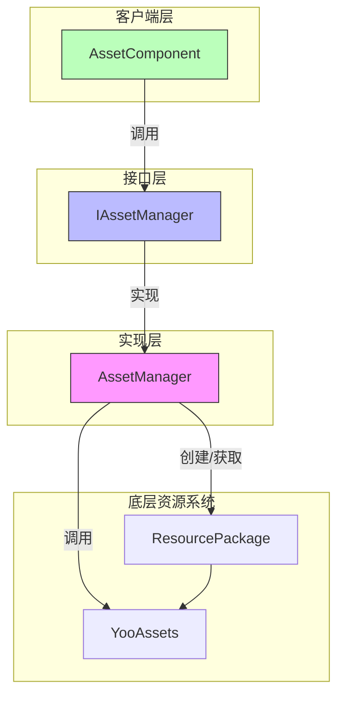
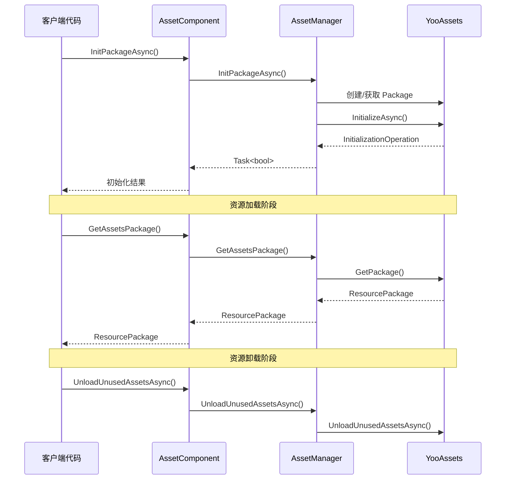

# リソースパッケージ管理

リソースパッケージ管理 API 提供します对リソースパッケージ（ResourcePackage）的完全なライフサイクル管理能力，含みますパッケージ的作成、初期化、取得、アンロード等操作。该モジュール基于 YooAssets 库ビルド，为 GameFrameX 提供します統一された且強力的リソースパッケージ管理機能。

## 概要

リソースパッケージ（ResourcePackage）是 GameFrameX リソースシステム中用于组织和管理リソース的コアコンセプト。每个リソースパッケージ代表一个独立的リソース集合，〜できます拥有自己的下载地址、初期化方法和リソースロード规则。通过リソースパッケージ管理 API，開発者〜できます：

- 作成多个独立的リソースパッケージ以実装リソース的モジュール化管理
- 为每个リソースパッケージ設定不同的远程服务器地址
- 設定デフォルトリソースパッケージ以簡素化ロードインターフェース的使用
- 柔軟地控制リソース的ロード和アンロード时机

系统サポート同時に管理多个リソースパッケージ，但同一时间只能設定一个デフォルトパッケージ。デフォルトパッケージ〜できます使用簡素化的ロードインターフェース，无需显式指定パッケージ名。

> 注意：デフォルトリソースパッケージ名称为 `DefaultPackage`，定義在 `AssetManager.ConstDefaultPackageName` 常量中。

## アーキテクチャ

リソースパッケージ管理的アーキテクチャ采用了典型的分层設計モード，通过インターフェース抽象実装了底层 YooAssets 的カプセル化：



**コンポーネント説明：**

| コンポーネント | 职责 |
|------|------|
| AssetComponent | Unity コンポーネント層，提供公开的 API インターフェース |
| IAssetManager | 定義リソース管理的抽象インターフェース |
| AssetManager | 具体実装类，负责与 YooAssets 交互 |
| ResourcePackage | YooAssets 的リソースパッケージ对象 |

## コア機能

### リソースパッケージ初期化

リソースパッケージ在使用前〜しなければなりません先进行初期化。初期化过程会根据运行モード（PlayMode）設定不同的ファイル系统，并连接到远程服务器（もし〜する必要があります）。

#### 异步初期化リソースパッケージ

```csharp
public async Task<bool> InitPackageAsync(string packageName, string host, string fallbackHostServer, bool isDefaultPackage = false)
```

> Source: [AssetComponent.cs](https://github.com/GameFrameX/com.gameframex.unity.asset/blob/main/Runtime/Asset/AssetComponent.cs#L80-L95)

**パラメータ説明：**
- `packageName` (string): リソースパッケージ名称，用于标识和取得该リソースパッケージ
- `host` (string): 主下载地址，用于下载リモートリソース
- `fallbackHostServer` (string): 备用下载地址，当主地址不可用时使用
- `isDefaultPackage` (bool): 是否設定为デフォルトパッケージ，デフォルト为 false

**戻り値：** 
- `Task<bool>`: 初期化是否成功

**使用例：**

```csharp
var assetComponent = GameEntry.GetComponent<AssetComponent>();
bool success = await assetComponent.InitPackageAsync(
    "MyPackage", 
    "https://cdn.example.com/assets", 
    "https://backup.example.com/assets", 
    true
);
```

初期化过程会根据当前設定的运行モード（EPlayMode）选择不同的初期化策略：

- **EditorSimulateMode**: エディタ模拟モード，使用エディタ内的模拟リソース
- **OfflinePlayMode**: 单机运行モード，仅使用内蔵リソース
- **HostPlayMode**: 联机运行モード，サポートリモートリソース下载和ホットアップデート
- **WebPlayMode**: WebGL 运行モード，针对 Web プラットフォーム最適化

> 运行モード的詳細説明请参照 [运行モード](./6-configuration.play-modes) ドキュメント。

### リソースパッケージ作成与取得

#### 作成リソースパッケージ

```csharp
public ResourcePackage CreateAssetsPackage(string packageName)
```

> Source: [AssetComponent.cs](https://github.com/GameFrameX/com.gameframex.unity.asset/blob/main/Runtime/Asset/AssetComponent.cs#L471-L474)

作成一个新的リソースパッケージ。もしパッケージ已存在，则返す已存在的パッケージインスタンス。

**パラメータ：**
- `packageName` (string): リソースパッケージ名称

**戻り値：**
- ResourcePackage: 作成的リソースパッケージ对象

#### 尝试取得リソースパッケージ

```csharp
public ResourcePackage TryGetAssetsPackage(string packageName)
```

> Source: [AssetComponent.cs](https://github.com/GameFrameX/com.gameframex.unity.asset/blob/main/Runtime/Asset/AssetComponent.cs#L482-L485)

安全取得リソースパッケージ，もしパッケージ不存在则返す null 而不会抛出例外。

**パラメータ：**
- `packageName` (string): リソースパッケージ名称

**戻り値：**
- ResourcePackage: リソースパッケージ对象，もし不存在则返す null

#### 確認リソースパッケージ是否存在

```csharp
public bool HasAssetsPackage(string packageName)
```

> Source: [AssetComponent.cs](https://github.com/GameFrameX/com.gameframex.unity.asset/blob/main/Runtime/Asset/AssetComponent.cs#L493-L496)

確認指定名称的リソースパッケージ是否已作成。

**パラメータ：**
- `packageName` (string): リソースパッケージ名称

**戻り値：**
- bool: 是否存在

#### 取得リソースパッケージ

```csharp
public ResourcePackage GetAssetsPackage(string packageName)
```

> Source: [AssetComponent.cs](https://github.com/GameFrameX/com.gameframex.unity.asset/blob/main/Runtime/Asset/AssetComponent.cs#L504-L507)

取得指定名称的リソースパッケージ。もしパッケージ不存在，将抛出例外。

**パラメータ：**
- `packageName` (string): リソースパッケージ名称

**戻り値：**
- ResourcePackage: リソースパッケージ对象

### デフォルトリソースパッケージ

#### 設定デフォルトリソースパッケージ

```csharp
public void SetDefaultAssetsPackage(ResourcePackage assetsPackage)
```

> Source: [AssetComponent.cs](https://github.com/GameFrameX/com.gameframex.unity.asset/blob/main/Runtime/Asset/AssetComponent.cs#L581-L584)

設定デフォルトリソースパッケージ。設定后，ロードリソース时无需显式指定パッケージ名，系统会自动从デフォルトパッケージ中ロード。

**パラメータ：**
- `assetsPackage` (ResourcePackage): 要設定为デフォルト的リソースパッケージ

**使用例：**

```csharp
var assetComponent = GameEntry.GetComponent<AssetComponent>();
var package = assetComponent.GetAssetsPackage("MyPackage");
assetComponent.SetDefaultAssetsPackage(package);
// 之后可以使用简化的加载接口
var handle = await assetComponent.LoadAssetAsync("Prefabs/Player");
```

## リソースのアンロード与清理

GameFrameX 提供します多层次的リソースアンロード和清理机制，以满足不同シーン的需求。

### アンロード单个リソース

```csharp
public void UnloadAsset(string assetPath)
public void UnloadAsset(string packageName, string assetPath)
```

> Source: [AssetComponent.cs](https://github.com/GameFrameX/com.gameframex.unity.asset/blob/main/Runtime/Asset/AssetComponent.cs#L602-L615)

アンロード指定路径的リソース。

**パラメータ：**
- `packageName` (string): リソースパッケージ名称（可选，不指定则使用デフォルトパッケージ）
- `assetPath` (string): リソースパス

### 强制回收所有リソース

```csharp
public void UnloadAllAssetsAsync(string packageName)
```

> Source: [AssetComponent.cs](https://github.com/GameFrameX/com.gameframex.unity.asset/blob/main/Runtime/Asset/AssetComponent.cs#L591-L594)

强制回收指定リソースパッケージ中的所有已ロードリソース。此操作会立つまり解放所有リソース内存，应谨慎使用。

**パラメータ：**
- `packageName` (string): リソースパッケージ名称

### アンロード无用リソース

```csharp
public void UnloadUnusedAssetsAsync(string packageName = null)
```

> Source: [AssetComponent.cs](https://github.com/GameFrameX/com.gameframex.unity.asset/blob/main/Runtime/Asset/AssetComponent.cs#L635-L638)

アンロード未被参照的リソース。这是推奨使用的リソース解放方法，系统会自动识别并解放不再使用的リソース。

**パラメータ：**
- `packageName` (string): リソースパッケージ名称，为 null 时清理デフォルトパッケージ

### 清理リソースファイル

```csharp
public void ClearAllBundleFilesAsync(string packageName = null)
public void ClearUnusedBundleFilesAsync(string packageName = null)
```

> Source: [AssetComponent.cs](https://github.com/GameFrameX/com.gameframex.unity.asset/blob/main/Runtime/Asset/AssetComponent.cs#L645-L658)

清理本地缓存的リソースパッケージファイル。

- `ClearAllBundleFilesAsync`: 清理所有リソースファイル
- `ClearUnusedBundleFilesAsync`: 仅清理未被使用的リソースファイル

**パラメータ：**
- `packageName` (string): リソースパッケージ名称，为 null 时清理デフォルトパッケージ

## 使用フロー

以下是多リソースパッケージシーン的典型使用フロー：



## 典型使用シーン

### シーン一：DLC リソースパッケージ管理

在游戏リリース后〜する必要があります动态ロード额外的 DLC 内容时，〜できます使用独立的リソースパッケージ：

```csharp
var assetComponent = GameEntry.GetComponent<AssetComponent>();

// 初始化 DLC 资源包
await assetComponent.InitPackageAsync(
    "DLC_LevelPack1",
    "https://cdn.example.com/dlc/levelpack1",
    "https://backup.example.com/dlc/levelpack1"
);

// 获取 DLC 包并加载资源
var dlcPackage = assetComponent.GetAssetsPackage("DLC_LevelPack1");
assetComponent.SetDefaultAssetsPackage(dlcPackage);

var levelHandle = await assetComponent.LoadAssetAsync<Scene>("Levels/Level01");
```

### シーン二：リソースホットアップデート

使用联机モード时，リソースパッケージ用于管理ホットアップデートリソース：

```csharp
var assetComponent = GameEntry.GetComponent<AssetComponent>();

// 初始化默认包（用于热更新）
bool success = await assetComponent.InitPackageAsync(
    "HotUpdate",
    "https://gamecdn.example.com/hotupdate",
    "https://backup.example.com/hotupdate",
    true
);

if (success)
{
    Debug.Log("热更新资源包初始化成功");
}
```

### シーン三：リソース清理

在切换游戏シーン或进入特定フロー时清理不〜する必要があります的リソース：

```csharp
var assetComponent = GameEntry.GetComponent<AssetComponent>();

// 卸载未使用的资源（推荐）
assetComponent.UnloadUnusedAssetsAsync();

// 或者清理特定资源包的所有缓存
assetComponent.ClearUnusedBundleFilesAsync("OldDLC");
```

## API リファレンス

### AssetComponent

| メソッド | 返すタイプ | 説明 |
|------|----------|------|
| InitPackageAsync | Task\<bool\> | 异步初期化リソースパッケージ |
| CreateAssetsPackage | ResourcePackage | 作成リソースパッケージ |
| TryGetAssetsPackage | ResourcePackage | 尝试取得リソースパッケージ（安全） |
| HasAssetsPackage | bool | 確認リソースパッケージ是否存在 |
| GetAssetsPackage | ResourcePackage | 取得リソースパッケージ |
| SetDefaultAssetsPackage | void | 設定デフォルトリソースパッケージ |
| UnloadAsset | void | アンロード指定リソース |
| UnloadAllAssetsAsync | void | 强制回收所有リソース |
| UnloadUnusedAssetsAsync | void | アンロード无用リソース |
| ClearAllBundleFilesAsync | void | 清理所有リソースファイル |
| ClearUnusedBundleFilesAsync | void | 清理无用リソースファイル |

### IAssetManager

| プロパティ | タイプ | 説明 |
|------|------|------|
| DefaultPackageName | string | デフォルトリソースパッケージ名称 |
| PlayMode | EPlayMode | 当前运行モード |
| VerifyLevel | EFileVerifyLevel | ファイル検証等级 |
| Milliseconds | long | 异步系统时间片 |

> 完全な的インターフェース定義请参照 [IAssetManager.cs](https://github.com/GameFrameX/com.gameframex.unity.asset/blob/main/Runtime/Asset/IAssetManager.cs)

## 関連リンク

- [リソースロードインターフェース](./5-api-reference.loading-api) - 理解する如何在パッケージ中ロードリソース
- [运行モード](./6-configuration.play-modes) - 理解する不同的运行モード設定
- [リソースコンポーネント](./4-core-concepts.asset-component) - 理解する AssetComponent コンポーネント
- [アーキテクチャ設計](./4-core-concepts.architecture) - 理解する整体アーキテクチャ設計
