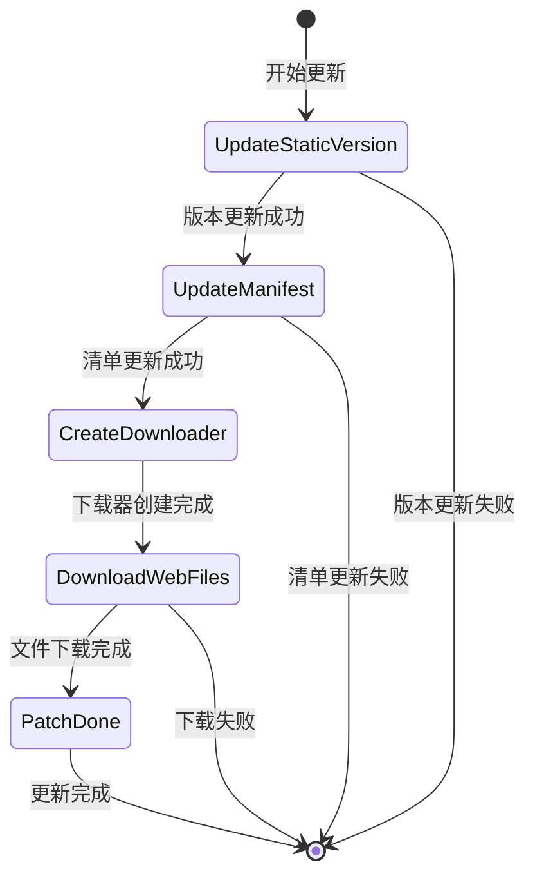

# アップデートイベント

リソースシステム提供的アップデートイベント机制，允许開発者在リソースホットアップデート过程中监听关键节点并执行自定義逻辑。

## 概要

在リソースホットアップデートフロー中，系统会トリガー多种イベント来通知当前アップデート的進捗和ステータス。这些イベント基于 GameFrameX 的イベント系统ビルド，遵循リリース-購読モード。開発者〜できます通过購読这些イベント来実装：
- 显示アップデート進捗 UI
- 统计下载数据
- 処理アップデート失敗情况
- 执行自定義业务逻辑

所有アップデートイベント都継承自 `GameEventArgs` 基底クラス，每个イベント具有唯一的イベント ID（EventId），用于イベント購読和分发。

## イベント体系アーキテクチャ


## アップデートフローステータス

アップデートフロー由 `EPatchStates` 列挙型定義，パッケージ含以下五个ステータス：



| ステータス | 説明 |
|------|------|
| UpdateStaticVersion | アップデート静态リソースバージョン号 |
| UpdateManifest | アップデート补丁清单ファイル |
| CreateDownloader | 作成下载器 |
| DownloadWebFiles | 下载远程ファイル |
| PatchDone | 补丁フロー完毕 |

## イベント詳細説明

### 下载進捗アップデートイベント (AssetDownloadProgressUpdateEventArgs)

在リソース下载过程中实时トリガー，用于报告当前下载進捗。

> Source: [Runtime/Update/EventArgs/AssetDownloadProgressUpdateEventArgs.cs](https://github.com/GameFrameX/com.gameframex.unity.asset/blob/main/Runtime/Update/EventArgs/AssetDownloadProgressUpdateEventArgs.cs#L1-L77)

**イベントID:**
```csharp
public static readonly string EventId = typeof(AssetDownloadProgressUpdateEventArgs).FullName;
```

**プロパティ説明:**

| プロパティ | タイプ | 説明 |
|------|------|------|
| PackageName | string | リソースパッケージ名称 |
| TotalDownloadCount | int | 总下载数量 |
| CurrentDownloadCount | int | 当前已下载数量 |
| TotalDownloadSizeBytes | long | 总下载大小（字节） |
| CurrentDownloadSizeBytes | long | 当前已下载大小（字节） |

**作成メソッド:**
```csharp
public static AssetDownloadProgressUpdateEventArgs Create(
    string packageName, 
    int totalDownloadCount, 
    int currentDownloadCount, 
    long totalDownloadSizeBytes, 
    long currentDownloadSizeBytes)
```

### 发现アップデートファイルイベント (AssetFoundUpdateFilesEventArgs)

当系统扫描并发现〜する必要がありますアップデート的ファイル时トリガー，携带待アップデートファイル的统计情報。

> Source: [Runtime/Update/EventArgs/AssetFoundUpdateFilesEventArgs.cs](https://github.com/GameFrameX/com.gameframex.unity.asset/blob/main/Runtime/Update/EventArgs/AssetFoundUpdateFilesEventArgs.cs#L1-L60)

**イベントID:**
```csharp
public static readonly string EventId = typeof(AssetFoundUpdateFilesEventArgs).FullName;
```

**プロパティ説明:**

| プロパティ | タイプ | 説明 |
|------|------|------|
| PackageName | string | リソースパッケージ名称 |
| TotalCount | int | 〜する必要がありますアップデート的ファイル总数量 |
| TotalSizeBytes | long | 〜する必要がありますアップデート的ファイル总大小（字节） |

**作成メソッド:**
```csharp
public static AssetFoundUpdateFilesEventArgs Create(
    string packageName, 
    int totalCount, 
    long totalSizeBytes)
```

### 补丁フローステータス变更イベント (AssetPatchStatesChangeEventArgs)

当リソースアップデートフロー进入新的ステータスフェーズ时トリガー，用于通知当前アップデート進捗。

> Source: [Runtime/Update/EventArgs/AssetPatchStatesChangeEventArgs.cs](https://github.com/GameFrameX/com.gameframex.unity.asset/blob/main/Runtime/Update/EventArgs/AssetPatchStatesChangeEventArgs.cs#L1-L49)

**イベントID:**
```csharp
public static readonly string EventId = typeof(AssetPatchStatesChangeEventArgs).FullName;
```

**プロパティ説明:**

| プロパティ | タイプ | 説明 |
|------|------|------|
| PackageName | string | リソースパッケージ名称 |
| CurrentStates | EPatchStates | 当前アップデートステータス |

**作成メソッド:**
```csharp
public static AssetPatchStatesChangeEventArgs Create(
    string packageName, 
    EPatchStates currentStates)
```

### 补丁清单アップデート失敗イベント (AssetPatchManifestUpdateFailedEventArgs)

当补丁清单ファイルアップデート失敗时トリガー，パッケージ含エラー情報。

> Source: [Runtime/Update/EventArgs/AssetPatchManifestUpdateFailedEventArgs.cs](https://github.com/GameFrameX/com.gameframex.unity.asset/blob/main/Runtime/Update/EventArgs/AssetPatchManifestUpdateFailedEventArgs.cs#L1-L52)

**イベントID:**
```csharp
public static readonly string EventId = typeof(AssetPatchManifestUpdateFailedEventArgs).FullName;
```

**プロパティ説明:**

| プロパティ | タイプ | 説明 |
|------|------|------|
| PackageName | string | リソースパッケージ名称 |
| Error | string | エラー情報 |

**作成メソッド:**
```csharp
public static AssetPatchManifestUpdateFailedEventArgs Create(
    string packageName, 
    string error)
```

### リソースバージョン号アップデート失敗イベント (AssetStaticVersionUpdateFailedEventArgs)

当リソースバージョン号アップデート失敗时トリガー，パッケージ含エラー情報。

> Source: [Runtime/Update/EventArgs/AssetStaticVersionUpdateFailedEventArgs.cs](https://github.com/GameFrameX/com.gameframex.unity.asset/blob/main/Runtime/Update/EventArgs/AssetStaticVersionUpdateFailedEventArgs.cs#L1-L52)

**イベントID:**
```csharp
public static readonly string EventId = typeof(AssetStaticVersionUpdateFailedEventArgs).FullName;
```

**プロパティ説明:**

| プロパティ | タイプ | 説明 |
|------|------|------|
| PackageName | string | リソースパッケージ名称 |
| Error | string | エラー情報 |

**作成メソッド:**
```csharp
public static AssetStaticVersionUpdateFailedEventArgs Create(
    string packageName, 
    string error)
```

### 网络ファイル下载失敗イベント (AssetWebFileDownloadFailedEventArgs)

当某个リソースファイル下载失敗时トリガー，パッケージ含ファイル名和エラー情報。

> Source: [Runtime/Update/EventArgs/AssetWebFileDownloadFailedEventArgs.cs](https://github.com/GameFrameX/com.gameframex.unity.asset/blob/main/Runtime/Update/EventArgs/AssetWebFileDownloadFailedEventArgs.cs#L1-L60)

**イベントID:**
```csharp
public static readonly string EventId = typeof(AssetWebFileDownloadFailedEventArgs).FullName;
```

**プロパティ説明:**

| プロパティ | タイプ | 説明 |
|------|------|------|
| PackageName | string | リソースパッケージ名称 |
| FileName | string | 下载失敗的ファイル名 |
| Error | string | エラー情報 |

**作成メソッド:**
```csharp
public static AssetWebFileDownloadFailedEventArgs Create(
    string packageName, 
    string fileName, 
    string error)
```

## 使用例

### 購読アップデートステータス变化イベント

```csharp
// 订阅补丁流程状态变更事件
GameEntry.Event.Subscribe(AssetPatchStatesChangeEventArgs.EventId, OnPatchStatesChange);

private void OnPatchStatesChange(object sender, AssetPatchStatesChangeEventArgs e)
{
    switch (e.CurrentStates)
    {
        case EPatchStates.UpdateStaticVersion:
            Debug.Log("正在更新资源版本号...");
            break;
        case EPatchStates.UpdateManifest:
            Debug.Log("正在更新补丁清单...");
            break;
        case EPatchStates.CreateDownloader:
            Debug.Log("正在创建下载器...");
            break;
        case EPatchStates.DownloadWebFiles:
            Debug.Log("正在下载远程文件...");
            break;
        case EPatchStates.PatchDone:
            Debug.Log("更新完成！");
            break;
    }
}
```

> Source: [Runtime/Update/EventArgs/AssetPatchStatesChangeEventArgs.cs](https://github.com/GameFrameX/com.gameframex.unity.asset/blob/main/Runtime/Update/EventArgs/AssetPatchStatesChangeEventArgs.cs#L35-L47)

### 購読下载進捗アップデートイベント

```csharp
// 订阅下载进度更新事件
GameEntry.Event.Subscribe(AssetDownloadProgressUpdateEventArgs.EventId, OnDownloadProgress);

private void OnDownloadProgress(object sender, AssetDownloadProgressUpdateEventArgs e)
{
    float progress = (float)e.CurrentDownloadCount / e.TotalDownloadCount;
    long downloadedSize = e.CurrentDownloadSizeBytes / 1024 / 1024; // MB
    long totalSize = e.TotalDownloadSizeBytes / 1024 / 1024; // MB
    
    Debug.Log($"下载进度: {progress * 100:F1}% ({e.CurrentDownloadCount}/{e.TotalDownloadCount}) - {downloadedSize}MB / {totalSize}MB");
}
```

> Source: [Runtime/Update/EventArgs/AssetDownloadProgressUpdateEventArgs.cs](https://github.com/GameFrameX/com.gameframex.unity.asset/blob/main/Runtime/Update/EventArgs/AssetDownloadProgressUpdateEventArgs.cs#L60-L75)

### 購読发现アップデートファイルイベント

```csharp
// 订阅发现更新文件事件
GameEntry.Event.Subscribe(AssetFoundUpdateFilesEventArgs.EventId, OnFoundUpdateFiles);

private void OnFoundUpdateFiles(object sender, AssetFoundUpdateFilesEventArgs e)
{
    long totalSizeMB = e.TotalSizeBytes / 1024 / 1024;
    Debug.Log($"发现 {e.TotalCount} 个需要更新的文件，总大小: {totalSizeMB}MB");
}
```

> Source: [Runtime/Update/EventArgs/AssetFoundUpdateFilesEventArgs.cs](https://github.com/GameFrameX/com.gameframex.unity.asset/blob/main/Runtime/Update/EventArgs/AssetFoundUpdateFilesEventArgs.cs#L44-L58)

### 購読エラーイベント

```csharp
// 订阅版本号更新失败事件
GameEntry.Event.Subscribe(AssetStaticVersionUpdateFailedEventArgs.EventId, OnStaticVersionUpdateFailed);

// 订阅清单更新失败事件
GameEntry.Event.Subscribe(AssetPatchManifestUpdateFailedEventArgs.EventId, OnManifestUpdateFailed);

// 订阅文件下载失败事件
GameEntry.Event.Subscribe(AssetWebFileDownloadFailedEventArgs.EventId, OnFileDownloadFailed);

private void OnStaticVersionUpdateFailed(object sender, AssetStaticVersionUpdateFailedEventArgs e)
{
    Debug.LogError($"资源版本号更新失败: {e.Error}");
    // 可以在这里显示错误提示或执行重试逻辑
}

private void OnManifestUpdateFailed(object sender, AssetPatchManifestUpdateFailedEventArgs e)
{
    Debug.LogError($"补丁清单更新失败: {e.Error}");
}

private void OnFileDownloadFailed(object sender, AssetWebFileDownloadFailedEventArgs e)
{
    Debug.LogError($"文件下载失败: {e.FileName}, 错误: {e.Error}");
}
```

> Sources:
> - [Runtime/Update/EventArgs/AssetStaticVersionUpdateFailedEventArgs.cs](https://github.com/GameFrameX/com.gameframex.unity.asset/blob/main/Runtime/Update/EventArgs/AssetStaticVersionUpdateFailedEventArgs.cs#L38-L50)
> - [Runtime/Update/EventArgs/AssetPatchManifestUpdateFailedEventArgs.cs](https://github.com/GameFrameX/com.gameframex.unity.asset/blob/main/Runtime/Update/EventArgs/AssetPatchManifestUpdateFailedEventArgs.cs#L38-L50)
> - [Runtime/Update/EventArgs/AssetWebFileDownloadFailedEventArgs.cs](https://github.com/GameFrameX/com.gameframex.unity.asset/blob/main/Runtime/Update/EventArgs/AssetWebFileDownloadFailedEventArgs.cs#L44-L58)

## イベント使用注意事项

1. **イベント購読时机**：お勧め在游戏启动时或リソースシステム初期化前購読イベント，確認してください不会遗漏任何アップデートイベント。

2. **イベント取消購読**：在合适的时机（如シーン切换或コンポーネント破棄）取消イベント購読，避免内存泄漏。

3. **对象池机制**：所有イベントパラメータ类都実装了对象池モード，使用 `Create` メソッド从池中取得インスタンス，使用后会自动回收。開発者无需手动管理其ライフサイクル。

4. **エラー処理**：强烈お勧め購読エラータイプ的イベント，以便在アップデート失敗时能够及时感知并做出相应処理（如ヒントユーザー重试）。

5. **進捗计算**：`AssetDownloadProgressUpdateEventArgs` 提供します字节级别的下载進捗，可用于実装精细的下载進捗显示。

## 関連リンク

- [リソースロードインターフェース](./5-api-reference.loading-api)
- [リソースパッケージ管理](./5-api-reference.package-management)
- [运行モード](./6-configuration.play-modes)
- [コアコンセプト - リソースマネージャー](./4-core-concepts.asset-manager)
