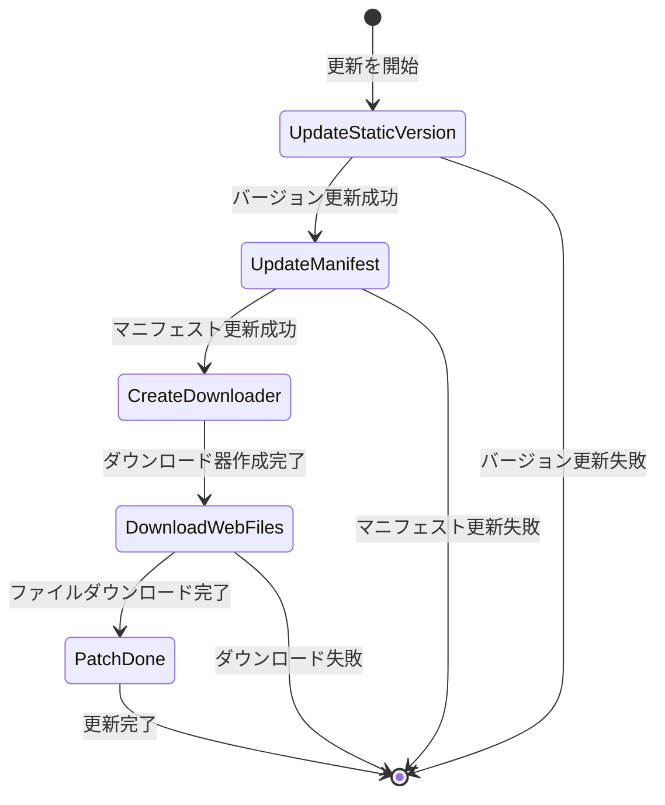

# 更新イベント

リソースシステムが提供する更新イベントメカニズムにより、開発者はリソース熱更新プロセス中に重要なノードを监听し、カスタムロジックを実行できます。

## 概要

リソース熱更新プロセスにおいて、システムは多样なイベントをトリガーして現在の更新の進捗とステータスを通知します。これらのイベント是基于 GameFrameX のイベントシステム構築されており、发布-購読パターンを遵循します。開発者はこれらのイベントを購読することで以下を実現できます：
- 更新進捗 UI を表示
- ダウンロードデータを統計
- 更新失敗状況を処理
- カスタム業務ロジックを実行

すべての更新イベント」は `GameEventArgs` 基底クラスを継承し、各イベントにはイベント購読と配布に使用される一意のイベント ID（EventId）があります。

## イベントシステムアーキテクチャ


## 更新フロー状態

更新フローは `EPatchStates` 列挙で定義され、以下の5つの状態が含まれています：



| 状態 | 説明 |
|------|------|
| UpdateStaticVersion | 静的なリソースバージョン番号を更新 |
| UpdateManifest | パッチマニフェストファイルを更新 |
| CreateDownloader | ダウンロード器を作成 |
| DownloadWebFiles | リモートファイルをダウンロード |
| PatchDone | パッチフローが完了 |

## イベントの詳細な説明

### ダウンロード進捗更新イベント (AssetDownloadProgressUpdateEventArgs)

リソースのダウンロード 중에リアルタイムでトリガーされ、現在のダウンロード進捗を報告するために使用されます。

> Source: [Runtime/Update/EventArgs/AssetDownloadProgressUpdateEventArgs.cs](https://github.com/GameFrameX/com.gameframex.unity.asset/blob/main/Runtime/Update/EventArgs/AssetDownloadProgressUpdateEventArgs.cs#L1-L77)

**イベントID:**
```csharp
public static readonly string EventId = typeof(AssetDownloadProgressUpdateEventArgs).FullName;
```

**プロパティ説明:**

| プロパティ | タイプ | 説明 |
|------|------|------|
| PackageName | string | リソースパッケージ名 |
| TotalDownloadCount | int | 総ダウンロード数 |
| CurrentDownloadCount | int | 現在のダウンロード完了数 |
| TotalDownloadSizeBytes | long | 総ダウンロードサイズ（バイト） |
| CurrentDownloadSizeBytes | long | 現在のダウンロードサイズ（バイト） |

**作成メソッド:**
```csharp
public static AssetDownloadProgressUpdateEventArgs Create(
    string packageName,
    int totalDownloadCount,
    int currentDownloadCount,
    long totalDownloadSizeBytes,
    long currentDownloadSizeBytes)
```

### 更新ファイル発見イベント (AssetFoundUpdateFilesEventArgs)

システムがスキャンして更新が必要なファイルを発見したときにトリガーされ、更新するファイルの統計情報を携带します。

> Source: [Runtime/Update/EventArgs/AssetFoundUpdateFilesEventArgs.cs](https://github.com/GameFrameX/com.gameframex.unity.asset/blob/main/Runtime/Update/EventArgs/AssetFoundUpdateFilesEventArgs.cs#L1-L60)

**イベントID:**
```csharp
public static readonly string EventId = typeof(AssetFoundUpdateFilesEventArgs).FullName;
```

**プロパティ説明:**

| プロパティ | タイプ | 説明 |
|------|------|------|
| PackageName | string | リソースパッケージ名 |
| TotalCount | int | 更新が必要なファイルの総数 |
| TotalSizeBytes | long | 更新が必要なファイルの総サイズ（バイト） |

**作成メソッド:**
```csharp
public static AssetFoundUpdateFilesEventArgs Create(
    string packageName,
    int totalCount,
    long totalSizeBytes)
```

### パッチフローステータス変更イベント (AssetPatchStatesChangeEventArgs)

リソース更新フローが新しい状態段階に進入したときにトリガーされ、現在の更新進捗を通知するために使用されます。

> Source: [Runtime/Update/EventArgs/AssetPatchStatesChangeEventArgs.cs](https://github.com/GameFrameX/com.gameframex.unity.asset/blob/main/Runtime/Update/EventArgs/AssetPatchStatesChangeEventArgs.cs#L1-L49)

**イベントID:**
```csharp
public static readonly string EventId = typeof(AssetPatchStatesChangeEventArgs).FullName;
```

**プロパティ説明:**

| プロパティ | タイプ | 説明 |
|------|------|------|
| PackageName | string | リソースパッケージ名 |
| CurrentStates | EPatchStates | 現在の更新状態 |

**作成メソッド:**
```csharp
public static AssetPatchStatesChangeEventArgs Create(
    string packageName,
    EPatchStates currentStates)
```

### パッチマニフェスト更新失敗イベント (AssetPatchManifestUpdateFailedEventArgs)

パッチマニフェストファイルの更新に失敗したときにトリガーされ、エラー情報を包含します。

> Source: [Runtime/Update/EventArgs/AssetPatchManifestUpdateFailedEventArgs.cs](https://github.com/GameFrameX/com.gameframex.unity.asset/blob/main/Runtime/Update/EventArgs/AssetPatchManifestUpdateFailedEventArgs.cs#L1-L52)

**イベントID:**
```csharp
public static readonly string EventId = typeof(AssetPatchManifestUpdateFailedEventArgs).FullName;
```

**プロパティ説明:**

| プロパティ | タイプ | 説明 |
|------|------|------|
| PackageName | string | リソースパッケージ名 |
| Error | string | エラー情報 |

**作成メソッド:**
```csharp
public static AssetPatchManifestUpdateFailedEventArgs Create(
    string packageName,
    string error)
```

### リソースバージョン番号更新失敗イベント (AssetStaticVersionUpdateFailedEventArgs)

リソースバージョン番号の更新に失敗したときにトリガーされ、エラー情報を包含します。

> Source: [Runtime/Update/EventArgs/AssetStaticVersionUpdateFailedEventArgs.cs](https://github.com/GameFrameX/com.gameframex.unity.asset/blob/main/Runtime/Update/EventArgs/AssetStaticVersionUpdateFailedEventArgs.cs#L1-L52)

**イベントID:**
```csharp
public static readonly string EventId = typeof(AssetStaticVersionUpdateFailedEventArgs).FullName;
```

**プロパティ説明:**

| プロパティ | タイプ | 説明 |
|------|------|------|
| PackageName | string | リソースパッケージ名 |
| Error | string | エラー情報 |

**作成メソッド:**
```csharp
public static AssetStaticVersionUpdateFailedEventArgs Create(
    string packageName,
    string error)
```

### ネットワークファイルダウンロード失敗イベント (AssetWebFileDownloadFailedEventArgs)

某一リソースファイルのダウンロードに失敗したときにトリガーされ、ファイル名とエラー情報を包含します。

> Source: [Runtime/Update/EventArgs/AssetWebFileDownloadFailedEventArgs.cs](https://github.com/GameFrameX/com.gameframex.unity.asset/blob/main/Runtime/Update/EventArgs/AssetWebFileDownloadFailedEventArgs.cs#L1-L60)

**イベントID:**
```csharp
public static readonly string EventId = typeof(AssetWebFileDownloadFailedEventArgs).FullName;
```

**プロパティ説明:**

| プロパティ | タイプ | 説明 |
|------|------|------|
| PackageName | string | リソースパッケージ名 |
| FileName | string | ダウンロードに失敗したファイル名 |
| Error | string | エラー情報 |

**作成メソッド:**
```csharp
public static AssetWebFileDownloadFailedEventArgs Create(
    string packageName,
    string fileName,
    string error)
```

## 使用例

### 更新状態変更イベントを購読

```csharp
// パッチフローステータス変更イベントを購読
GameEntry.Event.Subscribe(AssetPatchStatesChangeEventArgs.EventId, OnPatchStatesChange);

private void OnPatchStatesChange(object sender, AssetPatchStatesChangeEventArgs e)
{
    switch (e.CurrentStates)
    {
        case EPatchStates.UpdateStaticVersion:
            Debug.Log("リソースバージョン番号を更新中...");
            break;
        case EPatchStates.UpdateManifest:
            Debug.Log("パッチマニフェストを更新中...");
            break;
        case EPatchStates.CreateDownloader:
            Debug.Log("ダウンロード器を作成中...");
            break;
        case EPatchStates.DownloadWebFiles:
            Debug.Log("リモートファイルをダウンロード中...");
            break;
        case EPatchStates.PatchDone:
            Debug.Log("更新完了！");
            break;
    }
}
```

> Source: [Runtime/Update/EventArgs/AssetPatchStatesChangeEventArgs.cs](https://github.com/GameFrameX/com.gameframex.unity.asset/blob/main/Runtime/Update/EventArgs/AssetPatchStatesChangeEventArgs.cs#L35-L47)

### ダウンロード進捗更新イベントを購読

```csharp
// ダウンロード進捗更新イベントを購読
GameEntry.Event.Subscribe(AssetDownloadProgressUpdateEventArgs.EventId, OnDownloadProgress);

private void OnDownloadProgress(object sender, AssetDownloadProgressUpdateEventArgs e)
{
    float progress = (float)e.CurrentDownloadCount / e.TotalDownloadCount;
    long downloadedSize = e.CurrentDownloadSizeBytes / 1024 / 1024; // MB
    long totalSize = e.TotalDownloadSizeBytes / 1024 / 1024; // MB

    Debug.Log($"ダウンロード進捗: {progress * 100:F1}% ({e.CurrentDownloadCount}/{e.TotalDownloadCount}) - {downloadedSize}MB / {totalSize}MB");
}
```

> Source: [Runtime/Update/EventArgs/AssetDownloadProgressUpdateEventArgs.cs](https://github.com/GameFrameX/com.gameframex.unity.asset/blob/main/Runtime/Update/EventArgs/AssetDownloadProgressUpdateEventArgs.cs#L60-L75)

### 更新ファイル発見イベントを購読

```csharp
// 更新ファイル発見イベントを購読
GameEntry.Event.Subscribe(AssetFoundUpdateFilesEventArgs.EventId, OnFoundUpdateFiles);

private void OnFoundUpdateFiles(object sender, AssetFoundUpdateFilesEventArgs e)
{
    long totalSizeMB = e.TotalSizeBytes / 1024 / 1024;
    Debug.Log($" {e.TotalCount} 個の更新が必要なファイルを発見、總サイズ: {totalSizeMB}MB");
}
```

> Source: [Runtime/Update/EventArgs/AssetFoundUpdateFilesEventArgs.cs](https://github.com/GameFrameX/com.gameframex.unity.asset/blob/main/Runtime/Update/EventArgs/AssetFoundUpdateFilesEventArgs.cs#L44-L58)

### エラーイベントを購読

```csharp
// バージョン番号更新失敗イベントを購読
GameEntry.Event.Subscribe(AssetStaticVersionUpdateFailedEventArgs.EventId, OnStaticVersionUpdateFailed);

// マニフェスト更新失敗イベントを購読
GameEntry.Event.Subscribe(AssetPatchManifestUpdateFailedEventArgs.EventId, OnManifestUpdateFailed);

// ファイルダウンロード失敗イベントを購読
GameEntry.Event.Subscribe(AssetWebFileDownloadFailedEventArgs.EventId, OnFileDownloadFailed);

private void OnStaticVersionUpdateFailed(object sender, AssetStaticVersionUpdateFailedEventArgs e)
{
    Debug.LogError($"リソースバージョン番号の更新に失敗: {e.Error}");
    // ここにエラー表示または再試行ロジックを追加可能
}

private void OnManifestUpdateFailed(object sender, AssetPatchManifestUpdateFailedEventArgs e)
{
    Debug.LogError($"パッチマニフェストの更新に失敗: {e.Error}");
}

private void OnFileDownloadFailed(object sender, AssetWebFileDownloadFailedEventArgs e)
{
    Debug.LogError($"ファイルのダウンロードに失敗: {e.FileName}, エラー: {e.Error}");
}
```

> Sources:
> - [Runtime/Update/EventArgs/AssetStaticVersionUpdateFailedEventArgs.cs](https://github.com/GameFrameX/com.gameframex.unity.asset/blob/main/Runtime/Update/EventArgs/AssetStaticVersionUpdateFailedEventArgs.cs#L38-L50)
> - [Runtime/Update/EventArgs/AssetPatchManifestUpdateFailedEventArgs.cs](https://github.com/GameFrameX/com.gameframex.unity.asset/blob/main/Runtime/Update/EventArgs/AssetPatchManifestUpdateFailedEventArgs.cs#L38-L50)
> - [Runtime/Update/EventArgs/AssetWebFileDownloadFailedEventArgs.cs](https://github.com/GameFrameX/com.gameframex.unity.asset/blob/main/Runtime/Update/EventArgs/AssetWebFileDownloadFailedEventArgs.cs#L44-L58)

## イベント使用時の注意

1. **イベント購読タイミング**: ゲームの起動時またはリソースシステム初期化前にイベントを購読することをお勧めします，确保不会遗漏任何更新イベント。

2. **イベント購読解除**: 適切なタイミング（シーン切り替えまたはコンポーネント破棄など）でイベント購読を解除し、メモリーリークを避けます。

3. **オブジェクトプールメカニズム**: すべてのイベントパラメータクラスはオブジェクトプールパターンを実装しており、`Create` メソッドを使用してプールからインスタンスを取得し、使用後に自動的に回収されます。開発者はそのライフサイクルを手動で管理する必要はありません。

4. **エラー処理**: 更新失敗時に感知하여適切に处理できるように、エラータイプのイベントを購読することを強く推奨します（ユーザーに再試行を提示するなどの処理）。

5. **進捗計算**: `AssetDownloadProgressUpdateEventArgs` はバイトレベルのダウンロード進捗を提供しており、精細なダウンロード進捗表示の実装に使用できます。

## 関連リンク

- [リソースロードインターフェース](./5-api-reference.loading-api)
- [リソースパッケージ管理](./5-api-reference.package-management)
- [実行モード](./6-configuration.play-modes)
- [コアコンセプト - リソースマネージャー](./4-core-concepts.asset-manager)