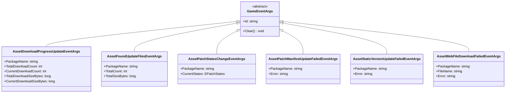
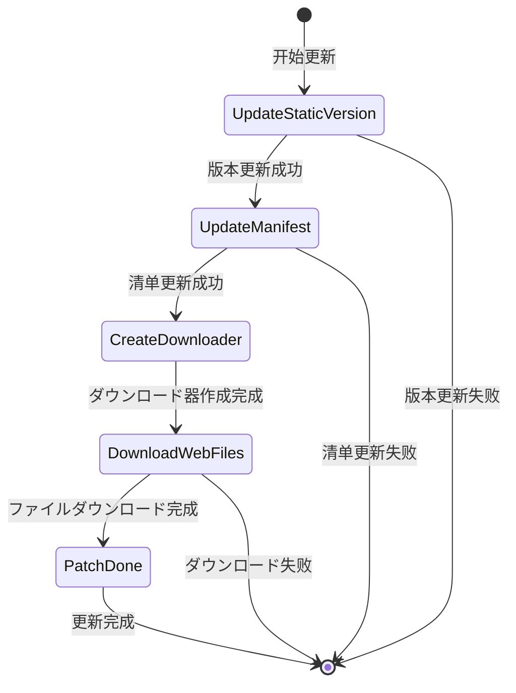

# 更新イベント

リソース系统提供的更新イベント机制，允许開発者在リソースホットアップデート过程中监听关键节点并执行自定义逻辑。

## 概要

在リソースホットアップデートフロー中，系统会触发多种イベント来通知当前更新的进度和ステータス。这些イベント基づく GameFrameX 的イベント系统构建，遵循发布-订阅模式。開発者可能を通じて订阅这些イベント来実装：
- 显示更新进度 UI
- 统计ダウンロード数据
- 处理更新失败情况
- 执行自定义业务逻辑

所有更新イベント都を継承 `GameEventArgs` 基クラス，每个イベント具有唯一的イベント ID（EventId），に使用イベント订阅和分发。

## イベント体系架构



## 更新フローステータス

更新フロー由 `EPatchStates` 枚举定义，包含以下五个ステータス：



| ステータス | 説明 |
|------|------|
| UpdateStaticVersion | 更新静态リソース版本号 |
| UpdateManifest | 更新补丁清单ファイル |
| CreateDownloader | 作成ダウンロード器 |
| DownloadWebFiles | ダウンロード远程ファイル |
| PatchDone | 补丁フロー完毕 |

## イベント詳細説明

### ダウンロード进度更新イベント (AssetDownloadProgressUpdateEventArgs)

在リソースダウンロード过程中实时触发，に使用报告当前ダウンロード进度。

> Source: [Runtime/Update/EventArgs/AssetDownloadProgressUpdateEventArgs.cs](https://github.com/GameFrameX/com.gameframex.unity.asset/blob/main/Runtime/Update/EventArgs/AssetDownloadProgressUpdateEventArgs.cs#L1-L77)

**イベントID:**
```csharp
public static readonly string EventId = typeof(AssetDownloadProgressUpdateEventArgs).FullName;
```

**プロパティ説明:**

| プロパティ | クラス型 | 説明 |
|------|------|------|
| PackageName | string | リソース包名称 |
| TotalDownloadCount | int | 总ダウンロード数量 |
| CurrentDownloadCount | int | 当前已ダウンロード数量 |
| TotalDownloadSizeBytes | long | 总ダウンロード大小（字节） |
| CurrentDownloadSizeBytes | long | 当前已ダウンロード大小（字节） |

**作成メソッド:**
```csharp
public static AssetDownloadProgressUpdateEventArgs Create(
    string packageName, 
    int totalDownloadCount, 
    int currentDownloadCount, 
    long totalDownloadSizeBytes, 
    long currentDownloadSizeBytes)
```

### 发现更新ファイルイベント (AssetFoundUpdateFilesEventArgs)

当系统扫描并发现必要更新的ファイル时触发，携带待更新ファイル的统计信息。

> Source: [Runtime/Update/EventArgs/AssetFoundUpdateFilesEventArgs.cs](https://github.com/GameFrameX/com.gameframex.unity.asset/blob/main/Runtime/Update/EventArgs/AssetFoundUpdateFilesEventArgs.cs#L1-L60)

**イベントID:**
```csharp
public static readonly string EventId = typeof(AssetFoundUpdateFilesEventArgs).FullName;
```

**プロパティ説明:**

| プロパティ | クラス型 | 説明 |
|------|------|------|
| PackageName | string | リソース包名称 |
| TotalCount | int | 必要更新的ファイル总数量 |
| TotalSizeBytes | long | 必要更新的ファイル总大小（字节） |

**作成メソッド:**
```csharp
public static AssetFoundUpdateFilesEventArgs Create(
    string packageName, 
    int totalCount, 
    long totalSizeBytes)
```

### 补丁フローステータス变更イベント (AssetPatchStatesChangeEventArgs)

当リソース更新フロー进入新的ステータス阶段时触发，に使用通知当前更新进度。

> Source: [Runtime/Update/EventArgs/AssetPatchStatesChangeEventArgs.cs](https://github.com/GameFrameX/com.gameframex.unity.asset/blob/main/Runtime/Update/EventArgs/AssetPatchStatesChangeEventArgs.cs#L1-L49)

**イベントID:**
```csharp
public static readonly string EventId = typeof(AssetPatchStatesChangeEventArgs).FullName;
```

**プロパティ説明:**

| プロパティ | クラス型 | 説明 |
|------|------|------|
| PackageName | string | リソース包名称 |
| CurrentStates | EPatchStates | 当前更新ステータス |

**作成メソッド:**
```csharp
public static AssetPatchStatesChangeEventArgs Create(
    string packageName, 
    EPatchStates currentStates)
```

### 补丁清单更新失败イベント (AssetPatchManifestUpdateFailedEventArgs)

当补丁清单ファイル更新失败时触发，包含错误信息。

> Source: [Runtime/Update/EventArgs/AssetPatchManifestUpdateFailedEventArgs.cs](https://github.com/GameFrameX/com.gameframex.unity.asset/blob/main/Runtime/Update/EventArgs/AssetPatchManifestUpdateFailedEventArgs.cs#L1-L52)

**イベントID:**
```csharp
public static readonly string EventId = typeof(AssetPatchManifestUpdateFailedEventArgs).FullName;
```

**プロパティ説明:**

| プロパティ | クラス型 | 説明 |
|------|------|------|
| PackageName | string | リソース包名称 |
| Error | string | 错误信息 |

**作成メソッド:**
```csharp
public static AssetPatchManifestUpdateFailedEventArgs Create(
    string packageName, 
    string error)
```

### リソース版本号更新失败イベント (AssetStaticVersionUpdateFailedEventArgs)

当リソース版本号更新失败时触发，包含错误信息。

> Source: [Runtime/Update/EventArgs/AssetStaticVersionUpdateFailedEventArgs.cs](https://github.com/GameFrameX/com.gameframex.unity.asset/blob/main/Runtime/Update/EventArgs/AssetStaticVersionUpdateFailedEventArgs.cs#L1-L52)

**イベントID:**
```csharp
public static readonly string EventId = typeof(AssetStaticVersionUpdateFailedEventArgs).FullName;
```

**プロパティ説明:**

| プロパティ | クラス型 | 説明 |
|------|------|------|
| PackageName | string | リソース包名称 |
| Error | string | 错误信息 |

**作成メソッド:**
```csharp
public static AssetStaticVersionUpdateFailedEventArgs Create(
    string packageName, 
    string error)
```

### 网络ファイルダウンロード失败イベント (AssetWebFileDownloadFailedEventArgs)

当某个リソースファイルダウンロード失败时触发，包含ファイル名和错误信息。

> Source: [Runtime/Update/EventArgs/AssetWebFileDownloadFailedEventArgs.cs](https://github.com/GameFrameX/com.gameframex.unity.asset/blob/main/Runtime/Update/EventArgs/AssetWebFileDownloadFailedEventArgs.cs#L1-L60)

**イベントID:**
```csharp
public static readonly string EventId = typeof(AssetWebFileDownloadFailedEventArgs).FullName;
```

**プロパティ説明:**

| プロパティ | クラス型 | 説明 |
|------|------|------|
| PackageName | string | リソース包名称 |
| FileName | string | ダウンロード失败的ファイル名 |
| Error | string | 错误信息 |

**作成メソッド:**
```csharp
public static AssetWebFileDownloadFailedEventArgs Create(
    string packageName, 
    string fileName, 
    string error)
```

## 使用例

### 订阅更新ステータス变化イベント

```csharp
// 订阅补丁フローステータス变更イベント
GameEntry.Event.Subscribe(AssetPatchStatesChangeEventArgs.EventId, OnPatchStatesChange);

private void OnPatchStatesChange(object sender, AssetPatchStatesChangeEventArgs e)
{
    switch (e.CurrentStates)
    {
        case EPatchStates.UpdateStaticVersion:
            Debug.Log("正在更新リソース版本号...");
            break;
        case EPatchStates.UpdateManifest:
            Debug.Log("正在更新补丁清单...");
            break;
        case EPatchStates.CreateDownloader:
            Debug.Log("正在作成ダウンロード器...");
            break;
        case EPatchStates.DownloadWebFiles:
            Debug.Log("正在ダウンロード远程ファイル...");
            break;
        case EPatchStates.PatchDone:
            Debug.Log("更新完成！");
            break;
    }
}
```

> Source: [Runtime/Update/EventArgs/AssetPatchStatesChangeEventArgs.cs](https://github.com/GameFrameX/com.gameframex.unity.asset/blob/main/Runtime/Update/EventArgs/AssetPatchStatesChangeEventArgs.cs#L35-L47)

### 订阅ダウンロード进度更新イベント

```csharp
// 订阅ダウンロード进度更新イベント
GameEntry.Event.Subscribe(AssetDownloadProgressUpdateEventArgs.EventId, OnDownloadProgress);

private void OnDownloadProgress(object sender, AssetDownloadProgressUpdateEventArgs e)
{
    float progress = (float)e.CurrentDownloadCount / e.TotalDownloadCount;
    long downloadedSize = e.CurrentDownloadSizeBytes / 1024 / 1024; // MB
    long totalSize = e.TotalDownloadSizeBytes / 1024 / 1024; // MB
    
    Debug.Log($"ダウンロード进度: {progress * 100:F1}% ({e.CurrentDownloadCount}/{e.TotalDownloadCount}) - {downloadedSize}MB / {totalSize}MB");
}
```

> Source: [Runtime/Update/EventArgs/AssetDownloadProgressUpdateEventArgs.cs](https://github.com/GameFrameX/com.gameframex.unity.asset/blob/main/Runtime/Update/EventArgs/AssetDownloadProgressUpdateEventArgs.cs#L60-L75)

### 订阅发现更新ファイルイベント

```csharp
// 订阅发现更新ファイルイベント
GameEntry.Event.Subscribe(AssetFoundUpdateFilesEventArgs.EventId, OnFoundUpdateFiles);

private void OnFoundUpdateFiles(object sender, AssetFoundUpdateFilesEventArgs e)
{
    long totalSizeMB = e.TotalSizeBytes / 1024 / 1024;
    Debug.Log($"发现 {e.TotalCount} 个必要更新的ファイル，总大小: {totalSizeMB}MB");
}
```

> Source: [Runtime/Update/EventArgs/AssetFoundUpdateFilesEventArgs.cs](https://github.com/GameFrameX/com.gameframex.unity.asset/blob/main/Runtime/Update/EventArgs/AssetFoundUpdateFilesEventArgs.cs#L44-L58)

### 订阅错误イベント

```csharp
// 订阅版本号更新失败イベント
GameEntry.Event.Subscribe(AssetStaticVersionUpdateFailedEventArgs.EventId, OnStaticVersionUpdateFailed);

// 订阅清单更新失败イベント
GameEntry.Event.Subscribe(AssetPatchManifestUpdateFailedEventArgs.EventId, OnManifestUpdateFailed);

// 订阅ファイルダウンロード失败イベント
GameEntry.Event.Subscribe(AssetWebFileDownloadFailedEventArgs.EventId, OnFileDownloadFailed);

private void OnStaticVersionUpdateFailed(object sender, AssetStaticVersionUpdateFailedEventArgs e)
{
    Debug.LogError($"リソース版本号更新失败: {e.Error}");
    // 可能在这里显示错误ヒント或执行重试逻辑
}

private void OnManifestUpdateFailed(object sender, AssetPatchManifestUpdateFailedEventArgs e)
{
    Debug.LogError($"补丁清单更新失败: {e.Error}");
}

private void OnFileDownloadFailed(object sender, AssetWebFileDownloadFailedEventArgs e)
{
    Debug.LogError($"ファイルダウンロード失败: {e.FileName}, 错误: {e.Error}");
}
```

> Sources:
> - [Runtime/Update/EventArgs/AssetStaticVersionUpdateFailedEventArgs.cs](https://github.com/GameFrameX/com.gameframex.unity.asset/blob/main/Runtime/Update/EventArgs/AssetStaticVersionUpdateFailedEventArgs.cs#L38-L50)
> - [Runtime/Update/EventArgs/AssetPatchManifestUpdateFailedEventArgs.cs](https://github.com/GameFrameX/com.gameframex.unity.asset/blob/main/Runtime/Update/EventArgs/AssetPatchManifestUpdateFailedEventArgs.cs#L38-L50)
> - [Runtime/Update/EventArgs/AssetWebFileDownloadFailedEventArgs.cs](https://github.com/GameFrameX/com.gameframex.unity.asset/blob/main/Runtime/Update/EventArgs/AssetWebFileDownloadFailedEventArgs.cs#L44-L58)

## イベント使用注意事项

1. **イベント订阅时机**：建议在ゲーム启动时或リソース系统初期化前订阅イベント，确保不会遗漏任何更新イベント。

2. **イベント取消订阅**：在合适的时机（如シーン切换或コンポーネント销毁）取消イベント订阅，避免内存泄漏。

3. **オブジェクトプール机制**：所有イベント参数クラス都実装了オブジェクトプール模式，使用 `Create` メソッド从池中取得インスタンス，使用后会自动回收。開発者无需手动管理其生命周期。

4. **错误处理**：强烈建议订阅错误クラス型的イベント，以便在更新失败时能够及时感知并做出相应处理（如ヒント用户重试）。

5. **进度计算**：`AssetDownloadProgressUpdateEventArgs` 提供します字节级别的ダウンロード进度，可に使用実装精细的ダウンロード进度显示。

## 関連リンク

- [リソース加载インターフェース](./5-api-reference.loading-api)
- [リソースパッケージ管理](./5-api-reference.package-management)
- [运行模式](./6-configuration.play-modes)
- [コア概念 - リソース管理器](./4-core-concepts.asset-manager)
