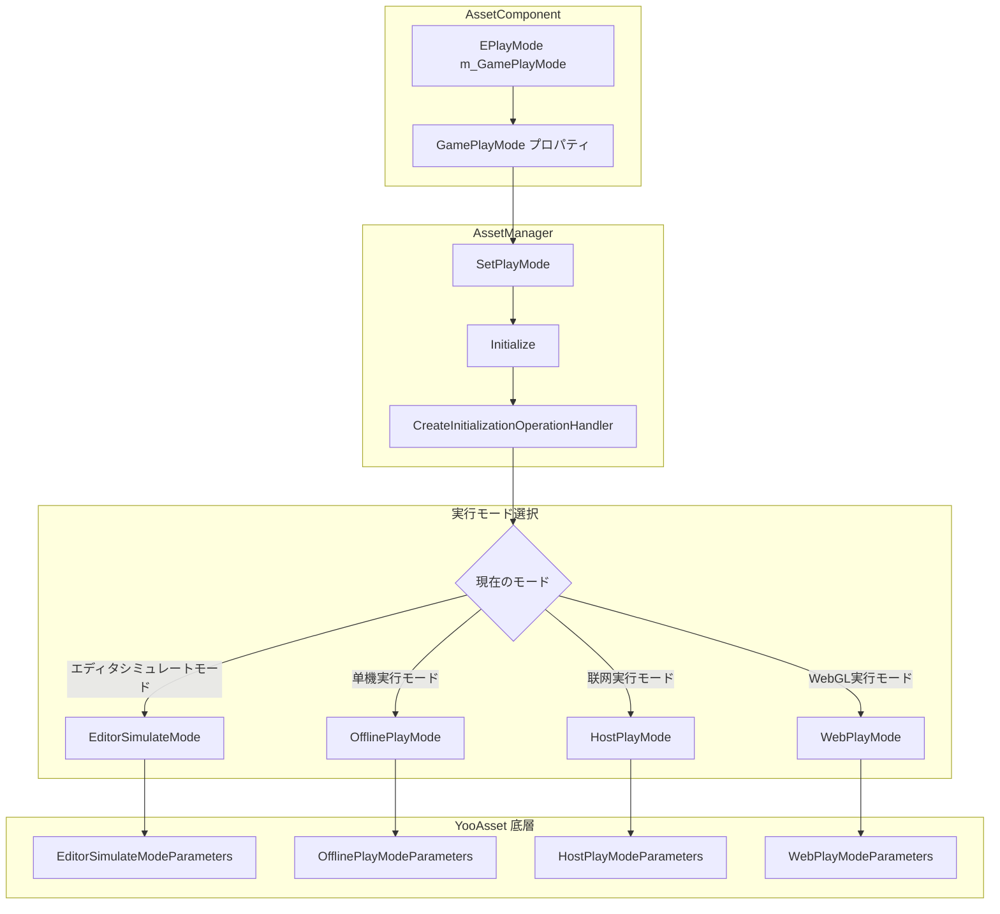
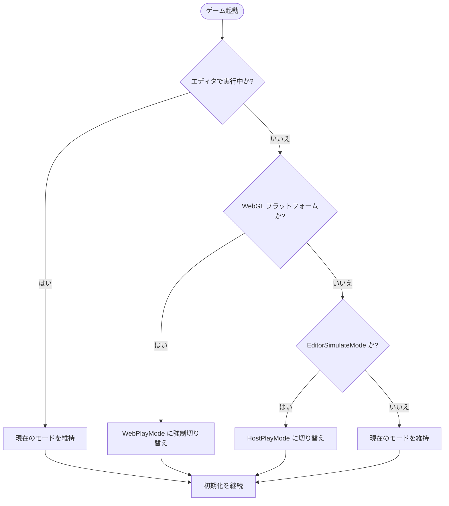

# 実行モード

実行モードはリソースシステムが開始時にリソースをどのように初期化し、ロードするかを定義します。GameFrameX は異なる開発と展開シナリオに対応するために4種類の実行モードを提供しています。

## 概要

リソースシステムの実行モードはリソースのロード方式とデータソースを決定します。正しい実行モードの選択はゲームの开发と发布にとって非常に重要です：

- **EditorSimulateMode**: Unity エディタ内でのみ使用。快速な開発とデバッグ用
- **OfflinePlayMode**: 单機ゲームモード、ネットワーク接続不要
- **HostPlayMode**: 熱更新モード、リモートサーバーからリソースを更新する機能をサポート
- **WebPlayMode**: WebGL および小游戏プラットフォーム専用モード

> **注意**: 目標プラットフォームが WebGL の場合、システムは実行モードを自動的に `EPlayMode.WebPlayMode` に強制設定し、手動で変更することはできません。

## アーキテクチャ設計



### コンポーネント职责

| コンポーネント | 职责 |
|------|------|
| AssetComponent | 実行モード設定を保存、実行時にプラットフォームを自動検出してモードを調整 |
| AssetManager | 実行モードに従って相应の初期化パラメータを作成し、リソースシステムの初期化を完了 |
| YooAsset | 底層リソースシステム、異なるパラメータタイプに従って对应する初期化ロジックを実行 |

## 各実行モードの詳細

### 1. エディタシミュレートモード (EditorSimulateMode)

エディタシミュレートモードは Unity エディタ環境でのみ実行され、最終的に公开发布されるゲームパッケージには含まりません。このモードは `EditorSimulateModeParameters` を使用して初期化します：

```csharp
// Source: Runtime/Asset/AssetManager.Initialization.cs#L55-L60
private InitializationOperation InitializeYooAssetEditorSimulateMode(ResourcePackage resourcePackage)
{
    var simulateBuildResult = EditorSimulateModeHelper.SimulateBuild(nameof(EDefaultBuildPipeline.BuiltinBuildPipeline), ConstDefaultPackageName);
    var createParameters = new EditorSimulateModeParameters();
    createParameters.EditorFileSystemParameters = FileSystemParameters.CreateDefaultEditorFileSystemParameters(simulateBuildResult);
    return resourcePackage.InitializeAsync(createParameters);
}
```

**特徴**：
- リソースパッケージング操作が不要
- エディタ内のソースリソースファイルから直接ロード
- ロード速度が最も速く、素早い反復開発に適合
- パッケージング公開時に他のモードに自動的に切り替え

**使用シーン**：
- エディタでの機能開発とデバッグ
- リソースロードロジックの素早い検証

### 2. 单機実行モード (OfflinePlayMode)

单機実行モードは完全にオフライ 게임シーン 用に使用され、すべてのリソースはゲームインストールパッケージ内にパッケージングされます。このモードは `OfflinePlayModeParameters` を使用して初期化します：

```csharp
// Source: Runtime/Asset/AssetManager.Initialization.cs#L69-L74
private InitializationOperation InitializeYooAssetOfflinePlayMode(ResourcePackage resourcePackage)
{
    var buildinFileSystem = FileSystemParameters.CreateDefaultBuildinFileSystemParameters();
    var initParameters = new OfflinePlayModeParameters();
    initParameters.BuildinFileSystemParameters = buildinFileSystem;
    return resourcePackage.InitializeAsync(initParameters);
}
```

**特徴**：
- ネットワーク接続不要
- リソースはアプリの内置の読み取り専用領域（StreamingAssets）からロード
- 実行時リソース更新をサポートしない
- 单機ゲームまたはネットワーク環境が不安定なシナリオに適合

**使用シーン**：
- 单機ゲーム
- 熱更新が必要ない獨立ゲーム
- ネットワーク環境が制限された发布プラットフォーム

### 3. 联网実行モード (HostPlayMode)

联网実行モード（熱更新モード）は大型ゲームで最も一般的に使用されるモードであり、リソースの熱更新機能をサポートします。このモードは `HostPlayModeParameters` を使用して初期化します：

```csharp
// Source: Runtime/Asset/AssetManager.Initialization.cs#L155-L163
private InitializationOperation InitializeYooAssetHostPlayMode(ResourcePackage resourcePackage, string hostServerURL, string fallbackHostServerURL)
{
    var remoteServices = new RemoteServices(hostServerURL, fallbackHostServerURL);
    var createParameters = new HostPlayModeParameters
    {
        BuildinFileSystemParameters = FileSystemParameters.CreateDefaultBuildinFileSystemParameters(),
        CacheFileSystemParameters = FileSystemParameters.CreateDefaultCacheFileSystemParameters(remoteServices),
    };
    return resourcePackage.InitializeAsync(createParameters);
}
```

**特徴**：
- リソースの熱更新機能をサポート
- 優先的にリモートサーバーから最新リソースをダウンロード
- 内蔵リソースは后备方案として機能
- 断点续传とキャッシュ管理をサポート

**使用シーン**：
- コンテンツの継続的な更新が必要なネットワークゲーム
- リソースを分割ダウンロードする必要がある大型ゲーム
- バグ修正や新コンテンツの追加に熱更新を利用したいゲーム

### 4. WebGL 実行モード (WebPlayMode)

WebGL 実行モードは WebGL プラットフォームと小游戏プラットフォーム 用に設計されており多种小游戏プラットフォームのファイルシステムをサポートします：

```csharp
// Source: Runtime/Asset/AssetManager.Initialization.cs#L85-L145
private InitializationOperation InitializeYooAssetWebPlayMode(ResourcePackage resourcePackage, string hostServerURL, string fallbackHostServerURL)
{
    var initParameters = new WebPlayModeParameters();
    FileSystemSystemParameters webFileSystem = null;
#if UNITY_WEBGL
#if ENABLE_DOUYIN_MINI_GAME
    // バイト小游戏ファイルシステム
    webFileSystem = ByteGameFileSystemCreater.CreateByteGameFileSystemParameters(hostServerURL);
#elif ENABLE_WECHAT_MINI_GAME
    // 微信小游戏ファイルシステム
    webFileSystem = WechatFileSystemCreater.CreateWechatPathFileSystemParameters(hostServerURL);
#elif ENABLE_KUAISHOU_MINI_GAME
    // 快手小游戏ファイルシステム
    webFileSystem = KuaiShouFileSystemCreater.CreateKuaiShouPathFileSystemParameters(hostServerURL);
#else
    // デフォルト WebGL ファイルシステム
    webFileSystem = FileSystemParameters.CreateDefaultWebFileSystemParameters();
#endif
#else
    webFileSystem = FileSystemParameters.CreateDefaultWebFileSystemParameters();
#endif
    initParameters.WebFileSystemParameters = webFileSystem;
    return resourcePackage.InitializeAsync(initParameters);
}
```

**サポートされるプラットフォーム**：
- WebGL ブラウザプラットフォーム
- 抖音小游戏 (ByteDance Mini Game)
- 微信小游戏 (WeChat Mini Game)
- 快手小游戏 (Kuaishou Mini Game)

**特徴**：
- 目標プラットフォームを自動検出、適切なファイルシステムを選択
- 小游戏プラットフォームに特化 оптимизация
- 小游戏プラットフォーム特有のプリロードメカニズムをサポート

## プラットフォーム自動切り替えロジック

システムは実行時にプラットフォーム互換性問題を自動的に処理します：

```csharp
// Source: Runtime/Asset/AssetComponent.cs#L42-L63
protected override void Awake()
{
#if !UNITY_EDITOR
    if (GamePlayMode == EPlayMode.EditorSimulateMode)
    {
        GamePlayMode = EPlayMode.HostPlayMode;
    }
#if UNITY_WEBGL
    GamePlayMode = EPlayMode.WebPlayMode;
#endif
#endif
    // ... その他の初期化コード
    _assetManager.SetPlayMode(GamePlayMode);
}
```



## 設定説明

実行モードは Unity シーンの AssetComponent コンポーネントを通じて設定します：

```csharp
// Source: Runtime/Asset/AssetComponent.cs#L18-L31
[Tooltip("目標プラットフォームがWebプラットフォームの場合、強制的に WebPlayMode に設定されます")] [SerializeField]
private EPlayMode m_GamePlayMode;

/// <summary>
/// リソースの実行モード
/// </summary>
public EPlayMode GamePlayMode
{
    get { return m_GamePlayMode; }
    set { m_GamePlayMode = value; }
}
```

### 設定プロパティ

| プロパティ | タイプ | 説明 |
|------|------|------|
| GamePlayMode | EPlayMode | リソースの実行モード |

### EPlayMode 列挙値

| 列挙値 | 説明 |
|--------|------|
| EditorSimulateMode | エディタシミュレートモード、エディタのみ使用可能 |
| OfflinePlayMode | 单機実行モード |
| HostPlayMode | 联网実行モード（熱更新モード） |
| WebPlayMode | WebGL 実行モード |

## 使用推奨

### 開発フェーズ

- Unity エディタでは **EditorSimulateMode** を使用し、素早い反復開発が可能
- リソースパッケージングツール配合して完全なパッケージングテストを実施

### テストフェーズ

- **OfflinePlayMode** を使用して完全なオフライン機能テストを実施
- **HostPlayMode** を使用して熱更新フローをテスト

### 发布フェーズ

- 目標プラットフォームに基づいて適切な実行モードを選択
- WebGL プラットフォームは自動的に WebPlayMode を使用、手動設定不要
- モバイルネットワークゲームには HostPlayMode を推奨

## 関連リンク

- [リソースコンポーネント](./4-core-concepts.asset-component)
- [リソースマネージャー](./4-core-concepts.asset-manager)
- [アーキテクチャ設計](./4-core-concepts.architecture)
- [コンポーネント設定](./6-configuration.component-settings)
- [WebGL プラットフォーム設定](./7-platforms.webgl)