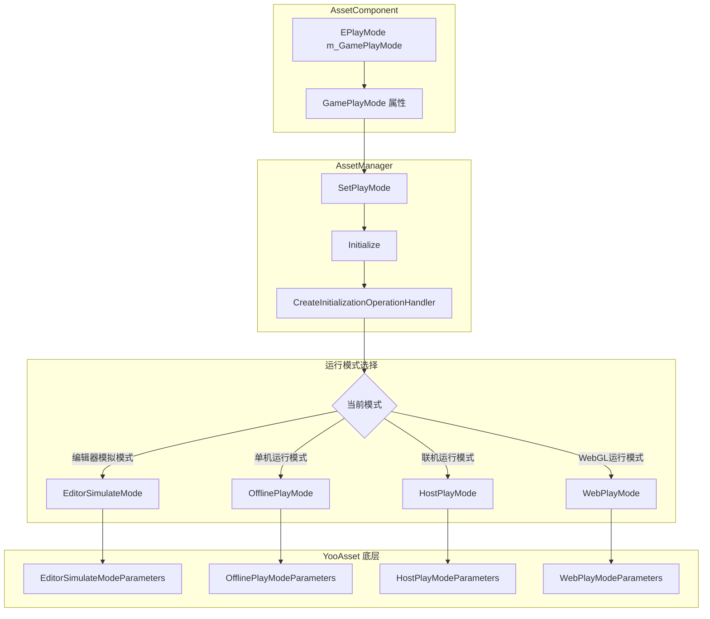
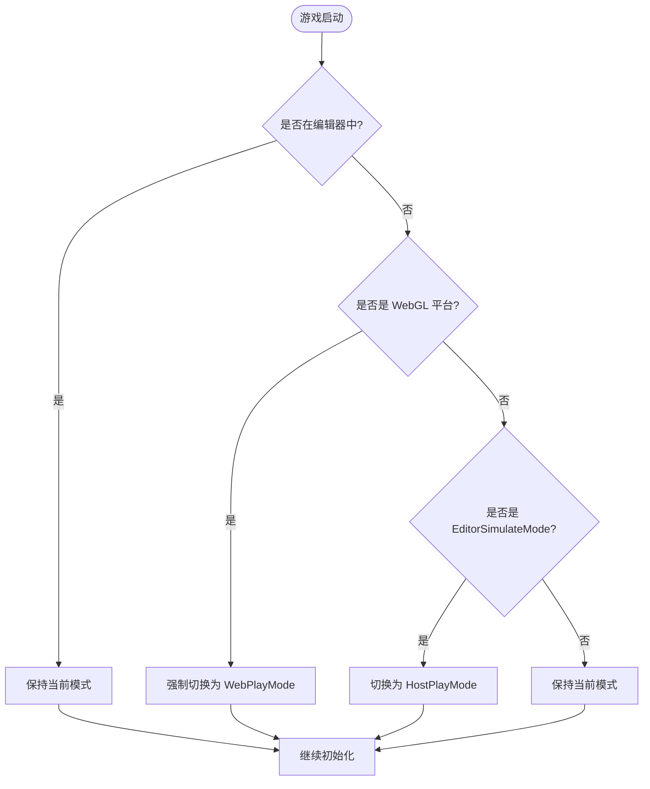

# 运行モード

运行モード定義了リソースシステム在游戏启动时如何初期化和ロードリソース。根据不同的开发和デプロイシーン，GameFrameX 提供します四种运行モード供选择。

## 概要

リソースシステム的运行モード决定了リソース的ロード方法和数据来源。正确选择运行モード对于游戏的开发和リリース至关重要な：

- **EditorSimulateMode**：仅在 Unity エディタ中使用，用于快速开发和デバッグ
- **OfflinePlayMode**：オフラインゲームモード，无需网络连接
- **HostPlayMode**：ホットアップデートモード，サポート从远程服务器アップデートリソース
- **WebPlayMode**：WebGL 及ミニゲームプラットフォーム专用モード

> **注意**：当目标プラットフォーム为 WebGL 时，系统会自动将运行モード强制設定为 `EPlayMode.WebPlayMode`，无法手动更改。

## アーキテクチャ設計



### コンポーネント职责

| コンポーネント | 职责 |
|------|------|
| AssetComponent | 存储运行モード設定，在ランタイム自动检测プラットフォーム并调整モード |
| AssetManager | 根据运行モード作成相应的初期化パラメータ，并完成リソースシステム初期化 |
| YooAsset | 底层リソースシステム，根据不同的パラメータタイプ执行对应的初期化逻辑 |

## 各运行モード详解

### 1. エディタ模拟モード (EditorSimulateMode)

エディタ模拟モード仅在 Unity エディタ環境中运行，不打パッケージ到最终リリース的游戏パッケージ中。该モード使用 `EditorSimulateModeParameters` 进行初期化：

```csharp
// Source: Runtime/Asset/AssetManager.Initialization.cs#L55-L60
private InitializationOperation InitializeYooAssetEditorSimulateMode(ResourcePackage resourcePackage)
{
    var simulateBuildResult = EditorSimulateModeHelper.SimulateBuild(nameof(EDefaultBuildPipeline.BuiltinBuildPipeline), ConstDefaultPackageName);
    var createParameters = new EditorSimulateModeParameters();
    createParameters.EditorFileSystemParameters = FileSystemParameters.CreateDefaultEditorFileSystemParameters(simulateBuildResult);
    return resourcePackage.InitializeAsync(createParameters);
}
```

**特点**：
- 不〜する必要があります执行リソース打パッケージ操作
- 直接从エディタ中的源リソースファイルロード
- ロード速度最快，适合快速迭代开发
- 打パッケージリリース时会自动切换到其他モード

**使用シーン**：
- エディタ下的機能开发和デバッグ
- 快速検証リソースロード逻辑

### 2. 单机运行モード (OfflinePlayMode)

单机运行モード用于完全离线的游戏シーン，所有リソース都打パッケージ在游戏インストールパッケージ内。该モード使用 `OfflinePlayModeParameters` 进行初期化：

```csharp
// Source: Runtime/Asset/AssetManager.Initialization.cs#L69-L74
private InitializationOperation InitializeYooAssetOfflinePlayMode(ResourcePackage resourcePackage)
{
    var buildinFileSystem = FileSystemParameters.CreateDefaultBuildinFileSystemParameters();
    var initParameters = new OfflinePlayModeParameters();
    initParameters.BuildinFileSystemParameters = buildinFileSystem;
    return resourcePackage.InitializeAsync(initParameters);
}
```

**特点**：
- 无需网络连接
- リソース从应用内置的只读区域（StreamingAssets）ロード
- 不サポートランタイムリソースアップデート
- 适合オフラインゲーム或网络環境不稳定的シーン

**使用シーン**：
- オフラインゲーム
- 无需ホットアップデート的独立游戏
- 网络環境受限的リリースプラットフォーム

### 3. 联机运行モード (HostPlayMode)

联机运行モード（ホットアップデートモード）是大型游戏最常用的モード，サポートリソース的ホットアップデート。该モード使用 `HostPlayModeParameters` 进行初期化：

```csharp
// Source: Runtime/Asset/AssetManager.Initialization.cs#L155-L163
private InitializationOperation InitializeYooAssetHostPlayMode(ResourcePackage resourcePackage, string hostServerURL, string fallbackHostServerURL)
{
    var remoteServices = new RemoteServices(hostServerURL, fallbackHostServerURL);
    var createParameters = new HostPlayModeParameters
    {
        BuildinFileSystemParameters = FileSystemParameters.CreateDefaultBuildinFileSystemParameters(),
        CacheFileSystemParameters = FileSystemParameters.CreateDefaultCacheFileSystemParameters(remoteServices),
    };
    return resourcePackage.InitializeAsync(createParameters);
}
```

**特点**：
- サポートリソース的ホットアップデート機能
- 优先从远程服务器下载最新リソース
- 内蔵リソース作为后备方案
- サポート断点续传和缓存管理

**使用シーン**：
- 〜する必要があります持续アップデート内容的オンラインゲーム
- 〜する必要があります分批下载リソース的大型游戏
- 希望通过ホットアップデート修复 bug 或追加新内容的游戏

### 4. WebGL 运行モード (WebPlayMode)

WebGL 运行モード专门为 WebGL プラットフォーム和ミニゲームプラットフォーム設計，サポート多种ミニゲームプラットフォーム的ファイル系统：

```csharp
// Source: Runtime/Asset/AssetManager.Initialization.cs#L85-L145
private InitializationOperation InitializeYooAssetWebPlayMode(ResourcePackage resourcePackage, string hostServerURL, string fallbackHostServerURL)
{
    var initParameters = new WebPlayModeParameters();
    FileSystemSystemParameters webFileSystem = null;
#if UNITY_WEBGL
#if ENABLE_DOUYIN_MINI_GAME
    // 字节小游戏文件系统
    webFileSystem = ByteGameFileSystemCreater.CreateByteGameFileSystemParameters(hostServerURL);
#elif ENABLE_WECHAT_MINI_GAME
    // 微信小游戏文件系统
    webFileSystem = WechatFileSystemCreater.CreateWechatPathFileSystemParameters(hostServerURL);
#elif ENABLE_KUAISHOU_MINI_GAME
    // 快手小游戏文件系统
    webFileSystem = KuaiShouFileSystemCreater.CreateKuaiShouPathFileSystemParameters(hostServerURL);
#else
    // 默认 WebGL 文件系统
    webFileSystem = FileSystemParameters.CreateDefaultWebFileSystemParameters();
#endif
#else
    webFileSystem = FileSystemParameters.CreateDefaultWebFileSystemParameters();
#endif
    initParameters.WebFileSystemParameters = webFileSystem;
    return resourcePackage.InitializeAsync(initParameters);
}
```

**サポート的プラットフォーム**：
- WebGL 浏览器プラットフォーム
- DouYinミニゲーム (ByteDance Mini Game)
- WeChatミニゲーム (WeChat Mini Game)
- KuaiShouミニゲーム (Kuaishou Mini Game)

**特点**：
- 自动检测目标プラットフォーム并选择合适的ファイル系统
- 针对ミニゲームプラットフォーム的特殊最適化
- サポートミニゲームプラットフォーム特有的预ロード机制

## プラットフォーム自动切换逻辑

系统在ランタイム自动処理プラットフォーム兼容性問題：

```csharp
// Source: Runtime/Asset/AssetComponent.cs#L42-L63
protected override void Awake()
{
#if !UNITY_EDITOR
    if (GamePlayMode == EPlayMode.EditorSimulateMode)
    {
        GamePlayMode = EPlayMode.HostPlayMode;
    }
#if UNITY_WEBGL
    GamePlayMode = EPlayMode.WebPlayMode;
#endif
#endif
    // ... 其他初始化代码
    _assetManager.SetPlayMode(GamePlayMode);
}
```



## 設定説明

运行モード通过 Unity シーン中的 AssetComponent コンポーネント进行設定：

```csharp
// Source: Runtime/Asset/AssetComponent.cs#L18-L31
[Tooltip("当目标平台为Web平台时，将会强制设置为 WebPlayMode")] [SerializeField]
private EPlayMode m_GamePlayMode;

/// <summary>
/// 资源的运行模式
/// </summary>
public EPlayMode GamePlayMode
{
    get { return m_GamePlayMode; }
    set { m_GamePlayMode = value; }
}
```

### 設定プロパティ

| プロパティ | タイプ | 説明 |
|------|------|------|
| GamePlayMode | EPlayMode | リソース的运行モード |

### EPlayMode 列挙型值

| 列挙型值 | 説明 |
|--------|------|
| EditorSimulateMode | エディタ模拟モード，仅エディタ可用 |
| OfflinePlayMode | 单机运行モード |
| HostPlayMode | 联机运行モード（ホットアップデートモード） |
| WebPlayMode | WebGL 运行モード |

## 使用お勧め

### 开发フェーズ

- 在 Unity エディタ中使用 **EditorSimulateMode**，〜できます快速迭代开发
- 配合リソース打パッケージ工具进行完全な的打パッケージテスト

### テストフェーズ

- 使用 **OfflinePlayMode** 进行完全な的离线機能テスト
- 使用 **HostPlayMode** テストホットアップデートフロー

### リリースフェーズ

- 根据目标プラットフォーム选择合适的运行モード
- WebGL プラットフォーム会自动使用 WebPlayMode，无需手动設定
- 移动端オンラインゲームお勧め使用 HostPlayMode

## 関連リンク

- [リソースコンポーネント](./4-core-concepts.asset-component)
- [リソースマネージャー](./4-core-concepts.asset-manager)
- [アーキテクチャ設計](./4-core-concepts.architecture)
- [コンポーネント設定](./6-configuration.component-settings)
- [WebGL プラットフォーム設定](./7-platforms.webgl)
