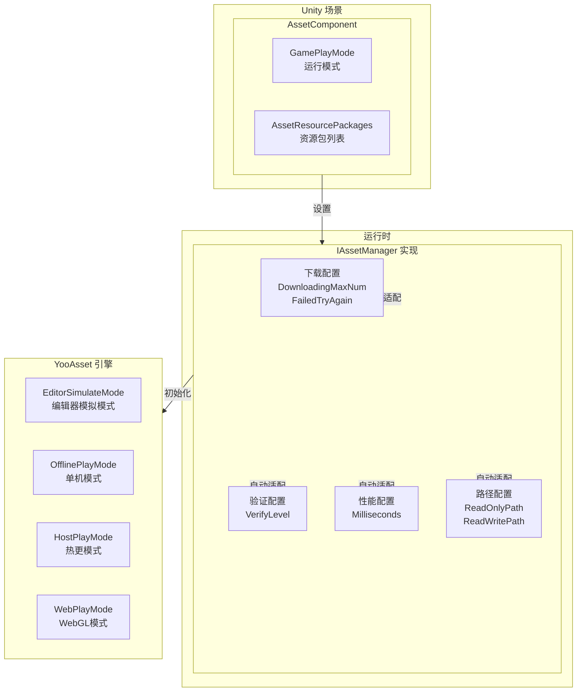
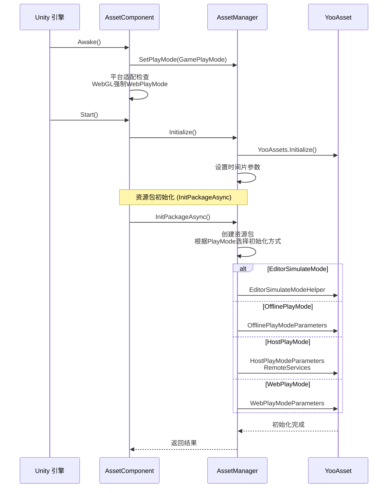

# コンポーネント設定

AssetComponent 是 GameFrameX リソースシステム的コア Unity コンポーネント，负责設定和管理リソース的ランタイム行为。通过该コンポーネント，開発者〜できます柔軟設定リソースロードモード、下载パラメータ、リソースパッケージ情報等关键設定。

## 概要

AssetComponent 継承自 GameFrameworkComponent，是 Unity シーン中的コアコンポーネント，用于初期化和管理リソースシステム。该コンポーネント通过 Unity Inspector パネル进行設定，サポート多种运行モード，能够根据不同プラットフォーム自动适配最佳的リソースロード策略。



**設定フロー説明：**
1. 在 Unity Inspector 中設定 AssetComponent 的运行モード和リソースパッケージ情報
2. AssetComponent 在 Awake フェーズ取得設定并传递给 AssetManager
3. AssetManager 根据設定初期化 YooAsset 引擎
4. 系统根据运行モード选择合适的リソースロード策略

## コア設定プロパティ

### 動作モード設定

AssetComponent 提供します `GamePlayMode` プロパティ，用于設定リソース的运行モード：

```csharp
[Tooltip("当目标平台为Web平台时，将会强制设置为" + nameof(EPlayMode.WebPlayMode))] [SerializeField]
private EPlayMode m_GamePlayMode;
```
> Source: [Runtime/Asset/AssetComponent.cs](https://github.com/GameFrameX/com.gameframex.unity.asset/blob/main/Runtime/Asset/AssetComponent.cs#L20-L21)

**运行モード説明：**

| モード | 列挙型值 | 説明 | 适用シーン |
|------|--------|------|----------|
| エディタ模拟モード | `EPlayMode.EditorSimulateMode` | 在 Unity エディタ中使用模拟方法ロードリソース，无需打パッケージつまり可テスト | 开发デバッグフェーズ |
| 单机运行モード | `EPlayMode.OfflinePlayMode` | 使用本地内置リソースファイル，无需网络下载 | 纯オフラインゲーム |
| 联机运行モード | `EPlayMode.HostPlayMode` | サポートホットアップデート，从远程服务器下载リソース | 〜する必要があります热更的游戏 |
| WebGL运行モード | `EPlayMode.WebPlayMode` | 针对 WebGL プラットフォーム的特殊最適化モード | WebGL プラットフォーム |

**プラットフォーム自动适配机制：**

```csharp
protected override void Awake()
{
#if !UNITY_EDITOR
    if (GamePlayMode == EPlayMode.EditorSimulateMode)
    {
        GamePlayMode = EPlayMode.HostPlayMode;
    }
#if UNITY_WEBGL
    GamePlayMode = EPlayMode.WebPlayMode;
#endif
#endif
    // ... 后续初始化逻辑
}
```
> Source: [Runtime/Asset/AssetComponent.cs](https://github.com/GameFrameX/com.gameframex.unity.asset/blob/main/Runtime/Asset/AssetComponent.cs#L42-L64)

**自动适配规则：**
- 在非エディタ環境下，`EditorSimulateMode` 会被自动转换为 `HostPlayMode`
- 在 WebGL プラットフォーム環境下，无论設定何种モード，都会被强制設定为 `WebPlayMode`

### リソースパッケージ設定

在エディタ環境下，〜できます通过 `AssetResourcePackages` 設定多个リソースパッケージ情報：

```csharp
#if UNITY_EDITOR
[SerializeField] private List<AssetResourcePackageInfo> m_assetResourcePackages = new List<AssetResourcePackageInfo>();
#endif
```
> Source: [Runtime/Asset/AssetComponent.cs](https://github.com/GameFrameX/com.gameframex.unity.asset/blob/main/Runtime/Asset/AssetComponent.cs#L33-L34)

**リソースパッケージ情報结构：**

```csharp
[Serializable]
public sealed class AssetResourcePackageInfo
{
    [SerializeField] public string PackageName;
    [SerializeField] public string DownloadURL;
    [SerializeField] public string FallbackDownloadURL;
}
```
> Source: [Runtime/Asset/AssetComponent.cs](https://github.com/GameFrameX/com.gameframex.unity.asset/blob/main/Runtime/Asset/AssetComponent.cs#L661-L667)

| 設定项 | タイプ | 説明 |
|--------|------|------|
| PackageName | string | リソースパッケージ名称 |
| DownloadURL | string | 主下载地址 |
| FallbackDownloadURL | string | 备用下载地址 |

## ランタイム設定インターフェース

IAssetManager インターフェース提供します丰富的ランタイム設定プロパティ，可在コード中动态调整：

```csharp
public interface IAssetManager
{
    /// <summary>
    /// 同时下载的最大数目。
    /// </summary>
    int DownloadingMaxNum { get; set; }

    /// <summary>
    /// 失败重试最大数目。
    /// </summary>
    int FailedTryAgain { get; set; }

    /// <summary>
    /// 获取或设置资源包名称。
    /// </summary>
    string DefaultPackageName { get; set; }

    /// <summary>
    /// 获取或设置下载文件校验等级。
    /// </summary>
    EFileVerifyLevel VerifyLevel { get; }

    /// <summary>
    /// 获取或设置异步系统参数，每帧执行消耗的最大时间切片（单位：毫秒）。
    /// </summary>
    long Milliseconds { get; set; }

    /// <summary>
    /// 获取资源只读区路径。
    /// </summary>
    string ReadOnlyPath { get; }

    /// <summary>
    /// 获取资源读写区路径。
    /// </summary>
    string ReadWritePath { get; }
}
```
> Source: [Runtime/Asset/IAssetManager.cs](https://github.com/GameFrameX/com.gameframex.unity.asset/blob/main/Runtime/Asset/IAssetManager.cs#L13-L76)

### 下载設定

| 設定项 | タイプ | デフォルト值 | 説明 |
|--------|------|--------|------|
| DownloadingMaxNum | int | - | 同時に下载的最大数量，お勧め根据网络状况設定 |
| FailedTryAgain | int | - | 下载失敗后的重试次数，お勧め設定为 3-5 次 |

### 検証設定

| 設定项 | タイプ | 説明 |
|--------|------|------|
| VerifyLevel | EFileVerifyLevel | ファイル校验等级，用于確認してください下载ファイル的完全な性 |

**校验等级説明：**
- `None` - 不进行校验
- `Low` - 轻度校验，仅校验ファイル是否存在
- `Medium` - 中度校验，校验ファイル大小和部分哈希
- `High` - 高度校验，校验完全なファイル哈希

### 性能設定

| 設定项 | タイプ | デフォルト值 | 説明 |
|--------|------|--------|------|
| Milliseconds | long | 30 | 异步系统每帧执行的最大时间切片（毫秒），用于控制每帧的リソースロード时间，避免卡顿 |

### 路径設定

| 設定项 | タイプ | 説明 |
|--------|------|------|
| ReadOnlyPath | string | リソース只读区路径，通常指向 StreamingAssets |
| ReadWritePath | string | リソース读写区路径，用于存储下载的リソース和缓存 |

## 設定初期化フロー



**初期化コード例：**

```csharp
public void Initialize()
{
    BetterStreamingAssets.Initialize();
    Log.Info($"资源系统运行模式：{PlayMode}");
    YooAssets.Initialize();
    YooAssets.SetOperationSystemMaxTimeSlice(30);
    Log.Info("Asset Init Over");
}
```
> Source: [Runtime/Asset/AssetManager.cs](https://github.com/GameFrameX/com.gameframex.unity.asset/blob/main/Runtime/Asset/AssetManager.cs#L46-L56)

## エディタ設定界面

AssetComponent 提供します自定義的 Unity Inspector エディタ界面：

```csharp
[CustomEditor(typeof(AssetComponent))]
internal sealed class AssetComponentInspector : ComponentTypeComponentInspector
{
    public override void OnInspectorGUI()
    {
        // 运行模式配置（播放时不可修改）
        EditorGUI.BeginDisabledGroup(EditorApplication.isPlayingOrWillChangePlaymode);
        {
            EditorGUILayout.PropertyField(m_GamePlayMode, m_GamePlayModeGUIContent);
            GUI.enabled = false;
            EditorGUILayout.PropertyField(m_AssetResourcePackages, m_AssetResourcePackagesGUIContent);
            GUI.enabled = true;
        }
        EditorGUI.EndDisabledGroup();
    }
}
```
> Source: [Editor/Inspector/AssetComponentInspector.cs](https://github.com/GameFrameX/com.gameframex.unity.asset/blob/main/Editor/Inspector/AssetComponentInspector.cs#L39-L79)

**設定界面特性：**
- 运行モード設定：下拉选择框，可在エディタ中直观选择
- パッケージ列表設定：显示已設定的リソースパッケージ情報（再生时禁用）
- 再生保护：进入再生モード后无法変更設定项

## 設定例コード

### 基本設定

```csharp
// 获取 AssetComponent
var assetComponent = GameEntry.GetComponent<AssetComponent>();

// 获取当前运行模式
var playMode = assetComponent.GamePlayMode;
Debug.Log($"当前运行模式: {playMode}");
```
> Source: [Runtime/Asset/AssetComponent.cs](https://github.com/GameFrameX/com.gameframex.unity.asset/blob/main/Runtime/Asset/AssetComponent.cs#L27-L31)

### ランタイム設定调整

```csharp
// 获取资源管理器
var assetManager = GameFrameworkEntry.GetModule<IAssetManager>();

// 配置下载参数
assetManager.DownloadingMaxNum = 10;  // 最多同时下载10个资源
assetManager.FailedTryAgain = 3;       // 失败重试3次

// 配置性能参数
assetManager.Milliseconds = 30;        // 每帧最多30毫秒

// 配置验证等级
assetManager.VerifyLevel = EFileVerifyLevel.Medium;

// 配置路径
assetManager.SetReadOnlyPath(Application.streamingAssetsPath);
assetManager.SetReadWritePath(Application.persistentDataPath);
```
> Source: [Runtime/Asset/AssetManager.cs](https://github.com/GameFrameX/com.gameframex.unity.asset/blob/main/Runtime/Asset/AssetManager.cs#L24-L39)

### リソースパッケージ初期化

```csharp
// 初始化默认资源包
var success = await assetComponent.InitPackageAsync(
    "DefaultPackage",                      // 包名称
    "https://cdn.example.com/assets/",      // 主下载地址
    "https://backup.example.com/assets/",  // 备用下载地址
    true                                    // 是否为默认包
);

if (success)
{
    Debug.Log("资源包初始化成功");
}
else
{
    Debug.LogError("资源包初始化失败");
}
```
> Source: [Runtime/Asset/AssetComponent.cs](https://github.com/GameFrameX/com.gameframex.unity.asset/blob/main/Runtime/Asset/AssetComponent.cs#L80-L95)

## プラットフォーム特殊設定

### WebGL プラットフォーム

在 WebGL プラットフォーム下，系统会自动処理不同ミニゲームプラットフォーム的适配：

```csharp
// 字节小游戏
#if ENABLE_DOUYIN_MINI_GAME
GameEntry.GetComponent<AssetComponent>().gameObject.GetOrAddComponent<DouYinConfigHandler>();
#endif

// 微信小游戏
#if ENABLE_WECHAT_MINI_GAME
GameEntry.GetComponent<AssetComponent>().gameObject.GetOrAddComponent<WeChatConfigHandler>();
#endif

// 快手小游戏
#if ENABLE_KUAISHOU_MINI_GAME
GameEntry.GetComponent<AssetComponent>().gameObject.GetOrAddComponent<KuaiShouConfigHandler>();
#endif
```
> Source: [Runtime/Asset/AssetManager.Initialization.cs](https://github.com/GameFrameX/com.gameframex.unity.asset/blob/main/Runtime/Asset/AssetManager.Initialization.cs#L90-L126)

**ミニゲームプラットフォーム特殊処理：**
- **ByteDanceミニゲーム**：使用字节专用ファイル系统，自动控制并发数量
- **WeChatミニゲーム**：使用微信ファイル系统，缓存到ユーザー数据ディレクトリ
- **KuaiShouミニゲーム**：使用快手ファイル系统

## 設定最佳实践

### 开发フェーズ

```csharp
// 开发阶段推荐配置
assetManager.DownloadingMaxNum = 5;
assetManager.FailedTryAgain = 3;
assetManager.VerifyLevel = EFileVerifyLevel.Low;
assetManager.Milliseconds = 20;
```

### 本番フェーズ

```csharp
// 生产阶段推荐配置
assetManager.DownloadingMaxNum = 10;
assetManager.FailedTryAgain = 5;
assetManager.VerifyLevel = EFileVerifyLevel.High;
assetManager.Milliseconds = 30;
```

### 网络環境适配

```csharp
// 弱网环境
if (Application.internetReachability == NetworkReachability.NotReachable)
{
    assetManager.GamePlayMode = EPlayMode.OfflinePlayMode;
}

// 移动网络
else if (Application.internetReachability == NetworkReachability.ReachableViaCarrierDataNetwork)
{
    assetManager.DownloadingMaxNum = 3;
}

// WiFi环境
else if (Application.internetReachability == NetworkReachability.ReachableViaLocalAreaNetwork)
{
    assetManager.DownloadingMaxNum = 10;
}
```

## 常见設定問題

### 問題 1：エディタモード无法正常运行

**原因**：在非エディタ環境下使用了 `EditorSimulateMode`

**解決策**：確認してください在打パッケージリリース时将运行モード改为 `HostPlayMode` 或 `OfflinePlayMode`

### 問題 2：WebGL プラットフォームリソースロード失敗

**原因**：WebGL プラットフォーム被强制設定为 `WebPlayMode`，〜する必要があります設定正确的下载服务器

**解決策**：確認してください在 `InitPackageAsync` 中提供正确的 `DownloadURL` 和 `FallbackDownloadURL`

### 問題 3：リソース下载速度慢

**原因**：`DownloadingMaxNum` 設定过低

**解決策**：在 WiFi 環境下适当增大 `DownloadingMaxNum` 的值

## 関連リンク

- [运行モード](./6-configuration.play-modes) - 詳細理解する各种运行モード的区别
- [リソースロードインターフェース](./5-api-reference.loading-api) - リソースロード API ドキュメント
- [リソースパッケージ管理](./5-api-reference.package-management) - リソースパッケージ管理ドキュメント
- [AssetComponent API](./4-core-concepts.asset-component) - コンポーネントコアコンセプト
