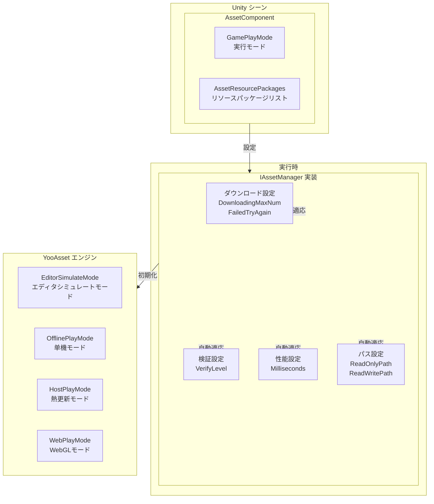
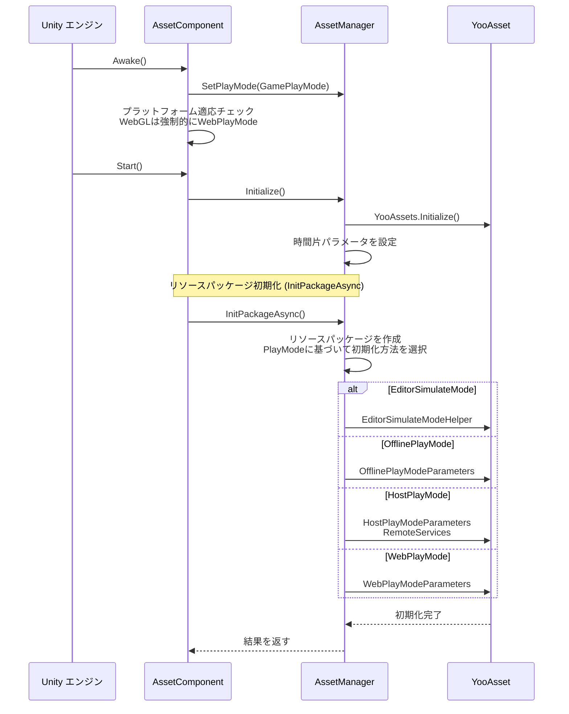

# コンポーネント設定

AssetComponent は GameFrameX リソースシステムのコア Unity コンポーネントであり、リソースの実行時動作を設定・管理する职责を担います。このコンポーネントを通じて、開発者はリソースロードモード、ダウンロードパラメータ、リソースパッケージ情報などの主要な設定を柔軟に構成できます。

## 概要

AssetComponent は GameFrameworkComponent を継承しており、Unity シーン内のコアコンポーネントとしてリソースシステムの初期化と管理を担当します。このコンポーネントは Unity Inspector パネルを通じて設定を行い、複数の実行モードをサポートし、異なるプラットフォームに基づいて最適なリソースロード戦略を自動適用します。



**設定フロー説明：**
1. Unity Inspector で AssetComponent の実行モードとリソースパッケージ情報を設定
2. AssetComponent は Awake 段階で設定を取得し AssetManager に渡す
3. AssetManager は設定に基づいて YooAsset 引擎を初期化
4. システムは実行モードに基づいて適切なリソースロード戦略を選択

## コア設定プロパティ

### 実行モード設定

AssetComponent は `GamePlayMode` プロパティを提供し、リソースの実行モードを設定するために使用されます：

```csharp
[Tooltip("目標プラットフォームがWebプラットフォームの場合、強制的に WebPlayMode に設定されます")] [SerializeField]
private EPlayMode m_GamePlayMode;
```
> Source: [Runtime/Asset/AssetComponent.cs](https://github.com/GameFrameX/com.gameframex.unity.asset/blob/main/Runtime/Asset/AssetComponent.cs#L20-L21)

**実行モード説明：**

| モード | 列挙値 | 説明 | 適用シーン |
|------|--------|------|----------|
| エディタシミュレートモード | `EPlayMode.EditorSimulateMode` | Unity エディタでシミュレート方式を使用してリソースをロード、パッケージングなしでテスト可能 | 開発デバッグフェーズ |
| 单機実行モード | `EPlayMode.OfflinePlayMode` | ローカルの内置リソースファイルを使用、ネットワークダウンロード不要 | 纯单机ゲーム |
| 联网実行モード | `EPlayMode.HostPlayMode` | 熱更新をサポート、リモートサーバーからリソースをダウンロード | 熱更新が必要なゲーム |
| WebGL実行モード | `EPlayMode.WebPlayMode` | WebGL プラットフォームに特化した最適化モード | WebGL プラットフォーム |

**プラットフォーム自動適応メカニズム：**

```csharp
protected override void Awake()
{
#if !UNITY_EDITOR
    if (GamePlayMode == EPlayMode.EditorSimulateMode)
    {
        GamePlayMode = EPlayMode.HostPlayMode;
    }
#if UNITY_WEBGL
    GamePlayMode = EPlayMode.WebPlayMode;
#endif
#endif
    // ... その他の初期化ロジック
}
```
> Source: [Runtime/Asset/AssetComponent.cs](https://github.com/GameFrameX/com.gameframex.unity.asset/blob/main/Runtime/Asset/AssetComponent.cs#L42-L64)

**自動適応ルール：**
- 非エディタ環境では、`EditorSimulateMode` は自動的に `HostPlayMode` に変換される
- WebGL プラットフォーム環境では、設定にかかわらず `WebPlayMode` に強制設定される

### リソースパッケージ設定

エディタ環境では、`AssetResourcePackages` を通じて複数のリソースパッケージ情報を設定できます：

```csharp
#if UNITY_EDITOR
[SerializeField] private List<AssetResourcePackageInfo> m_assetResourcePackages = new List<AssetResourcePackageInfo>();
#endif
```
> Source: [Runtime/Asset/AssetComponent.cs](https://github.com/GameFrameX/com.gameframex.unity.asset/blob/main/Runtime/Asset/AssetComponent.cs#L33-L34)

**リソースパッケージ情報構造：**

```csharp
[Serializable]
public sealed class AssetResourcePackageInfo
{
    [SerializeField] public string PackageName;
    [SerializeField] public string DownloadURL;
    [SerializeField] public string FallbackDownloadURL;
}
```
> Source: [Runtime/Asset/AssetComponent.cs](https://github.com/GameFrameX/com.gameframex.unity.asset/blob/main/Runtime/Asset/AssetComponent.cs#L661-L667)

| 設定項目 | タイプ | 説明 |
|--------|------|------|
| PackageName | string | リソースパッケージ名 |
| DownloadURL | string | メイン下载地址 |
| FallbackDownloadURL | string | バックアップ下载地址 |

## 実行時設定インターフェース

IAssetManager インターフェースは豊富な実行時設定プロパティを提供し、コード内で動的に調整できます：

```csharp
public interface IAssetManager
{
    /// <summary>
    /// 同時ダウンロードの最大数。
    /// </summary>
    int DownloadingMaxNum { get; set; }

    /// <summary>
    /// 失敗時の再試行最大回数。
    /// </summary>
    int FailedTryAgain { get; set; }

    /// <summary>
    /// リソースパッケージ名を取得または設定。
    /// </summary>
    string DefaultPackageName { get; set; }

    /// <summary>
    /// ダウンロードファイルの検証レベルを取得または設定。
    /// </summary>
    EFileVerifyLevel VerifyLevel { get; }

    /// <summary>
    /// 非同期システムパラメータを取得または設定。各フレームの実行消費最大時間切片（単位：ミリ秒）。
    /// </summary>
    long Milliseconds { get; set; }

    /// <summary>
    /// リソースの読み取り専用領域パスを取得。
    /// </summary>
    string ReadOnlyPath { get; }

    /// <summary>
    /// リソースの読み書き領域パスを取得。
    /// </summary>
    string ReadWritePath { get; }
}
```
> Source: [Runtime/Asset/IAssetManager.cs](https://github.com/GameFrameX/com.gameframex.unity.asset/blob/main/Runtime/Asset/IAssetManager.cs#L13-L76)

### ダウンロード設定

| 設定項目 | タイプ | デフォルト値 | 説明 |
|--------|------|--------|------|
| DownloadingMaxNum | int | - | 同時ダウンロードの最大数量、ネットワーク状況に基づいて設定することを推奨 |
| FailedTryAgain | int | - | ダウンロード失敗後の再試行回数、3-5 回に設定することを推奨 |

### 検証設定

| 設定項目 | タイプ | 説明 |
|--------|------|------|
| VerifyLevel | EFileVerifyLevel | ファイル検証レベル、ダウンロードファイルの完全性を保証するために使用 |

**検証レベル説明：**
- `None` - 検証なし
- `Low` - 軽度検証、ファイルが存在するかのみ検証
- `Medium` - 中度検証、ファイルサイズと部分ハッシュを検証
- `High` - 高度検証、完全なファイルハッシュを検証

### 性能設定

| 設定項目 | タイプ | デフォルト値 | 説明 |
|--------|------|--------|------|
| Milliseconds | long | 30 | 非同期システム各フレーム実行の最大時間切片（ミリ秒）、各フレームのリソースロード時間を制御するために使用され、卡頓を避ける |

### パス設定

| 設定項目 | タイプ | 説明 |
|--------|------|------|
| ReadOnlyPath | string | リソースの読み取り専用領域パス、通常は StreamingAssets を指す |
| ReadWritePath | string | リソースの読み書き領域パス、ダウンロードしたリソースとキャッシュを存储するために使用 |

## 設定初期化フロー



**初期化コード例：**

```csharp
public void Initialize()
{
    BetterStreamingAssets.Initialize();
    Log.Info($"リソースシステム実行モード：{PlayMode}");
    YooAssets.Initialize();
    YooAssets.SetOperationSystemMaxTimeSlice(30);
    Log.Info("Asset Init Over");
}
```
> Source: [Runtime/Asset/AssetManager.cs](https://github.com/GameFrameX/com.gameframex.unity.asset/blob/main/Runtime/Asset/AssetManager.cs#L46-L56)

## エディタ設定インターフェース

AssetComponent はカスタム Unity Inspector エディタイメージを提供します：

```csharp
[CustomEditor(typeof(AssetComponent))]
internal sealed class AssetComponentInspector : ComponentTypeComponentInspector
{
    public override void OnInspectorGUI()
    {
        // 実行モード設定（再生時は変更不可）
        EditorGUI.BeginDisabledGroup(EditorApplication.isPlayingOrWillChangePlaymode);
        {
            EditorGUILayout.PropertyField(m_GamePlayMode, m_GamePlayModeGUIContent);
            GUI.enabled = false;
            EditorGUILayout.PropertyField(m_AssetResourcePackages, m_AssetResourcePackagesGUIContent);
            GUI.enabled = true;
        }
        EditorGUI.EndDisabledGroup();
    }
}
```
> Source: [Editor/Inspector/AssetComponentInspector.cs](https://github.com/GameFrameX/com.gameframex.unity.asset/blob/main/Editor/Inspector/AssetComponentInspector.cs#L39-L79)

**設定インターフェース特性：**
- 実行モード設定：ドロップダウン選択ボックス、エディタで直感的に選択可能
- パッケージリスト設定：設定されたリソースパッケージ情報を表示（再生時は無効）
- 再生保護：再生モードに入ると設定項目の変更が不可

## 設定サンプルコード

### 基礎設定

```csharp
// AssetComponent を取得
var assetComponent = GameEntry.GetComponent<AssetComponent>();

// 現在の実行モードを取得
var playMode = assetComponent.GamePlayMode;
Debug.Log($"現在の実行モード: {playMode}");
```
> Source: [Runtime/Asset/AssetComponent.cs](https://github.com/GameFrameX/com.gameframex.unity.asset/blob/main/Runtime/Asset/AssetComponent.cs#L27-L31)

### 実行時設定調整

```csharp
// リソースマネージャーを取得
var assetManager = GameFrameworkEntry.GetModule<IAssetManager>();

// ダウンロードパラメータを設定
assetManager.DownloadingMaxNum = 10;  // 最大で同時に10個のリソースをダウンロード
assetManager.FailedTryAgain = 3;       // 失敗時は3回再試行

// 性能パラメータを設定
assetManager.Milliseconds = 30;        // 各フレーム最大30ミリ秒

// 検証レベルを設定
assetManager.VerifyLevel = EFileVerifyLevel.Medium;

// パスを設定
assetManager.SetReadOnlyPath(Application.streamingAssetsPath);
assetManager.SetReadWritePath(Application.persistentDataPath);
```
> Source: [Runtime/Asset/AssetManager.cs](https://github.com/GameFrameX/com.gameframex.unity.asset/blob/main/Runtime/Asset/AssetManager.cs#L24-L39)

### リソースパッケージ初期化

```csharp
// デフォルトリソースパッケージを初期化
var success = await assetComponent.InitPackageAsync(
    "DefaultPackage",                      // パッケージ名
    "https://cdn.example.com/assets/",      // メイン下载地址
    "https://backup.example.com/assets/",  // バックアップ下载地址
    true                                    // デフォルトパッケージに設定するか
);

if (success)
{
    Debug.Log("リソースパッケージの初期化成功");
}
else
{
    Debug.LogError("リソースパッケージの初期化失敗");
}
```
> Source: [Runtime/Asset/AssetComponent.cs](https://github.com/GameFrameX/com.gameframex.unity.asset/blob/main/Runtime/Asset/AssetComponent.cs#L80-L95)

## プラットフォーム特殊設定

### WebGL プラットフォーム

WebGL プラットフォームでは、システムは異なる小游戏プラットフォームの適応を自動的に処理します：

```csharp
// バイト小游戏
#if ENABLE_DOUYIN_MINI_GAME
GameEntry.GetComponent<AssetComponent>().gameObject.GetOrAddComponent<DouYinConfigHandler>();
#endif

// 微信小游戏
#if ENABLE_WECHAT_MINI_GAME
GameEntry.GetComponent<AssetComponent>().gameObject.GetOrAddComponent<WeChatConfigHandler>();
#endif

// 快手小游戏
#if ENABLE_KUAISHOU_MINI_GAME
GameEntry.GetComponent<AssetComponent>().gameObject.GetOrAddComponent<KuaiShouConfigHandler>();
#endif
```
> Source: [Runtime/Asset/AssetManager.Initialization.cs](https://github.com/GameFrameX/com.gameframex.unity.asset/blob/main/Runtime/Asset/AssetManager.Initialization.cs#L90-L126)

**小游戏プラットフォーム特殊処理：**
- **バイト小游戏**：バイト专用ファイルシステムを使用、同時実行数を自動制御
- **微信小游戏**：微信ファイルシステムを使用、キャッシュをユーザーデータディレクトリに格納
- **快手小游戏**：快手ファイルシステムを使用

## 設定ベストプラクティス

### 開発フェーズ

```csharp
// 開発フェーズ推奨設定
assetManager.DownloadingMaxNum = 5;
assetManager.FailedTryAgain = 3;
assetManager.VerifyLevel = EFileVerifyLevel.Low;
assetManager.Milliseconds = 20;
```

### 本番フェーズ

```csharp
// 本番フェーズ推奨設定
assetManager.DownloadingMaxNum = 10;
assetManager.FailedTryAgain = 5;
assetManager.VerifyLevel = EFileVerifyLevel.High;
assetManager.Milliseconds = 30;
```

### ネットワーク環境適応

```csharp
// 弱ネットワーク環境
if (Application.internetReachability == NetworkReachability.NotReachable)
{
    assetManager.GamePlayMode = EPlayMode.OfflinePlayMode;
}

// モバイルネットワーク
else if (Application.internetReachability == NetworkReachability.ReachableViaCarrierDataNetwork)
{
    assetManager.DownloadingMaxNum = 3;
}

// WiFi環境
else if (Application.internetReachability == NetworkReachability.ReachableViaLocalAreaNetwork)
{
    assetManager.DownloadingMaxNum = 10;
}
```

## 一般的な設定問題

### 問題 1：エディタモードが正常に動作しない

**原因**：非エディタ環境で `EditorSimulateMode` を使用した

**解決策**：パッケージング公開時に実行モードを `HostPlayMode` または `OfflinePlayMode` に変更していることを確認

### 問題 2：WebGL プラットフォームでリソースロード失敗

**原因**：WebGL プラットフォームは `WebPlayMode` に強制設定されており正しいダウンロードサーバーを設定する必要がある

**解決策**：`InitPackageAsync` で正しい `DownloadURL` と `FallbackDownloadURL` を提供していることを確認

### 問題 3：リソースダウンロード速度が遅い

**原因**：`DownloadingMaxNum` の設定が低すぎる

**解決策**：WiFi 環境では適宜 `DownloadingMaxNum` の値を増やす

## 関連リンク

- [実行モード](./6-configuration.play-modes) - 各種実行モードの違いを詳細に確認
- [リソースロードインターフェース](./5-api-reference.loading-api) - リソースロード API ドキュメント
- [リソースパッケージ管理](./5-api-reference.package-management) - リソースパッケージ管理ドキュメント
- [AssetComponent API](./4-core-concepts.asset-component) - コンポーネントコアコンセプト