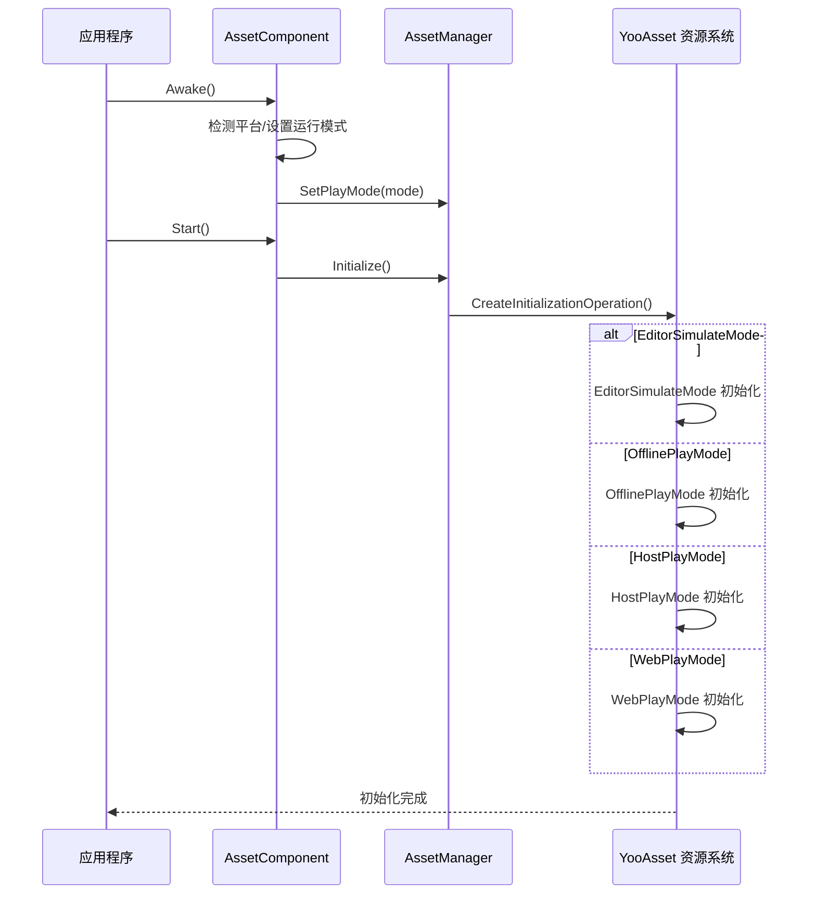

# プラットフォームサポート概览

GameFrameX Asset コンポーネントサポート多种 Unity プラットフォーム，并提供します柔軟的运行モード来适配不同的デプロイシーン。このドキュメント概要了系统サポート的プラットフォーム、运行モードおよびプラットフォーム自动检测机制。

## 概要

GameFrameX Asset コンポーネント基于 [YooAsset](https://www.yooasset.com/) リソースシステムビルド，提供します統一された的リソースロードインターフェース，同時にサポート多种 Unity プラットフォーム和运行モード。系统設計考虑了不同プラットフォーム的差异性，通过运行モード（Play Mode）来适配各种デプロイシーン，含みますエディタ开发、オフラインゲーム、ホットアップデート游戏および WebGL プラットフォーム。

运行モード是理解プラットフォームサポート的コアコンセプト。不同的运行モード决定了リソース的ロード方法和アップデート策略，開発者〜する必要があります根据目标プラットフォーム选择合适的运行モード。系统还提供しますプラットフォーム自动检测機能，在某些情况下会根据コンパイル目标プラットフォーム自动选择最合适的运行モード。

## サポート的プラットフォーム

GameFrameX Asset コンポーネントサポート的プラットフォーム可分为以下几类：

| プラットフォーム分类 | 具体プラットフォーム | 推奨运行モード | 説明 |
|---------|---------|-------------|------|
| エディタ | Unity Editor | EditorSimulateMode | 用于开发フェーズ的快速迭代 |
| PCプラットフォーム | Windows, macOS, Linux | HostPlayMode / OfflinePlayMode | サポートホットアップデート或单机デプロイ |
| モバイルプラットフォーム | iOS, Android | HostPlayMode / OfflinePlayMode | サポートホットアップデート或单机デプロイ |
| Webプラットフォーム | WebGL | WebPlayMode | 专门最適化的 Web プラットフォームモード |
| ミニゲーム | 抖音、快手、WeChatミニゲーム | WebPlayMode | 基于 WebGL 的ミニゲームプラットフォーム |

### 動作モード详解

系统提供します四种运行モード，每种モード適しています不同的シーン：

```csharp
// 运行模式定义 (来自 YooAsset)
public enum EPlayMode
{
    EditorSimulateMode,  // 编辑器模拟模式
    OfflinePlayMode,    // 单机运行模式
    HostPlayMode,       // 联机运行模式（热更新）
    WebPlayMode         // WebGL 运行模式
}
```

> Source: [AssetManager.Initialization.cs](https://github.com/GameFrameX/com.gameframex.unity.asset/blob/main/Runtime/Asset/AssetManager.Initialization.cs#L20-L46)

## プラットフォーム选择フロー

系统在不同環境下会自动选择合适的运行モード。以下是运行モード的选择逻辑：


### 自动プラットフォーム检测実装

在 `AssetComponent` 中，系统会在ランタイム自动检测プラットフォーム并调整运行モード。以下是コア実装逻辑：

```csharp
protected override void Awake()
{
#if !UNITY_EDITOR
    // 在非编辑器环境下，如果配置了 EditorSimulateMode，自动切换为联机模式
    if (GamePlayMode == EPlayMode.EditorSimulateMode)
    {
        GamePlayMode = EPlayMode.HostPlayMode;
    }
    
    // WebGL 平台强制使用 WebPlayMode
#if UNITY_WEBGL
    GamePlayMode = EPlayMode.WebPlayMode;
#endif
#endif
    // ... 后续初始化逻辑
}
```

> Source: [AssetComponent.cs](https://github.com/GameFrameX/com.gameframex.unity.asset/blob/main/Runtime/Asset/AssetComponent.cs#L42-L64)

这种設計確認してください了：
- 开发フェーズ〜できます使用模拟モード快速迭代
- 打パッケージリリース后自动切换到合适的运行モード
- WebGL プラットフォーム始终使用专门最適化的 WebPlayMode

## 動作モード与初期化

不同的运行モード对应不同的リソース初期化方法。系统在 `AssetManager` 中根据选定的运行モード呼び出し相应的初期化メソッド：



### 各モード的初期化メソッド

系统在 `AssetManager.Initialization.cs` 中为每种运行モード提供します专门的初期化メソッド：

```csharp
private InitializationOperation CreateInitializationOperationHandler(
    ResourcePackage resourcePackage, 
    string hostServerURL, 
    string fallbackHostServerURL)
{
    switch (PlayMode)
    {
        case EPlayMode.EditorSimulateMode:
            return InitializeYooAssetEditorSimulateMode(resourcePackage);
        case EPlayMode.OfflinePlayMode:
            return InitializeYooAssetOfflinePlayMode(resourcePackage);
        case EPlayMode.HostPlayMode:
            return InitializeYooAssetHostPlayMode(resourcePackage, hostServerURL, fallbackHostServerURL);
        case EPlayMode.WebPlayMode:
            return InitializeYooAssetWebPlayMode(resourcePackage, hostServerURL, fallbackHostServerURL);
    }
}
```

> Source: [AssetManager.Initialization.cs](https://github.com/GameFrameX/com.gameframex.unity.asset/blob/main/Runtime/Asset/AssetManager.Initialization.cs#L18-L47)

## WebGL 与ミニゲームプラットフォーム

WebGL プラットフォーム是该コンポーネント的重点サポート对象，除了標準的 WebPlayMode 外，还サポート多种ミニゲームプラットフォーム：

```csharp
private InitializationOperation InitializeYooAssetWebPlayMode(
    ResourcePackage resourcePackage, 
    string hostServerURL, 
    string fallbackHostServerURL)
{
    var initParameters = new WebPlayModeParameters();
    FileSystemParameters webFileSystem = null;
    
#if UNITY_WEBGL
#if ENABLE_DOUYIN_MINI_GAME
    // 抖音小游戏特殊处理
    TTSDK.TT.PreloadConcurrent(10);
    // ... 创建 ByteGame 文件系统
#elif ENABLE_WECHAT_MINI_GAME
    // 微信小游戏特殊处理
    WeChatWASM.WXBase.PreloadConcurrent(10);
    // ... 创建 Wechat 文件系统
#elif ENABLE_KUAISHOU_MINI_GAME
    // 快手小游戏特殊处理
    KSWASM.KSBase.PreloadConcurrent(10);
    // ... 创建 KuaiShou 文件系统
#else
    // 默认 WebGL 文件系统
    webFileSystem = FileSystemParameters.CreateDefaultWebFileSystemParameters();
#endif
#else
    webFileSystem = FileSystemParameters.CreateDefaultWebFileSystemParameters();
#endif
    
    initParameters.WebFileSystemParameters = webFileSystem;
    return resourcePackage.InitializeAsync(initParameters);
}
```

> Source: [AssetManager.Initialization.cs](https://github.com/GameFrameX/com.gameframex.unity.asset/blob/main/Runtime/Asset/AssetManager.Initialization.cs#L85-L146)

### サポート的ミニゲームプラットフォーム

| プラットフォーム | 预定義符号 | 特点 |
|-----|----------|------|
| DouYinミニゲーム | `ENABLE_DOUYIN_MINI_GAME` | 使用 ByteGameFileSystem |
| WeChatミニゲーム | `ENABLE_WECHAT_MINI_GAME` | 使用 WechatFileSystem |
| KuaiShouミニゲーム | `ENABLE_KUAISHOU_MINI_GAME` | 使用 KuaiShouFileSystem |

## 設定运行モード

在 Unity エディタ中，〜できます通过 `AssetComponent` コンポーネント設定运行モード：

```csharp
[Tooltip("当目标平台为Web平台时，将会强制设置为 WebPlayMode")]
[SerializeField]
private EPlayMode m_GamePlayMode;
```

> Source: [AssetComponent.cs](https://github.com/GameFrameX/com.gameframex.unity.asset/blob/main/Runtime/Asset/AssetComponent.cs#L20-L21)

設定ステップ：
1. 在シーン中作成或选择带有 `AssetComponent` 的 GameObject
2. 在 Inspector パネル中找到 "Game Play Mode" プロパティ
3. 选择适合的运行モード
4. ビルドプロジェクト时，系统会自动根据目标プラットフォーム调整モード

## 動作モード选择ガイド

根据不同的プロジェクト需求，选择合适的运行モード：

| シーン | 推奨モード | 原因 |
|-----|---------|------|
| エディタ开发デバッグ | EditorSimulateMode | 快速ロード，无需打パッケージ |
| 单机独立游戏 | OfflinePlayMode | リソース内置，无需网络 |
| 〜する必要がありますホットアップデート的游戏 | HostPlayMode | サポートリソースアップデート |
| WebGL Web ゲーム | WebPlayMode | 针对 Web プラットフォーム最適化 |
| 微信/DouYinミニゲーム | WebPlayMode + プラットフォーム符号 | プラットフォーム原生サポート |

## 関連リンク

- [WebGL プラットフォーム設定](./7-platforms.webgl) - 詳細的 WebGL プラットフォーム設定説明
- [运行モード](./6-configuration.play-modes) - 运行モード的詳細設定オプション
- [リソースロードインターフェース](./5-api-reference.loading-api) - リソースロード API リファレンス
- [コンポーネント設定](./6-configuration.component-settings) - AssetComponent 設定説明
