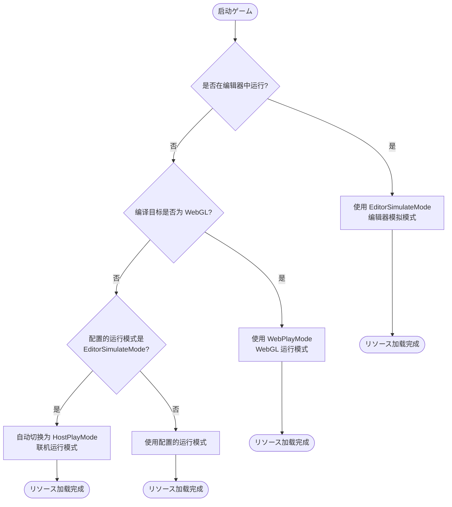
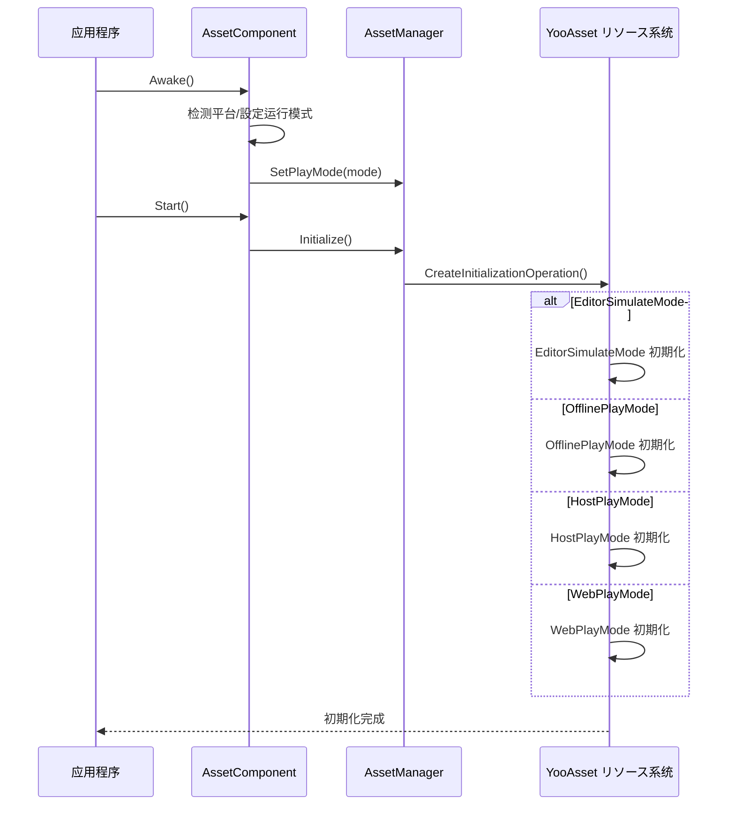

# 平台サポート概要

GameFrameX Asset コンポーネントサポート多种 Unity 平台，并提供します灵活的运行模式来适配不同的部署シーン。本文档概述了系统サポート的平台、运行模式以及平台自动检测机制。

## 概要

GameFrameX Asset コンポーネント基づく [YooAsset](https://www.yooasset.com/) リソース系统构建，提供します统一的リソース加载インターフェース，同时サポート多种 Unity 平台和运行模式。系统设计考虑了不同平台的差异性，を通じて运行模式（Play Mode）来适配各种部署シーン，包括编辑器开发、单机ゲーム、ホットアップデートゲーム以及 WebGL 平台。

运行模式是理解平台サポート的コア概念。不同的运行模式决定了リソース的加载方法和更新策略，開発者必要に基づいて目标平台选择合适的运行模式。系统还提供します平台自动检测機能，在某些情况下会に基づいて编译目标平台自动选择最合适的运行模式。

## サポート的平台

GameFrameX Asset コンポーネントサポート的平台可分为以下几クラス：

| 平台分クラス | 具体平台 | 推荐运行模式 | 説明 |
|---------|---------|-------------|------|
| 编辑器 | Unity Editor | EditorSimulateMode | に使用开发阶段的快速迭代 |
| PC平台 | Windows, macOS, Linux | HostPlayMode / OfflinePlayMode | サポートホットアップデート或单机部署 |
| 移动平台 | iOS, Android | HostPlayMode / OfflinePlayMode | サポートホットアップデート或单机部署 |
| Web平台 | WebGL | WebPlayMode | 专门优化的 Web 平台模式 |
| 小ゲーム | 抖音、快手、微信小ゲーム | WebPlayMode | 基づく WebGL 的小ゲーム平台 |

### 运行模式详解

系统提供します四种运行模式，每种模式适に使用不同的シーン：

```csharp
// 运行模式定义 (来自 YooAsset)
public enum EPlayMode
{
    EditorSimulateMode,  // 编辑器模拟模式
    OfflinePlayMode,    // 单机运行模式
    HostPlayMode,       // 联机运行模式（ホットアップデート）
    WebPlayMode         // WebGL 运行模式
}
```

> Source: [AssetManager.Initialization.cs](https://github.com/GameFrameX/com.gameframex.unity.asset/blob/main/Runtime/Asset/AssetManager.Initialization.cs#L20-L46)

## 平台选择フロー

系统在不同环境下会自动选择合适的运行模式。以下是运行模式的选择逻辑：



### 自动平台检测実装

在 `AssetComponent` 中，系统会在运行时自动检测平台并调整运行模式。以下是コア実装逻辑：

```csharp
protected override void Awake()
{
#if !UNITY_EDITOR
    // 在非编辑器环境下，如果配置了 EditorSimulateMode，自动切换为联机模式
    if (GamePlayMode == EPlayMode.EditorSimulateMode)
    {
        GamePlayMode = EPlayMode.HostPlayMode;
    }
    
    // WebGL 平台强制使用 WebPlayMode
#if UNITY_WEBGL
    GamePlayMode = EPlayMode.WebPlayMode;
#endif
#endif
    // ... 后续初期化逻辑
}
```

> Source: [AssetComponent.cs](https://github.com/GameFrameX/com.gameframex.unity.asset/blob/main/Runtime/Asset/AssetComponent.cs#L42-L64)

这种设计确保了：
- 开发阶段可能使用模拟模式快速迭代
- 打包发布后自动切换到合适的运行模式
- WebGL 平台始终使用专门优化的 WebPlayMode

## 运行模式与初期化

不同的运行模式对应不同的リソース初期化方法。系统在 `AssetManager` 中に基づいて选定的运行模式呼び出し相应的初期化メソッド：



### 各模式的初期化メソッド

系统在 `AssetManager.Initialization.cs` 中为每种运行模式提供します专门的初期化メソッド：

```csharp
private InitializationOperation CreateInitializationOperationHandler(
    ResourcePackage resourcePackage, 
    string hostServerURL, 
    string fallbackHostServerURL)
{
    switch (PlayMode)
    {
        case EPlayMode.EditorSimulateMode:
            return InitializeYooAssetEditorSimulateMode(resourcePackage);
        case EPlayMode.OfflinePlayMode:
            return InitializeYooAssetOfflinePlayMode(resourcePackage);
        case EPlayMode.HostPlayMode:
            return InitializeYooAssetHostPlayMode(resourcePackage, hostServerURL, fallbackHostServerURL);
        case EPlayMode.WebPlayMode:
            return InitializeYooAssetWebPlayMode(resourcePackage, hostServerURL, fallbackHostServerURL);
    }
}
```

> Source: [AssetManager.Initialization.cs](https://github.com/GameFrameX/com.gameframex.unity.asset/blob/main/Runtime/Asset/AssetManager.Initialization.cs#L18-L47)

## WebGL 与小ゲーム平台

WebGL 平台是该コンポーネント的重点サポート对象，除了标准的 WebPlayMode 外，还サポート多种小ゲーム平台：

```csharp
private InitializationOperation InitializeYooAssetWebPlayMode(
    ResourcePackage resourcePackage, 
    string hostServerURL, 
    string fallbackHostServerURL)
{
    var initParameters = new WebPlayModeParameters();
    FileSystemParameters webFileSystem = null;
    
#if UNITY_WEBGL
#if ENABLE_DOUYIN_MINI_GAME
    // 抖音小ゲーム特殊处理
    TTSDK.TT.PreloadConcurrent(10);
    // ... 作成 ByteGame ファイル系统
#elif ENABLE_WECHAT_MINI_GAME
    // 微信小ゲーム特殊处理
    WeChatWASM.WXBase.PreloadConcurrent(10);
    // ... 作成 Wechat ファイル系统
#elif ENABLE_KUAISHOU_MINI_GAME
    // 快手小ゲーム特殊处理
    KSWASM.KSBase.PreloadConcurrent(10);
    // ... 作成 KuaiShou ファイル系统
#else
    // 默认 WebGL ファイル系统
    webFileSystem = FileSystemParameters.CreateDefaultWebFileSystemParameters();
#endif
#else
    webFileSystem = FileSystemParameters.CreateDefaultWebFileSystemParameters();
#endif
    
    initParameters.WebFileSystemParameters = webFileSystem;
    return resourcePackage.InitializeAsync(initParameters);
}
```

> Source: [AssetManager.Initialization.cs](https://github.com/GameFrameX/com.gameframex.unity.asset/blob/main/Runtime/Asset/AssetManager.Initialization.cs#L85-L146)

### サポート的小ゲーム平台

| 平台 | 预定义符号 | 特点 |
|-----|----------|------|
| 抖音小ゲーム | `ENABLE_DOUYIN_MINI_GAME` | 使用 ByteGameFileSystem |
| 微信小ゲーム | `ENABLE_WECHAT_MINI_GAME` | 使用 WechatFileSystem |
| 快手小ゲーム | `ENABLE_KUAISHOU_MINI_GAME` | 使用 KuaiShouFileSystem |

## 設定运行模式

在 Unity 编辑器中，可能を通じて `AssetComponent` コンポーネント配置运行模式：

```csharp
[Tooltip("当目标平台为Web平台时，将会强制設定为 WebPlayMode")]
[SerializeField]
private EPlayMode m_GamePlayMode;
```

> Source: [AssetComponent.cs](https://github.com/GameFrameX/com.gameframex.unity.asset/blob/main/Runtime/Asset/AssetComponent.cs#L20-L21)

配置手順：
1. 在シーン中作成或选择带有 `AssetComponent` 的 GameObject
2. 在 Inspector 面板中找到 "Game Play Mode" プロパティ
3. 选择适合的运行模式
4. 构建プロジェクト时，系统会自动に基づいて目标平台调整模式

## 运行模式选择指南

に基づいて不同的プロジェクト需求，选择合适的运行模式：

| シーン | 推荐模式 | 原因 |
|-----|---------|------|
| 编辑器开发调试 | EditorSimulateMode | 快速加载，无需打包 |
| 单机独立ゲーム | OfflinePlayMode | リソース内置，无需网络 |
| 必要ホットアップデート的ゲーム | HostPlayMode | サポートリソース更新 |
| WebGL 网页ゲーム | WebPlayMode | 针对 Web 平台优化 |
| 微信/抖音小ゲーム | WebPlayMode + 平台符号 | 平台原生サポート |

## 関連リンク

- [WebGL 平台配置](./7-platforms.webgl) - 详细的 WebGL 平台配置説明
- [运行模式](./6-configuration.play-modes) - 运行模式的详细配置选项
- [リソース加载インターフェース](./5-api-reference.loading-api) - リソース加载 API 参考
- [コンポーネント配置](./6-configuration.component-settings) - AssetComponent 配置説明
