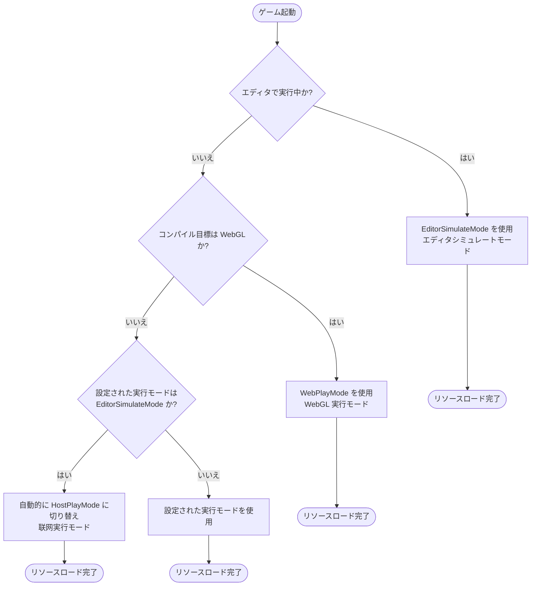
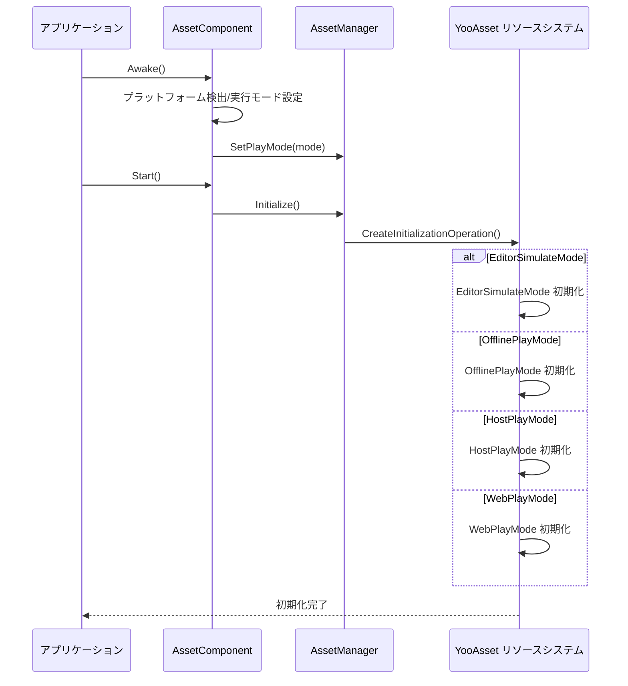

# プラットフォームサポート概要

GameFrameX Asset コンポーネントは複数の Unity プラットフォームをサポートし、柔軟な実行モードを提供하여異なる展開シナリオに適応します。このドキュメントはシステムがサポートするプラットフォーム、実行モード、およびプラットフォーム自動検出メカニズムの概要を説明します。

## 概要

GameFrameX Asset コンポーネントは [YooAsset](https://www.yooasset.com/) リソースシステムに基づいて構築されており、统一されたリソースロードインターフェースを提供的同时に、複数の Unity プラットフォームと実行モードをサポートしています。システムの設計では異なるプラットフォームの差異性が考慮されており、実行モード（Play Mode）を通じてエディタ開発、单機ゲーム、熱更新ゲームおよび WebGL プラットフォームなどの各种展開シナリオに適応します。

実行モードはプラットフォームサポートを理解するコアコンセプトです。異なる実行モードはリソースのロード方式と更新戦略を決定し、開発者は目標プラットフォームに基づいて適切な実行モードを選択する必要があります。システムはまたプラットフォーム自動検出機能を提供し、特定の状況ではコンパイル目標プラットフォームに基づいて最も適切な実行モードを自動的に選択します。

## サポートするプラットフォーム

GameFrameX Asset コンポーネントがサポートするプラットフォームは以下のように分類できます：

| プラットフォーム分類 | 具体的なプラットフォーム | 推奨実行モード | 説明 |
|---------|---------|-------------|------|
| エディタ | Unity Editor | EditorSimulateMode | 開発フェーズの快速反復に使用 |
| PCプラットフォーム | Windows, macOS, Linux | HostPlayMode / OfflinePlayMode | 熱更新または单機展開をサポート |
| モバイルプラットフォーム | iOS, Android | HostPlayMode / OfflinePlayMode | 熱更新または单機展開をサポート |
| Webプラットフォーム | WebGL | WebPlayMode | Web プラットフォームに特化した最適化モード |
| 小游戏 | 抖音、快手、微信小游戏 | WebPlayMode | WebGL に基づく小游戏プラットフォーム |

### 実行モードの詳細

システムは4種類の実行モードを提供し、各モードは異なるシーンに適しています：

```csharp
// 実行モード定義 (YooAsset から提供)
public enum EPlayMode
{
    EditorSimulateMode,  // エディタシミュレートモード
    OfflinePlayMode,    // 单機実行モード
    HostPlayMode,       // 联网実行モード（熱更新）
    WebPlayMode         // WebGL 実行モード
}
```

> Source: [AssetManager.Initialization.cs](https://github.com/GameFrameX/com.gameframex.unity.asset/blob/main/Runtime/Asset/AssetManager.Initialization.cs#L20-L46)

## プラットフォーム選択フロー

システムは異なる環境下で適切な実行モードを自動的に選択します。以下は実行モードの選択ロジックです：



### 自動プラットフォーム検出の実装

`AssetComponent` では、システムは実行時にプラットフォームを自動検出してから実行モードを調整します。以下はコア実装ロジックです：

```csharp
protected override void Awake()
{
#if !UNITY_EDITOR
    // 非エディタ環境では、EditorSimulateMode が設定されている場合、自動的に联网モードに切り替え
    if (GamePlayMode == EPlayMode.EditorSimulateMode)
    {
        GamePlayMode = EPlayMode.HostPlayMode;
    }

    // WebGL プラットフォームは強制的に WebPlayMode を使用
#if UNITY_WEBGL
    GamePlayMode = EPlayMode.WebPlayMode;
#endif
#endif
    // ... その他の初期化ロジック
}
```

> Source: [AssetComponent.cs](https://github.com/GameFrameX/com.gameframex.unity.asset/blob/main/Runtime/Asset/AssetComponent.cs#L42-L64)

この設計により以下が保証されます：
- 開発フェーズではシミュレートモードを使用して快速に反復可能
- パッケージング公開後は適切な実行モードに自動的に切り替え
- WebGL プラットフォームは常に専用の WebPlayMode を使用

## 実行モードと初期化

異なる実行モードは異なるリソース初期化方法に対応します。システムは `AssetManager` で選定された実行モードに従って対応する初期化メソッドを呼び出します：



### 各モードの初期化メソッド

システムは `AssetManager.Initialization.cs` で各実行モードに専用の初期化メソッドを提供します：

```csharp
private InitializationOperation CreateInitializationOperationHandler(
    ResourcePackage resourcePackage,
    string hostServerURL,
    string fallbackHostServerURL)
{
    switch (PlayMode)
    {
        case EPlayMode.EditorSimulateMode:
            return InitializeYooAssetEditorSimulateMode(resourcePackage);
        case EPlayMode.OfflinePlayMode:
            return InitializeYooAssetOfflinePlayMode(resourcePackage);
        case EPlayMode.HostPlayMode:
            return InitializeYooAssetHostPlayMode(resourcePackage, hostServerURL, fallbackHostServerURL);
        case EPlayMode.WebPlayMode:
            return InitializeYooAssetWebPlayMode(resourcePackage, hostServerURL, fallbackHostServerURL);
    }
}
```

> Source: [AssetManager.Initialization.cs](https://github.com/GameFrameX/com.gameframex.unity.asset/blob/main/Runtime/Asset/AssetManager.Initialization.cs#L18-L47)

## WebGL と小游戏プラットフォーム

WebGL プラットフォームは該当コンポーネントの重点サポート対象であり、標準の WebPlayMode の他に多种小游戏プラットフォームもサポートします：

```csharp
private InitializationOperation InitializeYooAssetWebPlayMode(
    ResourcePackage resourcePackage,
    string hostServerURL,
    string fallbackHostServerURL)
{
    var initParameters = new WebPlayModeParameters();
    FileSystemParameters webFileSystem = null;

#if UNITY_WEBGL
#if ENABLE_DOUYIN_MINI_GAME
    // 抖音小游戏の特殊処理
    TTSDK.TT.PreloadConcurrent(10);
    // ... ByteGame ファイルシステムを作成
#elif ENABLE_WECHAT_MINI_GAME
    // 微信小游戏の特殊処理
    WeChatWASM.WXBase.PreloadConcurrent(10);
    // ... Wechat ファイルシステムを作成
#elif ENABLE_KUAISHOU_MINI_GAME
    // 快手小游戏の特殊処理
    KSWASM.KSBase.PreloadConcurrent(10);
    // ... KuaiShou ファイルシステムを作成
#else
    // デフォルト WebGL ファイルシステム
    webFileSystem = FileSystemParameters.CreateDefaultWebFileSystemParameters();
#endif
#else
    webFileSystem = FileSystemParameters.CreateDefaultWebFileSystemParameters();
#endif

    initParameters.WebFileSystemParameters = webFileSystem;
    return resourcePackage.InitializeAsync(initParameters);
}
```

> Source: [AssetManager.Initialization.cs](https://github.com/GameFrameX/com.gameframex.unity.asset/blob/main/Runtime/Asset/AssetManager.Initialization.cs#L85-L146)

### サポートする小游戏プラットフォーム

| プラットフォーム | 定義シンボル | 特徴 |
|-----|----------|------|
| 抖音小游戏 | `ENABLE_DOUYIN_MINI_GAME` | ByteGameFileSystem を使用 |
| 微信小游戏 | `ENABLE_WECHAT_MINI_GAME` | WechatFileSystem を使用 |
| 快手小游戏 | `ENABLE_KUAISHOU_MINI_GAME` | KuaiShouFileSystem を使用 |

## 実行モードの設定

Unity エディタでは、`AssetComponent` コンポーネントを通じて実行モードを設定できます：

```csharp
[Tooltip("目標プラットフォームがWebプラットフォームの場合、強制的に WebPlayMode に設定されます")]
[SerializeField]
private EPlayMode m_GamePlayMode;
```

> Source: [AssetComponent.cs](https://github.com/GameFrameX/com.gameframex.unity.asset/blob/main/Runtime/Asset/AssetComponent.cs#L20-L21)

設定手順：
1. シーンで `AssetComponent` を持つ GameObject を作成または選択
2. Inspector パネルで "Game Play Mode" プロパティを見つける
3. 適切な実行モードを選択
4. プロジェクトをビルドする際、システムは目標プラットフォームに基づいて自動的にモードを調整

## 実行モード選択ガイド

プロジェクトの需求に基づいて、適切な実行モードを選択：

| シーン | 推奨モード | 理由 |
|-----|---------|------|
| エディタ開発デバッグ | EditorSimulateMode | 快速ロード、パッケージング不要 |
| 单機獨立ゲーム | OfflinePlayMode | リソース内置、ネットワーク不要 |
| 熱更新が必要なゲーム | HostPlayMode | リソース更新をサポート |
| WebGL 网页ゲーム | WebPlayMode | Web プラットフォームに最適化 |
| 微信/抖音小游戏 | WebPlayMode + プラットフォームシンボル | プラットフォームネイティブサポート |

## 関連リンク

- [WebGL プラットフォーム設定](./7-platforms.webgl) - WebGL プラットフォームの詳細な設定説明
- [実行モード](./6-configuration.play-modes) - 実行モードの詳細な設定オプション
- [リソースロードインターフェース](./5-api-reference.loading-api) - リソースロード API リファレンス
- [コンポーネント設定](./6-configuration.component-settings) - AssetComponent 設定説明