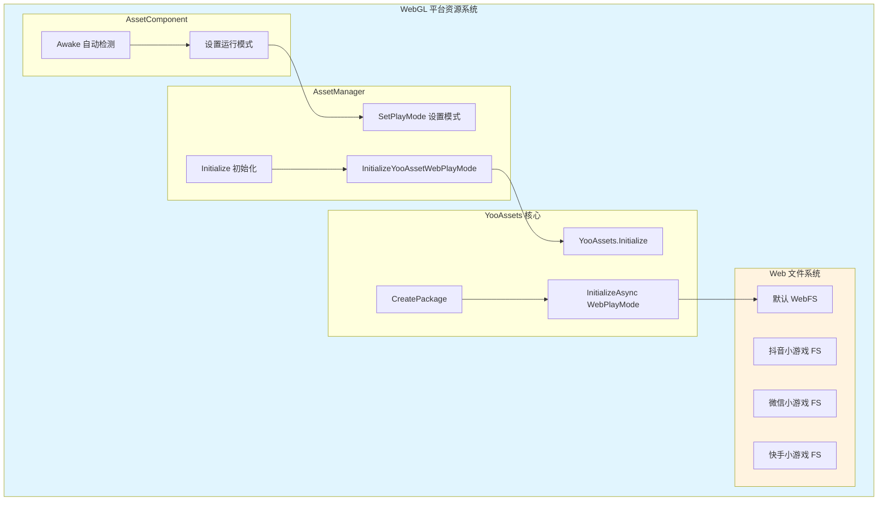
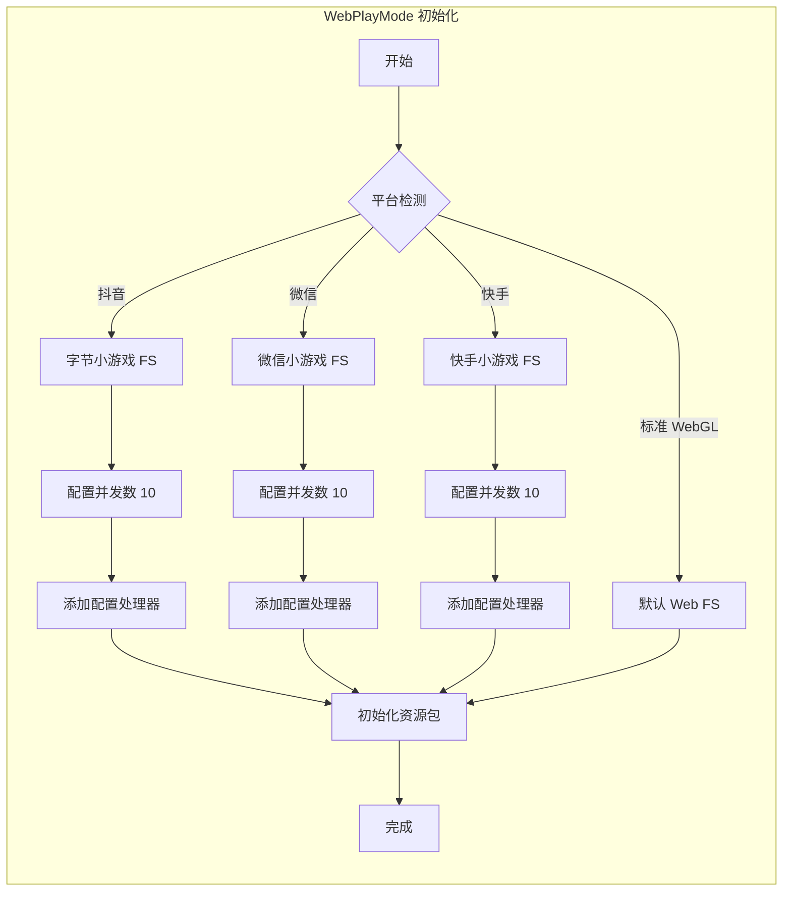

# WebGL プラットフォーム

このドキュメント介绍 GameFrameX Asset リソースコンポーネント对 WebGL プラットフォーム的サポート和設定。

## 概要

WebGL プラットフォーム是 Unity デプロイ到 Web 浏览器的重要な目标プラットフォーム。GameFrameX Asset コンポーネント基于 YooAssets フレームワーク，提供します完全な的 WebGL リソースロード解決策。该方案サポート標準 WebGL ビルドおよび多种ミニゲームプラットフォーム（DouYinミニゲーム、WeChatミニゲーム、KuaiShouミニゲーム）。

WebGL プラットフォーム的主な特点含みます：
- **浏览器環境限制**：无法使用传统的ファイル系统，〜する必要があります特殊的リソースロード机制
- **单线程执行**：JavaScript 環境下リソースロード〜する必要があります异步処理
- **缓存机制**：依赖浏览器缓存存储下载的リソース
- **ミニゲームプラットフォームサポート**：针对国内主流ミニゲームプラットフォーム进行了专门适配

## アーキテクチャ設計



### コアコンポーネント説明

| コンポーネント | 职责 |
|------|------|
| AssetComponent | 在 Awake 时自动检测 WebGL 環境并設定运行モード |
| AssetManager | 管理リソース初期化和ロード，呼び出し YooAssets |
| YooAssets | 底层リソースシステム，提供 WebPlayMode 初期化 |
| Web ファイル系统 | 処理 Web 環境下的リソースロード和缓存 |

## 自动プラットフォーム检测

GameFrameX 実装了智能的自动プラットフォーム检测机制。在非エディタ環境下ビルド时，AssetComponent 会自动识别目标プラットフォーム并选择合适的运行モード。

```csharp
using GameFrameX.Asset.Runtime;
using UnityEngine;

[DisallowMultipleComponent]
[AddComponentMenu("GameFrameX/Asset")]
public sealed class AssetComponent : GameFrameworkComponent
{
    [Tooltip("当目标平台为Web平台时，将会强制设置为WebPlayMode")]
    [SerializeField]
    private EPlayMode m_GamePlayMode;

    protected override void Awake()
    {
#if !UNITY_EDITOR
        if (GamePlayMode == EPlayMode.EditorSimulateMode)
        {
            GamePlayMode = EPlayMode.HostPlayMode;
        }
#if UNITY_WEBGL
        GamePlayMode = EPlayMode.WebPlayMode;
#endif
#endif
        base.Awake();
        _assetManager.SetPlayMode(GamePlayMode);
    }
}
```

> Source: [AssetComponent.cs](https://github.com/GameFrameX/com.gameframex.unity.asset/blob/main/Runtime/Asset/AssetComponent.cs#L42-L64)

### 检测逻辑説明

| 条件 | 行为 |
|------|------|
| エディタ環境 | 使用設定的 GamePlayMode |
| 非エディタ + EditorSimulateMode | 转换为 HostPlayMode |
| 非エディタ + UNITY_WEBGL | 自动切换为 WebPlayMode |
| 其他情况 | 保持設定的运行モード |

## WebPlayMode 初期化フロー

当設定为 WebPlayMode 时，AssetManager 会呼び出し `InitializeYooAssetWebPlayMode` メソッド进行初期化。该メソッドサポート多种 Web 環境設定。

```csharp
/// <summary>
/// 初始化YooAsset WebGL运行模式
/// </summary>
private InitializationOperation InitializeYooAssetWebPlayMode(
    ResourcePackage resourcePackage,
    string hostServerURL,
    string fallbackHostServerURL)
{
    var initParameters = new WebPlayModeParameters();
    FileSystemParameters webFileSystem = null;

#if UNITY_WEBGL
#if ENABLE_DOUYIN_MINI_GAME
    // 抖音小游戏配置
    TTSDK.TT.PreloadConcurrent(10);
    GameEntry.GetComponent<AssetComponent>().gameObject
        .GetOrAddComponent<DouYinConfigHandler>();
    
    if (hostServerURL.IsNullOrWhiteSpace())
    {
        webFileSystem = ByteGameFileSystemCreater.CreateByteGameFileSystemParameters();
    }
    else
    {
        webFileSystem = ByteGameFileSystemCreater.CreateByteGameFileSystemParameters(hostServerURL);
    }
#elif ENABLE_WECHAT_MINI_GAME
    // 微信小游戏配置
    WeChatWASM.WXBase.PreloadConcurrent(10);
    GameEntry.GetComponent<AssetComponent>().gameObject
        .GetOrAddComponent<WeChatConfigHandler>();
    
    string packageRoot = $"{WeChatWASM.WXBase.env.USER_DATA_PATH}/__GAME_FILE_CACHE/{YooAssetSettingsData.Setting.DefaultYooFolderName}";
    
    if (hostServerURL.IsNullOrWhiteSpace())
    {
        webFileSystem = WechatFileSystemCreater.CreateWechatFileSystemParameters();
    }
    else
    {
        webFileSystem = WechatFileSystemCreater.CreateWechatPathFileSystemParameters(hostServerURL);
    }
#elif ENABLE_KUAISHOU_MINI_GAME
    // 快手小游戏配置
#if !UNITY_EDITOR
    KSWASM.KSBase.PreloadConcurrent(10);
#endif
    GameEntry.GetComponent<AssetComponent>().gameObject
        .GetOrAddComponent<KuaiShouConfigHandler>();
    
    if (hostServerURL.IsNullOrWhiteSpace())
    {
        webFileSystem = KuaiShouFileSystemCreater.CreateKuaiShouFileSystemParameters();
    }
    else
    {
        webFileSystem = KuaiShouFileSystemCreater.CreateKuaiShouPathFileSystemParameters(hostServerURL);
    }
#else
    // 标准 WebGL 文件系统
    webFileSystem = FileSystemParameters.CreateDefaultWebFileSystemParameters();
#endif
#else
    // 非 WebGL 环境回退
    webFileSystem = FileSystemParameters.CreateDefaultWebFileSystemParameters();
#endif

    initParameters.WebFileSystemParameters = webFileSystem;
    return resourcePackage.InitializeAsync(initParameters);
}
```

> Source: [AssetManager.Initialization.cs](https://github.com/GameFrameX/com.gameframex.unity.asset/blob/main/Runtime/Asset/AssetManager.Initialization.cs#L85-L146)

## 小程序プラットフォームサポート

GameFrameX Asset コンポーネント针对国内主流小程序プラットフォーム提供します专门的适配サポート。

### サポート的プラットフォーム

| プラットフォーム | 预定義符号 | 特性 |
|------|-----------|------|
| DouYinミニゲーム | ENABLE_DOUYIN_MINI_GAME | ByteDanceミニゲームファイル系统 |
| WeChatミニゲーム | ENABLE_WECHAT_MINI_GAME | 微信缓存ディレクトリ設定 |
| KuaiShouミニゲーム | ENABLE_KUAISHOU_MINI_GAME | 快手ファイル系统适配 |

### プラットフォーム初期化差异



### 設定処理器説明

每个小程序プラットフォーム都〜する必要があります追加对应的設定処理器：
- **DouYinConfigHandler**：処理DouYinミニゲーム設定
- **WeChatConfigHandler**：処理WeChatミニゲーム設定
- **KuaiShouConfigHandler**：処理KuaiShouミニゲーム設定

这些処理器负责プラットフォーム特定的ファイル系统設定和リソースパス映射。

## リソースパッケージ初期化

在 WebGL プラットフォーム上使用リソースパッケージ时，〜する必要があります正确設定初期化パラメータ：

```csharp
using UnityEngine;
using GameFrameX.Runtime;

public class WebGLBootstrap : MonoBehaviour
{
    private async void Start()
    {
        var assetComponent = GameEntry.GetComponent<AssetComponent>();
        
        // 初始化默认资源包
        bool success = await assetComponent.InitPackageAsync(
            "DefaultPackage",           // 包名称
            "https://cdn.example.com/", // 主服务器地址
            "https://backup.example.com/", // 备用服务器地址
            true                        // 设为默认包
        );
        
        if (success)
        {
            Debug.Log("WebGL 资源包初始化成功");
        }
    }
}
```

## 動作モード設定

GameFrameX Asset コンポーネントサポート多种运行モード，WebGL プラットフォーム主な使用 WebPlayMode：

| モード | 适用シーン | WebGL サポート |
|------|----------|------------|
| EditorSimulateMode | エディタ开发デバッグ | ❌ 不サポート |
| OfflinePlayMode | 单机运行 | ⚠️ 有限サポート |
| HostPlayMode | ホットアップデートモード | ⚠️ 有条件サポート |
| WebPlayMode | WebGL 运行環境 | ✅ 完全サポート |

> 关于运行モード的詳細設定，请リファレンス [运行モード](./6-configuration.play-modes) ドキュメント。

## よくある問題

### Q1: WebGL ビルド后リソースロード失敗

**考えられる原因**：
- 服务器地址設定エラー
- CORS 跨域策略問題
- リソースパッケージ未正确ビルド

**解決策**：
1. 確認リソース服务器是否サポート CORS
2. 確認リソースパッケージ已使用 WebGL プラットフォームビルド
3. 検証 hostServerURL 設定正确

### Q2: 小程序プラットフォームリソースロード缓慢

**考えられる原因**：
- 并发下载数过高
- リソース未进行分パッケージ処理

**解決策**：
1. 在コード中调整 PreloadConcurrent パラメータ
2. 使用リソース标签进行按需ロード
3. 启用リソース压缩和合并

### Q3: 内存占用过高

**考えられる原因**：
- 同時にロード过多リソース
- 未及时解放リソース句柄

**解決策**：
1. 使用 `UnloadAsset` 及时解放已使用完的リソース
2. 合理設定 `DownloadingMaxNum` 控制并发
3. 定期呼び出し `UnloadUnusedAssetsAsync` 清理无用リソース

## 関連リンク

- [运行モード設定](./6-configuration.play-modes) - 詳細的运行モード説明
- [コンポーネント設定](./6-configuration.component-settings) - AssetComponent 設定详解
- [リソースロードインターフェース](./5-api-reference.loading-api) - 异步/同期ロード API
- [リソースパッケージ管理](./5-api-reference.package-management) - リソースパッケージ操作
- [Asset コンポーネント介绍](./1-overview.introduction) - Asset コンポーネント概要
- [機能特性](./1-overview.features) - 完全な機能列表
