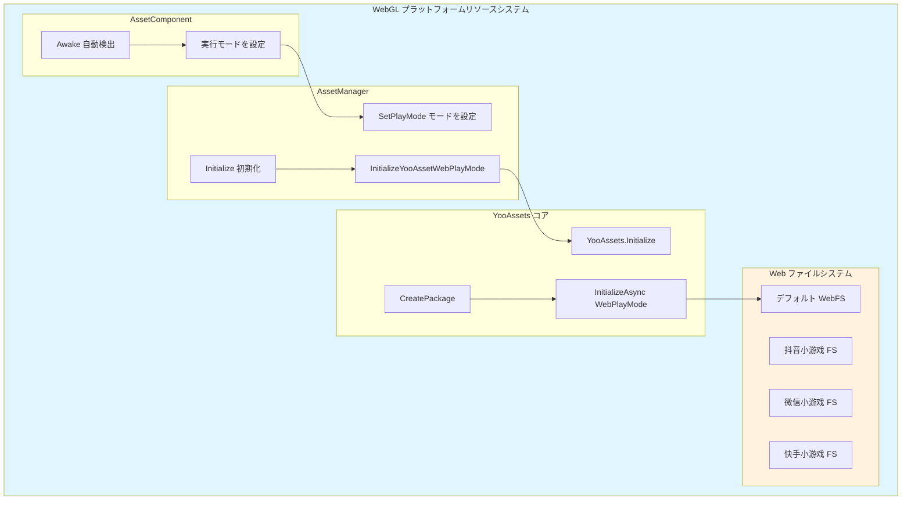
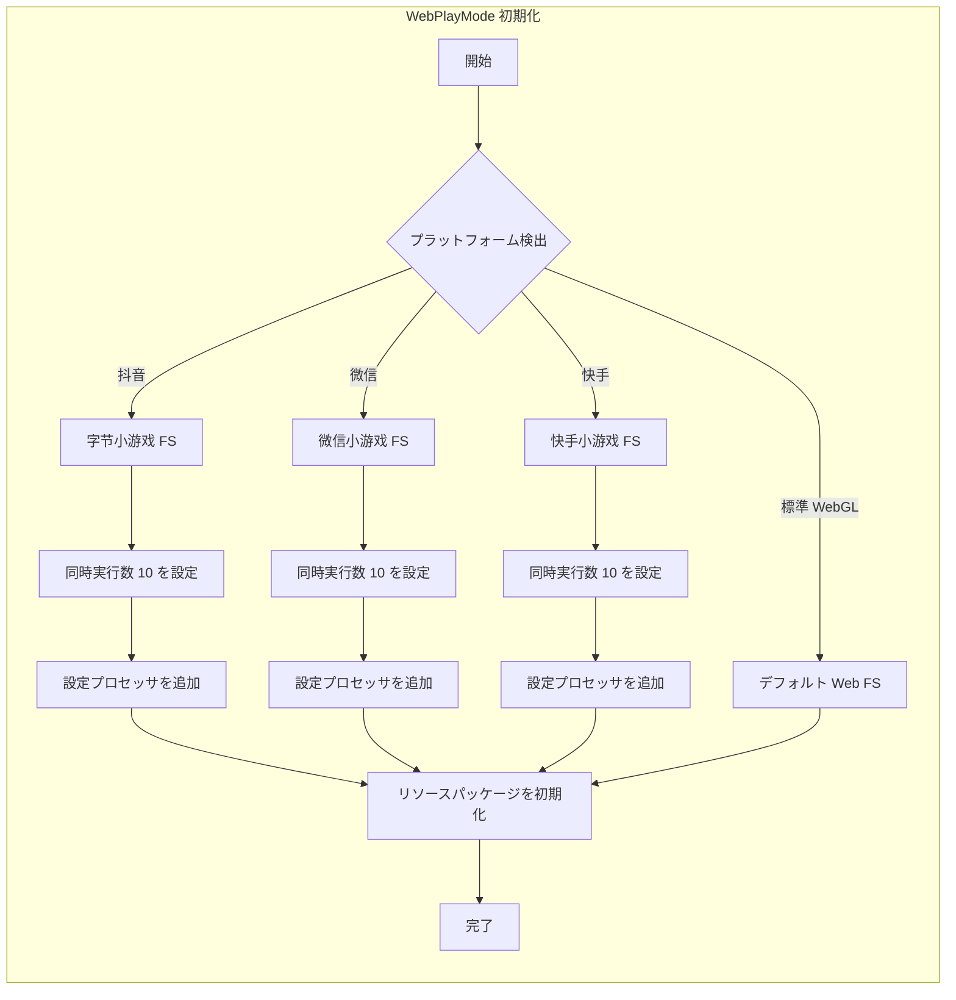

# WebGL プラットフォーム

このドキュメントでは、GameFrameX Asset リソースコンポーネントの WebGL プラットフォームサポートと設定について説明します。

## 概要

WebGL プラットフォームは Unity が Web ブラウザに展開するための重要な目標プラットフォームです。GameFrameX Asset コンポーネントは YooAssets フレームワークに基づいて構築されており、完全な WebGL リソースロード解决方案を提供します。この方案は標準的な WebGL ビルドだけでなく、多种の小游戏プラットフォーム（抖音小游戏、微信小游戏、快手小游戏）もサポートします。

WebGL プラットフォームの主な特徴は以下を含みます：
- **ブラウザ環境の制限**：従来のファイルシステムを使用できず、特別なリソースロードメカニズムが必要
- **单一スレッド実行**：JavaScript 環境でのリソースロードは非同期処理が必要
- **キャッシュメカニズム**：ブラウザキャッシュにダウンロードしたリソースを存储
- **小游戏プラットフォームサポート**：国内主流小游戏プラットフォーム向けの専用adapter

## アーキテクチャ設計



### コアコンポーネント説明

| コンポーネント | 职责 |
|------|------|
| AssetComponent | Awake で WebGL 環境を自動検出してから実行モードを設定 |
| AssetManager | リソース初期化とロードを管理、YooAssets を呼び出す |
| YooAssets | 底層リソースシステム、WebPlayMode 初期化を提供 |
| Web ファイルシステム | Web 環境でのリソースロードとキャッシュを処理 |

## 自動プラットフォーム検出

GameFrameX はインテリジェントな自動プラットフォーム検出メカニズムを実装しています。非エディタ環境でビルドする際、AssetComponent は目標プラットフォームを自動的に識別し、適切な実行モード」を選択します。

```csharp
using GameFrameX.Asset.Runtime;
using UnityEngine;

[DisallowMultipleComponent]
[AddComponentMenu("GameFrameX/Asset")]
public sealed class AssetComponent : GameFrameworkComponent
{
    [Tooltip("目標プラットフォームがWebプラットフォームの場合、強制的に WebPlayMode に設定されます")]
    [SerializeField]
    private EPlayMode m_GamePlayMode;

    protected override void Awake()
    {
#if !UNITY_EDITOR
        if (GamePlayMode == EPlayMode.EditorSimulateMode)
        {
            GamePlayMode = EPlayMode.HostPlayMode;
        }
#if UNITY_WEBGL
        GamePlayMode = EPlayMode.WebPlayMode;
#endif
#endif
        base.Awake();
        _assetManager.SetPlayMode(GamePlayMode);
    }
}
```

> Source: [AssetComponent.cs](https://github.com/GameFrameX/com.gameframex.unity.asset/blob/main/Runtime/Asset/AssetComponent.cs#L42-L64)

### 検出ロジック説明

| 条件 | 動作 |
|------|------|
| エディタ環境 | 設定された GamePlayMode を使用 |
| 非エディタ + EditorSimulateMode | HostPlayMode に変換 |
| 非エディタ + UNITY_WEBGL | 自動的に WebPlayMode に切り替え |
| その他 | 設定された実行モードを維持 |

## WebPlayMode 初期化フロー

WebPlayMode に設定すると、AssetManager は `InitializeYooAssetWebPlayMode` メソッドを呼び出して初期化を実行します。このメソッドは多种の Web 環境設定をサポートします。

```csharp
/// <summary>
/// YooAsset WebGL 実行モードを初期化
/// </summary>
private InitializationOperation InitializeYooAssetWebPlayMode(
    ResourcePackage resourcePackage,
    string hostServerURL,
    string fallbackHostServerURL)
{
    var initParameters = new WebPlayModeParameters();
    FileSystemParameters webFileSystem = null;

#if UNITY_WEBGL
#if ENABLE_DOUYIN_MINI_GAME
    // 抖音小游戏設定
    TTSDK.TT.PreloadConcurrent(10);
    GameEntry.GetComponent<AssetComponent>().gameObject
        .GetOrAddComponent<DouYinConfigHandler>();

    if (hostServerURL.IsNullOrWhiteSpace())
    {
        webFileSystem = ByteGameFileSystemCreater.CreateByteGameFileSystemParameters();
    }
    else
    {
        webFileSystem = ByteGameFileSystemCreater.CreateByteGameFileSystemParameters(hostServerURL);
    }
#elif ENABLE_WECHAT_MINI_GAME
    // 微信小游戏設定
    WeChatWASM.WXBase.PreloadConcurrent(10);
    GameEntry.GetComponent<AssetComponent>().gameObject
        .GetOrAddComponent<WeChatConfigHandler>();

    string packageRoot = $"{WeChatWASM.WXBase.env.USER_DATA_PATH}/__GAME_FILE_CACHE/{YooAssetSettingsData.Setting.DefaultYooFolderName}";

    if (hostServerURL.IsNullOrWhiteSpace())
    {
        webFileSystem = WechatFileSystemCreater.CreateWechatFileSystemParameters();
    }
    else
    {
        webFileSystem = WechatFileSystemCreater.CreateWechatPathFileSystemParameters(hostServerURL);
    }
#elif ENABLE_KUAISHOU_MINI_GAME
    // 快手小游戏設定
#if !UNITY_EDITOR
    KSWASM.KSBase.PreloadConcurrent(10);
#endif
    GameEntry.GetComponent<AssetComponent>().gameObject
        .GetOrAddComponent<KuaiShouConfigHandler>();

    if (hostServerURL.IsNullOrWhiteSpace())
    {
        webFileSystem = KuaiShouFileSystemCreater.CreateKuaiShouFileSystemParameters();
    }
    else
    {
        webFileSystem = KuaiShouFileSystemCreater.CreateKuaiShouPathFileSystemParameters(hostServerURL);
    }
#else
    // 標準 WebGL ファイルシステム
    webFileSystem = FileSystemParameters.CreateDefaultWebFileSystemParameters();
#endif
#else
    // 非 WebGL 環境にfallback
    webFileSystem = FileSystemParameters.CreateDefaultWebFileSystemParameters();
#endif

    initParameters.WebFileSystemParameters = webFileSystem;
    return resourcePackage.InitializeAsync(initParameters);
}
```

> Source: [AssetManager.Initialization.cs](https://github.com/GameFrameX/com.gameframex.unity.asset/blob/main/Runtime/Asset/AssetManager.Initialization.cs#L85-L146)

## 小程序プラットフォームサポート

GameFrameX Asset コンポーネントは国内主流小程序プラットフォーム向けに専用のadapterサポートを提供します。

### サポートするプラットフォーム

| プラットフォーム | 定義シンボル | 特徴 |
|------|-----------|------|
| 抖音小程序 | ENABLE_DOUYIN_MINI_GAME | 字节小游戏ファイルシステム |
| 微信小程序 | ENABLE_WECHAT_MINI_GAME | 微信キャッシュディレクトリ設定 |
| 快手小程序 | ENABLE_KUAISHOU_MINI_GAME | 快手ファイルシステムadapter |

### プラットフォーム初期化の違い



### 設定プロセッサの説明

各小程序プラットフォームには対応する設定プロセッサを追加する必要があります：
- **DouYinConfigHandler**：抖音小游戏設定を処理
- **WeChatConfigHandler**：微信小游戏設定を処理
- **KuaiShouConfigHandler**：快手小游戏設定を処理

これらのプロセッサはプラットフォーム特有のファイルシステム設定とリソースパスマッピングを担当します。

## リソースパッケージ初期化

WebGL プラットフォームでリソースパッケージを使用する際は、正しい初期化パラメータを設定する必要があります：

```csharp
using UnityEngine;
using GameFrameX.Runtime;

public class WebGLBootstrap : MonoBehaviour
{
    private async void Start()
    {
        var assetComponent = GameEntry.GetComponent<AssetComponent>();

        // デフォルトリソースパッケージを初期化
        bool success = await assetComponent.InitPackageAsync(
            "DefaultPackage",           // パッケージ名
            "https://cdn.example.com/", // メインサーバーアドレス
            "https://backup.example.com/", // バックアップサーバーアドレス
            true                        // デフォルトパッケージに設定するか
        );

        if (success)
        {
            Debug.Log("WebGL リソースパッケージの初期化成功");
        }
    }
}
```

## 実行モード設定

GameFrameX Asset コンポーネントは複数の実行モードをサポートし、WebGL プラットフォームでは主に WebPlayMode を使用します：

| モード | 適用シーン | WebGL サポート |
|------|----------|------------|
| EditorSimulateMode | エディタ開発デバッグ | ❌ サポートなし |
| OfflinePlayMode | 单機実行 | ⚠️ 限定的サポート |
| HostPlayMode | 熱更新モード | ⚠️ 条件付きサポート |
| WebPlayMode | WebGL 実行環境 | ✅ 完全サポート |

> 実行モードの詳細な設定については [実行モード](./6-configuration.play-modes) ドキュメントを参照してください。

## よくある質問

### Q1: WebGL ビルド後リソースロード失敗

**可能性のある原因**：
- サーバーアドレス設定エラー
- CORS クロスドメイン戦略の問題
- リソースパッケージが正しくビルドされていない

**解決策**：
1. リソースサーバーが CORS をサポートしているか確認
2. リソースパッケージが WebGL プラットフォームを使用してビルドされていることを確認
3. hostServerURL の設定が正しいことを確認

### Q2: 小程序プラットフォームでリソースロードが遅い

**可能性のある原因**：
- 同時ダウンロード数が高すぎる
- リソースが分割パッケージされていない

**解決策**：
1. コードで PreloadConcurrent パラメータを調整
2. リソースタグを使用してオンデマンドロード
3. リソース圧縮とマージを有効化

### Q3: メモリ使用量が高すぎる

**可能性のある原因**：
- 同時に过多のリソースをロード
- リソースハンドルを適時に解放していない

**解決策**：
1. `UnloadAsset` を使用して使用完了したリソースを適時に解放
2. `DownloadingMaxNum` を適切に設定して同時実行数を制御
3. 定期的に `UnloadUnusedAssetsAsync` を呼び出して未使用のリソースを清理

## 関連リンク

- [実行モード設定](./6-configuration.play-modes) - 実行モードの詳細な説明
- [コンポーネント設定](./6-configuration.component-settings) - AssetComponent 設定の詳細
- [リソースロードインターフェース](./5-api-reference.loading-api) - 非同期/同期ロード API
- [リソースパッケージ管理](./5-api-reference.package-management) - リソースパッケージ操作
- [Asset コンポーネント紹介](./1-overview.introduction) - Asset コンポーネントの概要
- [機能特性](./1-overview.features) - 完全な機能リスト