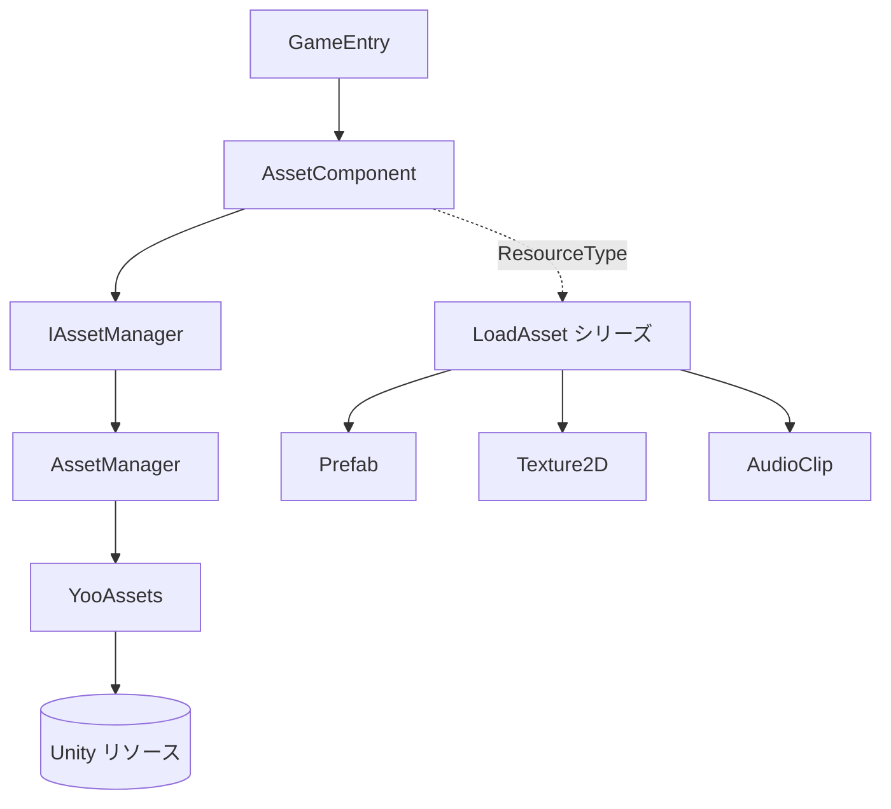

# GameFrameX Asset について

GameFrameX Asset は、GameFrameX フレームワークをベースにパッケージ化された Unity リソース管理コンポーネントです。[YooAsset](https://github.com/tuyoogame/YooAsset) を下層エンジンとして使用し、統一されたリソースの読み込み、解放、および分包管理インターフェースを提供し、ゲーム実行時にパスや種類によって `Prefab`、`Texture2D`、`AudioClip` などの Unity リソースを安全に取得できるようにします。

## クイックスタート

1. Unity プロジェクトの `Packages/manifest.json` に scoped registry を追加し、`dependencies` ノードに依存関係を宣言します:

```json
{
  "scopedRegistries": [
    {
      "name": "GameFrameX",
      "url": "https://gameframex.upm.alianblank.uk",
      "scopes": ["com.gameframex"]
    }
  ],
  "dependencies": {
    "com.gameframex.unity.asset": "3.0.1"
  }
}
```

`scopes` は `com.gameframex` で始まるパッケージのみがこのレジストリを使用するように制御し、他のパッケージは引き続き Unity 公式ソースを使用します。Git URL を直接 `dependencies` に記述したり、`Packages` ディレクトリに配置してオフラインで読み込むこともできます。

2. シーン内で `AssetComponent` がアタッチされていることを確認します(`GameEntry` に自動登録されます)。次に、`GameEntry` からコンポーネントを取得し、読み込みインターフェースを呼び出します:

```csharp
// 標準的な方法:GameEntry 経由(com.gameframex.unity.entry に依存しない)
var assetComponent = GameEntry.GetComponent<AssetComponent>();
assetComponent.LoadAsset("AssetPath");
```

## 仕組みの概要



- `AssetComponent` は `GameFrameworkComponent` であり、GameFrameX フレームワークに自動登録され、エディタでは `AssetComponentInspector` を通じて設定されます。
- `IAssetManager` はインターフェースであり、デフォルト実装の `AssetManager` は YooAssets の初期化操作である `InitializationOperation`、パッケージ情報リスト、および読み込み/解放タスクキューを保持します。
- 各 Unity リソースタイプに対応する partial ファイル(例: `AssetComponent.Prefab.cs`、`AssetComponent.Texture2D.cs`)が存在し、`LoadAssetAsync` などの型指定されたインターフェースを提供します。

## 次に読む

- 依存関係のインストールとレジストリ設定: `README.zh-CN.md` のインストール章を参照してください。
- 各タイプのリソースの読み込みインターフェース: `Runtime/Asset/AssetComponent.*.cs` シリーズのファイルを参照してください。
- エディタ側の Inspector 設定: [AssetComponentInspector.cs](https://github.com/GameFrameX/com.gameframex.unity.asset/blob/main/Editor/Inspector/AssetComponentInspector.cs) を参照してください。

## 関連リンク

- リポジトリ:https://github.com/GameFrameX/com.gameframex.unity.asset
- ドキュメントサイト:https://gameframex.doc.alianblank.com
- 問題フィードバック:https://github.com/GameFrameX/com.gameframex.unity.asset/issues
- ソースコードメイン入口:[AssetComponent.cs](https://github.com/GameFrameX/com.gameframex.unity.asset/blob/main/Runtime/Asset/AssetComponent.cs)、[AssetManager.cs](https://github.com/GameFrameX/com.gameframex.unity.asset/blob/main/Runtime/Asset/AssetManager.cs)