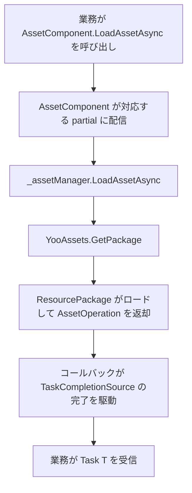

# 仕組み:リソースコンポーネントと YooAsset の連携フロー

`AssetComponent` はフレームワークの Unity 側の对外リソースファサードであり、`AssetManager` はそのランタイム実装で、両者とも YooAsset を底层ローディングエンジンとしています。このページでは、三者がどのように連結し、初期化、タスクを配信し、最終的にアセットをビジネスコードに届けるのかを説明します。

## 役割のレイヤー分け

| レイヤー | 種類 | 責務 |
|----|------|------|
| コンポーネント層 | `AssetComponent : GameFrameworkComponent` | シーンにアタッチ、ランタイムモードのシリアライズ、外部呼び出しをマネージャ層に転送 |
| マネージャ層 | `AssetManager : GameFrameworkModule, IAssetManager` | ビジネス向けに `LoadAsset` / `UnloadAsset` / `InitPackageAsync` などの API を提供、`PlayMode` を保持 |
| エンジン層 | YooAsset(`YooAssets`、`ResourcePackage`) | リソースパッケージの初期化、ファイルアドレス指定、ロード/アンロード、キャッシュを実際に実行 |

`AssetComponent` は `Awake` で `ImplementationComponentType = Utility.Assembly.GetType(componentType)` のリフレクションによって実装クラスを取得し、`GameFrameworkEntry.GetModule<IAssetManager>()` でマネージャのシングルトンを取得します。以降のすべての呼び出しは `_assetManager` を経由します。

## 起動と初期化のフロー

1. `AssetComponent.Awake()` は `m_GamePlayMode` を読み取り、エディタ以外または WebGL の場合にモードを強制的に修正した後、`_assetManager.SetPlayMode(GamePlayMode)` を呼び出します。
2. `AssetComponent.Start()` が `_assetManager.Initialize()` をトリガーします。
3. `AssetManager.Initialize()` は `YooAssets.Initialize()` を呼び出し、必要に応じて `SetOperationSystemMaxTimeSlice` を設定します。
4. ビジネスは `AssetComponent.InitPackageAsync(packageName, host, fallback, isDefaultPackage)` を呼び出し、層ごとに `AssetManager.InitPackageAsync` に転送されます。

```csharp
// 摘自 AssetManager.cs:66-97
public Task<bool> InitPackageAsync(string packageName, string hostServerURL, string fallbackHostServerURL, bool isDefaultPackage = false)
{
    var taskCompletionSource = new TaskCompletionSource<bool>();
    // ... 参数校验 ...

    var resourcePackage = YooAssets.TryGetPackage(packageName);
    if (resourcePackage == null)
    {
        resourcePackage = YooAssets.CreatePackage(packageName);
        if (isDefaultPackage)
        {
            YooAssets.SetDefaultPackage(resourcePackage);
        }
    }

    var initializationOperationHandler = CreateInitializationOperationHandler(resourcePackage, hostServerURL, fallbackHostServerURL);
    initializationOperationHandler.Completed += asyncOperationBase =>
    {
        if (asyncOperationBase.Error == null && asyncOperationBase.Status == EOperationStatus.Succeed && asyncOperationBase.IsDone)
        {
            taskCompletionSource.TrySetResult(true);
        }
        else
        {
            taskCompletionSource.TrySetException(new Exception(asyncOperationBase.Error));
        }
    };
    return taskCompletionSource.Task;
}
```

重要なポイント:`TaskCompletionSource<bool>` によって YooAsset のコールバック形式の `InitializationOperation` を `await` 可能な `Task<bool>` に変換しています。

## ランタイムモードの配信

`CreateInitializationOperationHandler` は switch ディスパッチャであり、`EPlayMode` を YooAsset の4種類の初期化パラメータにマッピングします:

| `EPlayMode` | YooAsset 初期化パラメータ | 典型的な用途 |
|-------------|---------------------|----------|
| `EditorSimulateMode` | `EditorSimulateModeParameters` + `CreateDefaultEditorFileSystemParameters` | エディタ内でビルド成果物を直接シミュレートしてロード |
| `OfflinePlayMode` | `OfflinePlayModeParameters` + `CreateDefaultBuildinFileSystemParameters` | スタンドアロン/完全ローカル |
| `HostPlayMode` | `HostPlayModeParameters` + 内蔵ファイルシステム + `RemoteServices` キャッシュファイルシステム | ホットアップデートが必要な場合 |
| `WebPlayMode` | `WebPlayModeParameters` + WebGL/ミニゲームファイルシステム | WebGL、微信、抖音、快手のミニゲーム |

```csharp
// 摘自 AssetManager.Initialization.cs:18-47
switch (PlayMode)
{
    case EPlayMode.EditorSimulateMode: return InitializeYooAssetEditorSimulateMode(resourcePackage);
    case EPlayMode.OfflinePlayMode:    return InitializeYooAssetOfflinePlayMode(resourcePackage);
    case EPlayMode.HostPlayMode:       return InitializeYooAssetHostPlayMode(resourcePackage, hostServerURL, fallbackHostServerURL);
    case EPlayMode.WebPlayMode:        return InitializeYooAssetWebPlayMode(resourcePackage, hostServerURL, fallbackHostServerURL);
    default: throw new ArgumentOutOfRangeException(nameof(PlayMode), PlayMode, $"Unsupported play mode: {PlayMode}");
}
```

`HostPlayMode` はさらに主系・待機系の2つのダウンロード URL を `RemoteServices` にパッケージし、それぞれ `CacheFileSystemParameters` のダウンロード元とフォールバックとして機能します:

```csharp
// 摘自 AssetManager.Initialization.cs:155-164
var remoteServices = new RemoteServices(hostServerURL, fallbackHostServerURL);
var createParameters = new HostPlayModeParameters
{
    BuildinFileSystemParameters = FileSystemParameters.CreateDefaultBuildinFileSystemParameters(),
    CacheFileSystemParameters   = FileSystemParameters.CreateDefaultCacheFileSystemParameters(remoteServices),
};
```

## ロードとアンロードの転送パス

各リソースタイプの便利な API(`LoadAssetAsync<T>`、`LoadSceneAsync` など)は `AssetComponent` の partial クラス(例えば `AssetComponent.Prefab.cs`、`AssetComponent.Texture2D.cs`)によって提供され、最終的に `_assetManager` の同名のメソッドを呼び出します。`_assetManager` はさらに `YooAssets.GetPackage(packageName)` で `ResourcePackage` を取得し、`LoadAssetAsync` / `TryUnloadUnusedAsset` / `UnloadAllAssetsAsync` などの操作を実行します。

アンロード時、`AssetManager.UnloadAsset(string assetPath)` はデフォルトで `DefaultPackageName` に対して作用し、パッケージ名を指定するオーバーロードは指定されたパッケージ名でパッケージを取得します:

```csharp
// 摘自 AssetManager.cs:104-124
public void UnloadAsset(string assetPath)
{
    var package = YooAssets.GetPackage(DefaultPackageName);
    package.TryUnloadUnusedAsset(assetPath);
}

public void UnloadAsset(string packageName, string assetPath)
{
    var package = YooAssets.GetPackage(packageName);
    package.TryUnloadUnusedAsset(assetPath);
}
```

## 連携のタイミングシーケンス



## 背景

- YooAsset を `GameFrameworkModule` に組み込んでいる理由は、フレームワーク上位のコンポーネントとホットアップデート/マルチパッケージのロジックをエンジン非依存に保つためです。`AssetManager` だけが直接 `using YooAsset` しています。
- `AssetComponent` の `Awake` は、エディタ以外では `EditorSimulateMode` を `HostPlayMode` に書き換え、`WebGL` は一律 `WebPlayMode` に変更して、パッケージ設定の誤りを防止します。
- マルチエンドのミニゲーム対応(`ENABLE_DOUYIN_MINI_GAME` / `ENABLE_WECHAT_MINI_GAME` / `ENABLE_KUAISHOU_MINI_GAME`)は `InitializeYooAssetWebPlayMode` 内でコンパイルマクロによってそれぞれ対応するファイルシステムを作成し、同時に並行数を制限してプラットフォーム底层の制限に引きずられないようにしています。

## 関連リンク

- [AssetComponent.cs](https://github.com/GameFrameX/com.gameframex.unity.asset/blob/main/Runtime/Asset/AssetComponent.cs)
- [AssetManager.cs](https://github.com/GameFrameX/com.gameframex.unity.asset/blob/main/Runtime/Asset/AssetManager.cs)
- [AssetManager.Initialization.cs](https://github.com/GameFrameX/com.gameframex.unity.asset/blob/main/Runtime/Asset/AssetManager.Initialization.cs)
- [AssetComponent.Prefab.cs](https://github.com/GameFrameX/com.gameframex.unity.asset/blob/main/Runtime/Asset/AssetComponent.Prefab.cs)