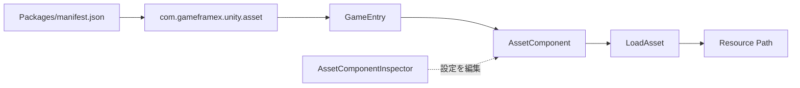

# クイックスタート:インストールして最初のリソースを読み込む

`com.gameframex.unity.asset` をインストールした後、`GameEntry` から `AssetComponent` を取得し、`LoadAsset` を使って指定パスのリソースを読み込むことができます。このページでは、リポジトリの README から直接コピーして使えるインストールと呼び出しの手順を示します。

## クイックスタート

### 前提条件

- Unity `2019.4`。
- プロジェクトに GameFrameX コアパッケージがインストール済みであること。現在のパッケージマニフェストは `com.gameframex.unity: 1.1.1` と `com.gameframex.unity.event: 1.1.0` への依存を宣言しています。
- 利用可能なリソースパスを用意してください。サンプルではプレースホルダー文字列 `AssetPath` を使用しています。実際のアドレスはあなたのリソースアドレスに置き換えてください。

### 操作手順

1. Unity で `Packages/manifest.json` を開き、パッケージを `dependencies` に追加します：

```json
{
  "dependencies": {
    "com.gameframex.unity.asset": "3.0.1"
  }
}
```

> Source: [README.zh-CN.md](https://github.com/GameFrameX/com.gameframex.unity.asset/blob/main/README.zh-CN.md#L32-L63)

2. Unity Package Manager がパッケージを解決して読み込むのを待ちます。README に記載されている scoped registry、Git URL、または `Packages` ディレクトリへの直接配置によるインストール方法を選択することもできます。

3. プロジェクトコード内で `GameEntry` を使って `AssetComponent` を取得します：

```csharp
var assetComponent = GameEntry.GetComponent<AssetComponent>();
assetComponent.LoadAsset("AssetPath");
```

> Source: [README.zh-CN.md](https://github.com/GameFrameX/com.gameframex.unity.asset/blob/main/README.zh-CN.md#L64-L70)

4. `AssetPath` を実際のリソースアドレスに置き換え、リソース読み込みフローを実行します。リポジトリの現在のパッケージバージョンは `3.1.1` です。README のインストール例では `3.0.1` が使用されているため、使用時はプロジェクトでロックされたバージョンを基準にしてください。

```json
{
  "name": "com.gameframex.unity.asset",
  "version": "3.1.1",
  "unity": "2019.4",
  "dependencies": {
    "com.gameframex.unity": "1.1.1",
    "com.gameframex.unity.event": "1.1.0"
  }
}
```

> Source: [package.json](https://github.com/GameFrameX/com.gameframex.unity.asset/blob/main/package.json#L1-L25)

## よくあるバリエーション

| インストール方法 | 設定 |
|------|------|
| Scoped registry | レジストリ URL は `https://gameframex.upm.alianblank.uk`、scope は `com.gameframex` |
| Git URL | `https://github.com/gameframex/com.gameframex.unity.asset.git` |
| ローカルディレクトリ | リポジトリを Unity プロジェクトの `Packages` ディレクトリに直接配置 |

## よくあるエラー

| 症状 | 原因 | 修正 |
|------|------|------|
| Package Manager が見つからない | `scopedRegistries`、scope、またはバージョンの不一致 | `manifest.json` の `scopes` が `com.gameframex` であることを確認し、Unity が対象バージョンを使用していることを確認する |
| `GetComponent<AssetComponent>()` がコンパイルできない | GameFrameX コアの依存関係がインストールされていない、または対応する名前空間が参照されていない | `com.gameframex.unity: 1.1.1` をインストールする。リポジトリのソースには完全にコピーして使える安全な名前空間の使い方が提供されておらず、実装の詳細はソース内に見つかりません |
| リソースが読み込めない | 渡されたパスが有効なリソースアドレスではない、またはコンポーネント/パッケージの準備が完了していない | 実際のリソースアドレスを使用し、パッケージの読み込みとリソースビルドの設定を確認する。リポジトリの README にはこれ以上の具体的な読み込み前準備手順は記載されていません |

## 仕組みの概要

インストールが完了すると、Unity はパッケージマニフェストを通じて `com.gameframex.unity.asset` を読み込みます。ランタイムでは `GameEntry` から `AssetComponent` を取得し、このコンポーネントが `LoadAsset` を呼び出してリソースを読み込みます。エディタ側では `AssetComponentInspector` も提供されており、`リソース実行モード` と `パッケージリスト` の設定を表示します。



> Source: [README.zh-CN.md](https://github.com/GameFrameX/com.gameframex.unity.asset/blob/main/README.zh-CN.md#L26-L29)；[README.zh-CN.md](https://github.com/GameFrameX/com.gameframex.unity.asset/blob/main/README.zh-CN.md#L64-L70)；[Editor/Inspector/AssetComponentInspector.cs](https://github.com/GameFrameX/com.gameframex.unity.asset/blob/main/Editor/Inspector/AssetComponentInspector.cs#L32-L40)；[Editor/Inspector/AssetComponentInspector.cs](https://github.com/GameFrameX/com.gameframex.unity.asset/blob/main/Editor/Inspector/AssetComponentInspector.cs#L73-L78)

## 次に進む

- リソースパッケージのインストール、読み込み、ランタイム設定については、[プロジェクト README](https://github.com/GameFrameX/com.gameframex.unity.asset/blob/main/README.zh-CN.md#L30-L80) を優先的に参照してください。
- パッケージのバージョンと依存関係の制約については、[package.json](https://github.com/GameFrameX/com.gameframex.unity.asset/blob/main/package.json#L1-L25) を参照してください。
- `AssetComponent` のエディタ設定のエントリについては、[AssetComponentInspector.cs](https://github.com/GameFrameX/com.gameframex.unity.asset/blob/main/Editor/Inspector/AssetComponentInspector.cs#L39-L78) を参照してください。
- 公式ドキュメントのエントリ：[GameFrameX ドキュメント](https://gameframex.doc.alianblank.com)。