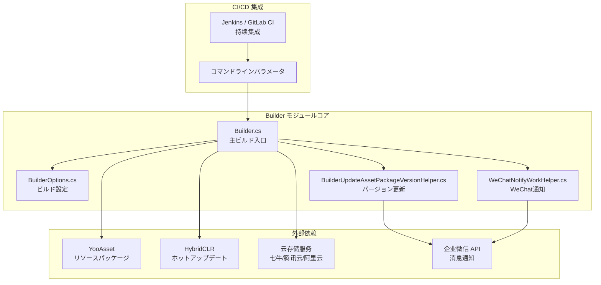
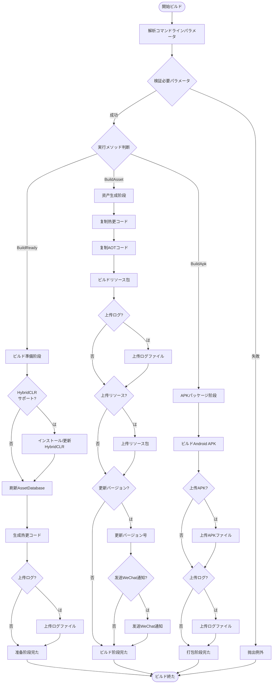

# 

GameFrameX Builder は GameFrameX ゲームフレームワークの Unity ビルドモジュール，の CI/CD ビルドフローサポート。モジュールをじてコマンドラインパラメータのビルド，と Jenkins、GitLab CI、GitHub Actions プラットフォーム，ゲームプロジェクトの、とバージョン。

## Overview

GameFrameX Builder は GameFrameX ゲームフレームワークのコアコンポーネント， Unity ゲームプロジェクトのビルド。にゲーム，のバージョンとはの。Builder モジュールをじてのコマンドラインインターフェースとモジュールのビルドフロー，，と。

モジュールのコアはビルドの，の。たコードの，ビルドフロープロジェクト。，Builder モジュールた HybridCLR ホットアップデート、YooAsset リソース，たのゲーム。

## アーキテクチャ

GameFrameX Builder モジュールのアーキテクチャ，ビルドののクラス。モジュールの，と。は Builder モジュールのアーキテクチャ：



アーキテクチャ，Builder モジュールビルドフローのコア，コンポーネントの。コマンドラインパラメータ BuilderOptions ， Builder クラスのビルド。ビルドのリソースをじて，バージョンをじて。

## コア

### コマンドラインビルドサポート

GameFrameX Builder にづくコマンドライン，のビルドパラメータをじてコマンドライン。ビルド，。に Builder.cs ，をじて `BuildParamsParse()` メソッドコマンドラインパラメータ，ビルドオプション BuilderOptions 。

```csharp
private static void BuildParamsParse()
{
    var commandLineArgs = Environment.GetCommandLineArgs();
    _builderOptions = new BuilderOptions();
    for (var index = 0; index < commandLineArgs.Length; index++)
    {
        var commandLineArg = commandLineArgs[index];
        if (commandLineArg == "-logFile")
        {
            _builderOptions.LogFilePath = commandLineArgs[index + 1].Replace("/Unity/", "/");
        }
        else if (commandLineArg == "-executeMethod")
        {
            _builderOptions.ExecuteMethod = commandLineArgs[index + 1].Trim();
        }
        // ... 更多パラメータ解析
    }
}
```
> Source: [Builder.cs](https://github.com/GameFrameX/com.gameframex.unity.builder/blob/main/Editor/Builder.cs#L60-L74)

パラメータサポートのビルドオプション，ビルド、、、バージョン、。をじてパラメータ，カスタマイズのビルドフロー。

### と

Builder モジュールた YooAsset リソース，のと。に `BuildAsset()` メソッド，たのリソースパッケージフロー，ホットアップデートコード、AOT コード、リソースビルドステップ。

```csharp
public static void BuildAsset()
{
    // 复制ホットアップデート程序集
    Debug.Log("BuildReady Start Copy Hotfix Code");
    BuildHotfixHelper.CopyHotfixCode();
    AssetDatabase.Refresh();
    
    // 复制AOTコード
    Debug.Log("BuildReady Start Copy AOT Code");
    BuildHotfixHelper.CopyAOTCode();
    AssetDatabase.Refresh();
    
    // ビルドリソース包
    var buildInFileCopyParams = AssetBundleBuilderSetting.GetPackageBuildinFileCopyParams(_builderOptions.PackageName, EBuildPipeline.BuiltinBuildPipeline);
    BuiltinBuildPipeline pipeline = new BuiltinBuildPipeline();
    BuildParameters buildParameters = new BuildParameters();
    buildParameters.BuildMode = _builderOptions.IsIncrementalBuildPackage ? EBuildMode.IncrementalBuild : EBuildMode.ForceRebuild;
    // ... 更多設定
    pipeline.Run(buildParameters, true);
}
```
> Source: [Builder.cs](https://github.com/GameFrameX/com.gameframex.unity.builder/blob/main/Editor/Builder.cs#L255-L296)

リソースパッケージサポートビルドとビルド，のビルド。ビルドビルド，の。

### ホットアップデートサポート

Builder モジュールサポート HybridCLR ホットアップデート。にビルド（`BuildReady()` メソッド）， HybridCLR のインストール，にインストールと。サポートホットアップデートのゲームプロジェクト。

```csharp
public static void BuildReady()
{
#if ENABLE_GAME_FRAME_X_HYBRID_CLR
    Debug.Log("BuildReady Start HybridCLR");
    var installerController = new InstallerController();
    var isInstalled = installerController.HasInstalledHybridCLR();
    if (!isInstalled || installerController.InstalledLibil2cppVersion != installerController.PackageVersion)
    {
        installerController.InstallDefaultHybridCLR();
    }
    // 生成ホットアップデート代理
    PrebuildCommand.GenerateAll();
#endif
    AssetDatabase.Refresh();
}
```
> Source: [Builder.cs](https://github.com/GameFrameX/com.gameframex.unity.builder/blob/main/Editor/Builder.cs#L215-L244)

をじてコンパイル `ENABLE_GAME_FRAME_X_HYBRID_CLR`，はホットアップデート。モジュールホットアップデートとホットアップデートのプロジェクト。

### 

GameFrameX Builder サポートの，、と。をじてのインターフェース，に。にビルド，のリソースと APK ファイルの。

```csharp
#if ENABLE_GAME_FRAME_X_OBJECT_STORAGE
#if ENABLE_GAME_FRAME_X_OBJECT_STORAGE_QI_NIU
    ObjectStorageUploadManager = ObjectStorageUploadFactory.Create<QiNiuYunObjectStorageUploadManager>(_builderOptions.ObjectStorageKey, _builderOptions.ObjectStorageSecret, _builderOptions.ObjectStorageBucketName, _builderOptions.ObjectStorageEndPoint);
#endif

#if ENABLE_GAME_FRAME_X_OBJECT_STORAGE_TENCENT
    ObjectStorageUploadManager = ObjectStorageUploadFactory.Create<TencentCloudObjectStorageUploadManager>(_builderOptions.ObjectStorageKey, _builderOptions.ObjectStorageSecret, _builderOptions.ObjectStorageBucketName, _builderOptions.ObjectStorageEndPoint);
#endif

#if ENABLE_GAME_FRAME_X_OBJECT_STORAGE_A_LI_YUN
    ObjectStorageUploadManager = ObjectStorageUploadFactory.Create<ALiYunObjectStorageUploadManager>(_builderOptions.ObjectStorageKey, _builderOptions.ObjectStorageSecret, _builderOptions.ObjectStorageBucketName, _builderOptions.ObjectStorageEndPoint);
#endif
#endif
```
> Source: [Builder.cs](https://github.com/GameFrameX/com.gameframex.unity.builder/blob/main/Editor/Builder.cs#L32-L54)

をじて `IObjectStorageUploadManager` インターフェース，の。た，のサポート。

### バージョンと

Builder モジュールたのバージョン。ビルドた，リソースバージョン，をじてビルド。た，たビルドとバージョン。

```csharp
if (_builderOptions.IsUpdateAssetPackageVersion)
{
    var result = BuilderUpdateAssetPackageVersionHelper.Run(buildParameters, _builderOptions);
    if (result)
    {
        WeChatNotifyWorkHelper.Run(buildParameters, _builderOptions);
    }
}
```
> Source: [Builder.cs](https://github.com/GameFrameX/com.gameframex.unity.builder/blob/main/Editor/Builder.cs#L335-L342)

バージョンをじて HTTP POST リクエストビルドの，WeChatの Webhook インターフェース Markdown のビルド。

## ビルドフロー

GameFrameX Builder のビルドフロー，のと。はのビルドフローチャート：



フローチャート，Builder モジュールサポートのビルドメソッド：ビルド（BuildReady）、（BuildAsset）と APK （BuildApk）。メソッド，たのビルドフロー。

## オプション

BuilderOptions クラスたのビルドパラメータ，パラメータをじてコマンドラインビルドシステム。はのオプション：

| オプション | タイプ | デフォルト |  |
|------|------|--------|------|
| ExecuteMethod | string | - | ****。のビルドメソッド（BuildReady、BuildAsset、BuildApk） |
| BuildNumber | string | - | ****。ビルド，にバージョン |
| JobName | string | - | ，にのビルド |
| PackageName | string | "DefaultPackage" | リソース |
| ChannelName | string | "default" | ，に |
| BundleId | string | - | ，プロジェクトデフォルト |
| AppVersion | string | - | バージョン，プロジェクトデフォルトバージョン |
| IsIncrementalBuildPackage | bool | false | はビルド |
| IsUploadAsset | bool | false | はリソース |
| IsUploadApk | bool | false | は APK  |
| IsUploadLogFile | bool | false | はログファイル |
| IsUpdateAssetPackageVersion | bool | false | はリソースバージョン |
| UpdateAssetPackageVersionUrl | string | - | バージョンの URL |
| UpdateAssetPackageVersionAuthorization | string | - | バージョンリクエストの |
| WeChatBotKey | string | - | の Key |
| Language | string | "default" |  |

## シーン

GameFrameX Builder にゲームと：

****：に Jenkins、GitLab CI  GitHub Actions ビルド，コードビルドフロー。Builder のコマンドラインインターフェースと CI ，のビルドと。

****：をじての ChannelName と PackageName パラメータ，のゲーム。にプラットフォームゲームのプロジェクト。

**ホットアップデート**： HybridCLR ホットアップデート，にゲームのゲーム。Builder ホットアップデートコードのと，たホットアップデートのフロー。

**バージョン**：をじてバージョンとWeChat，たビルドのと，。

## リンク

- [インストール](./2-installation) - たインストールと Builder モジュール
- [クイックスタート](./3-getting-started) -  Builder の
- [メソッド](./4-usage) - のビルドコマンドとメソッド
- [オプション](./5-configuration) - のパラメータリファレンス
- [オブジェクトストレージ](./6-object-storage) - ガイド
- [よくある](./7-troubleshooting) - よくあると

- ドキュメント：https://gameframex.doc.alianblank.com
- GitHub リポジトリ：https://github.com/GameFrameX/com.gameframex.unity.builder
