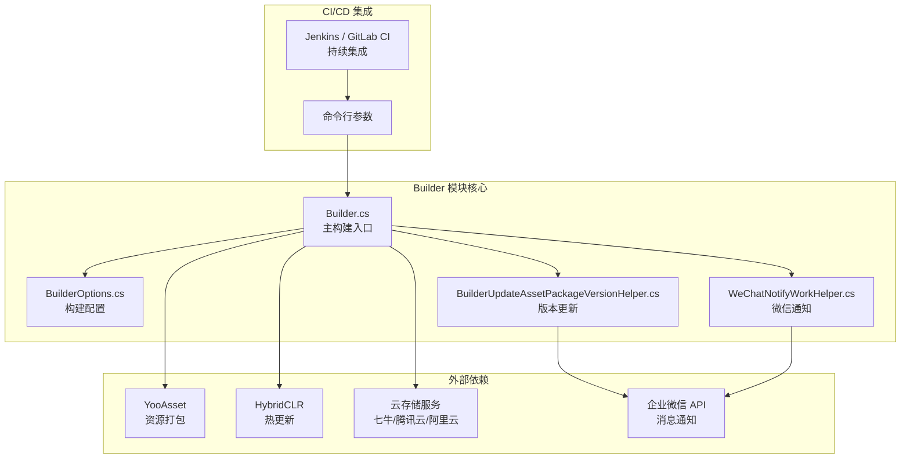
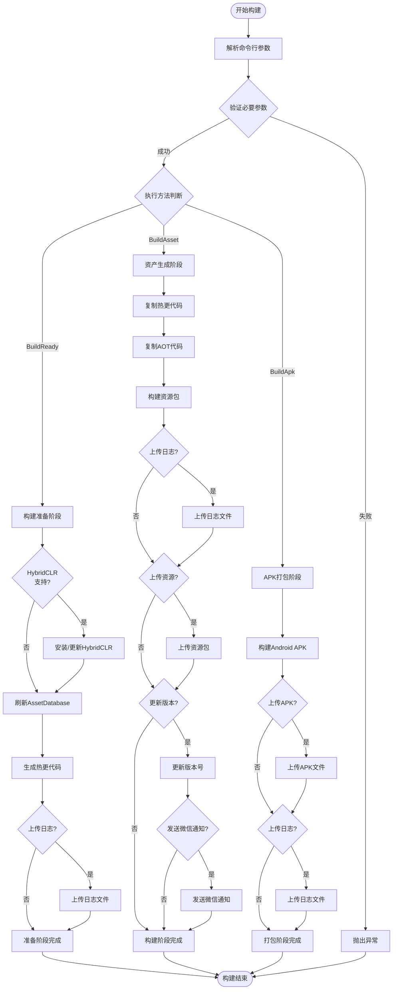

# 概要

GameFrameX Builder 是 GameFrameX 游戏フレームワーク的 Unity 自动化ビルドモジュール，提供完全な的 CI/CD ビルドフローサポート。该モジュール通过命令行パラメータ驱动的ビルド方法，能够与 Jenkins、GitLab CI、GitHub Actions 等持续集成プラットフォーム无缝集成，実装游戏プロジェクト的自动化打パッケージ、资产生成和バージョンリリース。

## Overview

GameFrameX Builder 是 GameFrameX 游戏フレームワーク的コアコンポーネント之一，专注于解决 Unity 游戏プロジェクト的自动化ビルド問題。在游戏开发过程中，频繁的バージョンリリース和多渠道打パッケージ是一项耗时且容易出错的工作。Builder モジュール通过標準化的命令行インターフェース和モジュール化的ビルドフロー設計，将这些重复性工作自动化，从而显著提升开发效率和リリース质量。

该モジュール的コア設計理念是将ビルド过程拆分为多个独立的フェーズ，每个フェーズ专注于特定的任务。这种設計不仅提高了コード的可维护性，还使得ビルドフロー〜できます根据プロジェクト需求进行柔軟設定。从技术実装角度来看，Builder モジュール深度整合了 HybridCLR ホットアップデート解決策、YooAsset リソース管理系统および多种云存储服务，形成了一套完全な的游戏リリース解決策。

## アーキテクチャ設計

GameFrameX Builder 采用モジュール化的アーキテクチャ設計，将ビルド过程中的不同機能分离到独立的类中実装。这种設計モード使得每个モジュール的职责清晰明确，便于维护和拡張。以下是 Builder モジュール的整体アーキテクチャ图：



从アーキテクチャ图中〜できます看出，Builder モジュール处于整个ビルドフロー的コア位置，它负责协调各个外部依赖コンポーネント的工作。命令行パラメータまず被解析为 BuilderOptions 对象，次に Builder 主类根据这些設定执行相应的ビルド任务。ビルド过程中产生的リソースパッケージ〜できます通过云存储服务进行上传，同時にバージョンアップデート情報〜できます通过企业微信自动通知相关人员。

## コア機能

### 命令行ビルドサポート

GameFrameX Builder 完全基于命令行运行，所有的ビルドパラメータ都通过命令行传递。这种設計使得ビルド过程〜できます完全自动化，无需人工干预。在 Builder.cs 中，通过 `BuildParamsParse()` メソッド解析命令行パラメータ，将各种ビルドオプション存储到 BuilderOptions 对象中。

```csharp
private static void BuildParamsParse()
{
    var commandLineArgs = Environment.GetCommandLineArgs();
    _builderOptions = new BuilderOptions();
    for (var index = 0; index < commandLineArgs.Length; index++)
    {
        var commandLineArg = commandLineArgs[index];
        if (commandLineArg == "-logFile")
        {
            _builderOptions.LogFilePath = commandLineArgs[index + 1].Replace("/Unity/", "/");
        }
        else if (commandLineArg == "-executeMethod")
        {
            _builderOptions.ExecuteMethod = commandLineArgs[index + 1].Trim();
        }
        // ... 更多参数解析
    }
}
```
> Source: [Builder.cs](https://github.com/GameFrameX/com.gameframex.unity.builder/blob/main/Editor/Builder.cs#L60-L74)

这种パラメータ解析机制サポート丰富的ビルドオプション，含みますビルド编号、任务名称、パッケージ名、バージョン号、渠道名称等。通过合理設定这些パラメータ，开发团队〜できます実装完全自定義的ビルドフロー。

### 资产生成与打パッケージ

Builder モジュール集成了 YooAsset リソース管理系统，提供強力的资产生成和打パッケージ機能。在 `BuildAsset()` メソッド中，実装了完全な的リソース打パッケージフロー，含みますホットアップデートコード复制、AOT コード処理、リソースパッケージビルド等ステップ。

```csharp
public static void BuildAsset()
{
    // 复制热更新程序集
    Debug.Log("BuildReady Start Copy Hotfix Code");
    BuildHotfixHelper.CopyHotfixCode();
    AssetDatabase.Refresh();
    
    // 复制AOT代码
    Debug.Log("BuildReady Start Copy AOT Code");
    BuildHotfixHelper.CopyAOTCode();
    AssetDatabase.Refresh();
    
    // 构建资源包
    var buildInFileCopyParams = AssetBundleBuilderSetting.GetPackageBuildinFileCopyParams(_builderOptions.PackageName, EBuildPipeline.BuiltinBuildPipeline);
    BuiltinBuildPipeline pipeline = new BuiltinBuildPipeline();
    BuildParameters buildParameters = new BuildParameters();
    buildParameters.BuildMode = _builderOptions.IsIncrementalBuildPackage ? EBuildMode.IncrementalBuild : EBuildMode.ForceRebuild;
    // ... 更多配置
    pipeline.Run(buildParameters, true);
}
```
> Source: [Builder.cs](https://github.com/GameFrameX/com.gameframex.unity.builder/blob/main/Editor/Builder.cs#L255-L296)

リソース打パッケージサポート增量ビルド和全量ビルド两种モード，開発者〜できます根据实际需求选择合适的ビルド方法。增量ビルドモード〜できます显著减少ビルド时间，特别适合开发フェーズ的频繁打パッケージ需求。

### ホットアップデートサポート

Builder モジュール原生サポート HybridCLR ホットアップデート解決策。在ビルド准备フェーズ（`BuildReady()` メソッド），系统会自动確認 HybridCLR 的インストールステータス，并在必要时进行自动インストール和設定。这一機能对于〜する必要がありますサポートホットアップデート的游戏プロジェクト至关重要な。

```csharp
public static void BuildReady()
{
#if ENABLE_GAME_FRAME_X_HYBRID_CLR
    Debug.Log("BuildReady Start HybridCLR");
    var installerController = new InstallerController();
    var isInstalled = installerController.HasInstalledHybridCLR();
    if (!isInstalled || installerController.InstalledLibil2cppVersion != installerController.PackageVersion)
    {
        installerController.InstallDefaultHybridCLR();
    }
    // 生成热更新代理
    PrebuildCommand.GenerateAll();
#endif
    AssetDatabase.Refresh();
}
```
> Source: [Builder.cs](https://github.com/GameFrameX/com.gameframex.unity.builder/blob/main/Editor/Builder.cs#L215-L244)

通过条件コンパイル指令 `ENABLE_GAME_FRAME_X_HYBRID_CLR`，開発者〜できます柔軟控制是否启用ホットアップデート機能。这种設計使得モジュール〜できます同時に满足〜する必要がありますホットアップデート和不〜する必要がありますホットアップデート的不同プロジェクト需求。

### 云存储集成

GameFrameX Builder サポート多种云存储服务的集成，含みます七牛云、腾讯云和阿里云。通过統一された的インターフェース設計，〜できます方便地在不同云服务商之间切换。在ビルド过程中，生成的リソースパッケージ和 APK ファイル〜できます自动上传到指定的云存储空间。

```csharp
#if ENABLE_GAME_FRAME_X_OBJECT_STORAGE
#if ENABLE_GAME_FRAME_X_OBJECT_STORAGE_QI_NIU
    ObjectStorageUploadManager = ObjectStorageUploadFactory.Create<QiNiuYunObjectStorageUploadManager>(_builderOptions.ObjectStorageKey, _builderOptions.ObjectStorageSecret, _builderOptions.ObjectStorageBucketName, _builderOptions.ObjectStorageEndPoint);
#endif

#if ENABLE_GAME_FRAME_X_OBJECT_STORAGE_TENCENT
    ObjectStorageUploadManager = ObjectStorageUploadFactory.Create<TencentCloudObjectStorageUploadManager>(_builderOptions.ObjectStorageKey, _builderOptions.ObjectStorageSecret, _builderOptions.ObjectStorageBucketName, _builderOptions.ObjectStorageEndPoint);
#endif

#if ENABLE_GAME_FRAME_X_OBJECT_STORAGE_A_LI_YUN
    ObjectStorageUploadManager = ObjectStorageUploadFactory.Create<ALiYunObjectStorageUploadManager>(_builderOptions.ObjectStorageKey, _builderOptions.ObjectStorageSecret, _builderOptions.ObjectStorageBucketName, _builderOptions.ObjectStorageEndPoint);
#endif
#endif
```
> Source: [Builder.cs](https://github.com/GameFrameX/com.gameframex.unity.builder/blob/main/Editor/Builder.cs#L32-L54)

云存储上传機能通过 `IObjectStorageUploadManager` インターフェース进行抽象，使用工厂モード作成不同云服务商的具体実装。这种設計遵循了開放閉鎖の原則，便于未来追加新的云存储サポート。

### バージョン管理与通知

Builder モジュール提供します完全な的バージョン管理機能。ビルド完成后，〜できます自动アップデートリソースパッケージバージョン号，并通过企业微信发送ビルド通知。这些機能大大提升了团队协作效率，使得相关人员能够及时理解するビルドステータス和バージョン情報。

```csharp
if (_builderOptions.IsUpdateAssetPackageVersion)
{
    var result = BuilderUpdateAssetPackageVersionHelper.Run(buildParameters, _builderOptions);
    if (result)
    {
        WeChatNotifyWorkHelper.Run(buildParameters, _builderOptions);
    }
}
```
> Source: [Builder.cs](https://github.com/GameFrameX/com.gameframex.unity.builder/blob/main/Editor/Builder.cs#L335-L342)

バージョンアップデート通过 HTTP POST 请求将ビルド情報发送到指定的服务器，而微信通知则使用企业微信的 Webhook インターフェース发送 Markdown フォーマット的ビルド报告。

## ビルドフロー

GameFrameX Builder 的ビルドフロー分为多个フェーズ，每个フェーズ都有明确的目标和职责。以下是完全な的ビルドフロー图：



从フロー图中〜できます看出，Builder モジュールサポート三种主な的ビルドメソッド：ビルド准备（BuildReady）、资产生成（BuildAsset）和 APK 打パッケージ（BuildApk）。每种メソッド都〜できます独立运行，也〜できます按顺序组合使用以完成完全な的ビルドフロー。

## 設定オプション

BuilderOptions 类定義了所有可用的ビルドパラメータ，这些パラメータ通过命令行传递给ビルド系统。以下是主な的設定オプション：

| オプション | タイプ | デフォルト值 | 説明 |
|------|------|--------|------|
| ExecuteMethod | string | - | **必需**。指定要执行的ビルドメソッド（BuildReady、BuildAsset、BuildApk） |
| BuildNumber | string | - | **必需**。ビルド编号，用于バージョン追踪 |
| JobName | string | - | 任务名称，用于区分不同的ビルド任务 |
| PackageName | string | "DefaultPackage" | リソースパッケージ名称 |
| ChannelName | string | "default" | 渠道名称，用于多渠道打パッケージ |
| BundleId | string | - | パッケージ名，为空时使用プロジェクトデフォルトパッケージ名 |
| AppVersion | string | - | 程序バージョン号，为空时使用プロジェクトデフォルトバージョン |
| IsIncrementalBuildPackage | bool | false | 是否使用增量ビルド |
| IsUploadAsset | bool | false | 是否上传リソースパッケージ到云存储 |
| IsUploadApk | bool | false | 是否上传 APK 到云存储 |
| IsUploadLogFile | bool | false | 是否上传ログファイル到云存储 |
| IsUpdateAssetPackageVersion | bool | false | 是否アップデートリソースパッケージバージョン |
| UpdateAssetPackageVersionUrl | string | - | バージョンアップデート服务器的 URL |
| UpdateAssetPackageVersionAuthorization | string | - | バージョンアップデート请求的授权情報 |
| WeChatBotKey | string | - | 企业微信机器人的 Key |
| Language | string | "default" | 多语言設定 |

## 使用シーン

GameFrameX Builder 適しています多种游戏开发和リリースシーン：

**持续集成環境**：在 Jenkins、GitLab CI 或 GitHub Actions 中設定自动化ビルド任务，当コード提交或合并到主ブランチ时自动トリガービルドフロー。Builder 的命令行インターフェース〜できます方便地与这些 CI 系统集成，実装全自动化的ビルド和リリース。

**多渠道打パッケージ**：通过設定不同的 ChannelName 和 PackageName パラメータ，〜できます快速生成针对不同渠道的游戏パッケージ。这种能力对于〜する必要があります在多个プラットフォーム或渠道リリース游戏的プロジェクト尤为重要な。

**ホットアップデートリリース**：结合 HybridCLR ホットアップデート機能，〜できます在不重新リリース游戏的情况下アップデート游戏内容。Builder 自动処理ホットアップデートコード的复制和打パッケージ，簡素化了ホットアップデート的リリースフロー。

**バージョン管理**：通过バージョンアップデート和微信通知機能，团队成员可および时理解する每次ビルド的結果和变更内容，提高协作效率。

## 関連リンク

- [インストール](./2-installation) - 理解する如何インストール和設定 Builder モジュール
- [快速开始](./3-getting-started) - 快速上手 Builder 的基本使用
- [使用メソッド](./4-usage) - 詳細的ビルド命令和使用メソッド
- [設定オプション](./5-configuration) - 完全な的設定パラメータリファレンス
- [对象存储](./6-object-storage) - 云存储服务設定ガイド
- [常见問題](./7-troubleshooting) - 常见問題排查和解決策

- 官方ドキュメント：https://gameframex.doc.alianblank.com
- GitHub リポジトリ：https://github.com/GameFrameX/com.gameframex.unity.builder
