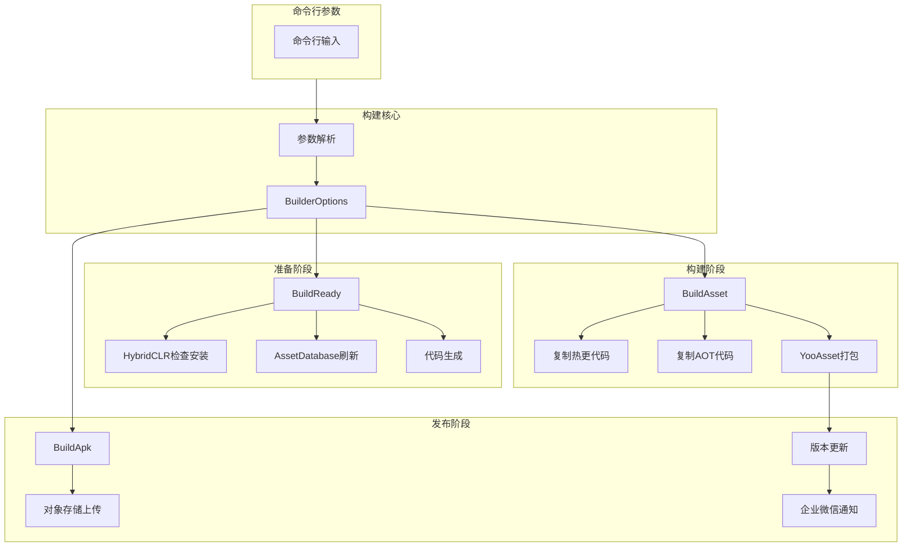
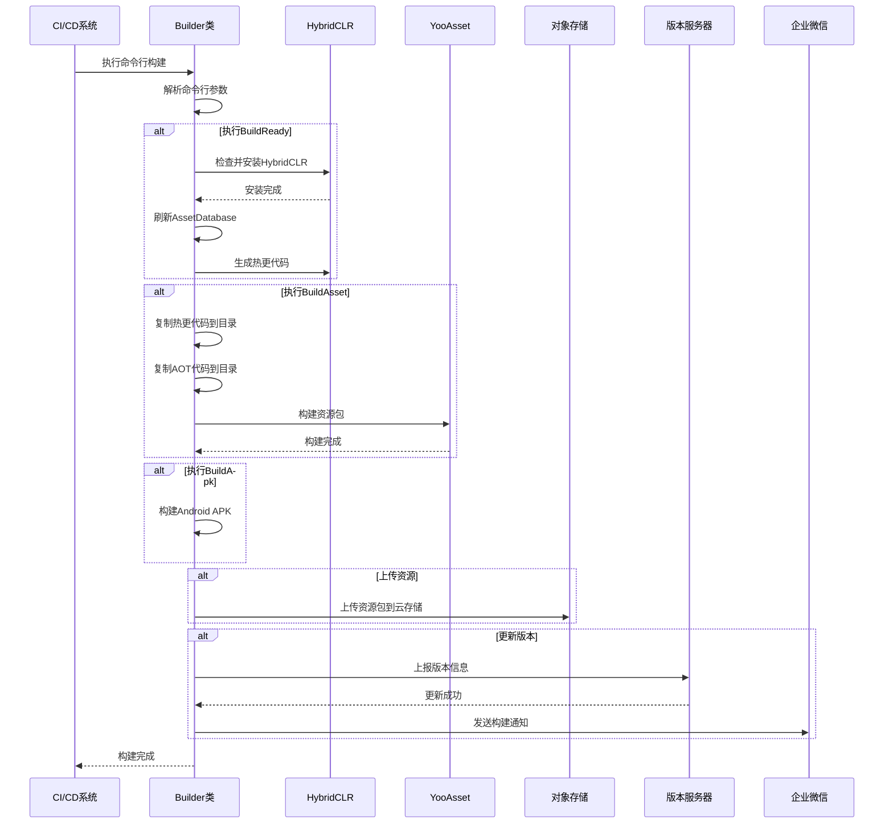

# クイックスタート

GameFrameX Unity Builder は機能強力的自动化ビルド系统，专门用于 Unity プロジェクト的持续集成和自动化打パッケージ。通过命令行パラメータ驱动，该系统能够自动完成从環境准备、リソース打パッケージ到 APK ビルド的全フロー。

## 概要

GameFrameX Builder 是 GameFrameX 游戏フレームワーク的コアコンポーネント之一，专注于解决 Unity プロジェクト自动化ビルド的痛点。它通过解析命令行パラメータ来設定ビルドフロー，サポート以下コア機能：

- **打パッケージ准备（BuildReady）**：自动確認并インストール HybridCLR ホットアップデートフレームワーク，执行コード生成
- **リソース打パッケージ（BuildAsset）**：使用 YooAsset ビルド游戏リソースパッケージ，サポート增量ビルド
- **APK ビルド（BuildApk）**：自动ビルド Android インストールパッケージ
- **对象存储上传**：サポート腾讯云、阿里云、七牛云等主流云存储
- **バージョンアップデート通知**：自动アップデートリソースパッケージバージョン并通过企业微信发送通知

## アーキテクチャ概览



## コアフロー

### ビルドフロー序列图



## 命令行パラメータ

### 必需パラメータ

| パラメータ | 説明 | 例 |
|------|------|------|
| `-executeMethod` | 执行メソッド | `GameFrameX.Builder.Editor.Builder.BuildAsset` |
| `-BUILD_NUMBER` | ビルド号 | `1001` |

### ビルド設定パラメータ

| パラメータ | 説明 | デフォルト值 |
|------|------|--------|
| `-JOB_NAME` | 任务名称 | - |
| `-PackageName` | リソースパッケージ名称 | `DefaultPackage` |
| `-ChannelName` | 渠道名称 | `default` |
| `-BundleId` | パッケージ名 | プロジェクトデフォルト值 |
| `-AppVersion` | 程序バージョン号 | プロジェクトデフォルト值 |
| `-IsIncrementalBuildPackage` | 是否增量ビルド | `false` |
| `-Language` | 语言 | `default` |

### 对象存储パラメータ

| パラメータ | 説明 |
|------|------|
| `-ObjectStorageKey` | 对象存储AccessKey |
| `-ObjectStorageSecret` | 对象存储SecretKey |
| `-ObjectStorageBucketName` | 存储桶名称 |
| `-ObjectStorageEndPoint` | 区域节点 |

### 上传控制パラメータ

| パラメータ | 説明 |
|------|------|
| `-IsUploadLogFile` | 是否上传ログファイル |
| `-IsUploadAsset` | 是否上传リソースパッケージ |
| `-IsUploadApk` | 是否上传APK |
| `-IsUpdateAssetPackageVersion` | 是否アップデートリソースパッケージバージョン |
| `-UpdateAssetPackageVersionUrl` | バージョンアップデート服务器URL |
| `-UpdateAssetPackageVersionAuthorization` | バージョンアップデート授权码 |
| `-WeChatBotKey` | 企业微信机器人Key |

## 使用例

### Jenkins ビルド任务設定

```groovy
// Jenkinsfile 示例
pipeline {
    agent any
    stages {
        stage('构建') {
            steps {
                bat '''
                    Unity.exe -projectPath "${WORKSPACE}" ^
                    -executeMethod GameFrameX.Builder.Editor.Builder.BuildAsset ^
                    -BUILD_NUMBER "${BUILD_NUMBER}" ^
                    -JOB_NAME "${JOB_NAME}" ^
                    -PackageName "GamePackage" ^
                    -ChannelName "official" ^
                    -IsUploadLogFile true ^
                    -IsUploadAsset true ^
                    -logFile "../Logs/build_${BUILD_NUMBER}.log"
                '''
            }
        }
    }
}
```

> Source: [Builder.cs](https://github.com/GameFrameX/com.gameframex.unity.builder/blob/main/Editor/Builder.cs#L60-L181)

### 完全な的ビルド命令例

```bash
Unity.exe -projectPath "D:\UnityProject\MyGame" ^
-executeMethod GameFrameX.Builder.Editor.Builder.BuildAsset ^
-BUILD_NUMBER "1001" ^
-JOB_NAME "DailyBuild" ^
-PackageName "GamePackage" ^
-ChannelName "official" ^
-Language "zh-CN" ^
-ObjectStorageKey "your_access_key" ^
-ObjectStorageSecret "your_secret_key" ^
-ObjectStorageBucketName "game-assets" ^
-ObjectStorageEndPoint "ap-guangzhou" ^
-IsUploadLogFile true ^
-IsUploadAsset true ^
-IsUpdateAssetPackageVersion true ^
-UpdateAssetPackageVersionUrl "https://api.example.com/version" ^
-UpdateAssetPackageVersionAuthorization "Bearer token" ^
-WeChatBotKey "your_wechat_key" ^
-logFile "../Logs/build_1001.log"
```

### 不同ビルドフェーズ

根据需求选择不同的执行メソッド：

```csharp
// 打包准备 - 安装HybridCLR、生成热更代码
-executeMethod GameFrameX.Builder.Editor.Builder.BuildReady

// 打包资源 - 构建资源包
-executeMethod GameFrameX.Builder.Editor.Builder.BuildAsset

// 构建APK - 打包安装包
-executeMethod GameFrameX.Builder.Editor.Builder.BuildApk
```

> Source: [Builder.cs](https://github.com/GameFrameX/com.gameframex.unity.builder/blob/main/Editor/Builder.cs#L183-L345)

## ビルドオプション設定

BuilderOptions 类カプセル化了所有ビルド設定オプション：

```csharp
public class BuilderOptions
{
    // 日志文件路径
    public string LogFilePath { get; set; }
    
    // 执行方法
    public string ExecuteMethod { get; set; }
    
    // 构建号
    public string BuildNumber { get; set; }
    
    // 对象存储配置
    public string ObjectStorageKey { get; set; }
    public string ObjectStorageSecret { get; set; }
    public string ObjectStorageBucketName { get; set; }
    public string ObjectStorageEndPoint { get; set; }
    
    // 构建配置
    public string JobName { get; set; }
    public string ChannelName { get; set; } = "default";
    public string BundleId { get; set; }
    public string AppVersion { get; set; }
    public string PackageName { get; set; } = "DefaultPackage";
    public bool IsIncrementalBuildPackage { get; set; }
    
    // 上传控制
    public bool IsUploadLogFile { get; set; }
    public bool IsUploadAsset { get; set; }
    public bool IsUploadApk { get; set; }
    public bool IsUpdateAssetPackageVersion { get; set; }
    
    // 版本更新
    public string UpdateAssetPackageVersionUrl { get; set; }
    public string UpdateAssetPackageVersionAuthorization { get; set; }
    
    // 通知
    public string Language { get; set; } = "default";
    public string WeChatBotKey { get; set; }
}
```

> Source: [BuilderOptions.cs](https://github.com/GameFrameX/com.gameframex.unity.builder/blob/main/Editor/BuilderOptions.cs#L5-L116)

## 機能特性説明

### ホットアップデートサポート

ビルド系统深度集成 HybridCLR，サポート：
- 自动確認 HybridCLR インストールステータス
- 自动インストール和設定 HybridCLR
- 自动生成ホットアップデートコード

### リソース打パッケージ

使用 YooAsset 进行リソース打パッケージ：
- サポート增量ビルド和全量ビルド
- 自动复制热更コード和 AOT コード
- サポートリソースパッケージバージョン号自动生成

### 对象存储

サポート多种云存储服务：

| 云服务商 | 条件コンパイル符号 | 説明 |
|---------|-------------|------|
| 腾讯云 | `ENABLE_GAME_FRAME_X_OBJECT_STORAGE_TENCENT` | 腾讯云COS |
| 阿里云 | `ENABLE_GAME_FRAME_X_OBJECT_STORAGE_A_LI_YUN` | 阿里云OSS |
| 七牛云 | `ENABLE_GAME_FRAME_X_OBJECT_STORAGE_QI_NIU` | 七牛云Kodo |

> Source: [Builder.cs](https://github.com/GameFrameX/com.gameframex.unity.builder/blob/main/Editor/Builder.cs#L40-L53)

### バージョンアップデート通知

ビルド完成后自动：
1. 将バージョン情報上报到バージョン服务器
2. 通过企业微信发送ビルド通知

> Source: [BuilderUpdateAssetPackageVersionHelper.cs](https://github.com/GameFrameX/com.gameframex.unity.builder/blob/main/Editor/BuilderUpdateAssetPackageVersionHelper.cs#L51-L85)
> Source: [WeChatNotifyWorkHelper.cs](https://github.com/GameFrameX/com.gameframex.unity.builder/blob/main/Editor/WeChatNotifyWorkHelper.cs#L45-L71)

## 依赖项

本ビルド系统依赖以下コアコンポーネント：

| 依赖パッケージ | 説明 |
|--------|------|
| GameFrameX.Editor | エディタ工具基底クラス |
| GameFrameX.Runtime | ランタイム基本库 |
| YooAsset | リソース管理パッケージ |
| HybridCLR | IL2CPPホットアップデート方案 |

## 関連リンク

- [インストールガイド](./2-installation)
- [使用メソッド](./4-usage)
- [設定オプション](./5-configuration)
- [对象存储設定](./6-object-storage)
- [常见問題](./7-troubleshooting)
- [GitHub リポジトリ](https://github.com/GameFrameX/com.gameframex.unity.builder.git)
- [官方ドキュメント](https://gameframex.doc.alianblank.com)
