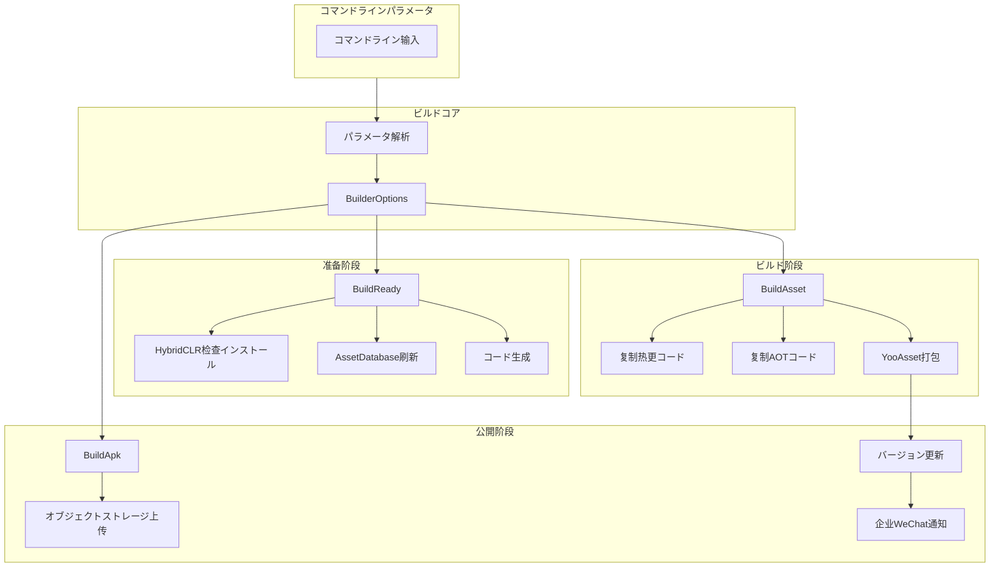
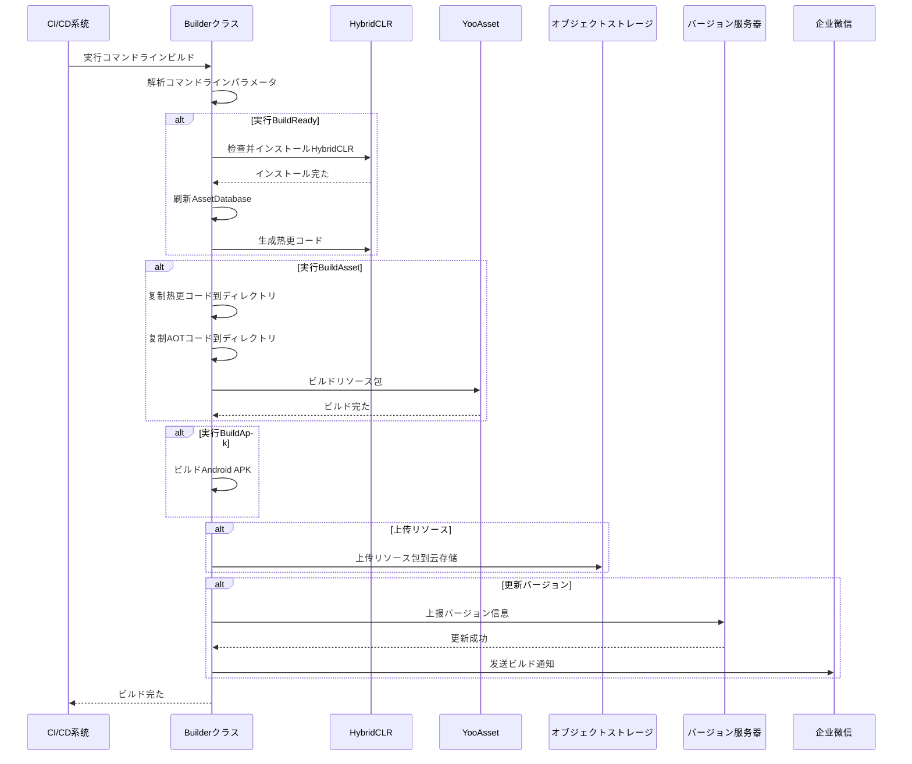

# クイックスタート

GameFrameX Unity Builder はのビルドシステム，に Unity プロジェクトのと。をじてコマンドラインパラメータ，た、リソースパッケージ APK ビルドのフロー。

## 

GameFrameX Builder は GameFrameX ゲームフレームワークのコアコンポーネント， Unity プロジェクトビルドの。をじてコマンドラインパラメータビルドフロー，サポートコア：

- **（BuildReady）**：インストール HybridCLR ホットアップデートフレームワーク，コード
- **リソースパッケージ（BuildAsset）**： YooAsset ビルドゲームリソース，サポートビルド
- **APK ビルド（BuildApk）**：ビルド Android インストール
- **オブジェクトストレージ**：サポート、、
- **バージョン**：リソースバージョンをじて

## アーキテクチャ



## コアフロー

### ビルドフロー



## コマンドラインパラメータ

### パラメータ

| パラメータ |  |  |
|------|------|------|
| `-executeMethod` | メソッド | `GameFrameX.Builder.Editor.Builder.BuildAsset` |
| `-BUILD_NUMBER` | ビルド | `1001` |

### ビルドパラメータ

| パラメータ |  | デフォルト |
|------|------|--------|
| `-JOB_NAME` |  | - |
| `-PackageName` | リソース | `DefaultPackage` |
| `-ChannelName` |  | `default` |
| `-BundleId` |  | プロジェクトデフォルト |
| `-AppVersion` | バージョン | プロジェクトデフォルト |
| `-IsIncrementalBuildPackage` | はビルド | `false` |
| `-Language` |  | `default` |

### オブジェクトストレージパラメータ

| パラメータ |  |
|------|------|
| `-ObjectStorageKey` | オブジェクトストレージAccessKey |
| `-ObjectStorageSecret` | オブジェクトストレージSecretKey |
| `-ObjectStorageBucketName` |  |
| `-ObjectStorageEndPoint` |  |

### パラメータ

| パラメータ |  |
|------|------|
| `-IsUploadLogFile` | はログファイル |
| `-IsUploadAsset` | はリソース |
| `-IsUploadApk` | はAPK |
| `-IsUpdateAssetPackageVersion` | はリソースバージョン |
| `-UpdateAssetPackageVersionUrl` | バージョンURL |
| `-UpdateAssetPackageVersionAuthorization` | バージョン |
| `-WeChatBotKey` | Key |

## 

### Jenkins ビルド

```groovy
// Jenkinsfile 例
pipeline {
    agent any
    stages {
        stage('ビルド') {
            steps {
                bat '''
                    Unity.exe -projectPath "${WORKSPACE}" ^
                    -executeMethod GameFrameX.Builder.Editor.Builder.BuildAsset ^
                    -BUILD_NUMBER "${BUILD_NUMBER}" ^
                    -JOB_NAME "${JOB_NAME}" ^
                    -PackageName "GamePackage" ^
                    -ChannelName "official" ^
                    -IsUploadLogFile true ^
                    -IsUploadAsset true ^
                    -logFile "../Logs/build_${BUILD_NUMBER}.log"
                '''
            }
        }
    }
}
```

> Source: [Builder.cs](https://github.com/GameFrameX/com.gameframex.unity.builder/blob/main/Editor/Builder.cs#L60-L181)

### のビルドコマンド

```bash
Unity.exe -projectPath "D:\UnityProject\MyGame" ^
-executeMethod GameFrameX.Builder.Editor.Builder.BuildAsset ^
-BUILD_NUMBER "1001" ^
-JOB_NAME "DailyBuild" ^
-PackageName "GamePackage" ^
-ChannelName "official" ^
-Language "zh-CN" ^
-ObjectStorageKey "your_access_key" ^
-ObjectStorageSecret "your_secret_key" ^
-ObjectStorageBucketName "game-assets" ^
-ObjectStorageEndPoint "ap-guangzhou" ^
-IsUploadLogFile true ^
-IsUploadAsset true ^
-IsUpdateAssetPackageVersion true ^
-UpdateAssetPackageVersionUrl "https://api.example.com/version" ^
-UpdateAssetPackageVersionAuthorization "Bearer token" ^
-WeChatBotKey "your_wechat_key" ^
-logFile "../Logs/build_1001.log"
```

### ビルド

のメソッド：

```csharp
// 打包准备 - インストールHybridCLR、生成热更コード
-executeMethod GameFrameX.Builder.Editor.Builder.BuildReady

// 打包リソース - ビルドリソース包
-executeMethod GameFrameX.Builder.Editor.Builder.BuildAsset

// ビルドAPK - 打包インストール包
-executeMethod GameFrameX.Builder.Editor.Builder.BuildApk
```

> Source: [Builder.cs](https://github.com/GameFrameX/com.gameframex.unity.builder/blob/main/Editor/Builder.cs#L183-L345)

## ビルドオプション

BuilderOptions クラスたビルドオプション：

```csharp
public class BuilderOptions
{
    // ログファイルパス
    public string LogFilePath { get; set; }
    
    // 実行メソッド
    public string ExecuteMethod { get; set; }
    
    // ビルド号
    public string BuildNumber { get; set; }
    
    // オブジェクトストレージ設定
    public string ObjectStorageKey { get; set; }
    public string ObjectStorageSecret { get; set; }
    public string ObjectStorageBucketName { get; set; }
    public string ObjectStorageEndPoint { get; set; }
    
    // ビルド設定
    public string JobName { get; set; }
    public string ChannelName { get; set; } = "default";
    public string BundleId { get; set; }
    public string AppVersion { get; set; }
    public string PackageName { get; set; } = "DefaultPackage";
    public bool IsIncrementalBuildPackage { get; set; }
    
    // 上传控制
    public bool IsUploadLogFile { get; set; }
    public bool IsUploadAsset { get; set; }
    public bool IsUploadApk { get; set; }
    public bool IsUpdateAssetPackageVersion { get; set; }
    
    // バージョン更新
    public string UpdateAssetPackageVersionUrl { get; set; }
    public string UpdateAssetPackageVersionAuthorization { get; set; }
    
    // 通知
    public string Language { get; set; } = "default";
    public string WeChatBotKey { get; set; }
}
```

> Source: [BuilderOptions.cs](https://github.com/GameFrameX/com.gameframex.unity.builder/blob/main/Editor/BuilderOptions.cs#L5-L116)

## 

### ホットアップデートサポート

ビルドシステム HybridCLR，サポート：
-  HybridCLR インストール
- インストールと HybridCLR
- ホットアップデートコード

### リソースパッケージ

 YooAsset リソースパッケージ：
- サポートビルドとビルド
- コードと AOT コード
- サポートリソースバージョン

### オブジェクトストレージ

サポート：

|  | コンパイル |  |
|---------|-------------|------|
|  | `ENABLE_GAME_FRAME_X_OBJECT_STORAGE_TENCENT` | COS |
|  | `ENABLE_GAME_FRAME_X_OBJECT_STORAGE_A_LI_YUN` | OSS |
|  | `ENABLE_GAME_FRAME_X_OBJECT_STORAGE_QI_NIU` | Kodo |

> Source: [Builder.cs](https://github.com/GameFrameX/com.gameframex.unity.builder/blob/main/Editor/Builder.cs#L40-L53)

### バージョン

ビルドた：
1. バージョンバージョン
2. をじてビルド

> Source: [BuilderUpdateAssetPackageVersionHelper.cs](https://github.com/GameFrameX/com.gameframex.unity.builder/blob/main/Editor/BuilderUpdateAssetPackageVersionHelper.cs#L51-L85)
> Source: [WeChatNotifyWorkHelper.cs](https://github.com/GameFrameX/com.gameframex.unity.builder/blob/main/Editor/WeChatNotifyWorkHelper.cs#L45-L71)

## 

ビルドシステムコアコンポーネント：

|  |  |
|--------|------|
| GameFrameX.Editor | エディタークラス |
| GameFrameX.Runtime |  |
| YooAsset | リソース |
| HybridCLR | IL2CPPホットアップデート |

## リンク

- [インストールガイド](./2-installation)
- [メソッド](./4-usage)
- [オプション](./5-configuration)
- [オブジェクトストレージ](./6-object-storage)
- [よくある](./7-troubleshooting)
- [GitHub リポジトリ](https://github.com/GameFrameX/com.gameframex.unity.builder.git)
- [ドキュメント](https://gameframex.doc.alianblank.com)
