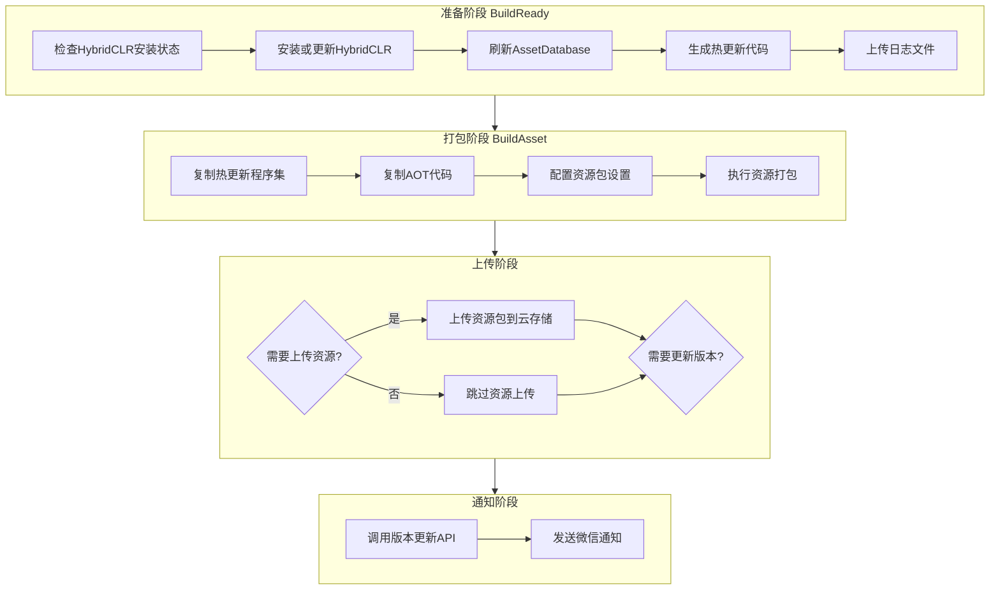

# 使用メソッド

GameFrameX Builder 提供します完全な的 Unity 自动化ビルド解決策，サポート命令行驱动ビルド、リソース打パッケージ、对象存储集成およびビルド通知等機能。

## 概要

GameFrameX Builder 是 GameFrameX フレームワーク的コアビルドモジュール，专门用于実装 Unity プロジェクト的自动化ビルドフロー。该モジュール通过命令行パラメータ受信ビルド設定，サポート多种ビルドシーン，含みますリソース打パッケージ、APK ビルド、ホットアップデート処理等。在持续集成/持续デプロイ（CI/CD）環境中，開発者〜できます通过 Jenkins、GitLab CI 等工具呼び出し Builder，実装完全自动化的ビルドリリースフロー。

Builder モジュール的コア設計理念是将複雑的ビルドフロー分解为独立的、可组合的ステップ。每个ビルドステップ（BuildReady、BuildAsset、BuildApk）都〜できます独立呼び出し，这种設計使得ビルドフロー具有极高的柔軟性。開発者〜できます根据プロジェクト需求选择性地执行某个ステップ，也〜できます将多个ステップ组合成一个完全な的ビルド流水线。

## コアコンセプト

### ビルドパラメータ

Builder 使用命令行パラメータ传递ビルド設定，这种方法与主流 CI/CD 系统完全兼容。所有的ビルドオプション都通过命令行パラメータ指定，含みますビルド目标、パッケージ名、渠道、バージョン号、上传オプション等。这种設計使得ビルド脚本〜できます完全外部化，便于在不同環境之间复用。

> Source: [Editor/BuilderOptions.cs](https://github.com/GameFrameX/com.gameframex.unity.builder/blob/main/Editor/BuilderOptions.cs#L1-L117)

### ビルドメソッド

Builder 提供します三个主な的静态メソッド，分别对应不同的ビルドフェーズ：

- **BuildReady**：ビルド准备フェーズ，负责初期化ビルド環境
- **BuildAsset**：リソース打パッケージフェーズ，使用 YooAsset ビルドリソースパッケージ
- **BuildApk**：APK ビルドフェーズ，生成 Android インストールパッケージ

> Source: [Editor/Builder.cs](https://github.com/GameFrameX/com.gameframex.unity.builder/blob/main/Editor/Builder.cs#L30-L346)

### 对象存储

Builder 集成了多家对象存储服务提供商，含みます七牛云、腾讯云和阿里云。ビルド完成后，〜できます自动将ビルド产物（APK、リソースパッケージ、ログファイル）上传到指定的对象存储桶中。这一機能极大地方便了ビルド产物的分发和管理。

## ビルドフロー

GameFrameX Builder 的ビルドフロー遵循標準的 CI/CD 流水线モード，パッケージ含准备、打パッケージ、上传和通知四个主なフェーズ。每个フェーズ都有明确的责任边界，通过パラメータ設定実装柔軟的フロー控制。



### 准备フェーズ

准备フェーズ（BuildReady）是ビルドフロー的初期化ステップ，主な完成以下工作：

まず確認 HybridCLR 是否已インストール。HybridCLR は Unity ホットアップデート解決策，能够実装 C# コード的热デプロイ。もし检测到 HybridCLR 未インストール或バージョン不匹配，系统会自动执行インストールフロー。这是確認してくださいホットアップデート機能正常工作的关键ステップ。

在 HybridCLR 処理完成后，系统会刷新 Unity 的 AssetDatabase，確認してください所有リソース变更被正确识别。随后呼び出し PrebuildCommand.GenerateAll() 生成ホットアップデート所需的代理コード，这些コード是ホットアップデート機能正常运行的必要基本。

もし設定了ログ上传オプション（-IsUploadLogFile），准备フェーズ结束时会将ビルドログ上传到对象存储，便于后续問題排查。

> Source: [Editor/Builder.cs](https://github.com/GameFrameX/com.gameframex.unity.builder/blob/main/Editor/Builder.cs#L215-L250)

### 打パッケージフェーズ

打パッケージフェーズ（BuildAsset）负责生成游戏的リソースパッケージ，是整个ビルドフロー的コア环节。该フェーズまず复制ホットアップデートアセンブリ和 AOT コード到指定ディレクトリ，次に使用 YooAsset 执行リソース打パッケージ。

在リソース打パッケージ前，系统会変更リソースパッケージファイル名的大小写設定为不敏感（LocationToLower = true），確認してくださいリソースパッケージ在不同プラットフォーム间的一致性。随后作成内置ビルド管线（BuiltinBuildPipeline），設定ビルドパラメータ，含みますビルドモード（增量或全量）、目标プラットフォーム、バージョン号等。

ビルド完成后，根据設定オプション决定是否上传リソースパッケージ。もし启用リソース上传機能，系统会将整个输出ディレクトリ上传到对象存储。もし启用バージョンアップデート機能，系统会呼び出しバージョンアップデート API 通知游戏服务器当前リソースパッケージ情報。

> Source: [Editor/Builder.cs](https://github.com/GameFrameX/com.gameframex.unity.builder/blob/main/Editor/Builder.cs#L255-L345)

### APK ビルドフェーズ

APK ビルドフェーズ（BuildApk）专门用于生成 Android インストールパッケージ。该フェーズ呼び出し BuildProductHelper.BuildPlayerAndroid() 执行原生 Android ビルドフロー，生成签名的 APK ファイル。

ビルド完成后，もし設定了 APK 上传オプション（-IsUploadApk），系统会将生成的 APK ファイル上传到对象存储。同時に也〜できます选择上传ビルドログ，便于問題排查。

> Source: [Editor/Builder.cs](https://github.com/GameFrameX/com.gameframex.unity.builder/blob/main/Editor/Builder.cs#L194-L210)

### 通知フェーズ

通知フェーズ在ビルド完成后自动执行，含みますバージョンアップデート通知和微信企业号通知两个機能。

バージョンアップデート機能会向指定的 HTTP インターフェース发送当前ビルド的バージョン情報，含みます应用バージョン、リソースパッケージバージョン、パッケージ名、プラットフォーム、渠道、语言等。这些情報对于游戏客户端正确ロードリソース至关重要な。

微信企业号通知機能会在ビルド完成后自动发送ビルド結果通知，通知内容含みますビルド时间、リソースバージョン、游戏バージョン、パッケージ名、リソースパッケージ名、プラットフォーム、渠道和语言等情報。团队成员〜できます通过微信及时理解するビルドステータス。

> Source: [Editor/WeChatNotifyWorkHelper.cs](https://github.com/GameFrameX/com.gameframex.unity.builder/blob/main/Editor/WeChatNotifyWorkHelper.cs#L40-L72)

## 命令行パラメータ

Builder 通过命令行パラメータ受信ビルド設定。以下是所有サポート的パラメータ及其説明：

| パラメータ | タイプ | 必填 | デフォルト值 | 説明 |
|------|------|------|--------|------|
| -executeMethod | string | 是 | - | 要执行的ビルドメソッド，如 GameFrameX.Builder.Editor.Builder.BuildAsset |
| -BUILD_NUMBER | string | 是 | - | ビルド编号，用于バージョン标识 |
| -logFile | string | 否 | 自动生成 | ログファイル输出路径 |
| -JOB_NAME | string | 否 | - | CI/CD 任务名称 |
| -PackageName | string | 否 | DefaultPackage | リソースパッケージ名称 |
| -ChannelName | string | 否 | default | 渠道名称 |
| -BundleId | string | 否 | プロジェクト設定 | Android パッケージ名 |
| -AppVersion | string | 否 | プロジェクト設定 | 应用程序バージョン号 |
| -IsIncrementalBuildPackage | flag | 否 | false | 启用增量ビルド |
| -IsUploadLogFile | flag | 否 | false | 上传ログファイル到云存储 |
| -IsUploadAsset | flag | 否 | false | 上传リソースパッケージ到云存储 |
| -IsUploadApk | flag | 否 | false | 上传 APK 到云存储 |
| -IsUpdateAssetPackageVersion | flag | 否 | false | 呼び出しバージョンアップデート API |
| -UpdateAssetPackageVersionUrl | string | 否 | - | バージョンアップデート API 地址 |
| -UpdateAssetPackageVersionAuthorization | string | 否 | - | バージョンアップデート API 授权码 |
| -Language | string | 否 | default | リソース语言 |
| -WeChatBotKey | string | 否 | - | 微信企业号机器人 Key |
| -ObjectStorageKey | string | 否 | - | 对象存储访问 Key |
| -ObjectStorageSecret | string | 否 | - | 对象存储访问秘钥 |
| -ObjectStorageBucketName | string | 否 | - | 对象存储桶名称 |
| -ObjectStorageEndPoint | string | 否 | - | 对象存储区域节点 |

> Source: [Editor/Builder.cs](https://github.com/GameFrameX/com.gameframex.unity.builder/blob/main/Editor/Builder.cs#L60-L181)

## 使用例

### 基本ビルドフロー

以下是使用 Jenkins 进行自动化ビルド的完全な例：

```bash
# 进入 Unity 安装目录
cd /Applications/Unity/Hub/Editor/2021.3.0f1/Unity.app/Contents/MacOS

# 执行构建命令
./Unity \
  -projectPath /path/to/your/project \
  -executeMethod GameFrameX.Builder.Editor.Builder.BuildAsset \
  -BUILD_NUMBER=1001 \
  -JobName=Game_Build \
  -PackageName=DefaultPackage \
  -ChannelName=official \
  -IsIncrementalBuildPackage \
  -logFile=/var/jenkins/workspace/logs/build_1001.log
```

> Source: [Editor/Builder.cs](https://github.com/GameFrameX/com.gameframex.unity.builder/blob/main/Editor/Builder.cs#L60-L80)

### 完全なビルドフロー（含上传）

以下例表示了一个完全な的 CI/CD ビルドフロー，含みますリソース打パッケージ、上传和バージョンアップデート：

```bash
# 完整构建命令
./Unity \
  -projectPath /path/to/your/project \
  -executeMethod GameFrameX.Builder.Editor.Builder.BuildAsset \
  -BUILD_NUMBER=1001 \
  -JobName=Game_Build \
  -PackageName=DefaultPackage \
  -ChannelName=official \
  -AppVersion=1.2.3 \
  -BundleId=com.gameframex.mygame \
  -IsIncrementalBuildPackage \
  -IsUploadAsset \
  -IsUpdateAssetPackageVersion \
  -UpdateAssetPackageVersionUrl=https://api.example.com/version/update \
  -UpdateAssetPackageVersionAuthorization=Bearer_token_here \
  -WeChatBotKey=your_wechat_bot_key \
  -ObjectStorageKey=your_access_key \
  -ObjectStorageSecret=your_secret_key \
  -ObjectStorageBucketName=game-bucket \
  -ObjectStorageEndPoint=cn-bj \
  -Language=zh-CN \
  -logFile=/var/jenkins/workspace/logs/build_1001.log
```

### APK ビルドフロー

もし〜する必要がありますビルド Android APK，〜できます使用以下命令：

```bash
# APK 构建命令
./Unity \
  -projectPath /path/to/your/project \
  -executeMethod GameFrameX.Builder.Editor.Builder.BuildApk \
  -BUILD_NUMBER=1001 \
  -JobName=Game_APK_Build \
  -PackageName=DefaultPackage \
  -ChannelName=official \
  -AppVersion=1.2.3 \
  -BundleId=com.gameframex.mygame \
  -IsUploadApk \
  -ObjectStorageKey=your_access_key \
  -ObjectStorageSecret=your_secret_key \
  -ObjectStorageBucketName=game-bucket \
  -ObjectStorageEndPoint=cn-bj \
  -logFile=/var/jenkins/workspace/logs/apk_build_1001.log
```

### ビルド准备フロー

在某些シーン下，〜の可能性があります只〜する必要があります执行ビルド准备工作（如アップデート HybridCLR）：

```bash
# 构建准备命令
./Unity \
  -projectPath /path/to/your/project \
  -executeMethod GameFrameX.Builder.Editor.Builder.BuildReady \
  -BUILD_NUMBER=1001 \
  -JobName=Game_Prepare \
  -IsUploadLogFile \
  -logFile=/var/jenkins/workspace/logs/prepare_1001.log
```

## 設定对象存储

Builder サポート三种主流的对象存储服务：七牛云、腾讯云和阿里云。根据选择的存储服务，〜する必要があります在ビルド命令中設定相应的パラメータ。

### 七牛云設定

```bash
# 使用七牛云时配置
-ObjectStorageKey=your_qiniu_access_key \
-ObjectStorageSecret=your_qiniu_secret_key \
-ObjectStorageBucketName=your_bucket \
-ObjectStorageEndPoint=cn-bj
```

### 腾讯云設定

```bash
# 使用腾讯云时配置
-ObjectStorageKey=your_tencent_secret_id \
-ObjectStorageSecret=your_tencent_secret_key \
-ObjectStorageBucketName=your_bucket \
-ObjectStorageEndPoint=ap-beijing
```

### 阿里云設定

```bash
# 使用阿里云时配置
-ObjectStorageKey=your_aliyun_access_key \
-ObjectStorageSecret=your_aliyun_secret_key \
-ObjectStorageBucketName=your_bucket \
-ObjectStorageEndPoint=oss-cn-beijing
```

> Source: [Editor/Builder.cs](https://github.com/GameFrameX/com.gameframex.unity.builder/blob/main/Editor/Builder.cs#L40-L53)

## バージョンアップデート与通知

### 設定バージョンアップデート API

当启用バージョンアップデート機能时，Builder 会向指定的 HTTP インターフェース发送バージョン情報：

```bash
-IsUpdateAssetPackageVersion \
-UpdateAssetPackageVersionUrl=https://api.example.com/version/update \
-UpdateAssetPackageVersionAuthorization=Bearer_your_token
```

请求内容フォーマット如下：

```json
{
  "AppVersion": "1.2.3",
  "PackageName": "com.gameframex.mygame",
  "AssetPackageVersion": "20240101120000",
  "AssetPackageName": "DefaultPackage",
  "Platform": "Android",
  "Language": "zh-CN",
  "Channel": "official"
}
```

> Source: [Editor/BuilderUpdateAssetPackageVersionHelper.cs](https://github.com/GameFrameX/com.gameframex.unity.builder/blob/main/Editor/BuilderUpdateAssetPackageVersionHelper.cs#L51-L85)

### 設定微信通知

設定微信企业号机器人后，ビルド完成会自动发送通知：

```bash
-WeChatBotKey=your_wechat_bot_key
```

通知メッセージフォーマット为 Markdown，パッケージ含ビルド时间、リソースバージョン、游戏バージョン、パッケージ名、リソースパッケージ名、プラットフォーム、渠道和语言等情報。

> Source: [Editor/WeChatNotifyWorkHelper.cs](https://github.com/GameFrameX/com.gameframex.unity.builder/blob/main/Editor/WeChatNotifyWorkHelper.cs#L45-L71)

## GitLab CI 集成例

以下是集成到 GitLab CI 的完全な設定例：

```yaml
stages:
  - build
  - upload

build-android:
  stage: build
  image: unityci/editor:2021.3.0f1-android
  script:
    - |
      /opt/Unity/Editor/Unity \
        -projectPath ${CI_PROJECT_DIR} \
        -executeMethod GameFrameX.Builder.Editor.Builder.BuildAsset \
        -BUILD_NUMBER=${CI_PIPELINE_ID} \
        -JobName=${CI_JOB_NAME} \
        -PackageName=DefaultPackage \
        -ChannelName=official \
        -AppVersion=1.2.3 \
        -BundleId=com.gameframex.mygame \
        -IsIncrementalBuildPackage \
        -IsUploadAsset \
        -IsUpdateAssetPackageVersion \
        -UpdateAssetPackageVersionUrl=${VERSION_API_URL} \
        -UpdateAssetPackageVersionAuthorization=${API_TOKEN} \
        -WeChatBotKey=${WECHAT_BOT_KEY} \
        -ObjectStorageKey=${OSS_KEY} \
        -ObjectStorageSecret=${OSS_SECRET} \
        -ObjectStorageBucketName=game-bucket \
        -ObjectStorageEndPoint=cn-bj \
        -Language=zh-CN
  artifacts:
    paths:
      - Logs/
    expire_in: 7 days
```

## Jenkins Pipeline 集成例

以下是 Jenkins Pipeline 的設定例：

```groovy
pipeline {
    agent any
    
    parameters {
        string(name: 'PACKAGE_NAME', defaultValue: 'DefaultPackage', description: '资源包名称')
        string(name: 'CHANNEL_NAME', defaultValue: 'official', description: '渠道名称')
        string(name: 'APP_VERSION', defaultValue: '1.2.3', description: '应用版本')
        booleanParam(name: 'INCREMENTAL_BUILD', defaultValue: true, description: '增量构建')
        booleanParam(name: 'UPLOAD_ASSET', defaultValue: true, description: '上传资源')
        booleanParam(name: 'UPDATE_VERSION', defaultValue: true, description: '更新版本')
    }
    
    stages {
        stage('构建') {
            steps {
                bat """
                    "${UNITY_PATH}\\Editor\\Unity.exe" \
                        -projectPath "${WORKSPACE}" \
                        -executeMethod GameFrameX.Builder.Editor.Builder.BuildAsset \
                        -BUILD_NUMBER=${BUILD_NUMBER} \
                        -JobName=${JOB_NAME} \
                        -PackageName=${params.PACKAGE_NAME} \
                        -ChannelName=${params.CHANNEL_NAME} \
                        -AppVersion=${params.APP_VERSION} \
                        ${params.INCREMENTAL_BUILD ? '-IsIncrementalBuildPackage' : ''} \
                        ${params.UPLOAD_ASSET ? '-IsUploadAsset' : ''} \
                        ${params.UPDATE_VERSION ? '-IsUpdateAssetPackageVersion' : ''} \
                        -UpdateAssetPackageVersionUrl=${VERSION_API_URL} \
                        -UpdateAssetPackageVersionAuthorization=${API_TOKEN} \
                        -WeChatBotKey=${WECHAT_BOT_KEY} \
                        -ObjectStorageKey=${OSS_KEY} \
                        -ObjectStorageSecret=${OSS_SECRET} \
                        -ObjectStorageBucketName=${OSS_BUCKET} \
                        -ObjectStorageEndPoint=cn-bj
                """
            }
        }
    }
}
```

## 関連リンク

- [設定オプション](./5-configuration) - 詳細理解する所有ビルド設定オプション
- [对象存储](./6-object-storage) - 对象存储服务設定与使用
- [常见問題](./7-troubleshooting) - ビルド过程中常见問題与解決策
- [概要](./1-overview) - GameFrameX Builder 概要与アーキテクチャ
- [インストール](./2-installation) - 環境設定与インストールガイド
- [快速开始](./3-getting-started) - 快速上手教程
