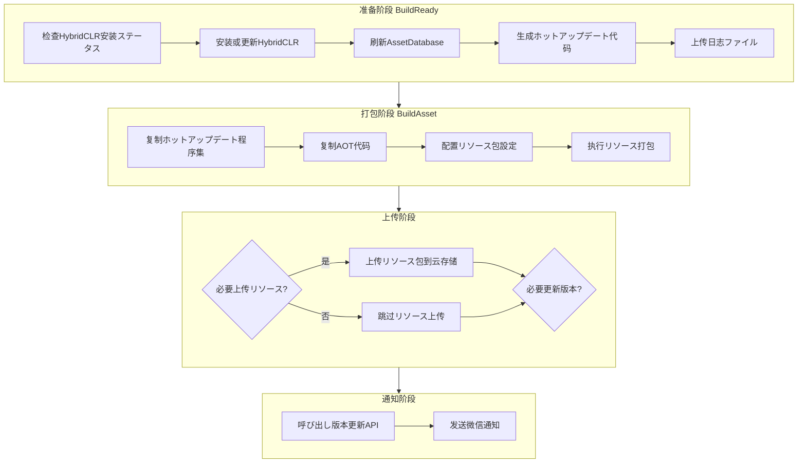

# 使用メソッド

GameFrameX Builder 提供します完整的 Unity 自动化构建解決策，サポート命令行驱动构建、リソース打包、オブジェクトストレージ集成以及构建通知等機能。

## 概要

GameFrameX Builder 是 GameFrameX フレームワーク的コア构建模块，专门に使用実装 Unity プロジェクト的自动化构建フロー。该模块を通じて命令行参数接收构建配置，サポート多种构建シーン，包括リソース打包、APK 构建、ホットアップデート处理等。在持续集成/持续部署（CI/CD）环境中，開発者可能を通じて Jenkins、GitLab CI 等工具呼び出し Builder，実装完全自动化的构建发布フロー。

Builder 模块的コア设计理念是将复杂的构建フロー分解为独立的、可组合的手順。每个构建手順（BuildReady、BuildAsset、BuildApk）都可能独立呼び出し，这种设计使得构建フロー具有极高的灵活性。開発者可能に基づいてプロジェクト需求选择性地执行某个手順，也可能将多个手順组合成一个完整的构建流水线。

## コアコンセプト

### 构建参数

Builder 使用命令行参数传递构建配置，这种方法与主流 CI/CD 系统完全兼容。所有的构建选项都を通じて命令行参数指定，包括构建目标、包名、渠道、版本号、上传选项等。这种设计使得构建脚本可能完全外部化，便于在不同环境之间复用。

> Source: [Editor/BuilderOptions.cs](https://github.com/GameFrameX/com.gameframex.unity.builder/blob/main/Editor/BuilderOptions.cs#L1-L117)

### 构建メソッド

Builder 提供します三个主要的静态メソッド，分别对应不同的构建阶段：

- **BuildReady**：构建准备阶段，负责初期化构建环境
- **BuildAsset**：リソース打包阶段，使用 YooAsset 构建リソース包
- **BuildApk**：APK 构建阶段，生成 Android 安装包

> Source: [Editor/Builder.cs](https://github.com/GameFrameX/com.gameframex.unity.builder/blob/main/Editor/Builder.cs#L30-L346)

### オブジェクトストレージ

Builder 集成了多家オブジェクトストレージ服务提供商，包括七牛云、腾讯云和阿里云。构建完成后，可能自动将构建产物（APK、リソース包、日志ファイル）上传到指定的オブジェクトストレージ桶中。这一機能极大地方便了构建产物的分发和管理。

## 构建フロー

GameFrameX Builder 的构建フロー遵循标准的 CI/CD 流水线模式，包含准备、打包、上传和通知四个主要阶段。每个阶段都有明确的责任边界，を通じて参数配置実装灵活的フロー控制。



### 准备阶段

准备阶段（BuildReady）是构建フロー的初期化手順，主要完成以下工作：

首先检查 HybridCLR 是否已安装。HybridCLR は Unity ホットアップデート解決策，能够実装 C# 代码的热部署。如果检测到 HybridCLR 未安装或版本不匹配，系统会自动执行安装フロー。这是确保ホットアップデート機能正常工作的关键手順。

在 HybridCLR 处理完成后，系统会刷新 Unity 的 AssetDatabase，确保所有リソース变更被正确识别。随后呼び出し PrebuildCommand.GenerateAll() 生成ホットアップデート所需的代理代码，这些代码是ホットアップデート機能正常运行的必要基础。

如果配置了日志上传选项（-IsUploadLogFile），准备阶段结束时会将构建日志上传到オブジェクトストレージ，便于后续问题排查。

> Source: [Editor/Builder.cs](https://github.com/GameFrameX/com.gameframex.unity.builder/blob/main/Editor/Builder.cs#L215-L250)

### 打包阶段

打包阶段（BuildAsset）负责生成ゲーム的リソース包，是整个构建フロー的コア环节。该阶段首先复制ホットアップデート程序集和 AOT 代码到指定ディレクトリ，然后使用 YooAsset 执行リソース打包。

在リソース打包前，系统会修改リソース包ファイル名的大小写設定为不敏感（LocationToLower = true），确保リソース包在不同平台间的一致性。随后作成内置构建管线（BuiltinBuildPipeline），配置构建参数，包括构建模式（增量或全量）、目标平台、版本号等。

构建完成后，に基づいて配置选项决定是否上传リソース包。如果启用リソース上传機能，系统会将整个输出ディレクトリ上传到オブジェクトストレージ。如果启用版本更新機能，系统会呼び出し版本更新 API 通知ゲーム服务器当前リソース包信息。

> Source: [Editor/Builder.cs](https://github.com/GameFrameX/com.gameframex.unity.builder/blob/main/Editor/Builder.cs#L255-L345)

### APK 构建阶段

APK 构建阶段（BuildApk）专门に使用生成 Android 安装包。该阶段呼び出し BuildProductHelper.BuildPlayerAndroid() 执行原生 Android 构建フロー，生成签名的 APK ファイル。

构建完成后，如果配置了 APK 上传选项（-IsUploadApk），系统会将生成的 APK ファイル上传到オブジェクトストレージ。同时也可能选择上传构建日志，便于问题排查。

> Source: [Editor/Builder.cs](https://github.com/GameFrameX/com.gameframex.unity.builder/blob/main/Editor/Builder.cs#L194-L210)

### 通知阶段

通知阶段在构建完成后自动执行，包括版本更新通知和微信企业号通知两个機能。

版本更新機能会向指定的 HTTP インターフェース发送当前构建的版本信息，包括应用版本、リソース包版本、包名、平台、渠道、语言等。这些信息对于ゲーム客户端正确加载リソース至关重要。

微信企业号通知機能会在构建完成后自动发送构建结果通知，通知内容包括构建时间、リソース版本、ゲーム版本、包名、リソース包名、平台、渠道和语言等信息。团队成员可能を通じて微信及时了解构建ステータス。

> Source: [Editor/WeChatNotifyWorkHelper.cs](https://github.com/GameFrameX/com.gameframex.unity.builder/blob/main/Editor/WeChatNotifyWorkHelper.cs#L40-L72)

## 命令行参数

Builder を通じて命令行参数接收构建配置。以下是所有サポート的参数及其説明：

| 参数 | クラス型 | 必填 | 默认值 | 説明 |
|------|------|------|--------|------|
| -executeMethod | string | 是 | - | 要执行的构建メソッド，如 GameFrameX.Builder.Editor.Builder.BuildAsset |
| -BUILD_NUMBER | string | 是 | - | 构建编号，に使用版本标识 |
| -logFile | string | 否 | 自动生成 | 日志ファイル输出路径 |
| -JOB_NAME | string | 否 | - | CI/CD 任务名称 |
| -PackageName | string | 否 | DefaultPackage | リソース包名称 |
| -ChannelName | string | 否 | default | 渠道名称 |
| -BundleId | string | 否 | プロジェクト配置 | Android 包名 |
| -AppVersion | string | 否 | プロジェクト配置 | 应用程序版本号 |
| -IsIncrementalBuildPackage | flag | 否 | false | 启用增量构建 |
| -IsUploadLogFile | flag | 否 | false | 上传日志ファイル到云存储 |
| -IsUploadAsset | flag | 否 | false | 上传リソース包到云存储 |
| -IsUploadApk | flag | 否 | false | 上传 APK 到云存储 |
| -IsUpdateAssetPackageVersion | flag | 否 | false | 呼び出し版本更新 API |
| -UpdateAssetPackageVersionUrl | string | 否 | - | 版本更新 API 地址 |
| -UpdateAssetPackageVersionAuthorization | string | 否 | - | 版本更新 API 授权码 |
| -Language | string | 否 | default | リソース语言 |
| -WeChatBotKey | string | 否 | - | 微信企业号机器人 Key |
| -ObjectStorageKey | string | 否 | - | オブジェクトストレージ访问 Key |
| -ObjectStorageSecret | string | 否 | - | オブジェクトストレージ访问秘钥 |
| -ObjectStorageBucketName | string | 否 | - | 对象バケット名 |
| -ObjectStorageEndPoint | string | 否 | - | オブジェクトストレージ区域节点 |

> Source: [Editor/Builder.cs](https://github.com/GameFrameX/com.gameframex.unity.builder/blob/main/Editor/Builder.cs#L60-L181)

## 使用例

### 基本构建フロー

以下是使用 Jenkins 进行自动化构建的完整示例：

```bash
# 进入 Unity 安装ディレクトリ
cd /Applications/Unity/Hub/Editor/2021.3.0f1/Unity.app/Contents/MacOS

# 执行构建命令
./Unity \
  -projectPath /path/to/your/project \
  -executeMethod GameFrameX.Builder.Editor.Builder.BuildAsset \
  -BUILD_NUMBER=1001 \
  -JobName=Game_Build \
  -PackageName=DefaultPackage \
  -ChannelName=official \
  -IsIncrementalBuildPackage \
  -logFile=/var/jenkins/workspace/logs/build_1001.log
```

> Source: [Editor/Builder.cs](https://github.com/GameFrameX/com.gameframex.unity.builder/blob/main/Editor/Builder.cs#L60-L80)

### 完整构建フロー（含上传）

以下示例展示了一个完整的 CI/CD 构建フロー，包括リソース打包、上传和版本更新：

```bash
# 完整构建命令
./Unity \
  -projectPath /path/to/your/project \
  -executeMethod GameFrameX.Builder.Editor.Builder.BuildAsset \
  -BUILD_NUMBER=1001 \
  -JobName=Game_Build \
  -PackageName=DefaultPackage \
  -ChannelName=official \
  -AppVersion=1.2.3 \
  -BundleId=com.gameframex.mygame \
  -IsIncrementalBuildPackage \
  -IsUploadAsset \
  -IsUpdateAssetPackageVersion \
  -UpdateAssetPackageVersionUrl=https://api.example.com/version/update \
  -UpdateAssetPackageVersionAuthorization=Bearer_token_here \
  -WeChatBotKey=your_wechat_bot_key \
  -ObjectStorageKey=your_access_key \
  -ObjectStorageSecret=your_secret_key \
  -ObjectStorageBucketName=game-bucket \
  -ObjectStorageEndPoint=cn-bj \
  -Language=zh-CN \
  -logFile=/var/jenkins/workspace/logs/build_1001.log
```

### APK 构建フロー

如果必要构建 Android APK，可能使用以下命令：

```bash
# APK 构建命令
./Unity \
  -projectPath /path/to/your/project \
  -executeMethod GameFrameX.Builder.Editor.Builder.BuildApk \
  -BUILD_NUMBER=1001 \
  -JobName=Game_APK_Build \
  -PackageName=DefaultPackage \
  -ChannelName=official \
  -AppVersion=1.2.3 \
  -BundleId=com.gameframex.mygame \
  -IsUploadApk \
  -ObjectStorageKey=your_access_key \
  -ObjectStorageSecret=your_secret_key \
  -ObjectStorageBucketName=game-bucket \
  -ObjectStorageEndPoint=cn-bj \
  -logFile=/var/jenkins/workspace/logs/apk_build_1001.log
```

### 构建准备フロー

在某些シーン下，可能只必要执行构建准备工作（如更新 HybridCLR）：

```bash
# 构建准备命令
./Unity \
  -projectPath /path/to/your/project \
  -executeMethod GameFrameX.Builder.Editor.Builder.BuildReady \
  -BUILD_NUMBER=1001 \
  -JobName=Game_Prepare \
  -IsUploadLogFile \
  -logFile=/var/jenkins/workspace/logs/prepare_1001.log
```

## 設定オブジェクトストレージ

Builder サポート三种主流的オブジェクトストレージ服务：七牛云、腾讯云和阿里云。に基づいて选择的存储服务，必要在构建命令中配置相应的参数。

### 七牛云配置

```bash
# 使用七牛云时配置
-ObjectStorageKey=your_qiniu_access_key \
-ObjectStorageSecret=your_qiniu_secret_key \
-ObjectStorageBucketName=your_bucket \
-ObjectStorageEndPoint=cn-bj
```

### 腾讯云配置

```bash
# 使用腾讯云时配置
-ObjectStorageKey=your_tencent_secret_id \
-ObjectStorageSecret=your_tencent_secret_key \
-ObjectStorageBucketName=your_bucket \
-ObjectStorageEndPoint=ap-beijing
```

### 阿里云配置

```bash
# 使用阿里云时配置
-ObjectStorageKey=your_aliyun_access_key \
-ObjectStorageSecret=your_aliyun_secret_key \
-ObjectStorageBucketName=your_bucket \
-ObjectStorageEndPoint=oss-cn-beijing
```

> Source: [Editor/Builder.cs](https://github.com/GameFrameX/com.gameframex.unity.builder/blob/main/Editor/Builder.cs#L40-L53)

## 版本更新与通知

### 設定版本更新 API

当启用版本更新機能时，Builder 会向指定的 HTTP インターフェース发送版本信息：

```bash
-IsUpdateAssetPackageVersion \
-UpdateAssetPackageVersionUrl=https://api.example.com/version/update \
-UpdateAssetPackageVersionAuthorization=Bearer_your_token
```

お願いします求内容格式如下：

```json
{
  "AppVersion": "1.2.3",
  "PackageName": "com.gameframex.mygame",
  "AssetPackageVersion": "20240101120000",
  "AssetPackageName": "DefaultPackage",
  "Platform": "Android",
  "Language": "zh-CN",
  "Channel": "official"
}
```

> Source: [Editor/BuilderUpdateAssetPackageVersionHelper.cs](https://github.com/GameFrameX/com.gameframex.unity.builder/blob/main/Editor/BuilderUpdateAssetPackageVersionHelper.cs#L51-L85)

### 設定微信通知

配置微信企业号机器人后，构建完成会自动发送通知：

```bash
-WeChatBotKey=your_wechat_bot_key
```

通知消息格式为 Markdown，包含构建时间、リソース版本、ゲーム版本、包名、リソース包名、平台、渠道和语言等信息。

> Source: [Editor/WeChatNotifyWorkHelper.cs](https://github.com/GameFrameX/com.gameframex.unity.builder/blob/main/Editor/WeChatNotifyWorkHelper.cs#L45-L71)

## GitLab CI 集成示例

以下是集成到 GitLab CI 的完整配置示例：

```yaml
stages:
  - build
  - upload

build-android:
  stage: build
  image: unityci/editor:2021.3.0f1-android
  script:
    - |
      /opt/Unity/Editor/Unity \
        -projectPath ${CI_PROJECT_DIR} \
        -executeMethod GameFrameX.Builder.Editor.Builder.BuildAsset \
        -BUILD_NUMBER=${CI_PIPELINE_ID} \
        -JobName=${CI_JOB_NAME} \
        -PackageName=DefaultPackage \
        -ChannelName=official \
        -AppVersion=1.2.3 \
        -BundleId=com.gameframex.mygame \
        -IsIncrementalBuildPackage \
        -IsUploadAsset \
        -IsUpdateAssetPackageVersion \
        -UpdateAssetPackageVersionUrl=${VERSION_API_URL} \
        -UpdateAssetPackageVersionAuthorization=${API_TOKEN} \
        -WeChatBotKey=${WECHAT_BOT_KEY} \
        -ObjectStorageKey=${OSS_KEY} \
        -ObjectStorageSecret=${OSS_SECRET} \
        -ObjectStorageBucketName=game-bucket \
        -ObjectStorageEndPoint=cn-bj \
        -Language=zh-CN
  artifacts:
    paths:
      - Logs/
    expire_in: 7 days
```

## Jenkins Pipeline 集成示例

以下是 Jenkins Pipeline 的配置示例：

```groovy
pipeline {
    agent any
    
    parameters {
        string(name: 'PACKAGE_NAME', defaultValue: 'DefaultPackage', description: 'リソース包名称')
        string(name: 'CHANNEL_NAME', defaultValue: 'official', description: '渠道名称')
        string(name: 'APP_VERSION', defaultValue: '1.2.3', description: '应用版本')
        booleanParam(name: 'INCREMENTAL_BUILD', defaultValue: true, description: '增量构建')
        booleanParam(name: 'UPLOAD_ASSET', defaultValue: true, description: '上传リソース')
        booleanParam(name: 'UPDATE_VERSION', defaultValue: true, description: '更新版本')
    }
    
    stages {
        stage('构建') {
            steps {
                bat """
                    "${UNITY_PATH}\\Editor\\Unity.exe" \
                        -projectPath "${WORKSPACE}" \
                        -executeMethod GameFrameX.Builder.Editor.Builder.BuildAsset \
                        -BUILD_NUMBER=${BUILD_NUMBER} \
                        -JobName=${JOB_NAME} \
                        -PackageName=${params.PACKAGE_NAME} \
                        -ChannelName=${params.CHANNEL_NAME} \
                        -AppVersion=${params.APP_VERSION} \
                        ${params.INCREMENTAL_BUILD ? '-IsIncrementalBuildPackage' : ''} \
                        ${params.UPLOAD_ASSET ? '-IsUploadAsset' : ''} \
                        ${params.UPDATE_VERSION ? '-IsUpdateAssetPackageVersion' : ''} \
                        -UpdateAssetPackageVersionUrl=${VERSION_API_URL} \
                        -UpdateAssetPackageVersionAuthorization=${API_TOKEN} \
                        -WeChatBotKey=${WECHAT_BOT_KEY} \
                        -ObjectStorageKey=${OSS_KEY} \
                        -ObjectStorageSecret=${OSS_SECRET} \
                        -ObjectStorageBucketName=${OSS_BUCKET} \
                        -ObjectStorageEndPoint=cn-bj
                """
            }
        }
    }
}
```

## 関連リンク

- [配置选项](./5-configuration) - 详细了解所有构建配置选项
- [オブジェクトストレージ](./6-object-storage) - オブジェクトストレージ服务配置与使用
- [常见问题](./7-troubleshooting) - 构建过程中常见问题与解決策
- [概述](./1-overview) - GameFrameX Builder 概述与架构
- [安装](./2-installation) - 环境配置与安装指南
- [快速开始](./3-getting-started) - 快速上手教程
