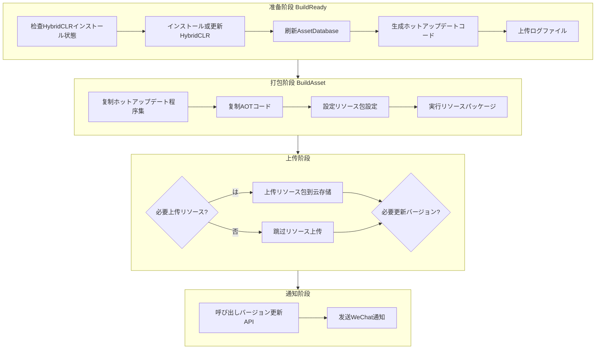

# メソッド

GameFrameX Builder たの Unity ビルド，サポートコマンドラインビルド、リソースパッケージ、オブジェクトストレージビルド。

## 

GameFrameX Builder は GameFrameX フレームワークのコアビルドモジュール，に Unity プロジェクトのビルドフロー。モジュールをじてコマンドラインパラメータビルド，サポートビルド，リソースパッケージ、APK ビルド、ホットアップデート。に/デプロイ（CI/CD），をじて Jenkins、GitLab CI びし Builder，のビルドフロー。

Builder モジュールのコアはのビルドフローの、のステップ。ビルドステップ（BuildReady、BuildAsset、BuildApk）びし，ビルドフローの。プロジェクトステップ，ステップのビルド。

## コアコンセプト

### ビルドパラメータ

Builder コマンドラインパラメータビルド，と CI/CD 。のビルドオプションをじてコマンドラインパラメータ，ビルド、、、バージョン、オプション。ビルド，に。

> Source: [Editor/BuilderOptions.cs](https://github.com/GameFrameX/com.gameframex.unity.builder/blob/main/Editor/BuilderOptions.cs#L1-L117)

### ビルドメソッド

Builder たのメソッド，のビルド：

- **BuildReady**：ビルド，ビルド
- **BuildAsset**：リソースパッケージ， YooAsset ビルドリソース
- **BuildApk**：APK ビルド， Android インストール

> Source: [Editor/Builder.cs](https://github.com/GameFrameX/com.gameframex.unity.builder/blob/main/Editor/Builder.cs#L30-L346)

### オブジェクトストレージ

Builder たオブジェクトストレージ，、と。ビルドた，ビルド（APK、リソース、ログファイル）のオブジェクトストレージ。たビルドのと。

## ビルドフロー

GameFrameX Builder のビルドフローの CI/CD ，む、、と。の，をじてパラメータのフロー。



### 

（BuildReady）はビルドフローのステップ，た：

 HybridCLR はインストール。HybridCLR は Unity ホットアップデート， C# コードのデプロイ。 HybridCLR インストールバージョン，インストールフロー。はホットアップデートのステップ。

に HybridCLR た， Unity の AssetDatabase，リソース。びし PrebuildCommand.GenerateAll() ホットアップデートのコード，コードはホットアップデートの。

たログオプション（-IsUploadLogFile），たビルドログオブジェクトストレージ，。

> Source: [Editor/Builder.cs](https://github.com/GameFrameX/com.gameframex.unity.builder/blob/main/Editor/Builder.cs#L215-L250)

### 

（BuildAsset）ゲームのリソース，はビルドフローのコア。ホットアップデートと AOT コードディレクトリ， YooAsset リソースパッケージ。

にリソースパッケージ，リソースファイルの（LocationToLower = true），リソースにプラットフォームの。ビルド（BuiltinBuildPipeline），ビルドパラメータ，ビルド（）、プラットフォーム、バージョン。

ビルドた，オプションはリソース。リソース，ディレクトリオブジェクトストレージ。バージョン，びしバージョン API ゲームリソース。

> Source: [Editor/Builder.cs](https://github.com/GameFrameX/com.gameframex.unity.builder/blob/main/Editor/Builder.cs#L255-L345)

### APK ビルド

APK ビルド（BuildApk）に Android インストール。びし BuildProductHelper.BuildPlayerAndroid()  Android ビルドフロー，の APK ファイル。

ビルドた，た APK オプション（-IsUploadApk），の APK ファイルオブジェクトストレージ。ビルドログ，。

> Source: [Editor/Builder.cs](https://github.com/GameFrameX/com.gameframex.unity.builder/blob/main/Editor/Builder.cs#L194-L210)

### 

にビルドた，バージョンと。

バージョンの HTTP インターフェースビルドのバージョン，バージョン、リソースバージョン、、プラットフォーム、、。ゲームロードリソース。

にビルドたビルド，ビルド、リソースバージョン、ゲームバージョン、、リソース、プラットフォーム、と。をじてたビルド。

> Source: [Editor/WeChatNotifyWorkHelper.cs](https://github.com/GameFrameX/com.gameframex.unity.builder/blob/main/Editor/WeChatNotifyWorkHelper.cs#L40-L72)

## コマンドラインパラメータ

Builder をじてコマンドラインパラメータビルド。はサポートのパラメータ：

| パラメータ | タイプ |  | デフォルト |  |
|------|------|------|--------|------|
| -executeMethod | string | は | - | のビルドメソッド， GameFrameX.Builder.Editor.Builder.BuildAsset |
| -BUILD_NUMBER | string | は | - | ビルド，にバージョン |
| -logFile | string |  |  | ログファイルパス |
| -JOB_NAME | string |  | - | CI/CD  |
| -PackageName | string |  | DefaultPackage | リソース |
| -ChannelName | string |  | default |  |
| -BundleId | string |  | プロジェクト | Android  |
| -AppVersion | string |  | プロジェクト | バージョン |
| -IsIncrementalBuildPackage | flag |  | false | ビルド |
| -IsUploadLogFile | flag |  | false | ログファイル |
| -IsUploadAsset | flag |  | false | リソース |
| -IsUploadApk | flag |  | false |  APK  |
| -IsUpdateAssetPackageVersion | flag |  | false | びしバージョン API |
| -UpdateAssetPackageVersionUrl | string |  | - | バージョン API  |
| -UpdateAssetPackageVersionAuthorization | string |  | - | バージョン API  |
| -Language | string |  | default | リソース |
| -WeChatBotKey | string |  | - |  Key |
| -ObjectStorageKey | string |  | - | オブジェクトストレージ Key |
| -ObjectStorageSecret | string |  | - | オブジェクトストレージ |
| -ObjectStorageBucketName | string |  | - | オブジェクトストレージ |
| -ObjectStorageEndPoint | string |  | - | オブジェクトストレージ |

> Source: [Editor/Builder.cs](https://github.com/GameFrameX/com.gameframex.unity.builder/blob/main/Editor/Builder.cs#L60-L181)

## 

### ビルドフロー

は Jenkins ビルドの：

```bash
# 进入 Unity インストールディレクトリ
cd /Applications/Unity/Hub/Editor/2021.3.0f1/Unity.app/Contents/MacOS

# 実行ビルドコマンド
./Unity \
  -projectPath /path/to/your/project \
  -executeMethod GameFrameX.Builder.Editor.Builder.BuildAsset \
  -BUILD_NUMBER=1001 \
  -JobName=Game_Build \
  -PackageName=DefaultPackage \
  -ChannelName=official \
  -IsIncrementalBuildPackage \
  -logFile=/var/jenkins/workspace/logs/build_1001.log
```

> Source: [Editor/Builder.cs](https://github.com/GameFrameX/com.gameframex.unity.builder/blob/main/Editor/Builder.cs#L60-L80)

### ビルドフロー（）

たの CI/CD ビルドフロー，リソースパッケージ、とバージョン：

```bash
# 完全ビルドコマンド
./Unity \
  -projectPath /path/to/your/project \
  -executeMethod GameFrameX.Builder.Editor.Builder.BuildAsset \
  -BUILD_NUMBER=1001 \
  -JobName=Game_Build \
  -PackageName=DefaultPackage \
  -ChannelName=official \
  -AppVersion=1.2.3 \
  -BundleId=com.gameframex.mygame \
  -IsIncrementalBuildPackage \
  -IsUploadAsset \
  -IsUpdateAssetPackageVersion \
  -UpdateAssetPackageVersionUrl=https://api.example.com/version/update \
  -UpdateAssetPackageVersionAuthorization=Bearer_token_here \
  -WeChatBotKey=your_wechat_bot_key \
  -ObjectStorageKey=your_access_key \
  -ObjectStorageSecret=your_secret_key \
  -ObjectStorageBucketName=game-bucket \
  -ObjectStorageEndPoint=cn-bj \
  -Language=zh-CN \
  -logFile=/var/jenkins/workspace/logs/build_1001.log
```

### APK ビルドフロー

ビルド Android APK，コマンド：

```bash
# APK ビルドコマンド
./Unity \
  -projectPath /path/to/your/project \
  -executeMethod GameFrameX.Builder.Editor.Builder.BuildApk \
  -BUILD_NUMBER=1001 \
  -JobName=Game_APK_Build \
  -PackageName=DefaultPackage \
  -ChannelName=official \
  -AppVersion=1.2.3 \
  -BundleId=com.gameframex.mygame \
  -IsUploadApk \
  -ObjectStorageKey=your_access_key \
  -ObjectStorageSecret=your_secret_key \
  -ObjectStorageBucketName=game-bucket \
  -ObjectStorageEndPoint=cn-bj \
  -logFile=/var/jenkins/workspace/logs/apk_build_1001.log
```

### ビルドフロー

に，ビルド（ HybridCLR）：

```bash
# ビルド準備コマンド
./Unity \
  -projectPath /path/to/your/project \
  -executeMethod GameFrameX.Builder.Editor.Builder.BuildReady \
  -BUILD_NUMBER=1001 \
  -JobName=Game_Prepare \
  -IsUploadLogFile \
  -logFile=/var/jenkins/workspace/logs/prepare_1001.log
```

## オブジェクトストレージ

Builder サポートのオブジェクトストレージ：、と。の，にビルドコマンドのパラメータ。

### 

```bash
# 使用七牛云时設定
-ObjectStorageKey=your_qiniu_access_key \
-ObjectStorageSecret=your_qiniu_secret_key \
-ObjectStorageBucketName=your_bucket \
-ObjectStorageEndPoint=cn-bj
```

### 

```bash
# 使用腾讯云时設定
-ObjectStorageKey=your_tencent_secret_id \
-ObjectStorageSecret=your_tencent_secret_key \
-ObjectStorageBucketName=your_bucket \
-ObjectStorageEndPoint=ap-beijing
```

### 

```bash
# 使用阿里云时設定
-ObjectStorageKey=your_aliyun_access_key \
-ObjectStorageSecret=your_aliyun_secret_key \
-ObjectStorageBucketName=your_bucket \
-ObjectStorageEndPoint=oss-cn-beijing
```

> Source: [Editor/Builder.cs](https://github.com/GameFrameX/com.gameframex.unity.builder/blob/main/Editor/Builder.cs#L40-L53)

## バージョンと

### バージョン API

バージョン，Builder の HTTP インターフェースバージョン：

```bash
-IsUpdateAssetPackageVersion \
-UpdateAssetPackageVersionUrl=https://api.example.com/version/update \
-UpdateAssetPackageVersionAuthorization=Bearer_your_token
```

リクエスト：

```json
{
  "AppVersion": "1.2.3",
  "PackageName": "com.gameframex.mygame",
  "AssetPackageVersion": "20240101120000",
  "AssetPackageName": "DefaultPackage",
  "Platform": "Android",
  "Language": "zh-CN",
  "Channel": "official"
}
```

> Source: [Editor/BuilderUpdateAssetPackageVersionHelper.cs](https://github.com/GameFrameX/com.gameframex.unity.builder/blob/main/Editor/BuilderUpdateAssetPackageVersionHelper.cs#L51-L85)

### WeChat

，ビルドた：

```bash
-WeChatBotKey=your_wechat_bot_key
```

 Markdown，むビルド、リソースバージョン、ゲームバージョン、、リソース、プラットフォーム、と。

> Source: [Editor/WeChatNotifyWorkHelper.cs](https://github.com/GameFrameX/com.gameframex.unity.builder/blob/main/Editor/WeChatNotifyWorkHelper.cs#L45-L71)

## GitLab CI 

は GitLab CI の：

```yaml
stages:
  - build
  - upload

build-android:
  stage: build
  image: unityci/editor:2021.3.0f1-android
  script:
    - |
      /opt/Unity/Editor/Unity \
        -projectPath ${CI_PROJECT_DIR} \
        -executeMethod GameFrameX.Builder.Editor.Builder.BuildAsset \
        -BUILD_NUMBER=${CI_PIPELINE_ID} \
        -JobName=${CI_JOB_NAME} \
        -PackageName=DefaultPackage \
        -ChannelName=official \
        -AppVersion=1.2.3 \
        -BundleId=com.gameframex.mygame \
        -IsIncrementalBuildPackage \
        -IsUploadAsset \
        -IsUpdateAssetPackageVersion \
        -UpdateAssetPackageVersionUrl=${VERSION_API_URL} \
        -UpdateAssetPackageVersionAuthorization=${API_TOKEN} \
        -WeChatBotKey=${WECHAT_BOT_KEY} \
        -ObjectStorageKey=${OSS_KEY} \
        -ObjectStorageSecret=${OSS_SECRET} \
        -ObjectStorageBucketName=game-bucket \
        -ObjectStorageEndPoint=cn-bj \
        -Language=zh-CN
  artifacts:
    paths:
      - Logs/
    expire_in: 7 days
```

## Jenkins Pipeline 

は Jenkins Pipeline の：

```groovy
pipeline {
    agent any
    
    parameters {
        string(name: 'PACKAGE_NAME', defaultValue: 'DefaultPackage', description: 'リソース包名称')
        string(name: 'CHANNEL_NAME', defaultValue: 'official', description: '渠道名称')
        string(name: 'APP_VERSION', defaultValue: '1.2.3', description: '应用バージョン')
        booleanParam(name: 'INCREMENTAL_BUILD', defaultValue: true, description: '增量ビルド')
        booleanParam(name: 'UPLOAD_ASSET', defaultValue: true, description: '上传リソース')
        booleanParam(name: 'UPDATE_VERSION', defaultValue: true, description: '更新バージョン')
    }
    
    stages {
        stage('ビルド') {
            steps {
                bat """
                    "${UNITY_PATH}\\Editor\\Unity.exe" \
                        -projectPath "${WORKSPACE}" \
                        -executeMethod GameFrameX.Builder.Editor.Builder.BuildAsset \
                        -BUILD_NUMBER=${BUILD_NUMBER} \
                        -JobName=${JOB_NAME} \
                        -PackageName=${params.PACKAGE_NAME} \
                        -ChannelName=${params.CHANNEL_NAME} \
                        -AppVersion=${params.APP_VERSION} \
                        ${params.INCREMENTAL_BUILD ? '-IsIncrementalBuildPackage' : ''} \
                        ${params.UPLOAD_ASSET ? '-IsUploadAsset' : ''} \
                        ${params.UPDATE_VERSION ? '-IsUpdateAssetPackageVersion' : ''} \
                        -UpdateAssetPackageVersionUrl=${VERSION_API_URL} \
                        -UpdateAssetPackageVersionAuthorization=${API_TOKEN} \
                        -WeChatBotKey=${WECHAT_BOT_KEY} \
                        -ObjectStorageKey=${OSS_KEY} \
                        -ObjectStorageSecret=${OSS_SECRET} \
                        -ObjectStorageBucketName=${OSS_BUCKET} \
                        -ObjectStorageEndPoint=cn-bj
                """
            }
        }
    }
}
```

## リンク

- [オプション](./5-configuration) - たビルドオプション
- [オブジェクトストレージ](./6-object-storage) - オブジェクトストレージと
- [よくある](./7-troubleshooting) - ビルドよくあると
- [](./1-overview) - GameFrameX Builder とアーキテクチャ
- [インストール](./2-installation) - とインストールガイド
- [クイックスタート](./3-getting-started) - 
