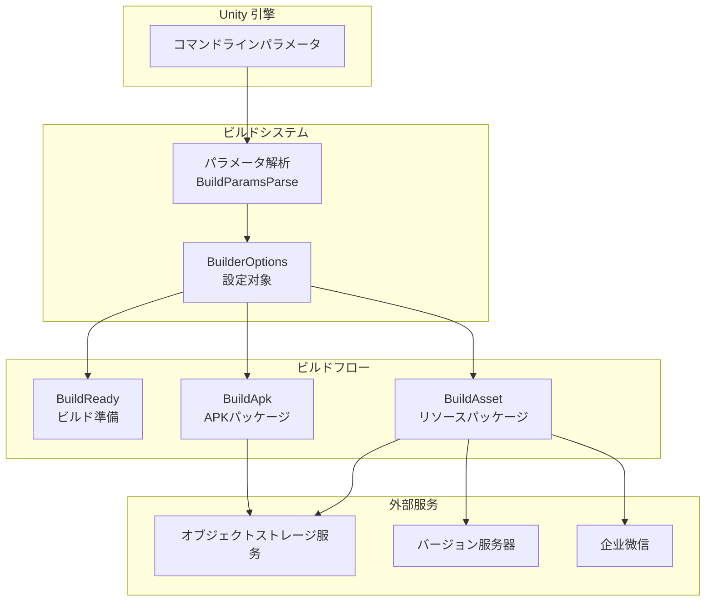

# オプション

GameFrameX Unity Builder をじてコマンドラインパラメータビルド，ビルドフロー。ドキュメントのオプションメソッド。

## 

BuilderOptions クラスたビルドのオプション，オプションをじて Unity コマンドラインビルド。オプションクラス：

- ****：ログパス、メソッド、ビルド
- **バージョン**：、バージョン、リソースバージョン
- **オブジェクトストレージ**：、、
- **ビルド**：はビルド、はリソース
- ****：リソースバージョンURL、Key

## オプション

### 

| コマンドラインパラメータ | タイプ | デフォルト |  |
|-----------|------|--------|------|
| `-logFile` | string |  | ログファイルパス，にビルドのログ |
| `-executeMethod` | string |  | のビルドメソッド， `GameFrameX.Builder.Editor.Builder.BuildApk` |
| `-BUILD_NUMBER` | string |  | ビルド，にビルド |
| `-JOB_NAME` | string |  | ，にのビルド |

### バージョン

| コマンドラインパラメータ | タイプ | デフォルト |  |
|-----------|------|--------|------|
| `-BundleId` | string | プロジェクトデフォルト | （Bundle Identifier），プロジェクトの |
| `-AppVersion` | string | プロジェクトデフォルト | バージョン，プロジェクトのバージョン |

### 

| コマンドラインパラメータ | タイプ | デフォルト |  |
|-----------|------|--------|------|
| `-ChannelName` | string | "default" | ，にのビルド |

### リソース

オプションにびし `BuildAsset` メソッド：

| コマンドラインパラメータ | タイプ | デフォルト |  |
|-----------|------|--------|------|
| `-PackageName` | string | "DefaultPackage" | リソース，ビルドのリソース |
| `-IsIncrementalBuildPackage` | flag | false | はビルドビルドリソース |

### オブジェクトストレージ

オブジェクトストレージの：

| コマンドラインパラメータ | タイプ | デフォルト |  |
|-----------|------|--------|------|
| `-ObjectStorageKey` | string | - | オブジェクトストレージの Access Key |
| `-ObjectStorageSecret` | string | - | オブジェクトストレージの Secret Key |
| `-ObjectStorageBucketName` | string | - | オブジェクトストレージの |
| `-ObjectStorageEndPoint` | string | - | オブジェクトストレージの |

サポートの：
-  (ALiYun)
-  (Tencent)
-  (QiNiu)

### 

| コマンドラインパラメータ | タイプ | デフォルト |  |
|-----------|------|--------|------|
| `-IsUploadLogFile` | flag | false | はビルドログファイルオブジェクトストレージ |
| `-IsUploadAsset` | flag | false | はビルドのリソースオブジェクトストレージ |
| `-IsUploadApk` | flag | false | はのAPKファイルオブジェクトストレージ（BuildApk） |

### リソースバージョン

| コマンドラインパラメータ | タイプ | デフォルト |  |
|-----------|------|--------|------|
| `-IsUpdateAssetPackageVersion` | flag | false | はリソースバージョン |
| `-UpdateAssetPackageVersionUrl` | string | - | リソースバージョンのHTTPリクエストURL |
| `-UpdateAssetPackageVersionAuthorization` | string | - | リソースバージョンの |

### 

| コマンドラインパラメータ | タイプ | デフォルト |  |
|-----------|------|--------|------|
| `-Language` | string | "default" | ビルドのバージョン |

### WeChat

| コマンドラインパラメータ | タイプ | デフォルト |  |
|-----------|------|--------|------|
| `-WeChatBotKey` | string | - | のWebhook Key |

## アーキテクチャ



## フロー


## 

###  Android APK ビルド

```bash
Unity.exe -projectPath "D:\MyGame" \
    -executeMethod GameFrameX.Builder.Editor.Builder.BuildApk \
    -BUILD_NUMBER "1001" \
    -JOB_NAME "daily_build" \
    -logFile "../Logs/BuildApk_1001.log"
```

### リソースビルド

```bash
Unity.exe -projectPath "D:\MyGame" \
    -executeMethod GameFrameX.Builder.Editor.Builder.BuildAsset \
    -BUILD_NUMBER "1001" \
    -JOB_NAME "asset_build" \
    -PackageName "HotUpdateResources" \
    -ChannelName "official" \
    -IsUploadAsset \
    -ObjectStorageKey "your_access_key" \
    -ObjectStorageSecret "your_secret_key" \
    -ObjectStorageBucketName "my-game-bucket" \
    -ObjectStorageEndPoint "https://s3.example.com"
```

### ビルドフロー（バージョンとWeChat）

```bash
Unity.exe -projectPath "D:\MyGame" \
    -executeMethod GameFrameX.Builder.Editor.Builder.BuildAsset \
    -BUILD_NUMBER "1002" \
    -JOB_NAME "release_build" \
    -PackageName "GameResources" \
    -ChannelName "official" \
    -AppVersion "1.2.0" \
    -IsUploadAsset \
    -IsUpdateAssetPackageVersion \
    -UpdateAssetPackageVersionUrl "https://api.example.com/version/update" \
    -UpdateAssetPackageVersionAuthorization "Bearer token123" \
    -WeChatBotKey "your_wechat_bot_key" \
    -Language "zh-CN"
```

### ビルドリソース

```bash
Unity.exe -projectPath "D:\MyGame" \
    -executeMethod GameFrameX.Builder.Editor.Builder.BuildAsset \
    -BUILD_NUMBER "1003" \
    -JOB_NAME "incremental_build" \
    -PackageName "HotUpdateResources" \
    -IsIncrementalBuildPackage \
    -IsUploadAsset
```

## 

 Builder にパラメータ：

| パラメータ |  |
|------|----------|
| `executeMethod` | ，：`executeMethod is null` |
| `BUILD_NUMBER` | ，：`build number is null` |
| `LogFilePath` | ， executeMethod デフォルトパス |

## とファイル

オプションをじてコマンドラインパラメータ，サポートをじてファイル。 Builder と CI/CD （ Jenkins、GitLab CI、GitHub Actions）。

## リンク

- [クイックスタート](./3-getting-started) - たビルド
- [メソッド](./4-usage) - たビルドフロー
- [オブジェクトストレージ](./6-object-storage) - たオブジェクトストレージの
- [よくある](./7-troubleshooting) - ビルド
