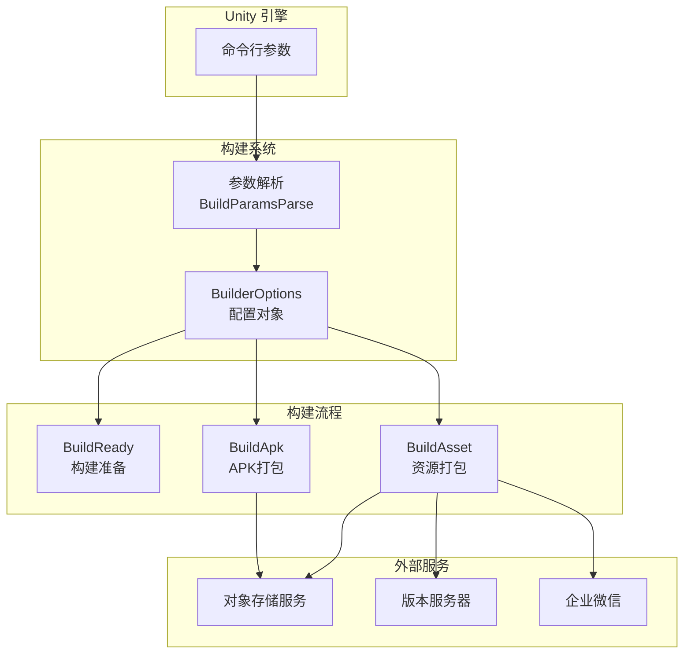
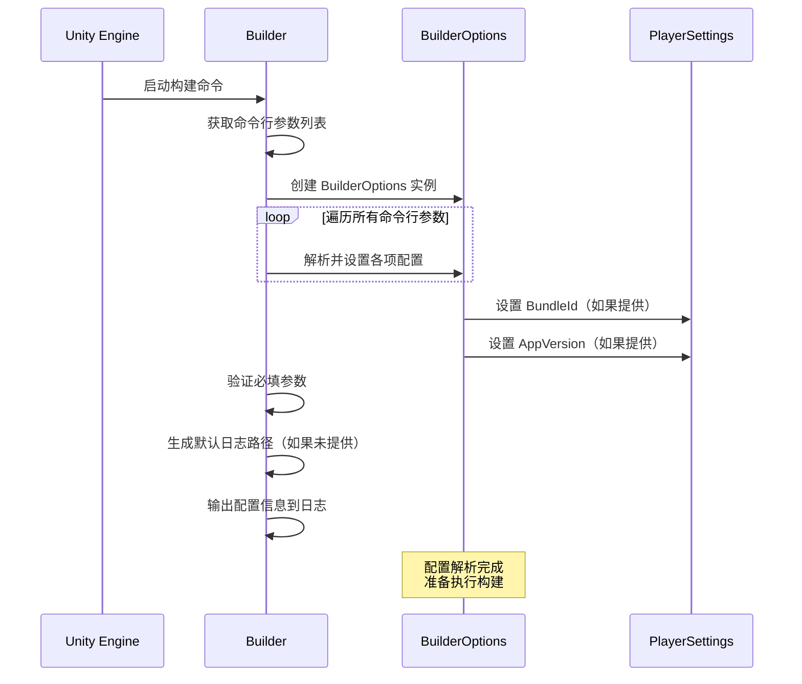

# 設定オプション

GameFrameX Unity Builder 通过命令行パラメータ受信ビルド設定，実装自动化ビルドフロー。このドキュメント詳細介绍所有可用的設定オプション及其使用メソッド。

## 概要

BuilderOptions 类カプセル化了所有ビルド相关的設定オプション，这些オプション通过 Unity 命令行传递给ビルド脚本。設定オプション分为以下几类：

- **基本設定**：ログ路径、执行メソッド、ビルド编号等
- **バージョン設定**：パッケージ名、程序バージョン号、リソースパッケージバージョン等
- **对象存储設定**：云存储密钥、桶名、端点等
- **ビルド行为設定**：是否增量ビルド、是否上传リソース等
- **通知設定**：リソースバージョンアップデートURL、微信机器人Key等

## 設定オプション详解

### 基本設定

| 命令行パラメータ | タイプ | デフォルト值 | 説明 |
|-----------|------|--------|------|
| `-logFile` | string | 自动生成 | ログファイル路径，用于存储ビルド过程中的ログ |
| `-executeMethod` | string | 必填 | 要执行的ビルドメソッド，如 `GameFrameX.Builder.Editor.Builder.BuildApk` |
| `-BUILD_NUMBER` | string | 必填 | ビルド编号，用于标识本次ビルド |
| `-JOB_NAME` | string | 必填 | 任务名称，用于区分不同的ビルド任务 |

### バージョン設定

| 命令行パラメータ | タイプ | デフォルト值 | 説明 |
|-----------|------|--------|------|
| `-BundleId` | string | プロジェクトデフォルト值 | パッケージ名（Bundle Identifier），如为空则使用プロジェクト設定的パッケージ名 |
| `-AppVersion` | string | プロジェクトデフォルト值 | 程序バージョン号，如为空则使用プロジェクト設定的バージョン号 |

### 渠道設定

| 命令行パラメータ | タイプ | デフォルト值 | 説明 |
|-----------|------|--------|------|
| `-ChannelName` | string | "default" | 渠道名称，用于区分不同分发渠道的ビルド |

### リソースパッケージ設定

以下オプション在呼び出し `BuildAsset` メソッド时有效：

| 命令行パラメータ | タイプ | デフォルト值 | 説明 |
|-----------|------|--------|------|
| `-PackageName` | string | "DefaultPackage" | リソースパッケージ名称，标识要ビルド的リソースパッケージ |
| `-IsIncrementalBuildPackage` | flag | false | 是否使用增量ビルド方法ビルドリソースパッケージ |

### 对象存储設定

設定对象存储服务所需的凭证情報：

| 命令行パラメータ | タイプ | デフォルト值 | 説明 |
|-----------|------|--------|------|
| `-ObjectStorageKey` | string | - | 对象存储的 Access Key |
| `-ObjectStorageSecret` | string | - | 对象存储的 Secret Key |
| `-ObjectStorageBucketName` | string | - | 对象存储桶的名称 |
| `-ObjectStorageEndPoint` | string | - | 对象存储服务的端点地址 |

サポート的云服务商：
- 阿里云 (ALiYun)
- 腾讯云 (Tencent)
- 七牛云 (QiNiu)

### 上传行为設定

| 命令行パラメータ | タイプ | デフォルト值 | 説明 |
|-----------|------|--------|------|
| `-IsUploadLogFile` | flag | false | 是否上传ビルドログファイル到对象存储 |
| `-IsUploadAsset` | flag | false | 是否上传ビルド的リソースパッケージ到对象存储 |
| `-IsUploadApk` | flag | false | 是否上传生成的APKファイル到对象存储（仅BuildApk有效） |

### リソースバージョンアップデート設定

| 命令行パラメータ | タイプ | デフォルト值 | 説明 |
|-----------|------|--------|------|
| `-IsUpdateAssetPackageVersion` | flag | false | 是否アップデートリソースパッケージバージョン |
| `-UpdateAssetPackageVersionUrl` | string | - | アップデートリソースパッケージバージョン的HTTP请求URL |
| `-UpdateAssetPackageVersionAuthorization` | string | - | アップデートリソースパッケージバージョン的授权情報 |

### 多语言設定

| 命令行パラメータ | タイプ | デフォルト值 | 説明 |
|-----------|------|--------|------|
| `-Language` | string | "default" | ビルド产物的语言バージョン |

### 微信通知設定

| 命令行パラメータ | タイプ | デフォルト值 | 説明 |
|-----------|------|--------|------|
| `-WeChatBotKey` | string | - | 企业微信机器人的Webhook Key |

## 設定アーキテクチャ



## 設定解析フロー



## 使用例

### 基本 Android APK ビルド

```bash
Unity.exe -projectPath "D:\MyGame" \
    -executeMethod GameFrameX.Builder.Editor.Builder.BuildApk \
    -BUILD_NUMBER "1001" \
    -JOB_NAME "daily_build" \
    -logFile "../Logs/BuildApk_1001.log"
```

### リソースパッケージビルド并上传

```bash
Unity.exe -projectPath "D:\MyGame" \
    -executeMethod GameFrameX.Builder.Editor.Builder.BuildAsset \
    -BUILD_NUMBER "1001" \
    -JOB_NAME "asset_build" \
    -PackageName "HotUpdateResources" \
    -ChannelName "official" \
    -IsUploadAsset \
    -ObjectStorageKey "your_access_key" \
    -ObjectStorageSecret "your_secret_key" \
    -ObjectStorageBucketName "my-game-bucket" \
    -ObjectStorageEndPoint "https://s3.example.com"
```

### 完全なビルドフロー（含バージョンアップデート和微信通知）

```bash
Unity.exe -projectPath "D:\MyGame" \
    -executeMethod GameFrameX.Builder.Editor.Builder.BuildAsset \
    -BUILD_NUMBER "1002" \
    -JOB_NAME "release_build" \
    -PackageName "GameResources" \
    -ChannelName "official" \
    -AppVersion "1.2.0" \
    -IsUploadAsset \
    -IsUpdateAssetPackageVersion \
    -UpdateAssetPackageVersionUrl "https://api.example.com/version/update" \
    -UpdateAssetPackageVersionAuthorization "Bearer token123" \
    -WeChatBotKey "your_wechat_bot_key" \
    -Language "zh-CN"
```

### 增量ビルドリソースパッケージ

```bash
Unity.exe -projectPath "D:\MyGame" \
    -executeMethod GameFrameX.Builder.Editor.Builder.BuildAsset \
    -BUILD_NUMBER "1003" \
    -JOB_NAME "incremental_build" \
    -PackageName "HotUpdateResources" \
    -IsIncrementalBuildPackage \
    -IsUploadAsset
```

## 設定の検証

 Builder 在启动时会検証以下必填パラメータ：

| パラメータ | 検証规则 |
|------|----------|
| `executeMethod` | 不能为空，否则抛出例外：`executeMethod is null` |
| `BUILD_NUMBER` | 不能为空，否则抛出例外：`build number is null` |
| `LogFilePath` | もし为空，会根据 executeMethod 自动生成デフォルト路径 |

## 環境变量与設定ファイル

所有設定オプション均通过命令行パラメータ传递，不サポート通过設定ファイル設定。这种設計使得 Builder 〜できます与各种 CI/CD 系统（如 Jenkins、GitLab CI、GitHub Actions）无缝集成。

## 関連リンク

- [快速开始](./3-getting-started) - 理解する如何开始使用自动化ビルド
- [使用メソッド](./4-usage) - 詳細理解するビルドフロー
- [对象存储](./6-object-storage) - 理解する更多关于对象存储集成的情報
- [常见問題](./7-troubleshooting) - 解决常见ビルド問題
