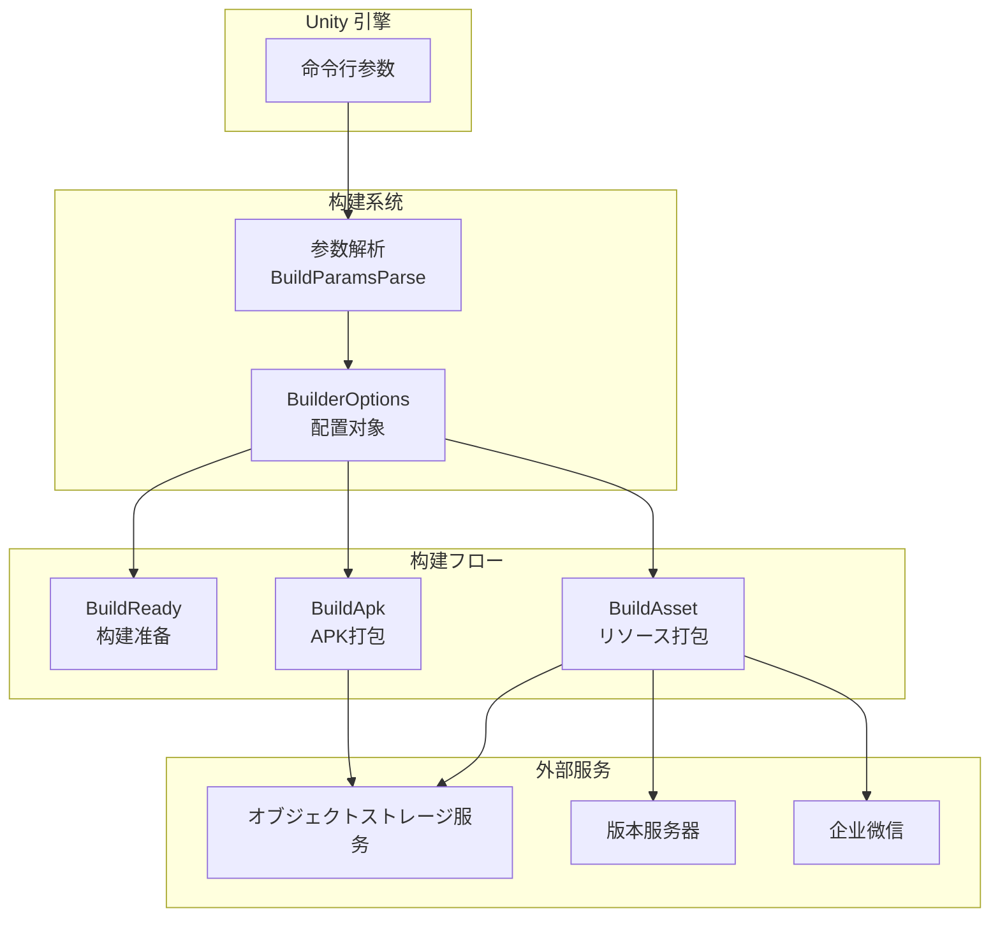
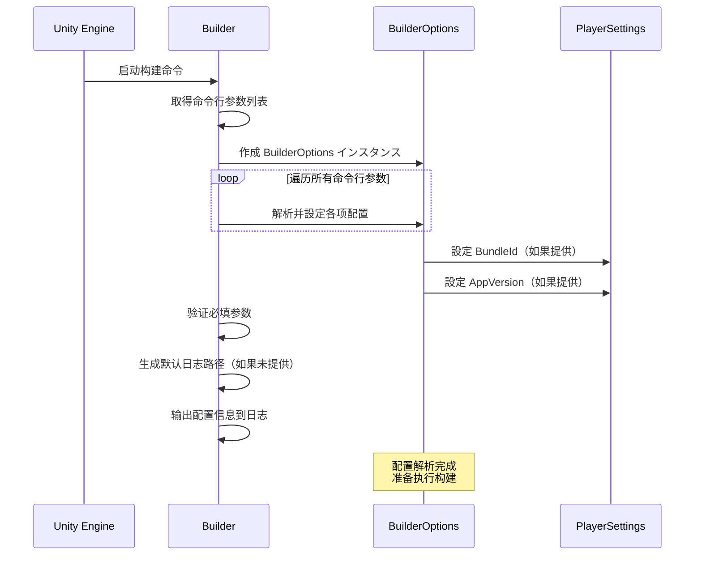

# 設定选项

GameFrameX Unity Builder を通じて命令行参数接收构建配置，実装自动化构建フロー。本文档详细介绍所有可用的配置选项及其使用メソッド。

## 概要

BuilderOptions クラス封装了所有构建関連的配置选项，这些选项を通じて Unity 命令行传递给构建脚本。配置选项分为以下几クラス：

- **基础配置**：日志路径、执行メソッド、构建编号等
- **版本配置**：包名、程序版本号、リソース包版本等
- **オブジェクトストレージ配置**：云存储密钥、桶名、端点等
- **构建行为配置**：是否增量构建、是否上传リソース等
- **通知配置**：リソース版本更新URL、微信机器人Key等

## 設定选项详解

### 基础配置

| 命令行参数 | クラス型 | 默认值 | 説明 |
|-----------|------|--------|------|
| `-logFile` | string | 自动生成 | 日志ファイル路径，に使用存储构建过程中的日志 |
| `-executeMethod` | string | 必填 | 要执行的构建メソッド，如 `GameFrameX.Builder.Editor.Builder.BuildApk` |
| `-BUILD_NUMBER` | string | 必填 | 构建编号，に使用标识本次构建 |
| `-JOB_NAME` | string | 必填 | 任务名称，に使用区分不同的构建任务 |

### 版本配置

| 命令行参数 | クラス型 | 默认值 | 説明 |
|-----------|------|--------|------|
| `-BundleId` | string | プロジェクト默认值 | 包名（Bundle Identifier），如为空则使用プロジェクト配置的包名 |
| `-AppVersion` | string | プロジェクト默认值 | 程序版本号，如为空则使用プロジェクト配置的版本号 |

### 渠道配置

| 命令行参数 | クラス型 | 默认值 | 説明 |
|-----------|------|--------|------|
| `-ChannelName` | string | "default" | 渠道名称，に使用区分不同分发渠道的构建 |

### リソース包配置

以下选项在呼び出し `BuildAsset` メソッド时有效：

| 命令行参数 | クラス型 | 默认值 | 説明 |
|-----------|------|--------|------|
| `-PackageName` | string | "DefaultPackage" | リソース包名称，标识要构建的リソース包 |
| `-IsIncrementalBuildPackage` | flag | false | 是否使用增量构建方法构建リソース包 |

### オブジェクトストレージ配置

配置オブジェクトストレージ服务所需的凭证信息：

| 命令行参数 | クラス型 | 默认值 | 説明 |
|-----------|------|--------|------|
| `-ObjectStorageKey` | string | - | オブジェクトストレージ的 Access Key |
| `-ObjectStorageSecret` | string | - | オブジェクトストレージ的 Secret Key |
| `-ObjectStorageBucketName` | string | - | オブジェクトストレージ桶的名称 |
| `-ObjectStorageEndPoint` | string | - | オブジェクトストレージ服务的端点地址 |

サポート的云服务商：
- 阿里云 (ALiYun)
- 腾讯云 (Tencent)
- 七牛云 (QiNiu)

### 上传行为配置

| 命令行参数 | クラス型 | 默认值 | 説明 |
|-----------|------|--------|------|
| `-IsUploadLogFile` | flag | false | 是否上传构建日志ファイル到オブジェクトストレージ |
| `-IsUploadAsset` | flag | false | 是否上传构建的リソース包到オブジェクトストレージ |
| `-IsUploadApk` | flag | false | 是否上传生成的APKファイル到オブジェクトストレージ（仅BuildApk有效） |

### リソース版本更新配置

| 命令行参数 | クラス型 | 默认值 | 説明 |
|-----------|------|--------|------|
| `-IsUpdateAssetPackageVersion` | flag | false | 是否更新リソース包版本 |
| `-UpdateAssetPackageVersionUrl` | string | - | 更新リソース包版本的HTTPお願いします求URL |
| `-UpdateAssetPackageVersionAuthorization` | string | - | 更新リソース包版本的授权信息 |

### 多语言配置

| 命令行参数 | クラス型 | 默认值 | 説明 |
|-----------|------|--------|------|
| `-Language` | string | "default" | 构建产物的语言版本 |

### 微信通知配置

| 命令行参数 | クラス型 | 默认值 | 説明 |
|-----------|------|--------|------|
| `-WeChatBotKey` | string | - | 企业微信机器人的Webhook Key |

## 設定架构



## 設定解析フロー



## 使用例

### 基本 Android APK 构建

```bash
Unity.exe -projectPath "D:\MyGame" \
    -executeMethod GameFrameX.Builder.Editor.Builder.BuildApk \
    -BUILD_NUMBER "1001" \
    -JOB_NAME "daily_build" \
    -logFile "../Logs/BuildApk_1001.log"
```

### リソース包构建并上传

```bash
Unity.exe -projectPath "D:\MyGame" \
    -executeMethod GameFrameX.Builder.Editor.Builder.BuildAsset \
    -BUILD_NUMBER "1001" \
    -JOB_NAME "asset_build" \
    -PackageName "HotUpdateResources" \
    -ChannelName "official" \
    -IsUploadAsset \
    -ObjectStorageKey "your_access_key" \
    -ObjectStorageSecret "your_secret_key" \
    -ObjectStorageBucketName "my-game-bucket" \
    -ObjectStorageEndPoint "https://s3.example.com"
```

### 完整构建フロー（含版本更新和微信通知）

```bash
Unity.exe -projectPath "D:\MyGame" \
    -executeMethod GameFrameX.Builder.Editor.Builder.BuildAsset \
    -BUILD_NUMBER "1002" \
    -JOB_NAME "release_build" \
    -PackageName "GameResources" \
    -ChannelName "official" \
    -AppVersion "1.2.0" \
    -IsUploadAsset \
    -IsUpdateAssetPackageVersion \
    -UpdateAssetPackageVersionUrl "https://api.example.com/version/update" \
    -UpdateAssetPackageVersionAuthorization "Bearer token123" \
    -WeChatBotKey "your_wechat_bot_key" \
    -Language "zh-CN"
```

### 增量构建リソース包

```bash
Unity.exe -projectPath "D:\MyGame" \
    -executeMethod GameFrameX.Builder.Editor.Builder.BuildAsset \
    -BUILD_NUMBER "1003" \
    -JOB_NAME "incremental_build" \
    -PackageName "HotUpdateResources" \
    -IsIncrementalBuildPackage \
    -IsUploadAsset
```

## 設定验证

 Builder 在启动时会验证以下必填参数：

| 参数 | 验证规则 |
|------|----------|
| `executeMethod` | 不能为空，否则抛出異常：`executeMethod is null` |
| `BUILD_NUMBER` | 不能为空，否则抛出異常：`build number is null` |
| `LogFilePath` | 如果为空，会に基づいて executeMethod 自动生成默认路径 |

## 环境变量与配置ファイル

所有配置选项均を通じて命令行参数传递，不サポートを通じて配置ファイル設定。这种设计使得 Builder 可能与各种 CI/CD 系统（如 Jenkins、GitLab CI、GitHub Actions）无缝集成。

## 関連リンク

- [快速开始](./3-getting-started) - 了解如何开始使用自动化构建
- [使用メソッド](./4-usage) - 详细了解构建フロー
- [オブジェクトストレージ](./6-object-storage) - 了解更多关于オブジェクトストレージ集成的信息
- [常见问题](./7-troubleshooting) - 解决常见构建问题
