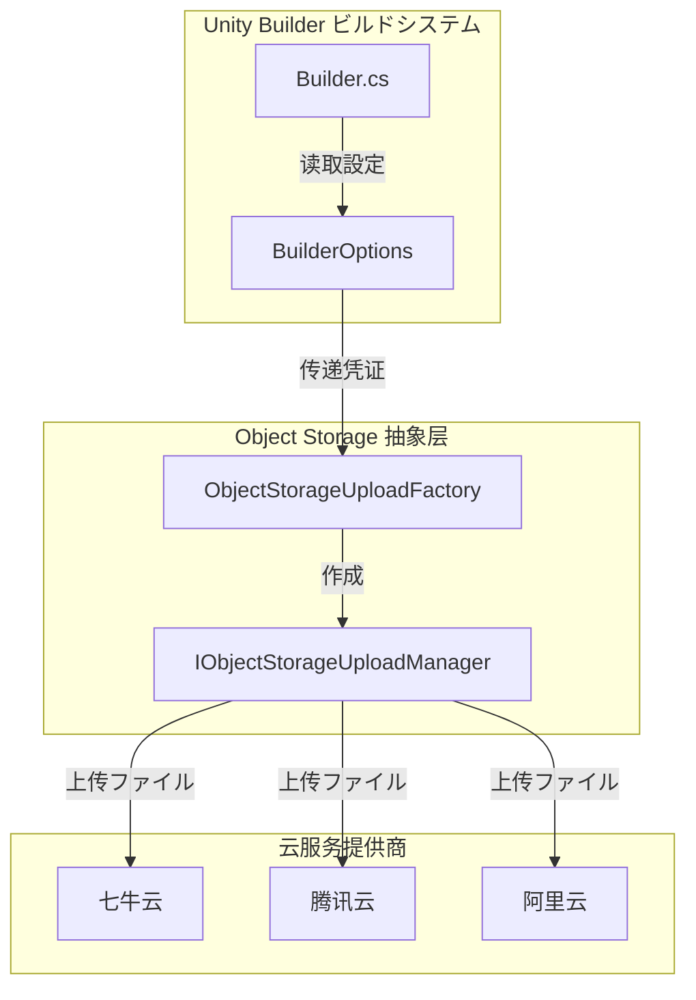
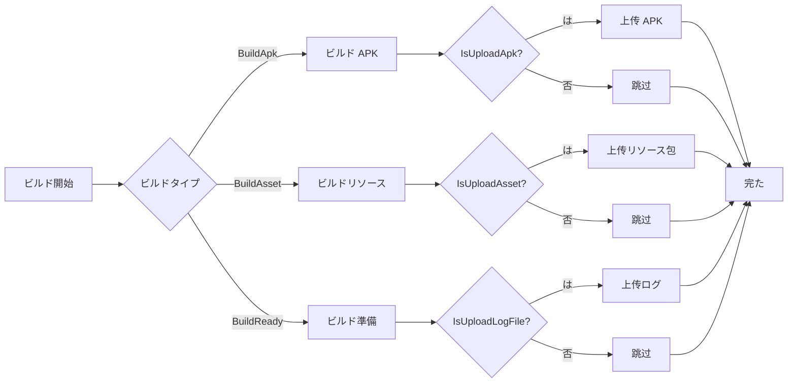

# オブジェクトストレージ

オブジェクトストレージモジュール Unity Builder たビルド（APK、ログファイル、リソース）オブジェクトストレージの。をじて GameFrameX ObjectStorage ，サポート。

## 

オブジェクトストレージ（Object Storage）は Unity Builder のコア，にビルドたビルド。に/デプロイ（CI/CD），：

- **APK **：Android ビルドたインストール
- **ログファイル**：ビルドログ，ビルド
- **リソース**：AB リソース CDN 

サポートの：
- オブジェクトストレージ（COS）
- オブジェクトストレージ（OSS）
- オブジェクトストレージ（Kodo）

> ：オブジェクトストレージ GameFrameX ObjectStorage ，にプロジェクトインストールと。

## アーキテクチャ



**アーキテクチャ：**

- **Builder**：ビルド，コマンドラインパラメータビルドフロー
- **BuilderOptions**：オブジェクトストレージ（Key、Secret、Bucket、Endpoint）
- **ObjectStorageUploadFactory**：クラス，コンパイルの UploadManager
- **IObjectStorageUploadManager**：マネージャーインターフェース， UploadFile と UploadDirectory メソッド

## コア

### サポートの

|  |  | コンパイル |
|----------|--------|--------|
|  | GameFrameX.ObjectStorage.QiNiu | ENABLE_GAME_FRAME_X_OBJECT_STORAGE_QI_NIU |
|  | GameFrameX.ObjectStorage.Tencent | ENABLE_GAME_FRAME_X_OBJECT_STORAGE_TENCENT |
|  | GameFrameX.ObjectStorage.ALiYun | ENABLE_GAME_FRAME_X_OBJECT_STORAGE_A_LI_YUN |

### タイプ

```csharp
// 上传单个ファイル
ObjectStorageUploadManager.UploadFile(apkPath);

// 上传整个ディレクトリ
ObjectStorageUploadManager.SetSavePath(savePath);
ObjectStorageUploadManager.UploadDirectory(uploadPath);
```

> Source: [Builder.cs](https://github.com/GameFrameX/com.gameframex.unity.builder/blob/main/Editor/Builder.cs#L200-L330)

### 



## オプション

オブジェクトストレージをじて `BuilderOptions` クラス，サポートオプション：

| オプション | タイプ | デフォルト |  |
|------|------|--------|------|
| ObjectStorageKey | string | "" | オブジェクトストレージの AccessKey |
| ObjectStorageSecret | string | "" | オブジェクトストレージの SecretKey |
| ObjectStorageBucketName | string | "" |  |
| ObjectStorageEndPoint | string | "" |  |
| IsUploadApk | bool | false | ビルドたは APK |
| IsUploadLogFile | bool | false | ビルドたはログファイル |
| IsUploadAsset | bool | false | ビルドたはリソース |

> Source: [BuilderOptions.cs](https://github.com/GameFrameX/com.gameframex.unity.builder/blob/main/Editor/BuilderOptions.cs#L22-L40)

## コマンドラインパラメータ

オブジェクトストレージをじてコマンドラインパラメータ，パラメータ：

```bash
# オブジェクトストレージ設定
-ObjectStorageKey "your_access_key"
-ObjectStorageSecret "your_secret_key"
-ObjectStorageBucketName "your_bucket_name"
-ObjectStorageEndPoint "ap-guangzhou"

# 上传控制
-IsUploadApk
-IsUploadLogFile
-IsUploadAsset
```

> Source: [Builder.cs](https://github.com/GameFrameX/com.gameframex.unity.builder/blob/main/Editor/Builder.cs#L83-L97)

### パラメータ

```csharp
// Builder.cs 中のパラメータ解析逻辑
else if (commandLineArg == "-ObjectStorageKey")
{
    _builderOptions.ObjectStorageKey = commandLineArgs[index + 1];
}
else if (commandLineArg == "-ObjectStorageSecret")
{
    _builderOptions.ObjectStorageSecret = commandLineArgs[index + 1];
}
else if (commandLineArg == "-ObjectStorageBucketName")
{
    _builderOptions.ObjectStorageBucketName = commandLineArgs[index + 1];
}
else if (commandLineArg == "-ObjectStorageEndPoint")
{
    _builderOptions.ObjectStorageEndPoint = commandLineArgs[index + 1];
}
```

## メソッド

### 1. インストール

に Unity Package Manager インストールの GameFrameX ObjectStorage ：

- ：`com.gameframex.unity.objectstorage`
- ：`com.gameframex.unity.objectstorage.qiniu`
- ：`com.gameframex.unity.objectstorage.tencent`
- ：`com.gameframex.unity.objectstorage.aliyun`

### 2. コンパイル

にプロジェクトの `GameFrameX.Builder.Editor.asmdef` バージョン：

```json
{
  "versionDefines": [
    {
      "name": "com.gameframex.unity.objectstorage",
      "define": "ENABLE_GAME_FRAME_X_OBJECT_STORAGE"
    },
    {
      "name": "com.gameframex.unity.objectstorage.tencent",
      "define": "ENABLE_GAME_FRAME_X_OBJECT_STORAGE_TENCENT"
    }
  ]
}
```

> Source: [GameFrameX.Builder.Editor.asmdef](https://github.com/GameFrameX/com.gameframex.unity.builder/blob/main/Editor/GameFrameX.Builder.Editor.asmdef#L24-L44)

### 3. マネージャー

の，をじてクラスのマネージャー：

```csharp
#if ENABLE_GAME_FRAME_X_OBJECT_STORAGE
#if ENABLE_GAME_FRAME_X_OBJECT_STORAGE_QI_NIU
ObjectStorageUploadManager = ObjectStorageUploadFactory.Create<QiNiuYunObjectStorageUploadManager>(
    _builderOptions.ObjectStorageKey, 
    _builderOptions.ObjectStorageSecret, 
    _builderOptions.ObjectStorageBucketName, 
    _builderOptions.ObjectStorageEndPoint);
#endif

#if ENABLE_GAME_FRAME_X_OBJECT_STORAGE_TENCENT
ObjectStorageUploadManager = ObjectStorageUploadFactory.Create<TencentCloudObjectStorageUploadManager>(
    _builderOptions.ObjectStorageKey, 
    _builderOptions.ObjectStorageSecret, 
    _builderOptions.ObjectStorageBucketName, 
    _builderOptions.ObjectStorageEndPoint);
#endif

#if ENABLE_GAME_FRAME_X_OBJECT_STORAGE_A_LI_YUN
ObjectStorageUploadManager = ObjectStorageUploadFactory.Create<ALiYunObjectStorageUploadManager>(
    _builderOptions.ObjectStorageKey, 
    _builderOptions.ObjectStorageSecret, 
    _builderOptions.ObjectStorageBucketName, 
    _builderOptions.ObjectStorageEndPoint);
#endif

// 設定上传パス
ObjectStorageUploadManager.SetSavePath($"builder/{PlayerSettings.productName}/{EditorUserBuildSettings.activeBuildTarget}/{_builderOptions.JobName}/{Application.version}/{_builderOptions.BuildNumber}");
#endif
```

> Source: [Builder.cs](https://github.com/GameFrameX/com.gameframex.unity.builder/blob/main/Editor/Builder.cs#L40-L52)

### 4. 

にビルドフローのびしメソッド：

```csharp
// 上传 APK
if (_builderOptions.IsUploadApk)
{
#if ENABLE_GAME_FRAME_X_OBJECT_STORAGE
    ObjectStorageUploadManager.UploadFile(apkPath);
#endif
}

// 上传リソース包
if (_builderOptions.IsUploadAsset)
{
    string savePath = $"Bundles/{PlayerSettings.applicationIdentifier}/{EditorUserBuildSettings.activeBuildTarget}/{Application.version}/{_builderOptions.ChannelName}/{_builderOptions.PackageName}/{buildParameters.PackageVersion}";
    string uploadPath = $"{buildParameters.BuildOutputRoot}/{buildParameters.BuildTarget}/{Application.version}/{buildParameters.PackageName}/{buildParameters.PackageVersion}";
    
#if ENABLE_GAME_FRAME_X_OBJECT_STORAGE
    ObjectStorageUploadManager.SetSavePath(savePath);
    ObjectStorageUploadManager.UploadDirectory(uploadPath);
#endif
}
```

> Source: [Builder.cs](https://github.com/GameFrameX/com.gameframex.unity.builder/blob/main/Editor/Builder.cs#L321-L331)

## 

### CI/CD 

に Jenkins、GitLab CI  CI ：

```bash
# Jenkinsfile 例
pipeline {
    stages {
        stage('Build') {
            steps {
                sh '''
                    unity -projectPath . \
                    -executeMethod GameFrameX.Builder.Editor.Builder.BuildApk \
                    -logFile "../Logs/build_${BUILD_NUMBER}.log" \
                    -BUILD_NUMBER "${BUILD_NUMBER}" \
                    -JobName "android" \
                    -ObjectStorageKey "${OSS_KEY}" \
                    -ObjectStorageSecret "${OSS_SECRET}" \
                    -ObjectStorageBucketName "my-bucket" \
                    -ObjectStorageEndPoint "ap-guangzhou" \
                    -IsUploadApk \
                    -IsUploadLogFile
                '''
            }
        }
    }
}
```

### プラットフォームビルド

プラットフォームのオブジェクトストレージ：

```bash
# Android ビルド
-executeMethod GameFrameX.Builder.Editor.Builder.BuildApk \
-ObjectStorageBucketName "android-bucket" \
-ObjectStorageEndPoint "ap-guangzhou" \
-IsUploadApk

# iOS リソースビルド
-executeMethod GameFrameX.Builder.Editor.Builder.BuildAsset \
-ObjectStorageBucketName "ios-bucket" \
-ObjectStorageEndPoint "ap-shanghai" \
-IsUploadAsset
```

## リンク

- [メソッド](./4-usage) - た Builder の
- [オプション](./5-configuration) - ビルドオプション
- [GameFrameX ドキュメント](https://gameframex.doc.alianblank.com) - ドキュメント
- [オブジェクトストレージ](https://www.qiniu.com/products/kodo) - ドキュメント
- [オブジェクトストレージ](https://cloud.tencent.com/product/cos) - ドキュメント
- [オブジェクトストレージ](https://www.aliyun.com/product/oss) - ドキュメント
