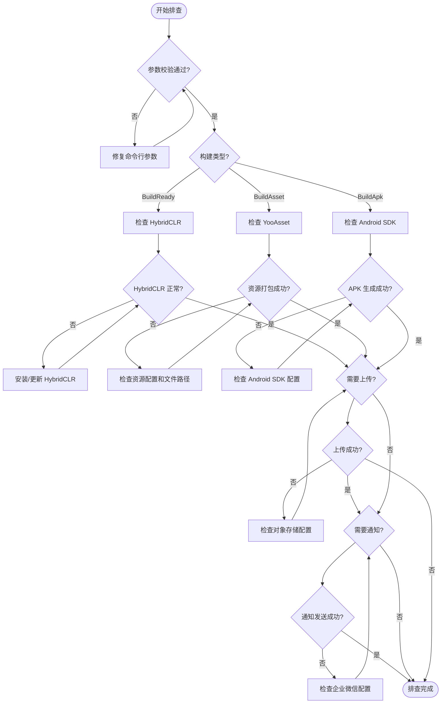

# よくある問題

このドキュメント汇总了使用 GameFrameX Unity Builder 进行自动化ビルド时〜の可能性があります遇到的常见問題及其解決策。

## 概要

GameFrameX Unity Builder は自动化ビルド工具，サポート以下機能：
- 命令行ビルド（サポート CI/CD 集成）
- リソース打パッケージ（基于 YooAsset）
- ホットアップデートサポート（基于 HybridCLR）
- 多云对象存储上传（七牛云、腾讯云、阿里云）
- 企业微信ビルド通知

## よくある問題与解決策

### 1. パラメータエラー

#### 1.1 executeMethod 为空

**エラー情報：**
```
Exception: executeMethod is null
```

**原因：** 未在命令行パラメータ中指定 `-executeMethod`。

**解決策：** 確認してください CI/CD 設定中パッケージ含 `-executeMethod` パラメータ，指定要执行的ビルドメソッド（如 `GameFrameX.Builder.Editor.Builder.BuildAsset`）。

```bash
-executeMethod GameFrameX.Builder.Editor.Builder.BuildAsset
```
> Source: [Builder.cs#L153-L156](https://github.com/GameFrameX/com.gameframex.unity.builder/blob/main/Editor/Builder.cs#L153-L156)

---

#### 1.2 buildNumber 为空

**エラー情報：**
```
Exception: build number is null
```

**原因：** 未在命令行パラメータ中指定 `-BUILD_NUMBER`。

**解決策：** 確認してください CI/CD 設定中パッケージ含 `-BUILD_NUMBER` パラメータ。

```bash
-BUILD_NUMBER 1001
```
> Source: [Builder.cs#L158-L161](https://github.com/GameFrameX/com.gameframex.unity.builder/blob/main/Editor/Builder.cs#L158-L161)

---

### 2. ビルド問題

#### 2.1 HybridCLR インストール失敗

**問題説明：** ビルド过程中 HybridCLR インストール失敗或未正确インストール。

**原因分析：**
- HybridCLR パッケージ未正确インストール
- il2cpp バージョン与 HybridCLR バージョン不匹配

**解決策：**

確認してください在ビルド前確認 HybridCLR インストールステータス。Builder 会在 `BuildReady` フェーズ自动確認并インストール：

```csharp
var installerController = new InstallerController();
var isInstalled = installerController.HasInstalledHybridCLR();
if (!isInstalled || installerController.InstalledLibil2cppVersion != installerController.PackageVersion)
{
    installerController.InstallDefaultHybridCLR();
}
```
> Source: [Builder.cs#L219-L232](https://github.com/GameFrameX/com.gameframex.unity.builder/blob/main/Editor/Builder.cs#L219-L232)

**排查ステップ：**
1. 確認 Unity プロジェクト已正确インストール HybridCLR パッケージ
2. 確認 il2cpp バージョン与 HybridCLR 兼容
3. 在ビルドログ中確認 `BuildReady Check HybridCLR Install Status` 输出

---

#### 2.2 リソース打パッケージ失敗

**問題説明：** リソース打パッケージ过程中出现例外，导致ビルド失敗。

**常见原因：**
- YooAsset 設定エラー
- リソースファイル路径問題
- 磁盘空间不足

**解決策：**

Builder 捕获了例外并会输出詳細エラーログ：

```csharp
try
{
    pipeline.Run(buildParameters, true);
    isSuccess = true;
}
catch (Exception e)
{
    Debug.LogException(e);
    Environment.Exit(1);
}
```
> Source: [Builder.cs#L298-L308](https://github.com/GameFrameX/com.gameframex.unity.builder/blob/main/Editor/Builder.cs#L298-L308)

**排查ステップ：**
1. 確認ビルドログ中的詳細例外情報
2. 確認 YooAsset 設定（AssetBundleCollectorSetting）
3. 確認リソースディレクトリ路径正确
4. 確認磁盘空间充足

---

#### 2.3 リソースパッケージファイル名大小写問題

**問題説明：** 某些ファイル系统（不区分大小写）导致リソースパッケージファイル名冲突。

**解決策：**

Builder 自动将所有リソースパッケージファイル名转换为小写：

```csharp
foreach (var assetBundleCollectorPackage in AssetBundleCollectorSettingData.Setting.Packages)
{
    assetBundleCollectorPackage.LocationToLower = true;
}
AssetBundleCollectorSettingData.SaveFile();
```
> Source: [Builder.cs#L271-L278](https://github.com/GameFrameX/com.gameframex.unity.builder/blob/main/Editor/Builder.cs#L271-L278)

---

### 3. 对象存储問題

#### 3.1 对象存储上传失敗

**問題説明：** ビルド完成后，リソースパッケージ或 APK 上传至对象存储失敗。

**原因分析：**
- 設定的 Key/Secret エラー
- Bucket 名称或 Endpoint エラー
- 网络连接問題

**解決策：**

確認してください在命令行パラメータ中正确設定对象存储相关パラメータ：

| パラメータ | 説明 | 例 |
|------|------|------|
| `-ObjectStorageKey` | API 密钥 | AKIDxxxx |
| `-ObjectStorageSecret` | API 秘钥 | xxxxxxxxx |
| `-ObjectStorageBucketName` | 存储桶名称 | my-bucket |
| `-ObjectStorageEndPoint` | 区域节点 | ap-guangzhou |

并在コード中正确启用コンパイル宏：
```csharp
#if ENABLE_GAME_FRAME_X_OBJECT_STORAGE
// 对象存储功能代码
#endif
```

---

#### 3.2 未启用对象存储機能

**問題説明：** コード中使用了对象存储相关機能，但コンパイル报错或機能未生效。

**原因：** 未在プロジェクト脚本定義中启用 `ENABLE_GAME_FRAME_X_OBJECT_STORAGE` コンパイル宏。

**解決策：**

在 Unity エディタ中：
1. 打开 `Edit > Project Settings > Player`
2. 找到 `Scripting Define Symbols`
3. 追加 `ENABLE_GAME_FRAME_X_OBJECT_STORAGE`
4. 根据〜する必要があります追加云服务商对应的宏：
   - `ENABLE_GAME_FRAME_X_OBJECT_STORAGE_QI_NIU`（七牛云）
   - `ENABLE_GAME_FRAME_X_OBJECT_STORAGE_TENCENT`（腾讯云）
   - `ENABLE_GAME_FRAME_X_OBJECT_STORAGE_A_LI_YUN`（阿里云）

---

### 4. 网络通知問題

#### 4.1 企业微信通知发送失敗

**問題説明：** ビルド成功但未收到企业微信通知。

**原因分析：**
- WeChatBotKey 設定エラー
- 企业微信机器人 API 呼び出し失敗

**解決策：**

確認してください設定了正确的企业微信机器人 Key：

```csharp
-WeChatBotKey xxxxx-xxxxx-xxxxx
```
> Source: [WeChatNotifyWorkHelper.cs#L49](https://github.com/GameFrameX/com.gameframex.unity.builder/blob/main/Editor/WeChatNotifyWorkHelper.cs#L49)

Builder 会捕获例外但不会阻止ビルドフロー：

```csharp
try
{
    var httpResponseMessage = httpClient.PostAsync(url, stringContent).GetAwaiter().GetResult();
    var response = httpResponseMessage.Content.ReadAsStringAsync().GetAwaiter().GetResult();
    Debug.Log(response);
}
catch (Exception e)
{
    Debug.LogException(e);
}
```
> Source: [WeChatNotifyWorkHelper.cs#L59-L69](https://github.com/GameFrameX/com.gameframex.unity.builder/blob/main/Editor/WeChatNotifyWorkHelper.cs#L59-L69)

---

#### 4.2 リソースバージョンアップデート API 呼び出し失敗

**問題説明：** リソースパッケージバージョンアップデート请求失敗。

**原因分析：**
- `UpdateAssetPackageVersionUrl` 設定エラー
- `UpdateAssetPackageVersionAuthorization` 授权情報エラー

**解決策：**

設定正确的バージョンアップデート URL 和授权情報：

```csharp
-UpdateAssetPackageVersionUrl https://api.example.com/version
-UpdateAssetPackageVersionAuthorization Bearer xxxxxx
```
> Source: [BuilderUpdateAssetPackageVersionHelper.cs#L55-L56](https://github.com/GameFrameX/com.gameframex.unity.builder/blob/main/Editor/BuilderUpdateAssetPackageVersionHelper.cs#L55-L56)

---

### 5. バージョン与パッケージ名問題

#### 5.1 パッケージ名未アップデート

**問題説明：** ビルド的 APK パッケージ名未使用命令行指定的值。

**原因：** 只有在設定了 `-BundleId` パラメータ时才会覆盖プロジェクトパッケージ名。

**解決策：**

確認してください在命令行パラメータ中パッケージ含 `-BundleId`：

```bash
-BundleId com.example.myapp
```

もし未設定此パラメータ，将使用プロジェクト原有的パッケージ名：
```csharp
if (!_builderOptions.BundleId.IsNullOrWhiteSpace())
{
    PlayerSettings.applicationIdentifier = _builderOptions.BundleId.Trim();
}
```
> Source: [Builder.cs#L172-L175](https://github.com/GameFrameX/com.gameframex.unity.builder/blob/main/Editor/Builder.cs#L172-L175)

---

#### 5.2 バージョン号未アップデート

**問題説明：** ビルド的 APK バージョン号未使用命令行指定的值。

**原因：** 只有在設定了 `-AppVersion` パラメータ时才会覆盖プロジェクトバージョン号。

**解決策：**

確認してください在命令行パラメータ中パッケージ含 `-AppVersion`：

```bash
-AppVersion 1.2.3
```

もし未設定此パラメータ，将使用プロジェクト原有的バージョン号：
```csharp
if (!_builderOptions.AppVersion.IsNullOrWhiteSpace())
{
    PlayerSettings.bundleVersion = _builderOptions.AppVersion.Trim();
}
```
> Source: [Builder.cs#L177-L180](https://github.com/GameFrameX/com.gameframex.unity.builder/blob/main/Editor/Builder.cs#L177-L180)

---

### 6. ログ相关問題

#### 6.1 ログファイル路径問題

**問題説明：** 无法找到ビルドログファイル。

**原因：** 未在命令行パラメータ中指定 `-logFile` 路径。

**解決策：**

Builder 会自动生成デフォルトログ路径（もし未指定）：

```csharp
if (_builderOptions.LogFilePath.IsNullOrWhiteSpace())
{
    var split = _builderOptions.ExecuteMethod.Split(new[] { "." }, StringSplitOptions.RemoveEmptyEntries);
    _builderOptions.LogFilePath = $"../Logs/{split[split.Length - 1]}_{_builderOptions.BuildNumber}.log";
}
```
> Source: [Builder.cs#L163-L167](https://github.com/GameFrameX/com.gameframex.unity.builder/blob/main/Editor/Builder.cs#L163-L167)

お勧め显式指定ログ路径：
```bash
-logFile /path/to/build.log
```

---

## ビルドフロー問題排查

### 排查フロー图



---

## 常用命令リファレンス

### 完全なビルド命令例

```bash
Unity \
  -projectPath /path/to/project \
  -executeMethod GameFrameX.Builder.Editor.Builder.BuildAsset \
  -BUILD_NUMBER ${BUILD_NUMBER} \
  -JOB_NAME ${JOB_NAME} \
  -PackageName DefaultPackage \
  -ChannelName default \
  -BundleId com.example.game \
  -AppVersion 1.0.0 \
  -IsIncrementalBuildPackage false \
  -IsUploadAsset true \
  -IsUploadLogFile true \
  -ObjectStorageKey ${OSS_KEY} \
  -ObjectStorageSecret ${OSS_SECRET} \
  -ObjectStorageBucketName game-assets \
  -ObjectStorageEndPoint ap-guangzhou \
  -IsUpdateAssetPackageVersion true \
  -UpdateAssetPackageVersionUrl https://api.example.com/version \
  -UpdateAssetPackageVersionAuthorization "Bearer token" \
  -WeChatBotKey ${WECHAT_KEY} \
  -logFile ../Logs/build_${BUILD_NUMBER}.log
```
> Source: [Builder.cs#L60-L151](https://github.com/GameFrameX/com.gameframex.unity.builder/blob/main/Editor/Builder.cs#L60-L151)

---

## 関連リンク

- [概要](./1-overview) - プロジェクト概要与アーキテクチャ
- [インストール](./2-installation) - インストールガイド
- [快速开始](./3-getting-started) - 快速入门
- [使用メソッド](./4-usage) - 詳細使用メソッド
- [設定オプション](./5-configuration) - 設定オプション説明
- [对象存储](./6-object-storage) - 对象存储集成
