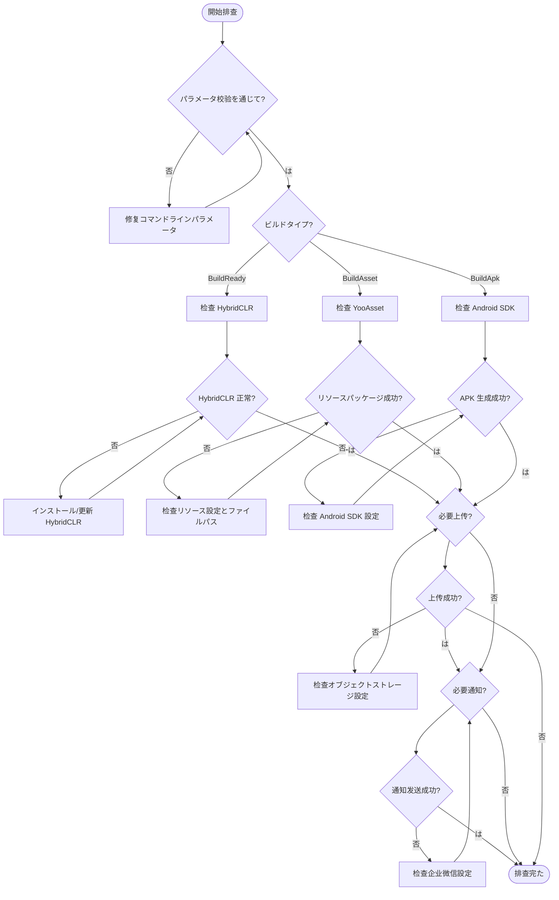

# よくある

ドキュメントた GameFrameX Unity Builder ビルドのよくある。

## 

GameFrameX Unity Builder はビルド，サポート：
- コマンドラインビルド（サポート CI/CD ）
- リソースパッケージ（にづく YooAsset）
- ホットアップデートサポート（にづく HybridCLR）
- オブジェクトストレージ（、、）
- ビルド

## よくあると

### 1. パラメータエラー

#### 1.1 executeMethod 

**エラー：**
```
Exception: executeMethod is null
```

**：** にコマンドラインパラメータ `-executeMethod`。

**：**  CI/CD む `-executeMethod` パラメータ，のビルドメソッド（ `GameFrameX.Builder.Editor.Builder.BuildAsset`）。

```bash
-executeMethod GameFrameX.Builder.Editor.Builder.BuildAsset
```
> Source: [Builder.cs#L153-L156](https://github.com/GameFrameX/com.gameframex.unity.builder/blob/main/Editor/Builder.cs#L153-L156)

---

#### 1.2 buildNumber 

**エラー：**
```
Exception: build number is null
```

**：** にコマンドラインパラメータ `-BUILD_NUMBER`。

**：**  CI/CD む `-BUILD_NUMBER` パラメータ。

```bash
-BUILD_NUMBER 1001
```
> Source: [Builder.cs#L158-L161](https://github.com/GameFrameX/com.gameframex.unity.builder/blob/main/Editor/Builder.cs#L158-L161)

---

### 2. ビルド

#### 2.1 HybridCLR インストール

**：** ビルド HybridCLR インストールインストール。

**：**
- HybridCLR インストール
- il2cpp バージョンと HybridCLR バージョン

**：**

にビルド HybridCLR インストール。Builder に `BuildReady` インストール：

```csharp
var installerController = new InstallerController();
var isInstalled = installerController.HasInstalledHybridCLR();
if (!isInstalled || installerController.InstalledLibil2cppVersion != installerController.PackageVersion)
{
    installerController.InstallDefaultHybridCLR();
}
```
> Source: [Builder.cs#L219-L232](https://github.com/GameFrameX/com.gameframex.unity.builder/blob/main/Editor/Builder.cs#L219-L232)

**ステップ：**
1.  Unity プロジェクトインストール HybridCLR 
2.  il2cpp バージョンと HybridCLR 
3. にビルドログ `BuildReady Check HybridCLR Install Status` 

---

#### 2.2 リソースパッケージ

**：** リソースパッケージ，ビルド。

**：**
- YooAsset エラー
- リソースファイルパス
- 

**：**

Builder たエラーログ：

```csharp
try
{
    pipeline.Run(buildParameters, true);
    isSuccess = true;
}
catch (Exception e)
{
    Debug.LogException(e);
    Environment.Exit(1);
}
```
> Source: [Builder.cs#L298-L308](https://github.com/GameFrameX/com.gameframex.unity.builder/blob/main/Editor/Builder.cs#L298-L308)

**ステップ：**
1. ビルドログの
2.  YooAsset （AssetBundleCollectorSetting）
3. リソースディレクトリパス
4. 

---

#### 2.3 リソースファイル

**：** ファイル（）リソースファイル。

**：**

Builder リソースファイル：

```csharp
foreach (var assetBundleCollectorPackage in AssetBundleCollectorSettingData.Setting.Packages)
{
    assetBundleCollectorPackage.LocationToLower = true;
}
AssetBundleCollectorSettingData.SaveFile();
```
> Source: [Builder.cs#L271-L278](https://github.com/GameFrameX/com.gameframex.unity.builder/blob/main/Editor/Builder.cs#L271-L278)

---

### 3. オブジェクトストレージ

#### 3.1 オブジェクトストレージ

**：** ビルドた，リソース APK オブジェクトストレージ。

**：**
- の Key/Secret エラー
- Bucket  Endpoint エラー
- ネットワーク

**：**

にコマンドラインパラメータオブジェクトストレージパラメータ：

| パラメータ |  |  |
|------|------|------|
| `-ObjectStorageKey` | API  | AKIDxxxx |
| `-ObjectStorageSecret` | API  | xxxxxxxxx |
| `-ObjectStorageBucketName` |  | my-bucket |
| `-ObjectStorageEndPoint` |  | ap-guangzhou |

にコードコンパイル：
```csharp
#if ENABLE_GAME_FRAME_X_OBJECT_STORAGE
// オブジェクトストレージ機能コード
#endif
```

---

#### 3.2 オブジェクトストレージ

**：** コードたオブジェクトストレージ，コンパイル。

**：** にプロジェクト `ENABLE_GAME_FRAME_X_OBJECT_STORAGE` コンパイル。

**：**

に Unity エディター：
1.  `Edit > Project Settings > Player`
2.  `Scripting Define Symbols`
3.  `ENABLE_GAME_FRAME_X_OBJECT_STORAGE`
4. の：
   - `ENABLE_GAME_FRAME_X_OBJECT_STORAGE_QI_NIU`（）
   - `ENABLE_GAME_FRAME_X_OBJECT_STORAGE_TENCENT`（）
   - `ENABLE_GAME_FRAME_X_OBJECT_STORAGE_A_LI_YUN`（）

---

### 4. ネットワーク

#### 4.1 WeChat

**：** ビルドWeChat。

**：**
- WeChatBotKey エラー
-  API びし

**：**

たの Key：

```csharp
-WeChatBotKey xxxxx-xxxxx-xxxxx
```
> Source: [WeChatNotifyWorkHelper.cs#L49](https://github.com/GameFrameX/com.gameframex.unity.builder/blob/main/Editor/WeChatNotifyWorkHelper.cs#L49)

Builder ビルドフロー：

```csharp
try
{
    var httpResponseMessage = httpClient.PostAsync(url, stringContent).GetAwaiter().GetResult();
    var response = httpResponseMessage.Content.ReadAsStringAsync().GetAwaiter().GetResult();
    Debug.Log(response);
}
catch (Exception e)
{
    Debug.LogException(e);
}
```
> Source: [WeChatNotifyWorkHelper.cs#L59-L69](https://github.com/GameFrameX/com.gameframex.unity.builder/blob/main/Editor/WeChatNotifyWorkHelper.cs#L59-L69)

---

#### 4.2 リソースバージョン API びし

**：** リソースバージョンリクエスト。

**：**
- `UpdateAssetPackageVersionUrl` エラー
- `UpdateAssetPackageVersionAuthorization` エラー

**：**

のバージョン URL と：

```csharp
-UpdateAssetPackageVersionUrl https://api.example.com/version
-UpdateAssetPackageVersionAuthorization Bearer xxxxxx
```
> Source: [BuilderUpdateAssetPackageVersionHelper.cs#L55-L56](https://github.com/GameFrameX/com.gameframex.unity.builder/blob/main/Editor/BuilderUpdateAssetPackageVersionHelper.cs#L55-L56)

---

### 5. バージョンと

#### 5.1 

**：** ビルドの APK コマンドラインの。

**：** にた `-BundleId` パラメータプロジェクト。

**：**

にコマンドラインパラメータむ `-BundleId`：

```bash
-BundleId com.example.myapp
```

パラメータ，プロジェクトの：
```csharp
if (!_builderOptions.BundleId.IsNullOrWhiteSpace())
{
    PlayerSettings.applicationIdentifier = _builderOptions.BundleId.Trim();
}
```
> Source: [Builder.cs#L172-L175](https://github.com/GameFrameX/com.gameframex.unity.builder/blob/main/Editor/Builder.cs#L172-L175)

---

#### 5.2 バージョン

**：** ビルドの APK バージョンコマンドラインの。

**：** にた `-AppVersion` パラメータプロジェクトバージョン。

**：**

にコマンドラインパラメータむ `-AppVersion`：

```bash
-AppVersion 1.2.3
```

パラメータ，プロジェクトのバージョン：
```csharp
if (!_builderOptions.AppVersion.IsNullOrWhiteSpace())
{
    PlayerSettings.bundleVersion = _builderOptions.AppVersion.Trim();
}
```
> Source: [Builder.cs#L177-L180](https://github.com/GameFrameX/com.gameframex.unity.builder/blob/main/Editor/Builder.cs#L177-L180)

---

### 6. ログ

#### 6.1 ログファイルパス

**：** ビルドログファイル。

**：** にコマンドラインパラメータ `-logFile` パス。

**：**

Builder デフォルトログパス（）：

```csharp
if (_builderOptions.LogFilePath.IsNullOrWhiteSpace())
{
    var split = _builderOptions.ExecuteMethod.Split(new[] { "." }, StringSplitOptions.RemoveEmptyEntries);
    _builderOptions.LogFilePath = $"../Logs/{split[split.Length - 1]}_{_builderOptions.BuildNumber}.log";
}
```
> Source: [Builder.cs#L163-L167](https://github.com/GameFrameX/com.gameframex.unity.builder/blob/main/Editor/Builder.cs#L163-L167)

ログパス：
```bash
-logFile /path/to/build.log
```

---

## ビルドフロー

### フローチャート



---

## コマンドリファレンス

### ビルドコマンド

```bash
Unity \
  -projectPath /path/to/project \
  -executeMethod GameFrameX.Builder.Editor.Builder.BuildAsset \
  -BUILD_NUMBER ${BUILD_NUMBER} \
  -JOB_NAME ${JOB_NAME} \
  -PackageName DefaultPackage \
  -ChannelName default \
  -BundleId com.example.game \
  -AppVersion 1.0.0 \
  -IsIncrementalBuildPackage false \
  -IsUploadAsset true \
  -IsUploadLogFile true \
  -ObjectStorageKey ${OSS_KEY} \
  -ObjectStorageSecret ${OSS_SECRET} \
  -ObjectStorageBucketName game-assets \
  -ObjectStorageEndPoint ap-guangzhou \
  -IsUpdateAssetPackageVersion true \
  -UpdateAssetPackageVersionUrl https://api.example.com/version \
  -UpdateAssetPackageVersionAuthorization "Bearer token" \
  -WeChatBotKey ${WECHAT_KEY} \
  -logFile ../Logs/build_${BUILD_NUMBER}.log
```
> Source: [Builder.cs#L60-L151](https://github.com/GameFrameX/com.gameframex.unity.builder/blob/main/Editor/Builder.cs#L60-L151)

---

## リンク

- [](./1-overview) - プロジェクトとアーキテクチャ
- [インストール](./2-installation) - インストールガイド
- [クイックスタート](./3-getting-started) - クイックスタート
- [メソッド](./4-usage) - メソッド
- [オプション](./5-configuration) - オプション
- [オブジェクトストレージ](./6-object-storage) - オブジェクトストレージ
