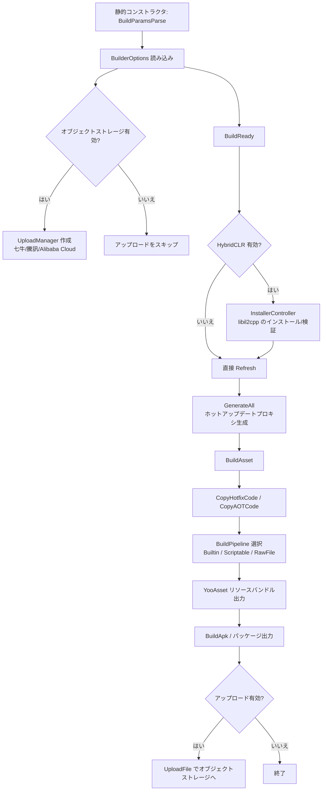

# 仕組み:Builder パイプライン

Builder パイプラインは、GameFrameX Unity Builder が Editor 側で順番にトリガーする一連のパッケージングエントリポイントです。`BuildReady` での環境準備から、`BuildAsset` での YooAsset リソースバンドル構築、`BuildApk` でのパッケージ出力とオプションのオブジェクトストレージへのアップロードまでを担当します。パイプライン全体は `Builder.cs` 内の `partial` 形式でファイル分割された静的メソッドを通じて連結されており、各メソッドがパイプラインの 1 つのステージに対応しています。

## パイプラインステージ一覧

| ステージ | エントリメソッド | 主な処理 |
|------|---------|---------|
| 1. パラメータ解析 | `Builder.BuildParamsParse()`(静的コンストラクタで呼び出し) | JSON 設定ファイルを解析し `BuilderOptions` を設定;スクリプトマクロに応じて `IObjectStorageUploadManager`(七牛/騰訊雲/Alibaba Cloud)を作成 |
| 2. ビルド準備 | `Builder.BuildReady()` | HybridCLR 有効時に libil2cpp のインストール/検証、`AssetDatabase` のリフレッシュ、ホットアップデートプロキシの生成 |
| 3. リソースビルド | `Builder.BuildAsset()` | ホットアップデートと AOT アセンブリのコピー、ビルドパイプラインの選択、YooAsset 呼び出しによるリソースバンドル出力 |
| 4. パッケージ出力 | `Builder.BuildApk()`(他プラットフォームも同様のメソッド) | プラットフォームビルダーの呼び出し、オプションで APK とログをオブジェクトストレージにアップロード |

## 仕組みの概要



## ステージ 1:パラメータ解析

`Builder.cs` の静的コンストラクタは、まず `BuildParamsParse()` を呼び出して JSON 設定を読み込み `_builderOptions` を設定します。その後、スクリプトマクロに応じてオブジェクトストレージアップロードマネージャーをインスタンス化するかどうかを判断し、保存パステンプレートを設定します。

Source:[Editor/Builder.cs#L32-L49](https://github.com/GameFrameX/com.gameframex.unity.builder/blob/main/Editor/Builder.cs#L32-L49)

```csharp
static Builder()
{
    BuildParamsParse();
#if ENABLE_GAME_FRAME_X_OBJECT_STORAGE_QI_NIU
    ObjectStorageUploadManager = ObjectStorageUploadFactory.Create<QiNiuYunObjectStorageUploadManager>(
        _builderOptions.ObjectStorageKey, _builderOptions.ObjectStorageSecret,
        _builderOptions.ObjectStorageBucketName, _builderOptions.ObjectStorageEndPoint);
#endif
    /* ... 騰訊雲 / Alibaba Cloud の分岐も同様 ... */
    ObjectStorageUploadManager.SetSavePath($"builder/{PlayerSettings.productName}/{EditorUserBuildSettings.activeBuildTarget}/{_builderOptions.JobName}/{Application.version}/{_builderOptions.BuildNumber}");
}
```

## ステージ 2:`BuildReady` ビルド準備

`BuildReady` はパッケージング開始前に環境を統一します。HybridCLR が有効な場合は libil2cpp を検証/インストールし、AssetDatabase をリフレッシュして HybridCLR のホットアップデートプロキシを生成します。その後、ログアップロードが有効な場合は、まずログを一度アップロードします。

Source:[Editor/Builder.BuildReady.cs#L15-L50](https://github.com/GameFrameX/com.gameframex.unity.builder/blob/main/Editor/Builder.BuildReady.cs#L15-L50)

```csharp
public static void BuildReady()
{
#if ENABLE_GAME_FRAME_X_HYBRID_CLR
    var installerController = new InstallerController();
    var isInstalled = installerController.HasInstalledHybridCLR();
    if (!isInstalled || installerController.InstalledLibil2cppVersion != installerController.PackageVersion)
    {
        installerController.InstallDefaultHybridCLR();
    }
    PrebuildCommand.GenerateAll();
#endif
    AssetDatabase.Refresh();
    if (_builderOptions.IsUploadLogFile)
    {
        ObjectStorageUploadManager.UploadFile(_builderOptions.LogFilePath);
    }
}
```

## ステージ 3:`BuildAsset` リソースビルド

`BuildAsset` はまずホットアップデート/AOT アセンブリをランタイムディレクトリにコピーし、次に `_builderOptions.BuildPipeline` に応じて `BuiltinBuildPipeline`、`ScriptableBuildPipeline`、`RawFileBuildPipeline` のいずれかを選択し、最後に YooAsset を呼び出してバンドルを出力します。

Source:[Editor/Builder.BuildAsset.cs#L15-L80](https://github.com/GameFrameX/com.gameframex.unity.builder/blob/main/Editor/Builder.BuildAsset.cs#L15-L80)

```csharp
BuildHotfixHelper.CopyHotfixCode();
AssetDatabase.Refresh();
BuildHotfixHelper.CopyAOTCode();
AssetDatabase.Refresh();

var buildPipeline = (EBuildPipeline)buildPipelineObj;
switch (buildPipeline)
{
    case EBuildPipeline.ScriptableBuildPipeline:
        pipeline = new ScriptableBuildPipeline();
        buildParameters = new ScriptableBuildParameters();
        break;
    case EBuildPipeline.RawFileBuildPipeline:
        pipeline = new RawFileBuildPipeline();
        buildParameters = new RawFileBuildParameters();
        break;
    default:
        pipeline = new BuiltinBuildPipeline();
        buildParameters = new BuiltinBuildParameters();
        break;
}
buildParameters.BuildMode = _builderOptions.IsIncrementalBuildPackage ? EBuildMode.IncrementalBuild : EBuildMode.ForceRebuild;
```

`EBuildPipeline` の文字列設定が不正な場合は `無効なビルドパイプラインタイプ` が出力され、直接 `return` されるため、パッケージ出力ステージには進みません。

## ステージ 4:`BuildApk` パッケージ出力とアップロード

`BuildApk` は `BuildProductHelper.BuildPlayerAndroid()` に APK 出力を委譲し、その後 `IsUploadApk` / `IsUploadLogFile` オプションに応じて成果物とログをオブジェクトストレージにアップロードします。

Source:[Editor/Builder.cs#L62-L78](https://github.com/GameFrameX/com.gameframex.unity.builder/blob/main/Editor/Builder.cs#L62-L78)

```csharp
public static void BuildApk()
{
    var apkPath = BuildProductHelper.BuildPlayerAndroid();
    if (_builderOptions.IsUploadApk)
    {
        ObjectStorageUploadManager.UploadFile(apkPath);
    }
    if (_builderOptions.IsUploadLogFile)
    {
        ObjectStorageUploadManager.UploadFile(_builderOptions.LogFilePath);
    }
}
```

## 主要設定項目(`BuilderOptions`)

| フィールド | 役割 | デフォルト値 |
|------|------|--------|
| `BuildPipeline` | `BuiltinBuildPipeline` / `ScriptableBuildPipeline` / `RawFileBuildPipeline` を選択 | — |
| `PackageName` | YooAsset リソースバンドル名 | — |
| `PackageVersion` | リソースバンドルのバージョン番号、空の場合は `yyyyMMddHHmmss` | 空文字列 |
| `IsIncrementalBuildPackage` | `true`=増分ビルド、`false`=強制再ビルド | — |
| `BuildinFileCopyOption` | 内蔵ファイルコピーオプション、空の場合は `ClearAndCopyAll` | 空文字列 |
| `IsUploadApk` / `IsUploadLogFile` | APK / ログをアップロードするかどうか | — |
| `ObjectStorageKey/Secret/BucketName/EndPoint` | オブジェクトストレージの認証情報 | 空文字列 |
| `JobName` / `BuildNumber` | オブジェクトストレージパス `builder/{product}/{target}/{job}/{version}/{buildNumber}` に組み込む | 空文字列 |

Source:[Editor/BuilderOptions.cs#L1-L60](https://github.com/GameFrameX/com.gameframex.unity.builder/blob/main/Editor/BuilderOptions.cs#L1-L60)

## アップロードパステンプレート

オブジェクトストレージが有効な場合、保存パスは以下に統一されます:

```text
builder/{PlayerSettings.productName}/{activeBuildTarget}/{JobName}/{Application.version}/{BuildNumber}
```

Source:[Editor/Builder.cs#L47](https://github.com/GameFrameX/com.gameframex.unity.builder/blob/main/Editor/Builder.cs#L47)

## 次に

- 各プラットフォームのパッケージ出力メソッドの違いについては、《プラットフォームパッケージ出力》タスクページを参照してください(ディレクトリに存在する場合)。
- `BuilderOptions` フィールドの全一覧については、《ビルドオプション早見表》リファレンスページを参照してください。
- ビルド失敗のトラブルシューティングについては、《ビルド失敗時の対処》トラブルシューティングページを参照してください。