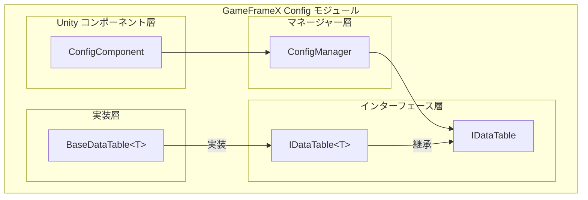

# コンポーネント概要

Config コンポーネントは、GameFrameX フレームワークにおけるゲーム設定データを管理するためのコアモジュールであり、効率的で型安全な設定データの保存とアクセス機構を提供します。Config コンポーネントを使用することで、開発者はアイテムテーブル、キャラターテーブル、レベルテーブルなど、ゲーム内の様々な設定テーブル удобноにロードおよび管理でき、強タイプインターフェースを通じて設定データを高速にクエリできます。

## 概要

Config コンポーネントの設計目標は、ゲーム開発向けに統一された設定データ管理ソリューションを提供することです。ゲーム開発において、設定データは通常 Excel、CSV、JSON などの形式の設定テーブルに保存され、実行時に高速なクエリとアクセスが必要です。Config コンポーネントは以下の機能によりこの要件を満たします：

- **型安全性**：ジェネリックインターフェースを通じてコンパイル時の型チェックを提供し、実行時エラーを削減
- **高效なクエリ**：内部的に Dictionary を使用し、O(1) の時間複雑度でデータを検索
- **灵活主キーサポート**：int、long、string の3種類主キータイプをサポートし、異なる設定テーブルの要件に対応
- **丰富的查询操作**：Find、Max、Min、Sum などの常用的クエリメソッドを提供

### コアコンポーネントアーキテクチャ



### データアクセスフロー

```mermaid
sequenceDiagram
    participant Dev as 開発者コード
    participant CC as ConfigComponent
    participant CM as ConfigManager
    participant DT as IDataTable&lt;T&gt;

    Dev->>CC: GetConfig&lt;TDataTable&gt;()
    CC->>CM: GetConfig(configName)
    CM->>DT: IDataTable インスタンスを返す
    DT-->>Dev: TDataTable データテーブルオブジェクト
    Dev->>DT: TryGet(id, out value)
    DT-->>Dev: クエリ結果を返す
```

## データテーブルの作成

Config コンポーネントを使用するには、まずカスタムデータテーブルクラスを作成する必要があります。データテーブルクラスは `BaseDataTable<T>` 抽象クラスを継承し、`LoadAsync` メソッドを実装して設定データをロードします。

### データモデルの定義

まず、設定データのモデルクラスを定義する必要があります。たとえば、アイテム設定データモデルを作成します：

```csharp
using GameFrameX.Config.Runtime;

[Serializable]
public class ItemData
{
    public int Id { get; set; }
    public string Name { get; set; }
    public string Description { get; set; }
    public int Quality { get; set; }
    public int Price { get; set; }
}
```
> Source: [サンプルコード](https://github.com/GameFrameX/com.gameframex.unity.config/blob/main/README.md)

### データテーブルクラスの作成

`BaseDataTable<T>` を継承し、`LoadAsync` メソッドを実装します：

```csharp
using System.Collections.Generic;
using System.Threading.Tasks;
using GameFrameX.Config.Runtime;

public class ItemDataTable : BaseDataTable<ItemData>
{
    public override async Task LoadAsync()
    {
        // 設定ソースからデータをロード
        // ファイル、ネットワーク、またはリソースシステムからロード可能
        var items = new List<ItemData>
        {
            new ItemData { Id = 1001, Name = "体力药水", Description = "体力を100回復", Quality = 1, Price = 50 },
            new ItemData { Id = 1002, Name = "魔力药水", Description = "魔力を50回復", Quality = 1, Price = 30 },
            new ItemData { Id = 1003, Name = "紫色装備", Description = "高品質装備", Quality = 5, Price = 1000 }
        };

        // 辞書にデータを追加
        foreach (var item in items)
        {
            LongDataMaps.Add(item.Id, item);
            DataList.Add(item);
        }
        
        await Task.CompletedTask;
    }
}
```
> Source: [BaseDataTable.cs](https://github.com/GameFrameX/com.gameframex.unity.config/blob/main/Runtime/Config/Config/BaseDataTable.cs#L48-L69)

`BaseDataTable<T>` クラスはデータを保存するために2つの主要な内部辞書を用意しています：
- `LongDataMaps`：長整数主キーのデータを保存するために使用
- `StringDataMaps`：文字列主キーのデータを保存するために使用
- `DataList`：すべてのデータオブジェクトを順序대로保存するために使用

## データテーブルの登録と使用

### ConfigComponent の追加

Unity シーン内で空のゲームオブジェクトを作成し、ConfigComponent コンポーネントを追加します：

1. Unity エディタで、Hierarchy パネルを右クリック
2. `GameObject` → `Create Empty` を選択
3. Inspector パネルで、`Add Component` をクリック
4. `ConfigComponent` を検索して追加（GameFrameX/Config メニュー下）

```csharp
// コードで追加することも可能
var configEntity = new GameObject("ConfigSystem");
var configComponent = configEntity.AddComponent<GameFrameX.Config.Runtime.ConfigComponent>();
```
> Source: [ConfigComponent.cs](https://github.com/GameFrameX/com.gameframex.unity.config/blob/main/Runtime/Config/ConfigComponent.cs#L46-L48)

### データテーブルの登録

作成したデータテーブルを ConfigComponent に登録します：

```csharp
using GameFrameX.Config.Runtime;
using UnityEngine;

public class GameStart : MonoBehaviour
{
    private ConfigComponent _configComponent;

    private void Start()
    {
        // ConfigComponent インスタンスを取得
        _configComponent = GetComponent<ConfigComponent>();
        
        if (_configComponent == null)
        {
            _configComponent = gameObject.AddComponent<ConfigComponent>();
        }

        // データテーブルを作成して登録
        var itemDataTable = new ItemDataTable();
        _configComponent.Add("ItemDataTable", itemDataTable);

        // 非同期でデータをロード
        _ = LoadDataAsync();
    }

    private async Task LoadDataAsync()
    {
        var itemDataTable = _configComponent.GetConfig<ItemDataTable>();
        if (itemDataTable != null)
        {
            await itemDataTable.LoadAsync();
            Debug.Log($"アイテムテーブルがロード完了しました。全 {_configComponent.Count} 件");
        }
    }
}
```
> Source: [ConfigComponent.cs](https://github.com/GameFrameX/com.gameframex.unity.config/blob/main/Runtime/Config/ConfigComponent.cs#L108-L127)

### ジェネリックメソッドによる便捷なアクセス

ConfigComponent はデータテーブルの取得を簡略化するジェネリックメソッドを提供します：

```csharp
// 指定されたタイプのデータテーブル是否存在か確認
bool hasTable = _configComponent.HasConfig<ItemDataTable>();

// データテーブルインスタンスを取得
var itemDataTable = _configComponent.GetConfig<ItemDataTable>();

// データテーブルを削除
_configComponent.RemoveConfig<ItemDataTable>();

// すべてのデータテーブルをクリア
_configComponent.RemoveAllConfigs();
```
> Source: [ConfigComponent.cs](https://github.com/GameFrameX/com.gameframex.unity.config/blob/main/Runtime/Config/ConfigComponent.cs#L129-L170)

## データクエリ

`IDataTable<T>` インターフェースは丰富的なデータクエリメソッドを提供し、多様なクエリシナリオをサポートします。

### 基本的なクエリ

インデクサーまたは TryGet メソッドを使用してデータをクエリします：

```csharp
var itemDataTable = _configComponent.GetConfig<ItemDataTable>();

// インデクサーを使用してクエリ（推奨）
// 整数主キーでクエリ
ItemData item1 = itemDataTable[1001];

// 長整数主キーでクエリ
ItemData item2 = itemDataTable[(long)1001];

// 文字列主キーでクエリ
ItemData item3 = itemDataTable["1001"];

// TryGet メソッドを使用（安全的）
if (itemDataTable.TryGet(1001, out ItemData item))
{
    Debug.Log($"アイテム Found: {item.Name}");
}
```
> Source: [BaseDataTable.cs](https://github.com/GameFrameX/com.gameframex.unity.config/blob/main/Runtime/Config/Config/BaseDataTable.cs#L119-L162)

### 条件クエリ

Find メソッドを使用して条件クエリを行います：

```csharp
var itemDataTable = _configComponent.GetConfig<ItemDataTable>();

// 条件に一致する最初のオブジェクトを検索
ItemData highQualityItem = itemDataTable.Find(item => item.Quality >= 5);

// 条件に一致するすべてのオブジェクトを検索
ItemData[] allHighQualityItems = itemDataTable.FindListArray(item => item.Quality >= 3);

// 条件に一致するすべてのオブジェクトを検索（リストで返す）
List<ItemData> expensiveItems = itemDataTable.FindList(item => item.Price > 100);
```
> Source: [BaseDataTable.cs](https://github.com/GameFrameX/com.gameframex.unity.config/blob/main/Runtime/Config/Config/BaseDataTable.cs#L296-L336)

### 集計クエリ

Max、Min、Sum メソッドを使用して集計計算を行います：

```csharp
var itemDataTable = _configComponent.GetConfig<ItemDataTable>();

// 指定されたプロパティの最大値を取得
int maxPrice = itemDataTable.Max(item => item.Price);

// 指定されたプロパティの最小値を取得
int minPrice = itemDataTable.Min(item => item.Price);

// プロパティの合計を計算
int totalPrice = itemDataTable.Sum(item => item.Price);

// 要素数をカウント
int count = itemDataTable.Count;

// すべてのデータを取得
ItemData[] allItems = itemDataTable.All;
```
> Source: [BaseDataTable.cs](https://github.com/GameFrameX/com.gameframex.unity.config/blob/main/Runtime/Config/Config/BaseDataTable.cs#L351-L449)

### 遍歴操作

ForEach メソッドを使用してすべてのデータを遍歴します：

```csharp
var itemDataTable = _configComponent.GetConfig<ItemDataTable>();

// すべてのデータを遍歴
itemDataTable.ForEach(item =>
{
    Debug.Log($"アイテム: {item.Name}, 価格: {item.Price}");
});
```
> Source: [BaseDataTable.cs](https://github.com/GameFrameX/com.gameframex.unity.config/blob/main/Runtime/Config/Config/BaseDataTable.cs#L338-L349)

### 最初と最後の要素の取得

```csharp
var itemDataTable = _configComponent.GetConfig<ItemDataTable>();

// 最初の要素を取得
ItemData first = itemDataTable.FirstOrDefault;

// 最後の要素を取得
ItemData last = itemDataTable.LastOrDefault;
```
> Source: [BaseDataTable.cs](https://github.com/GameFrameX/com.gameframex.unity.config/blob/main/Runtime/Config/Config/BaseDataTable.cs#L223-L255)

## 完全な使用例

以下は設定システムの完全な使用例です：

```csharp
using System.Collections.Generic;
using System.Threading.Tasks;
using GameFrameX.Config.Runtime;
using UnityEngine;

// 1. データモデルを定義
[System.Serializable]
public class ItemData
{
    public int Id { get; set; }
    public string Name { get; set; }
    public string Description { get; set; }
    public int Quality { get; set; }
    public int Price { get; set; }
}

// 2. データテーブルクラスを作成
public class ItemDataTable : BaseDataTable<ItemData>
{
    public override async Task LoadAsync()
    {
        // ファイルまたはネットワークからデータをロード
        var items = new List<ItemData>
        {
            new ItemData { Id = 1001, Name = "体力药水", Description = "体力を100回復", Quality = 1, Price = 50 },
            new ItemData { Id = 1002, Name = "魔力药水", Description = "魔力を50回復", Quality = 1, Price = 30 },
            new ItemData { Id = 1003, Name = "金色武器", Description = "黄金の伝説武器", Quality = 5, Price = 10000 }
        };

        foreach (var item in items)
        {
            LongDataMaps.Add(item.Id, item);
            DataList.Add(item);
        }
        
        await Task.CompletedTask;
    }
}

// 3. ゲーム起動スクリプト
public class GameConfigManager : MonoBehaviour
{
    private ConfigComponent _configComponent;

    private void Awake()
    {
        // シーンに ConfigComponent が存在することを確認
        _configComponent = GetComponent<ConfigComponent>();
        if (_configComponent == null)
        {
            _configComponent = gameObject.AddComponent<ConfigComponent>();
        }
    }

    private async void Start()
    {
        // データテーブルを登録
        var itemTable = new ItemDataTable();
        _configComponent.Add("ItemDataTable", itemTable);

        // データをロード
        await itemTable.LoadAsync();

        // データをクエリ
        QueryData();
    }

    private void QueryData()
    {
        var itemTable = _configComponent.GetConfig<ItemDataTable>();
        
        // 基本的なクエリ
        var item = itemTable[1001];
        Debug.Log($"クエリ結果: {item?.Name}");

        // 条件クエリ
        var highQualityItems = itemTable.FindListArray(x => x.Quality >= 3);
        Debug.Log($"高品質アイテム数: {highQualityItems.Length}");

        // 集計クエリ
        var totalValue = itemTable.Sum(x => x.Price);
        Debug.Log($"アイテム合計価値: {totalValue}");
    }
}
```
> Source: [BaseDataTable.cs](https://github.com/GameFrameX/com.gameframex.unity.config/blob/main/Runtime/Config/Config/BaseDataTable.cs#L48-L69)

## 設定データフォーマット

Config コンポーネントは複数のフォーマットの設定ファイルからデータをロードすることをサポートします：

### テキストフォーマット（TSV）

デフォルトで Tab 区切りのテキストフォーマットをサポートしています：

```
# フォーマット：Id	Name	Description	Quality	Price
1001	体力药水	体力を100回復	1	50
1002	魔力药水	魔力を50回復	1	30
```

各行は4列含み、Tab キーで区切られます。

### バイナリフォーマット

バイナリフォーマットの設定ファイルのロードもサポートします。通常は `.bytes` 拡張子を使用します。

> 設定フォーマットの詳細な説明は [データテーブル定義](../3-getting-started.data-table-definition) ドキュメントを参照してください。

## ベストプラクティス

### データテーブル命名規則

- データテーブルクラス名には PascalCase を使用
- データテーブルインスタンス名には意味のある名前を使用
- シングルトンパターンでのデータテーブルアクセス管理を推奨

### 非同期ロード

すべてのデータロード操作は非同期方式を使用して、主スレッドのブロックを回避します：

```csharp
// 推奨：非同期ロード
await itemDataTable.LoadAsync();

// または非同期呼び出しを使用
_ = itemDataTable.LoadAsync();
```

### ヌルチェック

TryGet メソッドを使用して 안전한 ヌルチェックを行います：

```csharp
// 推奨の記述方法
if (itemDataTable.TryGet(1001, out ItemData item))
{
    // 見つかったデータを処理
    Debug.Log(item.Name);
}

// 非推奨：データが存在しない場合は null を返す
var item = itemDataTable[1001];
if (item != null)
{
    // データを処理
}
```

## 関連リンク

- [Config コンポーネント概要](../1-overview.introduction)
- [機能一覧](../1-overview.features)
- [データテーブル定義](../3-getting-started.data-table-definition)
- [ConfigComponent 設定コンポーネント](../4-core-concepts.config-component)
- [ConfigManager 設定マネージャー](../4-core-concepts.config-manager)
- [IDataTable データテーブルインターフェース](../4-core-concepts.idata-table)
- [API リファレンス](../5-api-reference.interfaces)
- [イベント引数](../5-api-reference.event-args)
