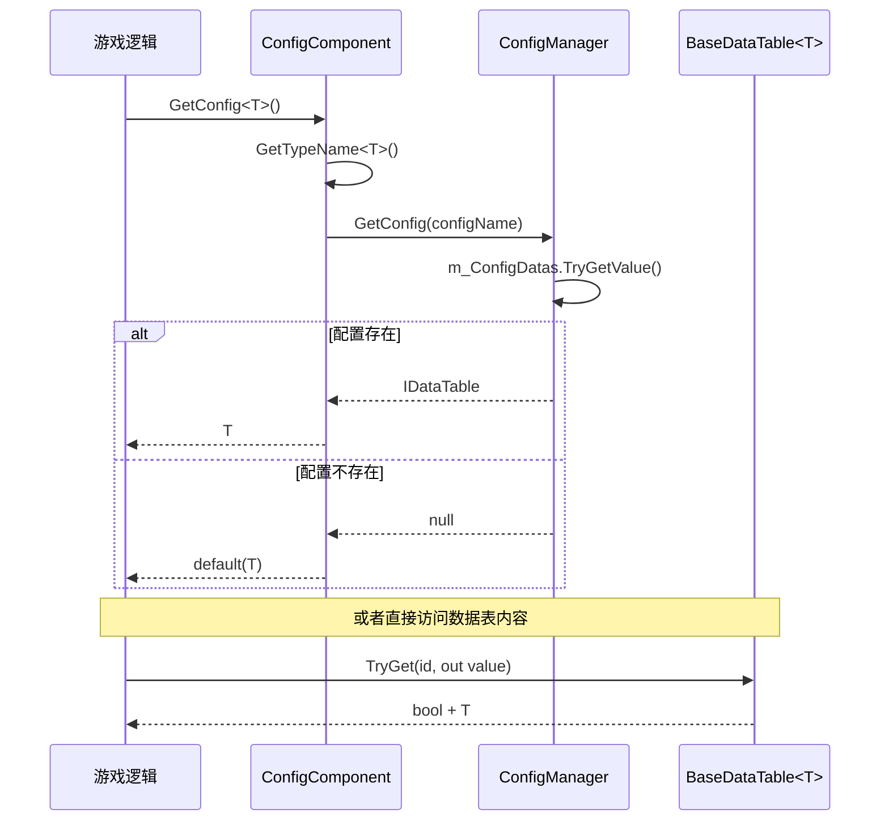

# Config コンポーネント紹介

Config コンポーネント是 GameFrameX フレームワーク中用于管理設定表数据的コアモジュール。它提供します統一された的設定ロード、存储和查询机制，使設定数据的使用更加シンプル効率的。

## 概要

GameFrameX Config コンポーネントは轻量级、高性能的 Unity 設定管理解決策，专门为游戏开发シーン設計。该コンポーネント采用モジュール化アーキテクチャ，将設定数据的存储、查询和管理分离，提供清晰的分层结构。

### 設計目标

- **簡素化設定访问**：通过ジェネリックインターフェース提供强タイプ的設定访问方法
- **高性能查询**：サポート多种 ID タイプ（int、long、string）的快速查找
- **柔軟的数据操作**：提供丰富的数据查询和聚合メソッド
- **イベント驱动**：サポート設定ロード成功/失敗的イベント通知

### コア特性

1. **强タイプサポート**：設定数据以ジェネリック `IDataTable<T>` 形式访问，コンパイル时タイプ安全
2. **多键值索引**：サポート `int`、`long`、`string` 三种主键タイプ的查询
3. **数据聚合能力**：内置 Max、Min、Sum 等聚合函数
4. **非同期ロード**：設定数据サポート非同期ロードモード
5. **线程安全**：使用 `ConcurrentDictionary` 保证多线程安全

## アーキテクチャ設計

Config コンポーネント采用三层アーキテクチャ設計，各层职责清晰，依赖关系明确：

```mermaid
graph TD
    subgraph UnityComponent["Unity 组件层"]
        CC[ConfigComponent<br/>配置组件]
    end

    subgraph ManagerLayer["管理器层"]
        ICM[IConfigManager<br/>配置管理器接口]
        CM[ConfigManager<br/>配置管理器实现]
    end

    subgraph DataTableLayer["数据表层"]
        IDataTable[IDataTable<br/>数据表接口]
        IDataTableG[IDataTable&lt;T&gt;<br/>泛型数据表接口]
        BDT[BaseDataTable&lt;T&gt;<br/>数据表基类]
    end

    subgraph EventLayer["事件层"]
        LCSEA[LoadConfigSuccessEventArgs<br/>加载成功事件]
        LCFA[LoadConfigFailureEventArgs<br/>加载失败事件]
    end

    CC --> ICM
    ICM <|.. CM
    IDataTable <|.. IDataTableG
    IDataTableG <|.. BDT
    CM -.->|存储| BDT
```

### 各层职责

| 层级 | コンポーネント | 职责説明 |
|------|------|----------|
| Unity コンポーネント層 | ConfigComponent | 作为 Unity コンポーネント暴露给シーン，提供游戏逻辑呼び出し的入口 |
| マネージャー层 | ConfigManager | 管理所有設定表的存储、检索和ライフサイクル |
| 数据表层 | BaseDataTable<T> | 実装具体設定数据的存储和查询逻辑 |
| イベント层 | EventArgs | 提供設定ロードステータス的イベント通知 |

## コアコンセプト

### 設定コンポーネント (ConfigComponent)

`ConfigComponent` 是直接挂载在 Unity シーン中的コンポーネント，継承自 `GameFrameworkComponent`。它负责：

- 初期化 `ConfigManager` モジュール
- 提供面向游戏逻辑的設定访问インターフェース
- 维护タイプ到設定名称的映射

> Source: [ConfigComponent.cs](https://github.com/GameFrameX/com.gameframex.unity.config/blob/main/Runtime/Config/ConfigComponent.cs#L46-L185)

### 設定マネージャー (ConfigManager)

`ConfigManager` 是フレームワーク内部的設定管理モジュール，実装了 `IConfigManager` インターフェース。使用 `ConcurrentDictionary<string, IDataTable>` 存储所有設定表数据。

### 数据表インターフェース (IDataTable)

数据表インターフェース分为两个层次：

- **IDataTable**：非ジェネリック基本インターフェース，定義汎用的非同期ロードメソッド
- **IDataTable<T>**：ジェネリックインターフェース，継承自 `IDataTable`，提供强タイプ的数据访问メソッド

> Source: [IDataTable.cs](https://github.com/GameFrameX/com.gameframex.unity.config/blob/main/Runtime/Config/Config/IDataTable.cs#L39-L355)

### 数据表基底クラス (BaseDataTable<T>)

`BaseDataTable<T>` 是所有具体設定数据表的抽象基底クラス，提供します：

- 内部使用 `Dictionary<long, T>` 和 `Dictionary<string, T>` 分别存储不同主键タイプ的数据
- 実装了 `TryGet` 系列メソッド用于安全的查询
- 提供します索引器サポート直接通过 `table[id]` 方法访问
- 実装了 `FirstOrDefault`、`LastOrDefault`、`All` 等便捷プロパティ
- 提供します `Find`、`FindList`、`FindListArray` 等查询メソッド
- 内置 `Max`、`Min`、`Sum` 等聚合计算メソッド

> Source: [BaseDataTable.cs](https://github.com/GameFrameX/com.gameframex.unity.config/blob/main/Runtime/Config/Config/BaseDataTable.cs#L40-L520)

## 数据访问フロー

設定数据从作成到访问的完全なフロー如下：



## クイックスタート

### 基本使用ステップ

1. **作成数据表类**：継承 `BaseDataTable<T>`，実装 `LoadAsync` メソッド
2. **挂载コンポーネント**：在 Unity シーン中挂载 `ConfigComponent` コンポーネント
3. **取得設定**：通过 `ConfigComponent.GetConfig<T>()` 取得設定インスタンス

### コード例

```csharp
// 1. 定义配置数据类型
public class ItemData
{
    public int Id { get; set; }
    public string Name { get; set; }
    public string Description { get; set; }
}

// 2. 创建具体的数据表实现
public class ItemTable : BaseDataTable<ItemData>
{
    public override async Task LoadAsync()
    {
        // 在这里实现从文件或网络加载数据的逻辑
        // 加载完成后将数据添加到字典中
        LongDataMaps.Add(1, new ItemData { Id = 1, Name = "武器", Description = "新手武器" });
        LongDataMaps.Add(2, new ItemData { Id = 2, Name = "护甲", Description = "新手护甲" });
        DataList.AddRange(LongDataMaps.Values);
    }
}

// 3. 在游戏逻辑中使用配置
public class GameManager : MonoBehaviour
{
    private ConfigComponent _configComponent;
    
    private async void Start()
    {
        _configComponent = UnityEngine.Component.FindObjectOfType<ConfigComponent>();
        
        // 加载配置
        var itemTable = new ItemTable();
        await itemTable.LoadAsync();
        _configComponent.Add("ItemTable", itemTable);
        
        // 访问配置数据 - 使用 TryGet 安全获取
        if (itemTable.TryGet(1, out var item))
        {
            Debug.Log($"物品名称: {item.Name}");
        }
        
        // 使用索引器访问
        var item2 = itemTable[2];
        
        // 条件查询
        var foundItems = itemTable.FindList(x => x.Name.Contains("护"));
    }
}
```

> Source: [ConfigComponent.cs](https://github.com/GameFrameX/com.gameframex.unity.config/blob/main/Runtime/Config/ConfigComponent.cs#L108-L127)

## API 概览

### ConfigComponent コアメソッド

| メソッド | 説明 |
|------|------|
| `GetConfig<T>()` | 取得指定タイプ的設定表インスタンス |
| `HasConfig<T>()` | 確認指定タイプ的設定是否存在 |
| `RemoveConfig<T>()` | 移除指定タイプ的設定 |
| `RemoveAllConfigs()` | 移除所有設定 |
| `Add(string, IDataTable)` | 追加新的設定表 |

### IDataTable<T> コア成员

| 成员 | 説明 |
|------|------|
| `TryGet(int/long/string, out T)` | 尝试根据主键取得数据 |
| `this[int/long/string id]` | 索引器，サポート直接通过主键访问 |
| `FirstOrDefault` | 取得第1个数据元素 |
| `LastOrDefault` | 取得最後に一个数据元素 |
| `All` | 取得所有数据元素 |
| `Find(Func<T, bool>)` | 查找第1个匹配的元素 |
| `FindList(Func<T, bool>)` | 查找所有匹配的元素 |
| `ForEach(Action<T>)` | 遍历所有元素 |
| `Max/Min<Tk>()` | 取得最大值/最小值 |
| `Sum()` | 计算总和 |

## 依赖关系

Config コンポーネント依赖以下 GameFrameX コアモジュール：

| 依赖モジュール | 最低バージョン | 用途説明 |
|----------|----------|----------|
| com.gameframex.unity | 1.1.1 | コアフレームワーク基本 |
| com.gameframex.unity.asset | 1.0.6 | リソースロードサポート |
| com.gameframex.unity.event | 1.0.0 | イベント系统 |

> 詳細依赖要求请リファレンス [依赖要求](../2-installation/dependencies) ドキュメント

## 関連リンク

- [機能特性](./1-overview.features) - 理解する Config コンポーネント的完全な機能列表
- [インストール方法](../2-installation.install-methods) - 掌握コンポーネント的正确インストールステップ
- [基本使用](../3-getting-started.basic-usage) - 快速上手設定コンポーネント的使用
- [数据表定義](../3-getting-started.data-table-definition) - 学习如何定義自己的数据表
- [設定コンポーネント详解](../4-core-concepts.config-component) - ConfigComponent 深入解析
- [設定マネージャー详解](../4-core-concepts.config-manager) - ConfigManager 実装细节
- [IDataTable インターフェース详解](../4-core-concepts.idata-table) - 数据表インターフェース完全なドキュメント
