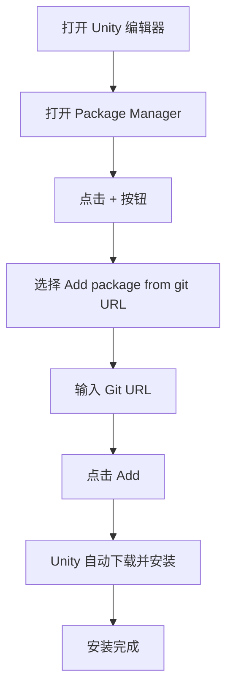

# インストールメソッド

このドキュメント介绍 GameFrameX Config 設定コンポーネント的多种インストール方法，帮助開発者快速在 Unity プロジェクト中集成该コンポーネント。

## 概要

GameFrameX Config 是 GameFrameX フレームワーク的設定表コンポーネント，提供設定表相关的インターフェース，使設定機能的使用更加シンプル効率的。在使用该コンポーネント之前，〜する必要があります先将其正确インストール到 Unity プロジェクト中。

> **当前バージョン**: 1.1.3  
> **Unity バージョン要求**: 2019.4 及以上

## 依存要件

在インストール Config コンポーネント之前，〜する必要があります確認してくださいプロジェクト中已インストール以下依赖パッケージ：

| 依赖パッケージ | 最低バージョン | 説明 |
|--------|----------|------|
| com.gameframex.unity | 1.1.1 | GameFrameX コアフレームワーク |
| com.gameframex.unity.asset | 1.0.6 | リソース管理モジュール |
| com.gameframex.unity.event | 1.0.0 | イベント系统モジュール |

Config コンポーネント会自动処理依赖パッケージ的インストール，当使用 Package Manager インストール时会自动インストール所有依赖。

## インストールメソッド

### 方法一：通过 manifest.json インストール（推奨）

这是最推奨的インストール方法，方便バージョン管理和团队协作。

1. 打开 Unity プロジェクト中的 `Packages` ファイル夹
2. 找到并编辑 `manifest.json` ファイル
3. 在 `dependencies` 节点下追加以下内容：

```json
{
  "dependencies": {
    "com.gameframex.unity.config": "https://github.com/GameFrameX/com.gameframex.unity.config.git"
  }
}
```

4. 保存ファイル后，Unity 会自动下载并インストール依赖パッケージ

> **注意**: 使用 Git URL 方法インストール时，Unity 会自动解析并インストール所有依赖项。

### 方法二：通过 Unity Package Manager インストール

1. 打开 Unity エディタ
2. 依次点击メニュー **Window** → **Package Manager**
3. 在 Package Manager ウィンドウ中，点击左上角的 **+** ボタン
4. 选择 **Add package from git URL...** オプション
5. 在输入框中粘贴以下地址：

```
https://github.com/GameFrameX/com.gameframex.unity.config.git
```

6. 点击 **Add** ボタン，Unity 会自动下载并インストールパッケージ及其依赖



### 方法三：直接放置到 Packages ディレクトリ

適しています〜する必要があります変更ソースコード或进行深度定制的シーン。

1. 克隆或下载リポジトリ：

```bash
git clone https://github.com/GameFrameX/com.gameframex.unity.config.git
```

2. 将下载的リポジトリファイル夹复制到 Unity プロジェクト的 `Packages` ディレクトリ下
3. Unity 会自动识别并ロードパッケージ

> **注意**: 这种方法インストール的パッケージ不会自动受信アップデート，〜する必要があります手动アップデート。

## インストールの確認

インストール完成后，〜できます通过以下方法検証 Config コンポーネント是否正确インストール：

1. **確認 Package Manager**: 在 Package Manager 中確認 "Game Frame X Config" 已显示
2. **確認 Assembly Definition**: 確認 `GameFrameX.Config.Runtime.asmdef` 已正确コンパイル
3. **使用コンポーネント**: 在シーン中尝试追加 `ConfigComponent` 確認是否正常工作

```csharp
// 验证安装 - 在代码中检查 Config 组件是否可用
using GameFrameX.Runtime;

var configComponent = UnityEngine.GameObject.FindObjectOfType<ConfigComponent>();
if (configComponent != null)
{
    UnityEngine.Debug.Log("Config 组件安装成功！");
}
```

## 升级与アップデート

### 自动アップデート（方法一和二）

使用 Package Manager インストール的パッケージ〜できます通过以下方法アップデート：

1. 在 Package Manager 中选择 GameFrameX Config
2. 点击バージョン号旁的下拉箭头
3. 选择最新バージョン或点击 "See all versions" 確認可用バージョン

### 手动アップデート（方法三）

对于直接放置到 Packages ディレクトリ的インストール方法：

1. 削除原有的パッケージファイル夹
2. 重新下载最新バージョン
3. 复制到 Packages ディレクトリ

## 常见インストール問題

### Git URL 无法访问

もし遇到 Git URL 无法访问的問題，〜できます尝试：
- 使用代理
- 将リポジトリ fork 到自己的 GitHub 账户
- 下载 ZIP パッケージ后解压到 Packages ディレクトリ

### 依赖パッケージバージョン冲突

当出现依赖パッケージバージョン冲突时：
1. 確認各个依赖パッケージ的バージョン要求
2. 統一された所有 GameFrameX コンポーネント到相同主バージョン
3. リファレンス [依赖要求](./2-installation.dependencies) ドキュメント

### Unity バージョン不兼容

確認 Unity エディタバージョン是否符合要求（2019.4+），旧バージョン〜の可能性があります〜する必要があります升级 Unity エディタ。

## 関連リンク

- [依赖要求](./2-installation.dependencies) - 詳細理解するコンポーネント依赖关系
- [快速开始](./3-getting-started.basic-usage) - 理解するコンポーネント的基本使用
- [Config コンポーネント紹介](./1-overview.introduction) - 理解する Config コンポーネント機能
- [GitHub リポジトリ](https://github.com/GameFrameX/com.gameframex.unity.config.git) - 取得最新バージョン
- [官方ドキュメント](https://gameframex.doc.alianblank.com) - 確認完全なドキュメント
