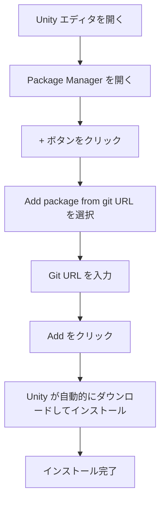

# インストール方法

本文書は GameFrameX Config 設定コンポーネントの複数のインストール方法を紹介します。開発者が Unity プロジェクトにこのコンポーネントをすばやく интегрировать するのを支援します。

## 概要

GameFrameX Config は GameFrameX フレームワークの設定テーブルコンポーネントであり、設定テーブルに関連するインターフェースを提供し、設定機能のより简单高效的な使用を実現します。このコンポーネントを使用する前に、Unity プロジェクトに正しくインストールする必要があります。

> **現在のバージョン**: 1.1.3  
> **Unity バージョン要件**: 2019.4 以上

## 依存関係

Config コンポーネントをインストールする前に、プロジェクトに以下の依存パッケージがインストールされていることを確認してください：

| 依存パッケージ | 最小バージョン | 説明 |
|--------|----------|------|
| com.gameframex.unity | 1.1.1 | GameFrameX コアフレームワーク |
| com.gameframex.unity.asset | 1.0.6 | リソース管理モジュール |
| com.gameframex.unity.event | 1.0.0 | イベントシステムモジュール |

Config コンポーネントは自動的に依存パッケージのインストールを処理し、Package Manager を使用してインストール的时候会자동으로 설치됩니다.

## インストール方法

### 方法一：manifest.json を通じたインストール（推奨）

これが最も推奨されるインストール方法で、版本管理とチームコラボレーションに便利です。

1. Unity プロジェクトの `Packages` フォルダを開きます
2. `manifest.json` ファイルを探して編集します
3. `dependencies` ノードの下に以下の内容を追加します：

```json
{
  "dependencies": {
    "com.gameframex.unity.config": "https://github.com/GameFrameX/com.gameframex.unity.config.git"
  }
}
```

4. ファイルを保存すると、Unity は自動的にダウンロードして依存パッケージをインストールします

> **注意**: Git URL 方式でインストールする場合、Unity は自動的にすべての依存項目を解決してインストールします。

### 方法二：Unity Package Manager を通じたインストール

1. Unity エディタを開きます
2. メニューから **Window** → **Package Manager** の順にクリックします
3. Package Manager ウィンドウで、左上の **+** ボタンをクリックします
4. **Add package from git URL...** オプション」を選択します
5. 入力框に以下のアドレスを貼り付けます：

```
https://github.com/GameFrameX/com.gameframex.unity.config.git
```

6. **Add** ボタンをクリックすると、Unity は自動的にダウンロードしてパッケージとその依存関係をインストールします



### 方法三：Packages ディレクトリに直接配置

ソースコードの修改や深度的なカスタマイズが必要なシナリオに適しています。

1. リポジトリをクローンまたはダウンロードします：

```bash
git clone https://github.com/GameFrameX/com.gameframex.unity.config.git
```

2. ダウンロードしたリポジトリフォルダを Unity プロジェクトの `Packages` ディレクトリにコピーします
3. Unity は自動的にパッケージを識別してロードします

> **注意**: この方法でインストールされたパッケージは自動更新を受け取らず、手動で更新する必要があります。

## インストール検証

インストールが完了したら、以下の方法で Config コンポーネントが正しくインストールされたことを確認できます：

1. **Package Manager を確認**: Package Manager で "Game Frame X Config" が表示されていることを確認します
2. **Assembly Definition を確認**: `GameFrameX.Config.Runtime.asmdef` が正しくコンパイルされていることを確認します
3. **コンポーネントを使用**: シーンで `ConfigComponent` を追加尝试し、正しく動作することを確認します

```csharp
// インストールの検証 - コードで Config コンポーネントが使用可能か確認
using GameFrameX.Runtime;

var configComponent = UnityEngine.GameObject.FindObjectOfType<ConfigComponent>();
if (configComponent != null)
{
    UnityEngine.Debug.Log("Config コンポーネントのインストール成功！");
}
```

## アップグレードと更新

### 自動更新（方法一および二）

Package Manager でインストールされたパッケージは、以下の方法で更新できます：

1. Package Manager で GameFrameX Config を選びます
2. バージョン番号の横のドロップダウン矢印をクリックします
3. 最新バージョンを選ぶか、"See all versions" をクリックして利用可能なバージョンを表示します

### 手動更新（方法三）

Packages ディレクトリに直接配置するインストール方式の場合：

1. 元のパッケージフォルダを削除します
2. 最新バージョンを再度ダウンロードします
3. Packages ディレクトリにコピーします

## よくあるインストール問題

### Git URL にアクセスできない

Git URL にアクセスできない問題が発生した場合は、以下を試すことができます：
- プロキシを使用します
- リポジトリを自分の GitHub アカウントに fork します
- ZIP パッケージをダウンロードして Packages ディレクトリに解凍します

### 依存パッケージのバージョン競合

依存パッケージのバージョン競合が発生した場合：
1. 各依存パッケージのバージョン要件を確認します
2. すべての GameFrameX コンポーネントを同じメジャーバージョンに統一します
3. [依存関係](./2-installation.dependencies) ドキュメントを参照します

### Unity バージョンの非互換性

Unity エディタのバージョンが要件（2019.4+）是否符合するか確認し、古すぎる版本は Unity エディタをアップグレードする必要があります。

## 関連リンク

- [依存関係](./2-installation.dependencies) - コンポーネントの依存関係を詳細に理解
- [クイックスタート](./3-getting-started.basic-usage) - コンポーネントの基本的な使用を理解
- [Config コンポーネント概要](./1-overview.introduction) - Config コンポーネント機能を理解
- [GitHub リポジトリ](https://github.com/GameFrameX/com.gameframex.unity.config.git) - 最新バージョンを取得
- [公式ドキュメント](https://gameframex.doc.alianblank.com) - 完全なドキュメントを表示
