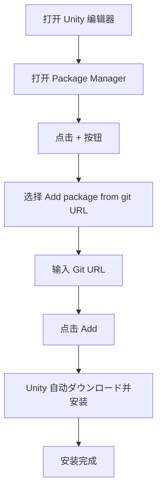

# 安装方法

本文档介绍 GameFrameX Config 配置コンポーネント的多种安装方法，帮助開発者快速在 Unity プロジェクト中集成该コンポーネント。

## 概要

GameFrameX Config 是 GameFrameX フレームワーク的配置表コンポーネント，提供配置表関連的インターフェース，使配置機能的使用更加简单高效。在使用该コンポーネント之前，必要先将其正确安装到 Unity プロジェクト中。

> **当前版本**: 1.1.3  
> **Unity 版本要求**: 2019.4 及以上

## 依赖要求

在安装 Config コンポーネント之前，必要确保プロジェクト中已安装以下依赖包：

| 依赖包 | 最小バージョン | 説明 |
|--------|----------|------|
| com.gameframex.unity | 1.1.1 | GameFrameX コアフレームワーク |
| com.gameframex.unity.asset | 1.0.6 | リソース管理模块 |
| com.gameframex.unity.event | 1.0.0 | イベント系统模块 |

Config コンポーネント会自动处理依赖包的安装，当使用 Package Manager 安装时会自动安装所有依赖。

## インストールメソッド

### メソッド一：を通じて manifest.json 安装（推荐）

这是最推荐的安装方法，方便版本管理和团队协作。

1. 打开 Unity プロジェクト中的 `Packages` ファイル夹
2. 找到并编辑 `manifest.json` ファイル
3. 在 `dependencies` ノードに追加以下の内容：

```json
{
  "dependencies": {
    "com.gameframex.unity.config": "https://github.com/GameFrameX/com.gameframex.unity.config.git"
  }
}
```

4. 保存ファイル后，Unity 会自动ダウンロード并安装依赖包

> **注意**: 使用 Git URL 方法安装时，Unity 会自动解析并安装所有依赖项。

### メソッド二：を通じて Unity Package Manager 安装

1. 打开 Unity 编辑器
2. 依次点击菜单 **Window** → **Package Manager**
3. 在 Package Manager 窗口中，点击左上角的 **+** 按钮
4. 选择 **Add package from git URL...** 选项
5. 在输入框中粘贴以下地址：

```
https://github.com/GameFrameX/com.gameframex.unity.config.git
```

6. 点击 **Add** 按钮，Unity 会自动ダウンロード并安装包及其依赖



### メソッド三：直接放置到 Packages ディレクトリ

适に使用必要修改源码或进行深度定制的シーン。

1. 克隆或ダウンロード仓库：

```bash
git clone https://github.com/GameFrameX/com.gameframex.unity.config.git
```

2. 将ダウンロード的仓库ファイル夹复制到 Unity プロジェクト的 `Packages` ディレクトリ下
3. Unity 会自动识别并加载包

> **注意**: 这种方法安装的包不会自动接收更新，必要手动更新。

## 安装验证

インストール完了後，以下のメソッドで確認可能 Config コンポーネント是否正确安装：

1. **检查 Package Manager**: 在 Package Manager 中确认 "Game Frame X Config" 已显示
2. **检查 Assembly Definition**: 确认 `GameFrameX.Config.Runtime.asmdef` 已正确编译
3. **使用コンポーネント**: 在シーン中尝试添加 `ConfigComponent` 检查正常に動作しているか

```csharp
// 验证安装 - 在代码中检查 Config コンポーネント是否可用
using GameFrameX.Runtime;

var configComponent = UnityEngine.GameObject.FindObjectOfType<ConfigComponent>();
if (configComponent != null)
{
    UnityEngine.Debug.Log("Config コンポーネントインストール成功！");
}
```

## 升级与更新

### 自动更新（方法一和二）

使用 Package Manager 安装的包可能を通じて以下方法更新：

1. 在 Package Manager 中选择 GameFrameX Config
2. 点击版本号旁的下拉箭头
3. 选择最新版本或点击 "See all versions" 查看可用版本

### 手动更新（方法三）

对于直接放置到 Packages ディレクトリ的安装方法：

1. 删除原有的包ファイル夹
2. 重新ダウンロード最新版本
3. 复制到 Packages ディレクトリ

## 常见安装问题

### Git URL 无法访问

如果遇到 Git URL 无法访问的问题，可能尝试：
- 使用代理
- 将仓库 fork 到自己的 GitHub 账户
- ダウンロード ZIP 包后解压到 Packages ディレクトリ

### 依赖包版本冲突

当出现依赖包版本冲突时：
1. 检查各个依赖包的版本要求
2. 统一所有 GameFrameX コンポーネント到相同主版本
3. 参考 [依赖要求](./2-installation.dependencies) 文档

### Unity 版本不兼容

确认 Unity 编辑器版本是否符合要求（2019.4+），旧版本可能必要升级 Unity 编辑器。

## 関連リンク

- [依赖要求](./2-installation.dependencies) - 详细了解コンポーネント依赖关系
- [快速开始](./3-getting-started.basic-usage) - 了解コンポーネント的基本使用
- [Config コンポーネント简介](./1-overview.introduction) - 了解 Config コンポーネント機能
- [GitHub 仓库](https://github.com/GameFrameX/com.gameframex.unity.config.git) - 取得最新版本
- [官方文档](https://gameframex.doc.alianblank.com) - 查看完整文档
