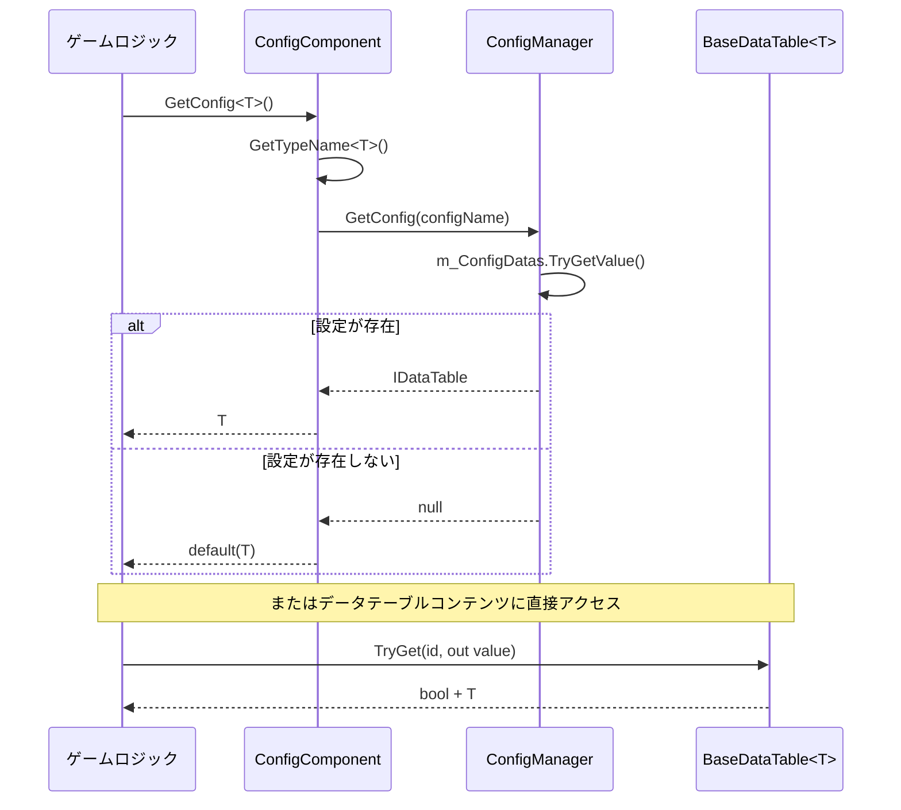

# Config コンポーネント概要

Config コンポーネントは、GameFrameX フレームワークにおける設定テーブルデータを管理するためのコアモジュールです。統一された 設定のロード、保存、クエリのメカニズムを提供し、設定データの使用をさらに简单高效的 にできるようにします。

## 概要

GameFrameX Config コンポーネントは、軽量で高性能な Unity 設定管理ソリューションであり、ゲーム開発シナリオ专用に設計されています。このコンポーネントは模块化アーキテクチャを採用しており、設定データの存储、クエリ、管理を分离し、明確な分层構造を提供します。

### 設計目標

- **設定アクセスの簡略化**：ジェネリックインターフェースを通じて强タイプの設定アクセス方式を提供
- **高性能クエリ**：複数の ID タイプ（int、long、string）の高速検索をサポート
- **灵活なデータ操作**：丰富的なデータクエリと集計メソッドを提供
- **イベント驱动**：設定のロード成功/失敗のイベント通知をサポート

### コア機能

1. **强タイプサポート**：設定データはジェネリック `IDataTable<T>` の形式でアクセスされ、コンパイル時に型安全を確保
2. **マルチキー值インデックス**：int、long、string の3种类主キータイプのクエリをサポート
3. **データ集計能力**：Max、Min、Sum などの集計関数が組み込まれています
4. **非同期ロード**：設定データは非同期ロードモードをサポート
5. **スレッド安全**：ConcurrentDictionary を使用してマルチスレッド安全を確保

## アーキテクチャ設計

Config コンポーネントは三層アーキテクチャ設計を採用しており、各層の职责が明確で、依存関係が明確です：

```mermaid
graph TD
    subgraph UnityComponent["Unity コンポーネント層"]
        CC[ConfigComponent<br/>設定コンポーネント]
    end

    subgraph ManagerLayer["マネージャー層"]
        ICM[IConfigManager<br/>設定マネージャーインターフェース]
        CM[ConfigManager<br/>設定マネージャー実装]
    end

    subgraph DataTableLayer["データテーブル層"]
        IDataTable[IDataTable<br/>データテーブルインターフェース]
        IDataTableG[IDataTable&lt;T&gt;<br/>ジェネリックデータテーブルインターフェース]
        BDT[BaseDataTable&lt;T&gt;<br/>データテーブル基底クラス]
    end

    subgraph EventLayer["イベント層"]
        LCSEA[LoadConfigSuccessEventArgs<br/>ロード成功イベント]
        LCFA[LoadConfigFailureEventArgs<br/>ロード失敗イベント]
    end

    CC --> ICM
    ICM <|.. CM
    IDataTable <|.. IDataTableG
    IDataTableG <|.. BDT
    CM -.->|保存| BDT
```

### 各層の职责

| レイヤー | コンポーネント | 职责説明 |
|------|------|----------|
| Unity コンポーネント層 | ConfigComponent | Unity コンポーネントとしてシーンに公开し、ゲームロジック呼び出しのエントリーポイントを提供 |
| マネージャー層 | ConfigManager | すべての設定テーブルの保存、検索、ライフサイクルを管理 |
| データテーブル層 | BaseDataTable<T> | 具体的な設定データの保存とクエリロジックを実装 |
| イベント層 | EventArgs | 設定ロード状态のイベント通知を提供 |

## コアコンセプト

### 設定コンポーネント (ConfigComponent)

`ConfigComponent` は Unity シーンに直接マウントされるコンポーネントで、`GameFrameworkComponent` を継承します。以下の职责を担います：

- `ConfigManager` モジュールを初期化
- ゲームロジック向けの設定アクセスインターフェースを提供
- 型から設定名へのマッピングを維持

> Source: [ConfigComponent.cs](https://github.com/GameFrameX/com.gameframex.unity.config/blob/main/Runtime/Config/ConfigComponent.cs#L46-L185)

### 設定マネージャー (ConfigManager)

`ConfigManager` はフレームワーク内部の設定管理モジュールで、`IConfigManager` インターフェースを実装します。`ConcurrentDictionary<string, IDataTable>` を使用してすべての設定テーブルデータを保存します。

### データテーブルインターフェース (IDataTable)

データテーブルインターフェースは2つのレベルに分かれています：

- **IDataTable**：非ジェネリック基底インターフェースで、通用の非同期ロードメソッドを定義
- **IDataTable<T>**：ジェネリックインターフェースで、`IDataTable` を継承し、强タイプのデータアクセスメソッドを提供

> Source: [IDataTable.cs](https://github.com/GameFrameX/com.gameframex.unity.config/blob/main/Runtime/Config/Config/IDataTable.cs#L39-L355)

### データテーブル基底クラス (BaseDataTable<T>)

`BaseDataTable<T>` はすべての具体的な設定データテーブルの抽象基底クラスであり、以下を提供します：

- 内部的に `Dictionary<long, T>` と `Dictionary<string, T>` を使用して異なる主キータイプのデータを保存
- TryGet シリーズのメソッドを実装して 안전한 クエリを提供
- インデクサー成员を実装して `table[id]` 方式での直接アクセスをサポート
- `FirstOrDefault`、`LastOrDefault`、`All` などの便捷なプロパティを実装
- `Find`、`FindList`、`FindListArray` などのクエリメソッドを提供
- `Max`、`Min`、`Sum` などの集計計算メソッドが組み込まれています

> Source: [BaseDataTable.cs](https://github.com/GameFrameX/com.gameframex.unity.config/blob/main/Runtime/Config/Config/BaseDataTable.cs#L40-L520)

## データアクセスフロー

設定データの作成からアクセスまでの完全なフローは以下の通りです：



## クイックスタート

### 基本的な使用ステップ

1. **データテーブルクラスを作成**：`BaseDataTable<T>` を継承し、`LoadAsync` メソッドを実装
2. **コンポーネントをマウント**：Unity シーンで `ConfigComponent` コンポーネントをマウント
3. **設定を取得**：`ConfigComponent.GetConfig<T>()` を通じて設定インスタンスを取得

### コード例

```csharp
// 1. 設定データタイプを定義
public class ItemData
{
    public int Id { get; set; }
    public string Name { get; set; }
    public string Description { get; set; }
}

// 2. 具体的なデータテーブル実装を作成
public class ItemTable : BaseDataTable<ItemData>
{
    public override async Task LoadAsync()
    {
        // ここでファイルまたはネットワークからデータをロードするロジックを実装
        // ロード完了後に辞書にデータを追加
        LongDataMaps.Add(1, new ItemData { Id = 1, Name = "武器", Description = "初心者武器" });
        LongDataMaps.Add(2, new ItemData { Id = 2, Name = "鎧", Description = "初心者鎧" });
        DataList.AddRange(LongDataMaps.Values);
    }
}

// 3. ゲームロジックで設定を使用
public class GameManager : MonoBehaviour
{
    private ConfigComponent _configComponent;
    
    private async void Start()
    {
        _configComponent = UnityEngine.Component.FindObjectOfType<ConfigComponent>();
        
        // 設定をロード
        var itemTable = new ItemTable();
        await itemTable.LoadAsync();
        _configComponent.Add("ItemTable", itemTable);
        
        // 設定データにアクセス - TryGet を使用して安全に取得
        if (itemTable.TryGet(1, out var item))
        {
            Debug.Log($"アイテム名: {item.Name}");
        }
        
        // インデクサーでアクセス
        var item2 = itemTable[2];
        
        // 条件クエリ
        var foundItems = itemTable.FindList(x => x.Name.Contains("鎧"));
    }
}
```

> Source: [ConfigComponent.cs](https://github.com/GameFrameX/com.gameframex.unity.config/blob/main/Runtime/Config/ConfigComponent.cs#L108-L127)

## API 概要

### ConfigComponent のコアメソッド

| メソッド | 説明 |
|------|------|
| `GetConfig<T>()` | 指定されたタイプの設定テーブルインスタンスを取得 |
| `HasConfig<T>()` | 指定されたタイプの設定是否存在か確認 |
| `RemoveConfig<T>()` | 指定されたタイプの設定を移除 |
| `RemoveAllConfigs()` | すべての設定を移除 |
| `Add(string, IDataTable)` | 新しい設定テーブルを追加 |

### IDataTable<T> のコアメンバー

| メンバー | 説明 |
|------|------|
| `TryGet(int/long/string, out T)` | 主キーに従ってデータを пытаться 取得 |
| `this[int/long/string id]` | インデクサーで主キーから直接アクセス |
| `FirstOrDefault` | 最初のデータ要素を取得 |
| `LastOrDefault` | 最後のデータ要素を取得 |
| `All` | すべてのデータ要素を取得 |
| `Find(Func<T, bool>)` | 最初の一致要素を検索 |
| `FindList(Func<T, bool>)` | すべての一致要素を検索 |
| `ForEach(Action<T>)` | すべての要素を遍歴 |
| `Max/Min<Tk>()` | 最大値/最小値を取得 |
| `Sum()` | 合計を計算 |

## 依存関係

Config コンポーネントは、以下の GameFrameX コアモジュールに依存します：

| 依存モジュール | 最小バージョン | 用途説明 |
|----------|----------|----------|
| com.gameframex.unity | 1.1.1 | コアフレームワーク基盤 |
| com.gameframex.unity.asset | 1.0.6 | リソースロードサポート |
| com.gameframex.unity.event | 1.0.0 | イベントシステム |

> 詳細な依存要件は [依存関係](../2-installation/dependencies) ドキュメントを参照してください

## 関連リンク

- [機能一覧](./1-overview.features) - Config コンポーネントの完全な機能リストを確認
- [インストール方法](../2-installation.install-methods) - コンポーネントの正しいインストールステップを掌握
- [基本的な使用方法](../3-getting-started.basic-usage) - 設定コンポーネントの使用をすぐに начать
- [データテーブル定義](../3-getting-started.data-table-definition) - 独自のデータテーブル定義方法を学習
- [設定コンポーネント詳細](../4-core-concepts.config-component) - ConfigComponent の詳細な解析
- [設定マネージャー詳細](../4-core-concepts.config-manager) - ConfigManager 実装の詳細
- [IDataTable インターフェース詳細](../4-core-concepts.idata-table) - データテーブルインターフェース完全なドキュメント
