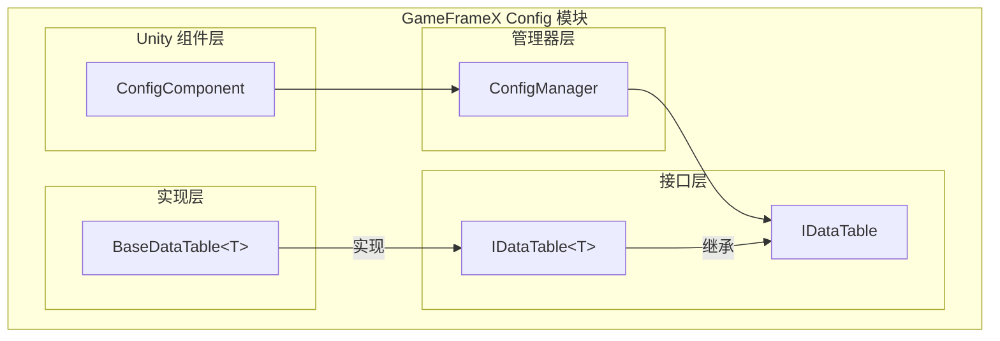

# 基本使用

Config コンポーネント是 GameFrameX フレームワーク中用于管理游戏設定数据的コアモジュール，提供します一套効率的、タイプ安全的設定数据存储和访问机制。通过 Config コンポーネント，開発者〜できます方便地ロード和管理游戏中的各种設定表（如物品表、角色表、关卡表等），并通过强タイプインターフェース快速查询設定数据。

## 概要

Config コンポーネント的設計目标是为游戏开发提供一个統一された的設定数据管理解決策。在游戏开发中，設定数据通常存储在 Excel、CSV 或 JSON 等フォーマット的設定表中，这些数据〜する必要があります在ランタイム被快速查询和访问。Config コンポーネント通过以下特性满足这一需求：

- **タイプ安全**：通过ジェネリックインターフェース提供コンパイル时的タイプ確認，减少ランタイムエラー
- **効率的查询**：内部使用 Dictionary 存储，サポート O(1) 时间複雑度的数据查找
- **柔軟的主键サポート**：サポート int、long、string 三种主键タイプ，适应不同的設定表需求
- **丰富的查询操作**：提供 Find、Max、Min、Sum 等常用查询メソッド

### コアコンポーネントアーキテクチャ



### 数据访问フロー

```mermaid
sequenceDiagram
    participant Dev as 开发者代码
    participant CC as ConfigComponent
    participant CM as ConfigManager
    participant DT as IDataTable&lt;T&gt;

    Dev->>CC: GetConfig&lt;TDataTable&gt;()
    CC->>CM: GetConfig(configName)
    CM->>DT: 返回 IDataTable 实例
    DT-->>Dev: TDataTable 数据表对象
    Dev->>DT: TryGet(id, out value)
    DT-->>Dev: 返回查询结果
```

## 作成数据表

要使用 Config コンポーネント，まず〜する必要があります作成自定義的数据表类。数据表类〜する必要があります継承 `BaseDataTable<T>` 抽象类，并実装 `LoadAsync` メソッド来ロード設定数据。

### 定義数据模型

まず，〜する必要があります定義設定数据的模型类。例えば，作成一个物品設定数据模型：

```csharp
using GameFrameX.Config.Runtime;

[Serializable]
public class ItemData
{
    public int Id { get; set; }
    public string Name { get; set; }
    public string Description { get; set; }
    public int Quality { get; set; }
    public int Price { get; set; }
}
```
> Source: [例コード](https://github.com/GameFrameX/com.gameframex.unity.config/blob/main/README.md)

### 作成数据表类

継承 `BaseDataTable<T>` 并実装 `LoadAsync` メソッド：

```csharp
using System.Collections.Generic;
using System.Threading.Tasks;
using GameFrameX.Config.Runtime;

public class ItemDataTable : BaseDataTable<ItemData>
{
    public override async Task LoadAsync()
    {
        // 从配置源加载数据
        // 这里可以是从文件、网络或资源系统加载
        var items = new List<ItemData>
        {
            new ItemData { Id = 1001, Name = "生命药水", Description = "恢复100点生命", Quality = 1, Price = 50 },
            new ItemData { Id = 1002, Name = "魔法药水", Description = "恢复50点魔法", Quality = 1, Price = 30 },
            new ItemData { Id = 1003, Name = "紫色装备", Description = "高品质装备", Quality = 5, Price = 1000 }
        };

        // 将数据添加到字典中
        foreach (var item in items)
        {
            LongDataMaps.Add(item.Id, item);
            DataList.Add(item);
        }
        
        await Task.CompletedTask;
    }
}
```
> Source: [BaseDataTable.cs](https://github.com/GameFrameX/com.gameframex.unity.config/blob/main/Runtime/Config/Config/BaseDataTable.cs#L48-L69)

`BaseDataTable<T>` 类提供します两个主な的内部字典用于存储数据：
- `LongDataMaps`：用于存储长整数主键的数据
- `StringDataMaps`：用于存储字符串主键的数据
- `DataList`：用于按顺序存储所有数据对象

## 登録和使用数据表

### 追加 ConfigComponent

在 Unity シーン中作成一个空物体，并追加 ConfigComponent コンポーネント：

1. 在 Unity エディタ中，右键点击 Hierarchy パネル
2. 选择 `GameObject` → `Create Empty`
3. 在 Inspector パネル中，点击 `Add Component`
4. 検索并追加 `ConfigComponent`（位于 GameFrameX/Config メニュー下）

```csharp
// 也可以通过代码添加
var configEntity = new GameObject("ConfigSystem");
var configComponent = configEntity.AddComponent<GameFrameX.Config.Runtime.ConfigComponent>();
```
> Source: [ConfigComponent.cs](https://github.com/GameFrameX/com.gameframex.unity.config/blob/main/Runtime/Config/ConfigComponent.cs#L46-L48)

### 登録数据表

将作成的数据表登録到 ConfigComponent 中：

```csharp
using GameFrameX.Config.Runtime;
using UnityEngine;

public class GameStart : MonoBehaviour
{
    private ConfigComponent _configComponent;

    private void Start()
    {
        // 获取 ConfigComponent 实例
        _configComponent = GetComponent<ConfigComponent>();
        
        if (_configComponent == null)
        {
            _configComponent = gameObject.AddComponent<ConfigComponent>();
        }

        // 创建并注册数据表
        var itemDataTable = new ItemDataTable();
        _configComponent.Add("ItemDataTable", itemDataTable);

        // 异步加载数据
        _ = LoadDataAsync();
    }

    private async Task LoadDataAsync()
    {
        var itemDataTable = _configComponent.GetConfig<ItemDataTable>();
        if (itemDataTable != null)
        {
            await itemDataTable.LoadAsync();
            Debug.Log($"物品表加载完成，共 {itemDataTable.Count} 条数据");
        }
    }
}
```
> Source: [ConfigComponent.cs](https://github.com/GameFrameX/com.gameframex.unity.config/blob/main/Runtime/Config/ConfigComponent.cs#L108-L127)

### ジェネリックメソッド便捷访问

ConfigComponent 提供しますジェネリックメソッド来簡素化数据表的取得：

```csharp
// 检查是否存在指定类型的数据表
bool hasTable = _configComponent.HasConfig<ItemDataTable>();

// 获取数据表实例
var itemDataTable = _configComponent.GetConfig<ItemDataTable>();

// 移除数据表
_configComponent.RemoveConfig<ItemDataTable>();

// 清空所有数据表
_configComponent.RemoveAllConfigs();
```
> Source: [ConfigComponent.cs](https://github.com/GameFrameX/com.gameframex.unity.config/blob/main/Runtime/Config/ConfigComponent.cs#L129-L170)

## 数据查询

IDataTable<T> インターフェース提供します丰富的数据查询メソッド，サポート多种查询シーン。

### 基本查询

使用索引器或 TryGet メソッド查询数据：

```csharp
var itemDataTable = _configComponent.GetConfig<ItemDataTable>();

// 使用索引器查询（推荐）
// 根据整数主键查询
ItemData item1 = itemDataTable[1001];

// 根据长整数主键查询
ItemData item2 = itemDataTable[(long)1001];

// 根据字符串主键查询
ItemData item3 = itemDataTable["1001"];

// 使用 TryGet 方法查询（更安全）
if (itemDataTable.TryGet(1001, out ItemData item))
{
    Debug.Log($"找到物品: {item.Name}");
}
```
> Source: [BaseDataTable.cs](https://github.com/GameFrameX/com.gameframex.unity.config/blob/main/Runtime/Config/Config/BaseDataTable.cs#L119-L162)

### 条件查询

使用 Find メソッド进行条件查询：

```csharp
var itemDataTable = _configComponent.GetConfig<ItemDataTable>();

// 查找第一个符合条件的对象
ItemData highQualityItem = itemDataTable.Find(item => item.Quality >= 5);

// 查找所有符合条件的对象
ItemData[] allHighQualityItems = itemDataTable.FindListArray(item => item.Quality >= 3);

// 查找所有符合条件的对象（返回列表）
List<ItemData> expensiveItems = itemDataTable.FindList(item => item.Price > 100);
```
> Source: [BaseDataTable.cs](https://github.com/GameFrameX/com.gameframex.unity.config/blob/main/Runtime/Config/Config/BaseDataTable.cs#L296-L336)

### 聚合查询

使用 Max、Min、Sum メソッド进行聚合计算：

```csharp
var itemDataTable = _configComponent.GetConfig<ItemDataTable>();

// 获取指定属性的最大值
int maxPrice = itemDataTable.Max(item => item.Price);

// 获取指定属性的最小值
int minPrice = itemDataTable.Min(item => item.Price);

// 计算属性总和
int totalPrice = itemDataTable.Sum(item => item.Price);

// 统计元素数量
int count = itemDataTable.Count;

// 获取所有数据
ItemData[] allItems = itemDataTable.All;
```
> Source: [BaseDataTable.cs](https://github.com/GameFrameX/com.gameframex.unity.config/blob/main/Runtime/Config/Config/BaseDataTable.cs#L351-L449)

### 遍历操作

使用 ForEach メソッド遍历所有数据：

```csharp
var itemDataTable = _configComponent.GetConfig<ItemDataTable>();

// 遍历所有数据
itemDataTable.ForEach(item =>
{
    Debug.Log($"物品: {item.Name}, 价格: {item.Price}");
});
```
> Source: [BaseDataTable.cs](https://github.com/GameFrameX/com.gameframex.unity.config/blob/main/Runtime/Config/Config/BaseDataTable.cs#L338-L349)

### 取得首尾元素

```csharp
var itemDataTable = _configComponent.GetConfig<ItemDataTable>();

// 获取第一个元素
ItemData first = itemDataTable.FirstOrDefault;

// 获取最后一个元素
ItemData last = itemDataTable.LastOrDefault;
```
> Source: [BaseDataTable.cs](https://github.com/GameFrameX/com.gameframex.unity.config/blob/main/Runtime/Config/Config/BaseDataTable.cs#L223-L255)

## 完全な使用例

以下は完全な的設定系统使用例：

```csharp
using System.Collections.Generic;
using System.Threading.Tasks;
using GameFrameX.Config.Runtime;
using UnityEngine;

// 1. 定义数据模型
[System.Serializable]
public class ItemData
{
    public int Id { get; set; }
    public string Name { get; set; }
    public string Description { get; set; }
    public int Quality { get; set; }
    public int Price { get; set; }
}

// 2. 创建数据表类
public class ItemDataTable : BaseDataTable<ItemData>
{
    public override async Task LoadAsync()
    {
        // 模拟从文件或网络加载数据
        var items = new List<ItemData>
        {
            new ItemData { Id = 1001, Name = "生命药水", Description = "恢复100点生命", Quality = 1, Price = 50 },
            new ItemData { Id = 1002, Name = "魔法药水", Description = "恢复50点魔法", Quality = 1, Price = 30 },
            new ItemData { Id = 1003, Name = "金色武器", Description = "金色传说武器", Quality = 5, Price = 10000 }
        };

        foreach (var item in items)
        {
            LongDataMaps.Add(item.Id, item);
            DataList.Add(item);
        }
        
        await Task.CompletedTask;
    }
}

// 3. 游戏启动脚本
public class GameConfigManager : MonoBehaviour
{
    private ConfigComponent _configComponent;

    private void Awake()
    {
        // 确保场景中有 ConfigComponent
        _configComponent = GetComponent<ConfigComponent>();
        if (_configComponent == null)
        {
            _configComponent = gameObject.AddComponent<ConfigComponent>();
        }
    }

    private async void Start()
    {
        // 注册数据表
        var itemTable = new ItemDataTable();
        _configComponent.Add("ItemDataTable", itemTable);

        // 加载数据
        await itemTable.LoadAsync();

        // 查询数据
        QueryData();
    }

    private void QueryData()
    {
        var itemTable = _configComponent.GetConfig<ItemDataTable>();
        
        // 基本查询
        var item = itemTable[1001];
        Debug.Log($"查询结果: {item?.Name}");

        // 条件查询
        var highQualityItems = itemTable.FindListArray(x => x.Quality >= 3);
        Debug.Log($"高品质物品数量: {highQualityItems.Length}");

        // 聚合查询
        var totalValue = itemTable.Sum(x => x.Price);
        Debug.Log($"物品总价值: {totalValue}");
    }
}
```
> Source: [BaseDataTable.cs](https://github.com/GameFrameX/com.gameframex.unity.config/blob/main/Runtime/Config/Config/BaseDataTable.cs#L48-L69)

## 設定数据フォーマット

Config コンポーネントサポート从多种フォーマット的設定ファイル中ロード数据：

### 文本フォーマット（TSV）

デフォルトサポート Tab 分隔的文本フォーマット：

```
# 格式：Id	Name	Description	Quality	Price
1001	生命药水	恢复100点生命	1	50
1002	魔法药水	恢复50点魔法	1	30
```

每行パッケージ含 4 列，以 Tab 键分隔。

### 二进制フォーマット

也サポートロード二进制フォーマット的設定ファイル，通常使用 `.bytes` 拡張名。

> 詳細的設定フォーマット説明请参照 [数据表定義](../3-getting-started.data-table-definition) ドキュメント。

## ベストプラクティス

### 数据表命名规范

- 数据表类名使用 PascalCase 命名
- 数据表インスタンス名称使用有意义的名称
- お勧め使用单例モード管理数据表访问

### 非同期ロード

所有数据ロード操作都应使用异步方法进行，避免阻塞主线程：

```csharp
// 推荐：异步加载
await itemDataTable.LoadAsync();

// 或者使用异步调用
_ = itemDataTable.LoadAsync();
```

### 空值確認

使用 TryGet メソッド进行安全的空值確認：

```csharp
// 推荐写法
if (itemDataTable.TryGet(1001, out ItemData item))
{
    // 处理找到的数据
    Debug.Log(item.Name);
}

// 不推荐：如果数据不存在会返回 null
var item = itemDataTable[1001];
if (item != null)
{
    // 处理数据
}
```

## 関連リンク

- [Config コンポーネント紹介](../1-overview.introduction)
- [機能特性](../1-overview.features)
- [数据表定義](../3-getting-started.data-table-definition)
- [ConfigComponent 設定コンポーネント](../4-core-concepts.config-component)
- [ConfigManager 設定マネージャー](../4-core-concepts.config-manager)
- [IDataTable 数据表インターフェース](../4-core-concepts.idata-table)
- [API リファレンス](../5-api-reference.interfaces)
- [イベントパラメータ](../5-api-reference.event-args)
