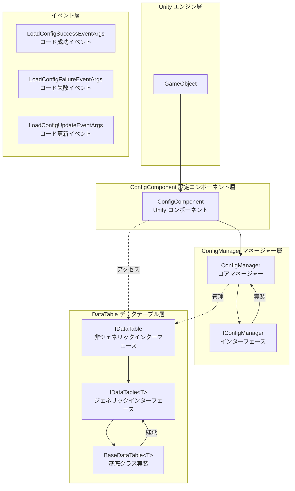
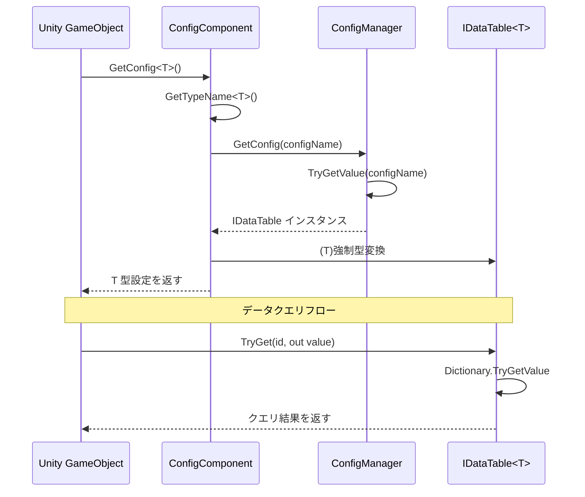

# 機能一覧

Config 設定テーブルコンポーネントは、GameFrameX フレームワークのコアモジュールの1つであり、完全なデータ設定管理ソリューションを提供します。このコンポーネントは複数のデータフォーマット（テキストとバイナリ）、灵活なデータテーブルクエリ、型安全なデータアクセス、そして完全なイベントシステムをサポートします。

## 概要

Config 設定テーブルコンポーネントは、Unity ゲーム開発に高效な設定データ管理能力を提供し主な特性は以下の通りです：

- **統一設定管理**：ConfigManager を通じてすべての設定データテーブルを集中管理
- **型安全なデータアクセス**：ジェネリックデータテーブルインターフェースに基づき、コンパイル時の型チェックを提供
- **複数データフォーマットサポート**：テキストフォーマット（Tab 区切り）とバイナリフォーマット設定テーブルをサポート
- **高性能クエリ**：辞書構造を使用して O(1) の時間複雑度でデータを検索
- **灵活なデータ操作**：丰富なクエリ、フィルタリング、集計メソッドを提供
- **イベント驱动アーキテクチャ**：ロード成功、失敗、更新などのイベントコールバックを提供

## アーキテクチャ設計

Config コンポーネントは分层アーキテクチャ設計を採用しており、各コンポーネントの职责が明確で、協調動作します：



### コアコンポーネント説明

| コンポーネント | 名前空間 | 説明 |
|------|----------|------|
| ConfigComponent | GameFrameX.Config.Runtime | Unity コンポーネント、実行時設定アクセスエントリーポイントを提供 |
| ConfigManager | GameFrameX.Config.Runtime | コア設定マネージャー、IConfigManager インターフェースを実装 |
| IConfigManager | GameFrameX.Config.Runtime | 設定マネージャーインターフェース、設定管理操作を定義 |
| IDataTable | GameFrameX.Config.Runtime | データテーブル基底インターフェース |
| `IDataTable<T>` | GameFrameX.Config.Runtime | ジェネリックデータテーブルインターフェース、型安全アクセスを提供 |
| `BaseDataTable<T>` | GameFrameX.Config.Runtime | データテーブル基底クラス、具体的な実装を提供 |

## コア機能

### 1. 設定データ保存と管理

ConfigManager はスレッド安全な `ConcurrentDictionary` を使用して設定データを保存し、設定の追加、クエリ、移除、クリア操作をサポートします。

```csharp
// ConfigManager.cs - 設定マネージャーのコア実装
public sealed partial class ConfigManager : GameFrameworkModule, IConfigManager
{
    private readonly ConcurrentDictionary<string, IDataTable> m_ConfigDatas;

    public ConfigManager()
    {
        m_ConfigDatas = new ConcurrentDictionary<string, IDataTable>(StringComparer.Ordinal);
    }

    public bool HasConfig(string configName)
    {
        return m_ConfigDatas.TryGetValue(configName, out _);
    }

    public void AddConfig(string configName, IDataTable configValue)
    {
        m_ConfigDatas.TryAdd(configName, configValue);
    }

    public IDataTable GetConfig(string configName)
    {
        return m_ConfigDatas.TryGetValue(configName, out var value) ? value : null;
    }

    public bool RemoveConfig(string configName)
    {
        return m_ConfigDatas.TryRemove(configName, out _);
    }

    public void RemoveAllConfigs()
    {
        m_ConfigDatas.Clear();
    }
}
```
> Source: [ConfigManager.cs](https://github.com/GameFrameX/com.gameframex.unity.config/blob/main/Runtime/Config/Config/ConfigManager.cs#L46-L166)

### 2. ジェネリックデータテーブルインターフェース

`IDataTable<T>` インターフェースは型安全なデータアクセスメソッドを定義し、複数のキータイプ（int、long、string）のデータクエリをサポートします：

```csharp
// IDataTable.cs - ジェネリックデータテーブルインターフェース定義
public interface IDataTable<T> : IDataTable where T : class
{
    // 整数IDに基づいてオブジェクトを取得 пытаться
    bool TryGet(int id, out T value);

    // 長整数IDに基づいてオブジェクトを取得 пытаться
    bool TryGet(long id, out T value);

    // 文字列IDに基づいてオブジェクトを取得 пытаться
    bool TryGet(string id, out T value);

    // インデクサー - 複数のキータイプをサポート
    T this[int id] { get; }
    T this[long id] { get; }
    T this[string id] { get; }

    // 最初と最後の要素を取得
    T FirstOrDefault { get; }
    T LastOrDefault { get; }

    // すべてのデータを取得
    T[] All { get; }
    T[] ToArray();
    List<T> ToList();

    // クエリメソッド
    T Find(Func<T, bool> func);
    T[] FindListArray(Func<T, bool> func);
    List<T> FindList(Func<T, bool> func);
    void ForEach(Action<T> func);

    // 聚合メソッド
    Tk Max<Tk>(Func<T, Tk> func) where Tk : IComparable<Tk>;
    Tk Min<Tk>(Func<T, Tk> func) where Tk : IComparable<Tk>;
    int Sum(Func<T, int> func);
    long Sum(Func<T, long> func);
    float Sum(Func<T, float> func);
    double Sum(Func<T, double> func);
    decimal Sum(Func<T, decimal> func);
}
```
> Source: [IDataTable.cs](https://github.com/GameFrameX/com.gameframex.unity.config/blob/main/Runtime/Config/Config/IDataTable.cs#L76-L265)

### 3. データテーブル基底クラス実装

`BaseDataTable<T>` は完全なジェネリックデータテーブル実装を提供し、内部的に双辞書構造（`LongDataMaps` と `StringDataMaps`）を使用して、それぞれ長整数と文字列キーのデータを保存します：

```csharp
// BaseDataTable.cs - データテーブル基底クラス実装
public abstract class BaseDataTable<T> : IDataTable<T> where T : class
{
    private const int DefaultSize = 1024 * 8;
    protected readonly Dictionary<long, T> LongDataMaps = new Dictionary<long, T>(DefaultSize);
    protected readonly Dictionary<string, T> StringDataMaps = new Dictionary<string, T>(DefaultSize);
    protected readonly List<T> DataList = new List<T>(DefaultSize);

    // キャッシュ最適化
    private bool _cacheInitialized;
    private T _firstOrDefaultCache;
    private T _lastOrDefaultCache;

    public bool TryGet(int id, out T value)
    {
        return LongDataMaps.TryGetValue(id, out value);
    }

    public bool TryGet(long id, out T value)
    {
        return LongDataMaps.TryGetValue(id, out value);
    }

    public bool TryGet(string id, out T value)
    {
        return StringDataMaps.TryGetValue(id, out value);
    }

    // インデクサーを使用してアクセス
    public T this[int id] => TryGet(id, out var value) ? value : null;
    public T this[long id] => TryGet(id, out var value) ? value : null;
    public T this[string id] => TryGet(id, out var value) ? value : null;

    // クエリメソッド
    public T Find(Func<T, bool> func)
    {
        return DataList.FirstOrDefault(func);
    }

    public T[] FindListArray(Func<T, bool> func)
    {
        return DataList.Where(func).ToArray();
    }
}
```
> Source: [BaseDataTable.cs](https://github.com/GameFrameX/com.gameframex.unity.config/blob/main/Runtime/Config/Config/BaseDataTable.cs#L46-L165)

### 4. Unity コンポーネント統合

`ConfigComponent` は Unity コンポーネントであり、GameObject に追加して、設定アクセス用の便捷なインターフェースを提供します：

```csharp
// ConfigComponent.cs - Unity コンポーネント
[DisallowMultipleComponent]
[AddComponentMenu("GameFrameX/Config")]
public sealed class ConfigComponent : GameFrameworkComponent
{
    private IConfigManager m_ConfigManager = null;
    private ConcurrentDictionary<Type, string> m_ConfigNameTypeMap = new ConcurrentDictionary<Type, string>();

    protected override void Awake()
    {
        base.Awake();
        m_ConfigManager = GameFrameworkEntry.GetModule<IConfigManager>();
    }

    // ジェネリックメソッドで設定を取得
    public T GetConfig<T>() where T : IDataTable
    {
        var configName = GetTypeName<T>();
        var config = m_ConfigManager.GetConfig(configName);
        return config != null ? (T)config : default;
    }

    // 設定是否存在か確認
    public bool HasConfig<T>() where T : IDataTable
    {
        var configName = GetTypeName<T>();
        return m_ConfigManager.HasConfig(configName);
    }

    // 設定を移除
    public bool RemoveConfig<T>() where T : IDataTable
    {
        var configName = GetTypeName<T>();
        return m_ConfigManager.RemoveConfig(configName);
    }

    // 設定を追加
    public void Add(string configName, IDataTable dataTable)
    {
        m_ConfigManager.AddConfig(configName, dataTable);
    }
}
```
> Source: [ConfigComponent.cs](https://github.com/GameFrameX/com.gameframex.unity.config/blob/main/Runtime/Config/ConfigComponent.cs#L46-L185)

### 5. イベントシステム

Config コンポーネントは完全なイベントシステムを提供し、設定ロードステータスの监听に使用します：

```csharp
// ロード成功イベント
public sealed class LoadConfigSuccessEventArgs : GameEventArgs
{
    public static readonly string EventId = typeof(LoadConfigSuccessEventArgs).FullName;
    public string ConfigAssetName { get; private set; }  // 設定リソース名
    public float Duration { get; private set; }          // ロード所要時間
    public object UserData { get; private set; }        // ユーザーデータ

    public static LoadConfigSuccessEventArgs Create(string dataAssetName, float duration, object userData)
    {
        // イベントインスタンスを作成
    }
}

// ロード失敗イベント
public sealed class LoadConfigFailureEventArgs : GameEventArgs
{
    public static readonly string EventId = typeof(LoadConfigFailureEventArgs).FullName;
    public string ConfigAssetName { get; private set; }  // 設定リソース名
    public string ErrorMessage { get; private set; }     // エラーメッセージ
    public object UserData { get; private set; }          // ユーザーデータ
}

// ロード更新イベント（進捗）
public sealed class LoadConfigUpdateEventArgs : GameEventArgs
{
    public static readonly string EventId = typeof(LoadConfigUpdateEventArgs).FullName;
    public string ConfigAssetName { get; private set; }  // 設定リソース名
    public float Progress { get; private set; }           // ロード進捗 (0.0 - 1.0)
    public object UserData { get; private set; }          // ユーザーデータ
}
```
> Sources:
> - [LoadConfigSuccessEventArgs.cs](https://github.com/GameFrameX/com.gameframex.unity.config/blob/main/Runtime/EventArgs/LoadConfigSuccessEventArgs.cs#L43-L137)
> - [LoadConfigFailureEventArgs.cs](https://github.com/GameFrameX/com.gameframex.unity.config/blob/main/Runtime/EventArgs/LoadConfigFailureEventArgs.cs#L43-L137)
> - [LoadConfigUpdateEventArgs.cs](https://github.com/GameFrameX/com.gameframex.unity.config/blob/main/Runtime/EventArgs/LoadConfigUpdateEventArgs.cs#L43-L137)

## データアクセスフロー

以下のフロー図は、Unity コンポーネントからデータテーブルへのデータアクセスプロセスを示しています：



## 使用例

### 基本設定取得

```csharp
// 設定コンポーネントを取得
var configComponent = GameEntry.GetComponent<ConfigComponent>();

// 設定是否存在か確認
if (configComponent.HasConfig<PlayerConfig>())
{
    // 設定データテーブルを取得
    var playerConfig = configComponent.GetConfig<PlayerConfig>();
    
    // インデクサーを使用してデータをクエリ
    var player = playerConfig[1001];  // ID に基づいてクエリ
    
    // TryGet メソッドを使用して安全的クエリ
    if (playerConfig.TryGet(1001, out var playerData))
    {
        Debug.Log($"プレイヤー名: {playerData.Name}");
    }
}
```

### データクエリとフィルタリング

```csharp
var config = configComponent.GetConfig<MonsterConfig>();

// 条件に一致するすべてのオブジェクトをクエリ
var bossMonsters = config.FindList(m => m.Type == MonsterType.Boss);

// 集計関数を使用
var maxLevel = config.Max(m => m.Level);
var totalHP = config.Sum(m => m.HP);

// すべてのデータを遍歴
config.ForEach(monster => {
    Debug.Log($"モンスター: {monster.Name}, レベル: {monster.Level}");
});
```

## 設定フォーマットサポート

Config コンポーネントは2種類の設定テーブルフォーマットをサポートしています：

### 1. テキストフォーマット（Tab 区切り）

テキストフォーマット設定は Tab 文字を列区切り文字として使用し、エディタプレビューとデバッグに適しています：

```
# フォーマット：ID    名称    説明    値
1    config1 設定1   100
2    config2 設定2   200
```

### 2. バイナリフォーマット（.bytes）

バイナリフォーマット設定ファイルは `.bytes` 接尾辞を持ち、運用環境でのロードに適しており、より小さなサイズとより高速な解析速度を持ちます。

> バイナリ設定テーブルの详细内容については、[バイナリ設定テーブル](./6-configuration.binary-config) ドキュメントを参照してください。

## 関連リンク

- [Config コンポーネント概要](./1-overview.introduction) - Config コンポーネント概述とインストール
- [インストール方法](./2-installation.install-methods) - コンポーネントインストールガイド
- [依存関係](./2-installation.dependencies) - プロジェクト依存関係説明
- [ConfigComponent 設定コンポーネント](./4-core-concepts.config-component) - Unity コンポーネント詳細解説
- [ConfigManager 設定マネージャー](./4-core-concepts.config-manager) - コアマネージャー詳細解説
- [IDataTable データテーブルインターフェース](./4-core-concepts.idata-table) - データテーブルインターフェース定義
- [API リファレンス](./5-api-reference.interfaces) - 完全なインターフェースドキュメント
- [イベント引数](./5-api-reference.event-args) - イベント引数詳細
- [スクリプトマクロ定義](./6-configuration.scripting-define-symbols) - コンパイルシンボル設定
